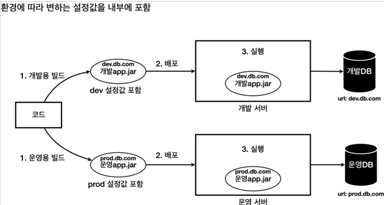
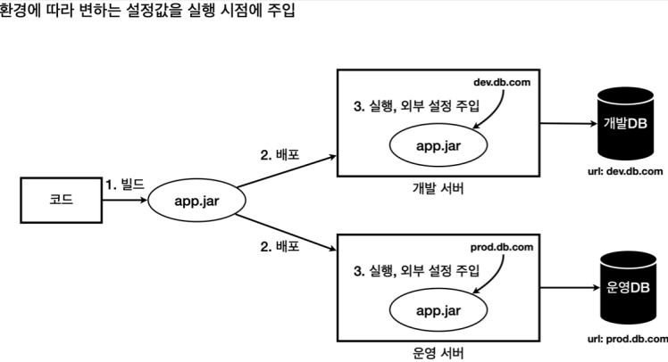
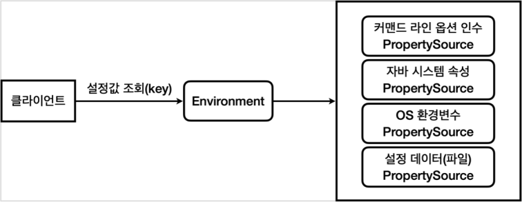
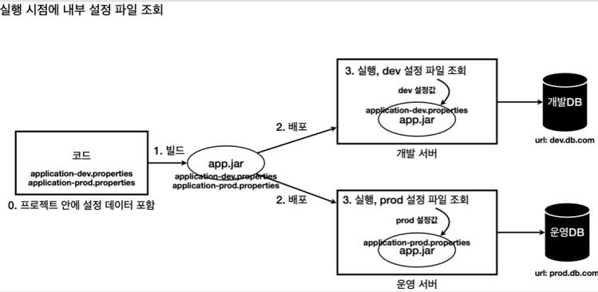

# 외부 설정 사용

## 문제 상황

​	하나의 애플리케이션을 여러 다른 환경에서 사용해야 할 때가 있습니다. 대표적으로 개발이 잘 진행되고 있는지 내부에서 확인하는 용도의 개발 환경, 그리고 실제 고객에게 서비스하는 운영 환경이 있습니다.

​	문제는 각각의 환경에 따라서 서로 다른 설정값이 존재한다는 점입니다. 예를 들어서 애플리케이션이 개발 DB 에 접근하려면 `dev.db.com` 이라는 url 정보가 필요한데, 운영 DB 에 접근하려면 `prod.db.com` 이라는 서로 다른 url 을 사용해야 합니다.

​	이 문제를 해결하는 가장 단순한 방법은 다음과 같이 각각의 환경에 맞게 애플리케이션을 빌드하는 것입니다.



​	하지만 당연히 이 방법은 좋은 방법이 아니겠죠. 환경에 따라서 빌드를 여러 번 해야 하며, 개발 버전과 운영 버전의 빌드 결과물이 다르기 때문에 같은 소스코드인지 검증하기 어려워집니다.

## 해결

​	그래서 보통 다음과 같이 빌드는 한번만 하고 각 환경에 맞추어 **실행 시점에 외부 설정값을 주입**합니다.



​	이렇게 하면 빌드도 한번만 하면 되고, 개발 버전과 운영 버전의 빌드 결과물이 같기 때문에 개발환경에서 검증되면 운영 환경에서도 믿고 사용할 수 있습니다. 그리고 이후에 새로운 환경이 추가되어도 별도의 빌드 과정 없이 기존 app.jar 를 사용해서 손쉽게 새로운 환경을 추가할 수 있습니다.

## 외부설정

​	그럼 지금부터 외부설정을 넣는 방법을 알아보겠습니다. 먼저 외부 설정은 일반적으로 다음 4가지 방법이 있습니다.

### OS 환경 변수

​	OS에서 지원하는 외부 설정으로 해당 OS를 사용하는 모든 프로세스에서 사용합니다.

### 자바 시스템 속성

​	자바에서 지원하는 외부 설정으로 해당 JVM 안에서 사용합니다. 

​	실행 시 `java -Durl=dev -jar app.jar` 로 `url` 을 `dev` 로 설정합수 있습니다. 이 설정은 **JVM의 모든 코드에서 `System.getProperty("property")`를 사용하여 액세스**할 수 있습니다. 

### 자바 커맨드 라인 인수

​	커맨드 라인에서 전달하는 외부 설정으로 **실행시 `main(args)` 메서드에서 사용**합니다.

1. `java -jar app.jar dataA dataB` -> `args` 에 `dataA` `dataB` 로 입력됩니다.

2. `java -jar app.jar --url=dev` : `key-value` 형식으로 파싱하여 저장합니다. 아래와 같이 읽을 수 있습니다.

   ```java
   public class CommandLine {
       public static void main(String[] args) {
           for (String arg : args) {
           	log.info("arg {}", arg); //arg --url=dev
           }
           ApplicationArguments appArgs = new DefaultApplicationArguments(args);
           Set<String> optionNames = appArgs.getOptionNames();
           for (String optionName : optionNames) {
               log.info("option args {}={}", optionName, ppArgs.getOptionValues(optionName));
               //option args url=[dev]
           }
           List<String> url = appArgs.getOptionValues("url");
           log.info("url={}", url); // url=[dev]
           }
   }
   ```

### 외부 파일(설정 데이터)

​	프로그램에서 외부 파일을 직접 읽어서 사용하는 방식입니다. 먼저 애플리케이션에서 특정 위치의 파일을 읽도록 해둡니다. ( ex. `data/hello.txt` ) 그리고 각 서버마다 해당 파일안에 다른 설정 정보를 남겨둡니다.

- 개발 서버 `hello.txt : url=dev.db.com` 
- 운영 서버 `hello.txt : url=prod.db.com`

그러면 각 서버마다 해당 파일을 읽고 다른 `url` 을 적용하게 됩니다.

### 외부 설정 - 스프링 통합

​	지금까지 살펴본 4가지 방식은 모두 외부 설정을 key=value 형식으로 사용할 수 있는 방법입니다. 하지만 해당 설정값을 읽는 방법이 모두 다르기 때문에 스프링은 이를 `Environment` 와 `PropertySource` 라는 추상화를 통해서 해결합니다.



스프링은 로딩 시점에 필요한 `PropertySource` 들(외부 설정값들) 을 생성하고, `Environment` 에서 사용할 수 있게 연결해둡니다. 클라이언트는 각각의 환경변수를 찾을 필요없이,` environment.getProperty(key)` 를 통해서 값을 해당 `key` 값에 대한 `value` 를 얻을 수 있습니다. `Environment` 클래스는 스프링에서 빈 등록이 되어 있습니다.

# 외부 파일 사용과 프로필

​	지금까지 외부 파일에 대해서 언급을 간단하게만 했는데요. OS 환경 변수, 자바 시스템 속성, 커맨드 라인 옵션 인수 등과 구분하기 위해서입니다. 해당 설정들은 사용해야 하는 값이 늘어날 수록 사용하기가 불편해집니다.

​	그래서 등장하는 대안으로는 설정값을 파일에 넣어서 관리하는 방법입니다. 그리고 애플리케이션 로딩 시점에 해당 파일을 읽어들이면 됩니다. 그 중에서도 `.properties` 라는 파일은 `key=value` 형식을 사용해서 설정값을 관리하기에 적합합니다. 아래 그림을 보겠습니다.



`app.jar` 파일 안에는 `appliation-dev.properties` 와 `application-prod.properties` 가 있습니다. 그러면 `app.jar` 는 마법을 부려서 dev 값이 필요하면  `appliation-dev.properties` 를 사용하고 prod 환경이면 `application-prod.properties` 를 사용할까요? 당연히 아닙니다. 스프링은 이런 곳에서 사용하기 위해 **프로필이라는 개념을 지원**합니다.

## 프로필

​	JAR 파일을 시작할 때 자바 시스템 속성이나 커맨드 라인 옵션 인수으로 어떤 프로필을 실행할 지 정할 수 있습니다. `spring.profiles.active` 외부 설정에 값을 넣으면 해당 프로필을 사용한다고 판단합니다.

- `java` **`-Dspring.profiles.active=dev -jar`** `external-0.0.1-SNAPSHOT.jar`
- `java -jar external-0.0.1-SNAPSHOT.jar` **`--spring.profiles.active=dev`**

그리고 해당 값에 따라서 다음과 같은 규칙으로 해당 프로필에 맞는 내부 파일(설정 데이터)을 조회합니다.

- `application-`**`{profile}`**`.properties`

## properties 파일 합치기

​	그런데 설정 파일을 각각 분리해서 관리하면 한눈에 전체가 들어오지 않는 단점이 있습니다. 스프링은 이런 단점을 보완하기 위해 물리적인 하나의 파일 안에서 논리적으로 영역을 구분하는 방법을 제공합니다. 아래 코드를 보겠습니다.

```properties
url=local.db.com
username=local_user
password=local_pw
---
spring.config.activate.on-profile=dev
url=dev.db.com
username=dev_user
password=dev_pw
---
spring.config.activate.on-profile=prod
url=prod.db.com
username=prod_user
password=prod_pw
```

위 코드는 하나의 `application.properties` 파일입니다. 하지만 `---` 을 통해 논리적으로 구분되어 있습니다. 외부 설정에 따라 어떻게 `properties` 가 적용되는지 알아보겠습니다.

### 외부 설정 미적용

​	만약 프로필을 지정하지 않는다면 해당하는 프로필이 없으므로 `default` 프로필이 실행됩니다. 현재 `application.properties` 에는 `default` 라는 프로필이 없으므로 공통 부분만 적용됩니다.

```properties
url=local.db.com
username=local_user
password=local_pw
--- # 아래 미적용
# spring.config.activate.on-profile=dev
# url=dev.db.com
# username=dev_user
# password=dev_pw
--- # 아래 미적용
# spring.config.activate.on-profile=prod
# url=prod.db.com
# username=prod_user
# password=prod_pw
```

### 외부 설정을 dev 로

이번엔 외부 설정을 dev 로 주겠습니다. 아래와 같이 적용됩니다.

```properties
url=local.db.com
username=local_user
password=local_pw
--- 
spring.config.activate.on-profile=dev
url=dev.db.com
username=dev_user
password=dev_pw
--- # 아래 미적용
# spring.config.activate.on-profile=prod
# url=prod.db.com
# username=prod_user
# password=prod_pw
```

​	위 코드를 보면 url, username, password 의 기본설정과 dev 설정이 겹치게 되는데요. 그럼 어떻게 될까요? 오류는 나지 않습니다. **다만 위에서 아래로 읽으면서 제일 마지막 설정값이 적용됩니다.**

url 기준으로 설명드리자면, 위에서부터 읽으면서 `url=local.db.com` 가 적용되었는데 `dev` 프로필이 활성화되면서 `url=dev.db.com` 로 덮어쓰기가 되는겁니다.

### 외부 설정을 prod 로

dev 와 같기 때문에 설명은 생략합니다.

```properties
url=local.db.com
username=local_user
password=local_pw
--- 아래 미적용
#spring.config.activate.on-profile=dev
#url=dev.db.com
#username=dev_user
#password=dev_pw
---
spring.config.activate.on-profile=prod
url=prod.db.com
username=prod_user
password=prod_pw
```

# Ref.

[스프링 부트 - 핵심 원리와 활용](https://www.inflearn.com/course/%EC%8A%A4%ED%94%84%EB%A7%81%EB%B6%80%ED%8A%B8-%ED%95%B5%EC%8B%AC%EC%9B%90%EB%A6%AC-%ED%99%9C%EC%9A%A9/dashboard) 중 외부설정과 프로필 섹션 참고