# 인증 흐름

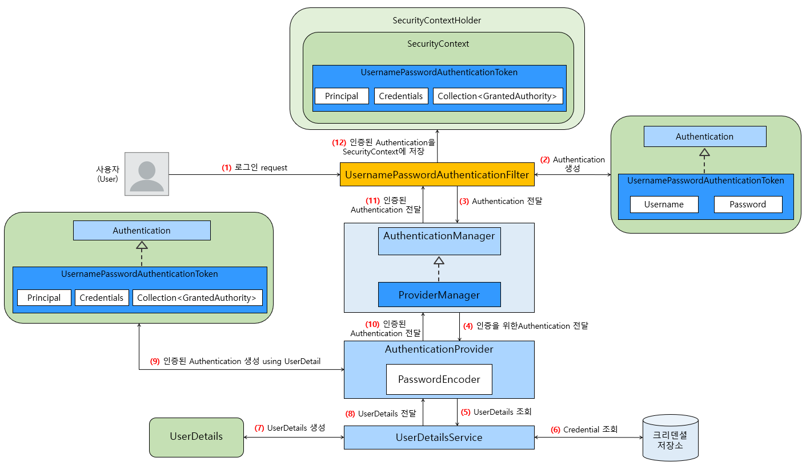

인증 흐름의 구성은 위와 같습니다. 코드 레벨에서 자세히 보겠습니다.

## UsernamePasswordAuthenticationFilter

현재 스프링 시큐리티의 `FilterChainProxy` 에 등록된 필터는 아래와 같습니다.

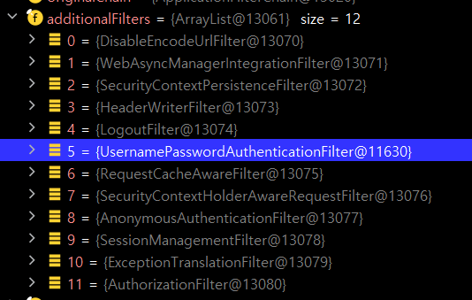

`UsernamePasswordAuthenticationFilter` 는 5번째로 실행되는 필터입니다.

먼저 해당 필터의 `doFilter()` 가 실행됩니다. `UsernamePasswordAuthenticationFilter` 는 직접 `doFilter()` 는 확장하지 않고 부모클래스인 `AbstractAuthenticationProcessingFilter` 의 doFilter() 를 사용합니다.

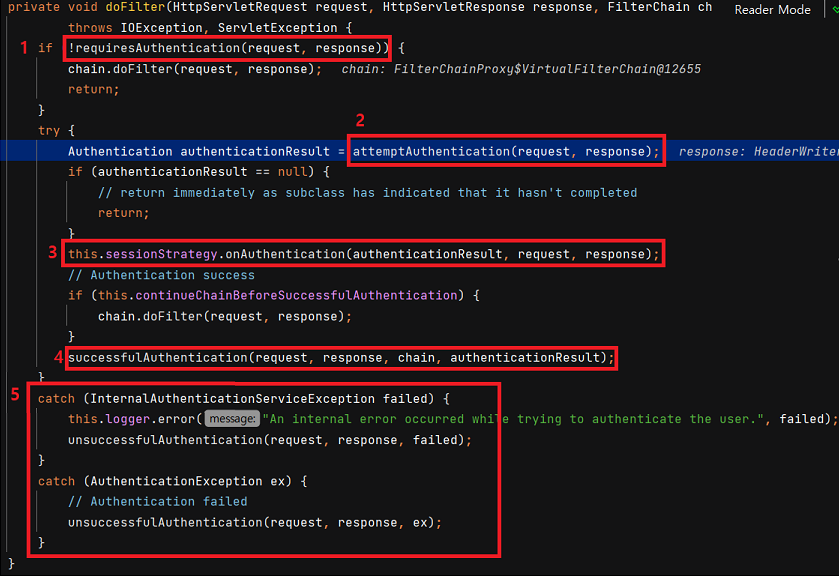

1. `requiresAuthentication()` 메서드는 로그인 페이지에서의 요청인지 확인합니다. 해당 요청이 맞으면 필터를 계속 진행합니다. 아니면 다음 필터로넘어갑니다. 해당 값은 `SecurityConfig` 의 `http.loginPage("/loginPage")` 설정에 따라 변경가능합니다.

   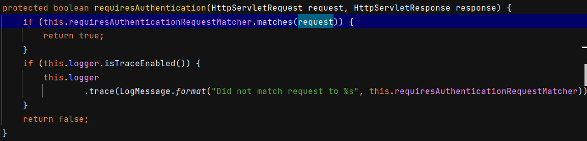

2. `attemptAuthentication()` 메서드는 로그인 정보는 통해 인증정보인 `Authentication` 을 만듭니다. `UsernamePasswordAuthenticationFilter` 에서는 `UsernamePasswordAuthenticationToken` 으로 만듭니다. 해당 `Authentication` 은 나중에 실제 인증에 사용됩니다. 그리고 `AuthenticationManager` 의 `authenticate()` 를 호출합니다. 해당 메서드는 후술하겠습니다.

   

   - `UsernamePasswordAuthenticationToken.unauthenticated()` 메서드는 권한 정보가 없는 객체 생성 메서드이고, 반대로 `authenticated()` 는 권한 정보가 있는 객체 생성 메서드입니다.

3. 세션 고정 보호 정책에 따른 세션ID 변경입니다. 매 요청마다 세션 ID 를 변경하여 세션 고정 공격에 대해 보호할 수 있도록 합니다. 기본정책은 `ChangeSessionIdAuthenticationStrategy` 으로, 로그인 시마다 세션ID 를 변경합니다. 아래 로직은 세션 정책을 가진 `CompositeSessionAuthenticationStrategy` 의 `onAUthentication()` 메서드입니다.

   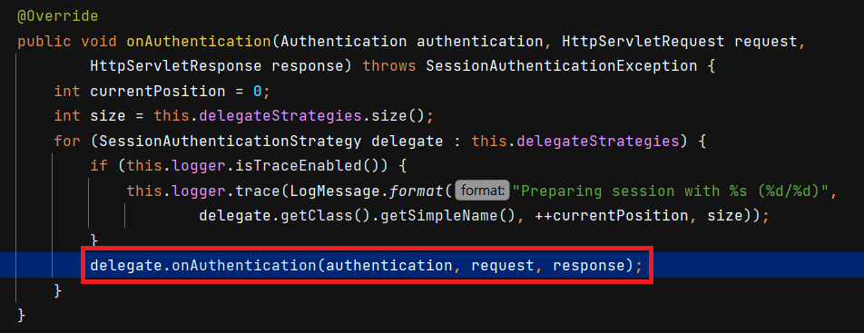

   - 위 빨간 박스에서 delegate 가 `ChangeSessionIdAuthenticationStrategy` 입니다.

4. 인증 성공 시 `successfulAuthentication()` 메서드를 호출합니다. 해당 메서드는 `SecurityContext` 안에 인증 결과인 `Authentication` 를 담아서 `SecurityContextHolder` 로 감쌉니다. 이제 해당 `ThreadLocal` 에서 `Authentication` 을 조회할 수 있게 됩니다.

   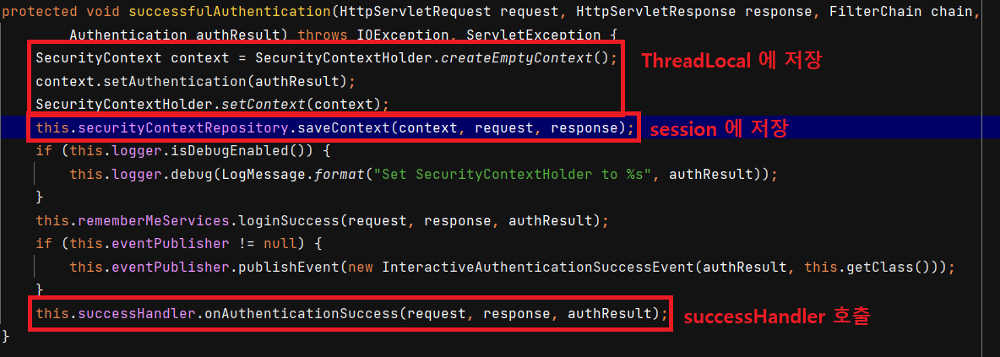

   - 또한 `session` 에서도 접근할 수 있게 저장해둡니다. 
   - 마지막으로 `successHandler` 를 호출합니다. 해당 핸들러는 설정 파일인 `SecurityFilterChain` 에서 `.successHandler()` 로 커스텀할 수 있습니다.

5. Exception 발생 시 호출됩니다. `unsuccessfulAuthentication()` 이 호출됩니다. 해당 핸들러 안에서 `failureHandler` 가 실행됩니다. 해당 핸들러도 마찬가지로 설정 파일인 `SecurityFilterChain` 에서 `.failureHandler()` 로 커스텀할 수 있습니다. 

   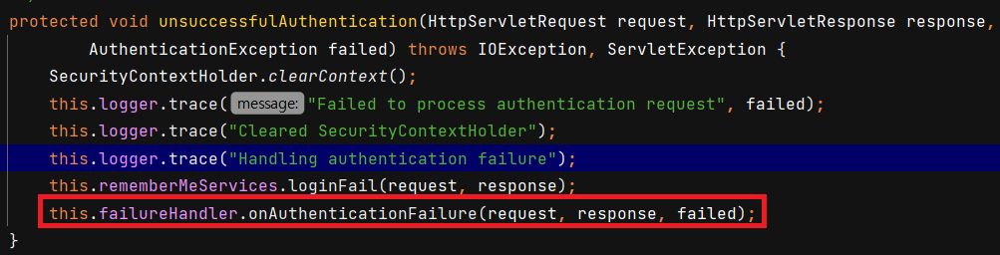

## ProviderManager

위 2번 과정의 `attemptAuthentication()` 메서드 내부에서 `this.getAuthenticationManager().authenticate(authRequest)` 안으로 들어가보겠습니다. 길어서 필요한 부분만 보겠습니다.

해당 메서드는 `ProviderManager` 에 있는 메서드입니다. `ProviderManager` 는 여러 `AuthenticationProvider` 를 가지면서 해당 `Authentication` 객체를 인증할 수 있는 `Provider` 를 선택해서 인증을 위임합니다.

아래는 `ProviderManager` 의 `authenticate()` 메서드입니다.

1. 받은 `Authentication` 의 클래스입니다. `Authentication` 은 인터페이스이며 여러 구현체가 있는데, 각 구현체마다 처리할 수 있는 `Provider` 가 있기 때문에 미리 `toTest` 객체를 선언하고 어떤 클래스인지 할당합니다.

2. 실제로 반환할 `Authentication` 객체를 `result` 로 선언합니다.

3. `getProviders()` 는 `ProviderManager` 가 가지고 있는 `Provider` 의 목록입니다. 하나씩 순회하며 전달받은 `Authentication` 에 맞는 `Provider` 를 찾습니다.

4. `provider.supports()` 메서드는 해당 `Provider` 가 전달받은 `Authentication` 를 처리할 수 있는지 확인하는 `boolean` 값입니다.

   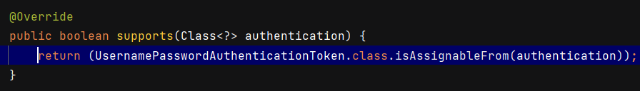

5. 선택된 `Provider` 가 인증을 수행하는 로직입니다. 아래에서 설명하겠습니다.

## AuthenticationProvider

`AuthenticationProvider` 는 인터페이스이며 해당 인터페이스를 구현한 구현체가 빈으로 등록되면 사용할 수 있습니다. `UsernamePasswordAuthenticationToken` 은 기본적으로 `DaoAuthenticationProvider` 를 사용합니다.

아래는 `DaoAuthenticationProvider` 의 추상 클래스인 `AbstractUserDetailsAuthenticationProvider`  의 `authenticate()` 메서드입니다. 먼저 `UserDetails` 를 얻는 로직입니다. 

### 사용자 아이디 검증

- `determineUsername()` 으로 `Authentication` 에 있는 `name` 을 얻습니다.

- `retrieveUser()` 메서드는 `username` 을 통해 DB 혹은 인메모리에서 `user` 를 조회하고 `UserDetails` 로 반환합니다.

  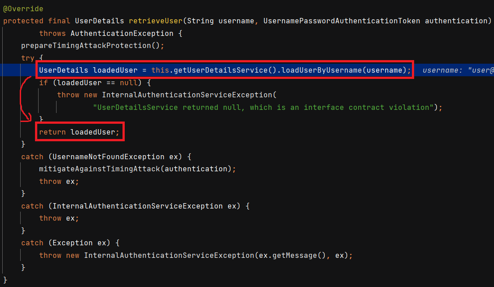

  - `UserDetails` 는 `UserDetailsService` 에서 `loadUserByUsername()` 메서드로 얻습니다. `UserDetailsService` 는 인터페이스로, 빈으로 등록된 `UserDetailsService` 가 사용되거나 인메모리사용 시 `InMemoryUserDetailsManager` 가 사용됩니다.
  - 만약 `username` 으로 조회되는 데이터가 없다면 `UsernameNotFoundException` 을 발생시킵니다.

**이렇게 얻은 `UserDetails` 에는 기본적으로 `username`, `password`, `authorities` 가 있습니다.**

### 사용자 비밀번호 검증

비밀번호도 `AuthenticationProvider` 의 `authenticate()` 메서드 내에서 이루어집니다. 해당 메서드 내 일부입니다.

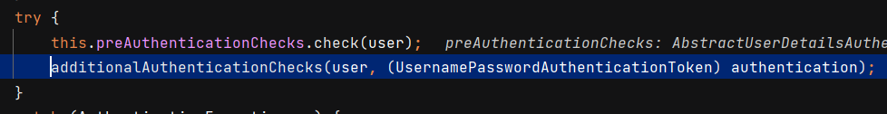

위 코드처럼 `additionalAuthenticationChecks()` 메서드에 `UserDetails user` 와 `authentication` 객체를 넘깁니다.

아래는 `DaoAuthenticationProvider` 의 `additionalAuthenticationChecks()` 메서드입니다.

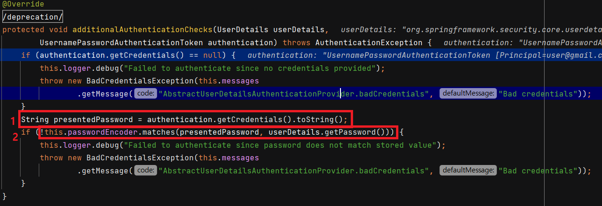

1. 먼저 `Authentication` 에서 비밀번호를 추출합니다. 여기서 유의해야 할 건 `Authentication` 은 요청으로부터 얻은 정보로 생성된 객체입니다.
2. 그리고 `userDetails` 에 있는 비밀번호와 비교합니다. `userDetails` 는 DB 에서 얻은 정보입니다. 만약 다르다면 `BadCredentialsException` 이 발생합니다.

# Authentication

사용자의 인증 정보를 저장하는 토큰 개념으로. 인증 시 `id` 와 `password` 를 담고 인증 검증을 위해 전달되어 사용됩니다. 인증 후에는 최종 인증 결과 (user 객체, 권한정보) 를 담고 `SecurityContext` 에 저장되어 전역적으로 참조가 가능합니다.

아래와 같은 필드 값을 가집니다.

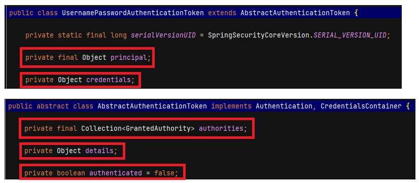

UsernamePasswordAuthenticationToken 은 AbstractAuthenticationToken 을 확장합니다. 필드값의 의미는 다음과 같습니다.

1. **principal** : 사용자 아이디 혹은 User 객체를 저장
2. **credentials** : 사용자 비밀번호
3. **authorities** : 인증된 사용자의 권한 목록
4. **details** : 인증 부가 정보
5. **Authenticated :** 인증 여부

## ThreadLocal 에 담긴 Authentication 객체 꺼내기

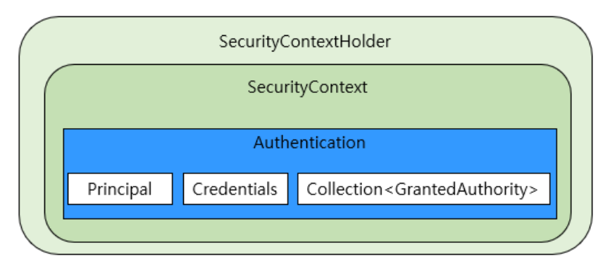

기본적으로 모든 위치에서 `SecurityContexHolder.getContext().getAuthentication()` 로 `Authentication` 을 얻을 수 있습니다. 그 이유는 `ThreadLocal` 에 저장되어 있기 때문입니다.

인증 성공 이후에 인증 필터인 `AbstractAuthenticationProcessingFilter` 의 `successfulAuthentication()` 메서드에서 `SecurityContext` 에 해당 `Authentication` 객체를 저장하고, 또한 세션에도 저장을 했습니다. 이제 해당 `Authentication` 을 꺼내보겠습니다. **`SecurityContextHolder` 에서 꺼내는 방법**과 **세션에서 꺼내는 방법** 두 가지가 있습니다.

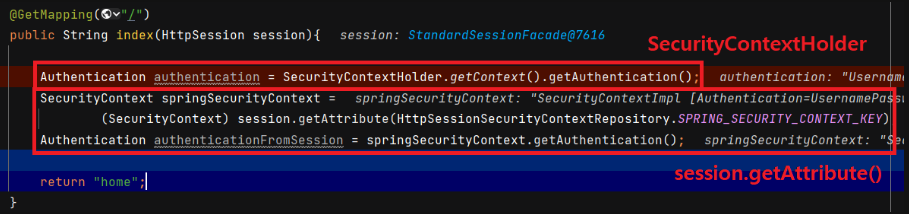

위 코드는 `"/"` 으로 매핑했을 때입니다. 두 방법으로 `Authentication` 을 받아도 둘 다 같은 인스턴스를 반환합니다.

# Authentication Flow

인증처리를 시작하는 시작 단계부터 각각의 인증 단계를 거쳐서 인증이 완료되는 흐름을 전체적으로 정리해보겠습니다.

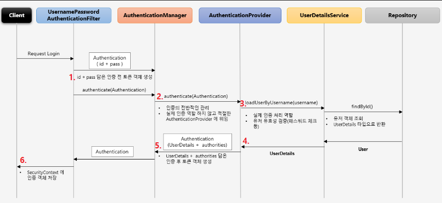

1. `UsernamePasswordAuthenticationFilter` 가 `Authentication` 객체를 생성해서 `AuthenticationManager` 에게 인증을 위임합니다. (**`attemptAuthentication()` 내의 `authenticate()`**)
2. `AuthenticationManager` 은 인증의 전반적인 관리를 하지만 실제 인증역할은 하지 않습니다. 대신 내부적으로 가지고 있는 `List` 안의 `AuthenticationProvider` 중, 현재 인증에 사용되는 `AuthenticationProvider` 를 찾아서 (**`support()` 사용**) 인증을 위임합니다. (**`authenticate()`**)
3. `AuthenticationProvider` 는 전달받은 `Authentication` 을 통해 `UserDetailsService` 로 유저 객체를 요청합니다. (**`loadUserByUsername()`**)
4. `UserDetailsService` 는 DB 에서 유저 객체를 조회합니다. 이때 예외가 발생하면 인증에 실패하게 되고, 그 예외는 `UsernamePasswordAuthenticationFilter` 가 받아서 처리하게 됩니다. **인증에 성공하면 `UserDetails` 타입으로 반환**합니다.
5. `AuthenticationProvider` 는 ID 가 검증된 `UserDetails` 에서 PW 를 검증합니다. (**`additionalAuthenticationChecks()`**) PW 가 일치하지 않으면 `BadCredentialException` 이 발생합니다. 검증이 완료되면 `Authentication` 에 `UserDetails` 와 `authorities` 를 담은 객체를 생성하여 반환합니다.
6. 최종적으로 `UsernamePasswordAuthenticationFilter` 는 `SecurityContext` 에 인증 객체를 저장합니다. (**`successfulAuthentication()`**)