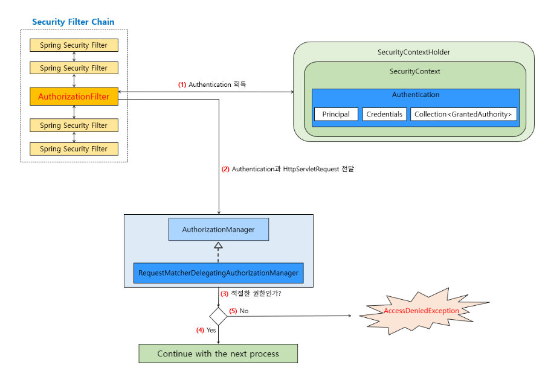
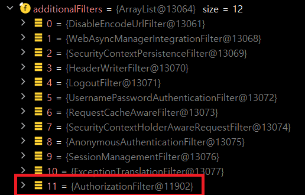
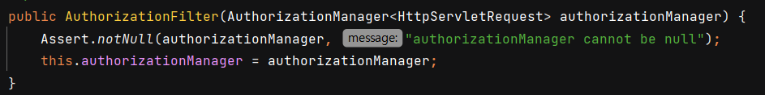
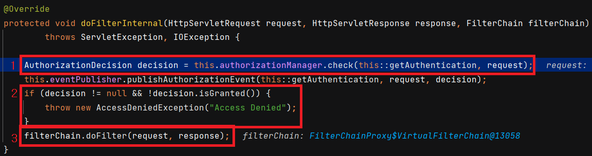
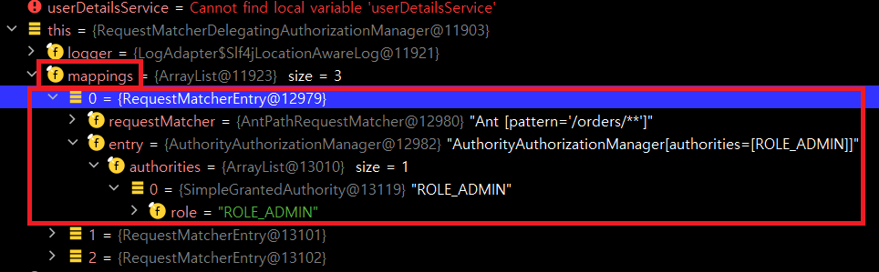
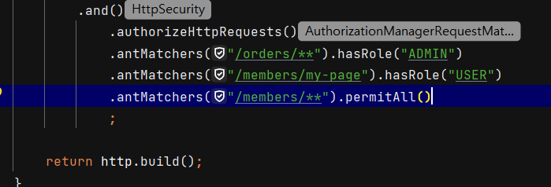
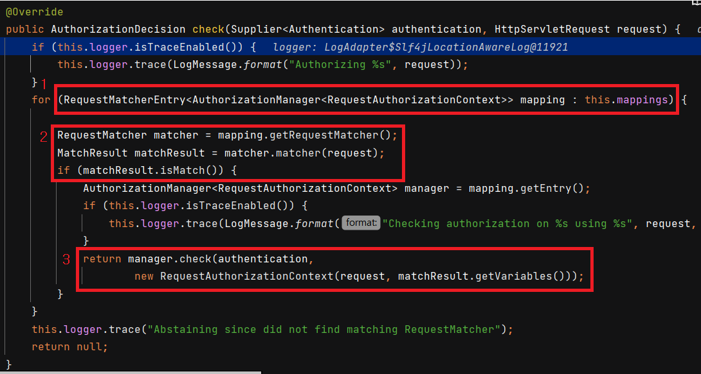
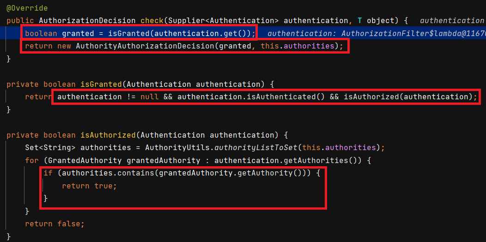
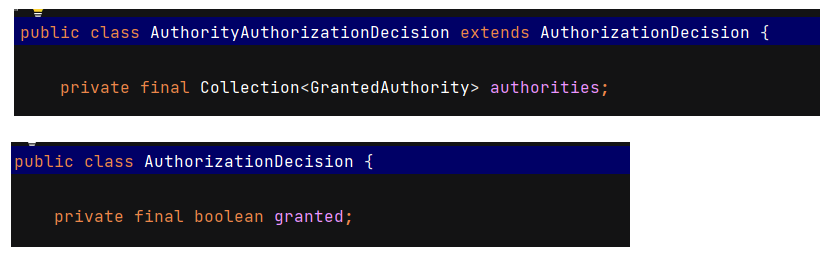

# 인증 흐름

인가 흐름은 위와 같습니다. 먼저 `Authentication` 을 획득해서 `AuthorizationManager` 에게 전달합니다. `AuthorizationManager` 는 url 접근 정보를 가지고 있고, `Authentication` 과 `request` 를 비교하면서 해당 `url` 에 접근가능한 권한인지 판단합니다. 만약적절한 권한이 아니라면 `AccessDeniedException` 을 발생시킵니다.

아래 콘솔창에서 보듯, `AuthorizationFilter` 는 제일 마지막 필터입니다.

## AuthorizationFilter

`AuthorizationFilter` 는 생성자를 통해 `AuthorizationManager`를 받습니다. URL 기반으로 권한 부여 처리를 하는 `AuthorizationFilter` 는 `AuthorizationManager` 의 구현 클래스로 `RequestMatcherDelegatingAuthorizationManager`를 사용합니다.

1. `AuthorizationManager` 의 `check()` 로 권한을 심사합니다. `Authentication` 과 `HttpServletRequest` 를 넘깁니다. 이때 권한 심사할 URL 이 아니면 `Null` 이 반환됩니다.
2. 만약 `AuthorizationDecision` 이 `null` 이 아닌데, `isGranted()` 가 `false` 이면 `AccessDeniedException` 을 발생시킵니다.
3. 권한 심사가 통과하면 `doFilter` 로 다음 필터를 진행합니다.

## RequestMatcherDelegatingAuthorizationManager

​	해당 클래스는 `check()` 를 통해 권한심사를 진행합니다. 아래와 같이 생성자를 통해 `List<RequestMatcherEntry<>>` 를 받습니다. 해당 `mappings` 필드는 어떤 리소스에 어떤 권한이 접근가능한지 정보를 가지고 있습니다. 

콘솔창에서 보면 아래와 같습니다.

총 3개가 있는데, 그 이유는 `SecurityConfiguration` 파일에서 다음과 같이 설정했기 때문입니다.

`mapping` 내의 각각의 `RequestMatcherEntry` 는 설정 파일에서 하나의 `.antMatchers` 라고 볼 수 있습니다.

이제 인가 프로세스인 `check()` 를 보겠습니다.

1. `mappings` 에서 하나하나  `mapping` 으로 순회합니다.
2. `mapping` 에서 `.getRequestMatcher()` 를 하면 `/order/**` 와 같은 url 패턴이 나옵니다. 해당 패턴과 `reqeust` 요청 url 이 같다면 권한심사를 진행합니다.
3. `mapping.getEntry()` 는 해당 url 패턴에 대한 권한 목록입니다. (ROLE_ADMIN 등) 해당 권한 목록과 `Authentication` 을 비교해서 `AuthorizationDecision` 을 반환합니다.

## AuthorityAuthorizationManager

`AuthorityAuthorizationManager` 는 `check()` 를 통해서 `Authentication` 에 있는 권한과 자신이 가지고 있는 권한 목록(`this.authorities`) 를 비교하여 `AuthorizationDecision` 을 반환합니다. `AuthorizationDecision` 는 내부적으로 권한목록과 `boolean` `granted` 값을 같습니다.

## AuthorizationDecision

위에서 기술했듯이 `boolean` 값인 `granted` 를 갖고, 추가적으로 `AuthorityAuthorizationDecision` 이 권한 목록인 `authorities` 를 갖습니다.