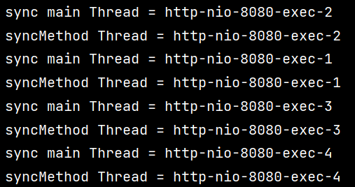
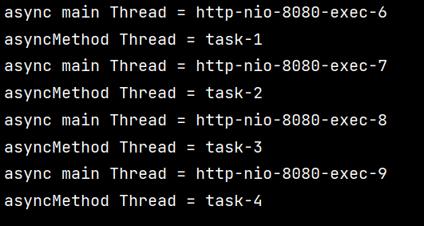
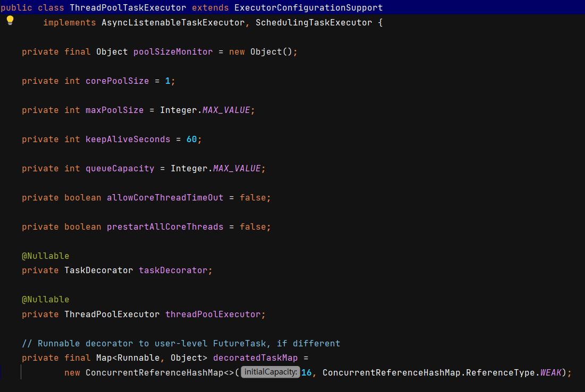

# 비동기 처리

​	비동기처리란 특정 로직의 실행이 끝날때까지 기다려주지 않고 나머지 코드를 먼저 실행하는 것입니다. 비동기 처리는 시간이 오래 걸리는 작업을 병렬로 실행할 수 있게 해줍니다.

## 비동기 처리가 없을 때

​	예를 들어 어떤 프로그램이 A -> B -> C 순서대로 처리한다고 가정하겠습니다. 이 때 다른 기능은 처리 속도가 빠르지만 A 기능은 5초가 걸린다고 하겠습니다. 비동기 처리를 사용하지 않는다면, 작업 A가 5초 동안 수행되는 동안, 프로그램은 B와 C를 수행할 수 없게 됩니다. 특히 A가 네트워크 요청이나 파일 I/O와 같은 블로킹 I/O 작업인 경우 문제가 될 수 있습니다. 이러한 작업들은 많은 시간을 필요로 하며, 동기 방식으로 처리할 경우 프로그램이 그 시간 동안 기다려야만 합니다.

## 비동기 처리를 통한 해결

​	비동기 처리를 사용하면, 프로그램은 A 작업을 시작한 후 즉시 B와 C를 시작할 수 있습니다. A 작업이 완료되면, 프로그램에 알려주도록 요청하거나 멀티 스레드를 사용할 수 있습니다. 이를 통해 프로그램은 A, B, C를 동시에 처리할 수 있으며, 이로 인해 전체적인 실행 시간을 줄일 수 있습니다.

## 자바에서 비동기 처리

​	아래는 멀티 스레드로 비동기 처리를 하는 방법입니다. 자바에서 스레드는 간단하게 `Thread` 클래스로 만들 수 있습니다. 만들어진 스레드를 통해 비동기 처리를 구현할 수 있습니다.

```java
package test;

public class Async {

    public static void main(String[] args){

        new Thread(() -> {
            System.out.println("sub Thread1 = " + Thread.currentThread().getName());
        }).start();

        new Thread(() -> {
            System.out.println("sub Thread2 = " + Thread.currentThread().getName());
        }).start();

        System.out.println("main Thread = " + Thread.currentThread().getName());

    }
}
/*
main Thread = main
sub Thread2 = Thread-1
sub Thread1 = Thread-0
*/
```

`Thread` 클래스를 통해서 각각의 기능을 멀티 스레딩 비동기 방식으로 바꿀 수 있습니다.

### ThreadPool 생성

하지만 위와 같은 방법으로 구현한다면 요청이 10000개 들어올 때 10000개의 스레드를 생성하게 됩니다. 스레드의 생성 및 유지비용은 크기 때문에 보통 스레드풀을 만들어서 관리합니다. 자바에서는 `ExecutorService` 로 스레드풀을 생성할 수 있습니다.

```java
public class Async {

    static final ExecutorService executorService = Executors.newFixedThreadPool(10);

    public static void main(String[] args){

        executorService.submit(() -> {
            System.out.println("sub Thread1 = " + Thread.currentThread().getName());
        });

        executorService.submit(() -> {
            System.out.println("sub Thread2 = " + Thread.currentThread().getName());
        });

        System.out.println("main Thread = " + Thread.currentThread().getName());
    }
}
```

`Executors.newFixedThreadPool(10)` 로 스레드를 10개 만들어줍니다. `executorService.submit()` 으로 스레드풀에서 스레드를 꺼내서 실행할 수 있습니다. 하지만 동기방식의 로직을 비동기 방식으로 변경하기 위해 `executorService.submit()` 를 구현해야 하는 수정사항이 필요해집니다.

# @Async 사용하기

​	이번엔 스프링에서 어노테이션으로 멀티 스레딩을 지원하는 `@Async` 어노테이션을 살펴보겠습니다.

```java
@SpringBootApplication
@EnableAsync
public class AsyncApplication {
	public static void main(String[] args) {
		SpringApplication.run(AsyncApplication.class, args);
	}
}

@RestController
@RequiredArgsConstructor
public class AsyncController {

    private final AsyncService asyncService;

    @GetMapping("/async")
    public void async(){
        System.out.println("async main Thread = " +  Thread.currentThread().getName());
        asyncService.asyncMethod();
    }

    @GetMapping("/sync")
    public void sync(){
        System.out.println("sync main Thread = " +  Thread.currentThread().getName());
        asyncService.syncMethod();
    }
}

@Service
public class AsyncService {

    @Async
    public void asyncMethod(){
        System.out.println("asyncMethod Thread = " + Thread.currentThread().getName());
    }

    public void syncMethod(){
        System.out.println("syncMethod Thread = " + Thread.currentThread().getName());
    }
}
```

​	`AsyncApplication` 에 `@EnableAsync` 을 붙여줍니다. 비동기 처리가 필요한 메서드에 `@Async` 를 붙여줍니다. 클래스에도 붙일 수 있습니다.

​	`http://localhost:8080/sync` 로 호출하면 `main Thread` 와 `syncMethod Thread` 가 똑같이 나옵니다. 아래는 4번 호출했을 때 결과입니다. 같은 스레드 이름이 두 번씩 출력됩니다.



​	반면 `http://localhost:8080/async` 로 호출하면 `main Thread` 와 `asyncMethod Thread` 가 다음과 같이 다르게 나옵니다. 다른 스레드를 생성해서 사용하는 것입니다.



​	하지만 해당 방식은 매 요청 시마다 스레드를 생성하는 문제가 있습니다. 왜냐하면 `@Async` 의 기본 설정은 `SimpleAsyncTaskExecutor` 를 사용하도록 되어 있는데, 이것은 스레드 풀이 아니고 단순히 스레드를 만들어내는 역할을 하기 때문입니다.

## 스레드 풀 사용

스레드 풀을 만들어서 `Executor` 로 빈 등록할 수 있습니다. 이때 `@EnableAsync` 은 `@SpringBootApplication` 이 아닌 `@Configuration` 에 붙여야 합니다. 해당 클래스의  `threadPoolTaskExecutor` 빈 정보를 읽어 들일 예정이기 때문입니다.

### AsyncConfig

```java
@Configuration
@EnableAsync
public class AsyncConfig {

    @Bean(name = "threadPoolTaskExecutor")
    public Executor threadPoolTaskExecutor() {
        ThreadPoolTaskExecutor taskExecutor = new ThreadPoolTaskExecutor();
        taskExecutor.setCorePoolSize(3); 
        taskExecutor.setMaxPoolSize(30);
        taskExecutor.setQueueCapacity(100)
        taskExecutor.setThreadNamePrefix("Executor-");
        return taskExecutor;
    }
}

```

`new ThreadPoolTaskExecutor()` 로 스프링에서 제공하는 `ThreadPoolTaskExecutor` 를 생성합니다. 해당 클래스는 자바의 `Executor` 를 구현하고 있습니다.

- `setCorePoolSize()`  : 최초 스레드 개수를 지정합니다. (3개)
- `setMaxPoolSize()` : 최대 스레드 개수를 지정합니다. (30개) `QueueCapacity` 가 가득차면 스레드 개수가 늘어나게 됩니다.
- `setQueueCapacity()` : 최대 `LinkedBlockingQueue` 의 사이즈를 지정합니다. 해당 큐가 꽉 차면 스레드를 새로 생성합니다. 기본 사이즈는 `Integer.MAX_VALUE` 입니다.

그 밖의 `ThreadPoolTaskExecutor` 의 필드를 살펴보겠습니다.



- `poolSizeMonitor` : 내부적으로 사용되는 동기화 객체로, `corePoolSize`와 `maxPoolSize` 사이의 동시 업데이트를 제어합니다.
- `corePoolSize` : 스레드 풀이 유지해야 하는 최소 스레드 수를 정의합니다. 이 수보다 적은 스레드가 존재하면 새로운 스레드가 생성됩니다. 이 필드의 기본 값은 1입니다.
- `maxPoolSize` : 스레드 풀이 생성할 수 있는 최대 스레드 수를 정의합니다. 이 수를 초과하면 작업이 대기열에 배치됩니다. 이 필드의 기본 값은 `Integer.MAX_VALUE` 입니다.
- `keepAliveSeconds` : 스레드가 작업을 완료하고 난 후, 그 스레드가 추가 작업을 기다리며 유지되는 시간(초) 을 정의합니다. 이 시간 이후에는 불필요한 스레드가 종료됩니다. 이 필드의 기본 값은 60초입니다.
- `queueCapacity` : 작업 대기열의 용량을 정의합니다. 스레드 풀이 최대 크기에 도달하면, 추가 작업은 이 대기열에 배치됩니다. 이 필드의 기본 값은 `Integer.MAX_VALUE`로, 이는 실질적으로 대기열 용량의 상한이 없음을 의미합니다.
- `allowCoreThreadTimeOut` : 이 값을 `true`로 설정하면, 코어 스레드가 `keepAliveSeconds` 시간 동안 유휴 상태라면 종료됩니다. 기본적으로 이 값은 `false`로 설정되어 있어, 코어 스레드는 작업을 기다리는 동안 계속 유지됩니다.
- `prestartAllCoreThreads` : 이 값을 `true`로 설정하면, 스레드 풀이 초기화되는 시점에 코어 스레드가 모두 생성됩니다. 기본적으로 이 값은 `false`로 설정되어 있어, 코어 스레드는 요청 시에만 생성됩니다.
- `taskDecorator` : 작업 실행에 앞서 특정 작업을 추가로 수행하고 싶을 때 사용할 수 있는 데코레이터입니다. 이 필드의 값은 `null`일 수 있으며, 이 경우 추가 작업 없이 원래의 작업이 그대로 실행됩니다.

`ThreadPoolTaskExecutor` 는 이러한 필드값을 받아서 `initializeExecutor()` 메서드로 자바의 `ExecutorService` 을 생성합니다.

### AsyncService

이제 `@Async` 에 value 값으로 등록한 스레드풀의 이름인 `threadPoolTaskExecutor` 을 지정합니다.

```java
@Service
public class AsyncService {

    @Async("threadPoolTaskExecutor")
    public void asyncMethod(){
        System.out.println("asyncMethod Thread = " + Thread.currentThread().getName());
    }

    public void syncMethod(){
        System.out.println("syncMethod Thread = " + Thread.currentThread().getName());
    }
}
```

`http://localhost:8080/async` 실행 시 다음과 같이 나옵니다.


`taskExecutor.setThreadNamePrefix("Executor-")` 세팅으로 스레드의 이름을 `Executor-번호` 로 지정했습니다.

만약에 스레드 풀을 여러 개 만드려면 해당 빈을 여러 개 만들고, @Async 설정할 때 속성값에 원하는 스레드 풀 빈을 넣으면 됩니다.

## 리턴 값이 있는 경우

​	리턴 값이 있을 때는 `Future`, `ListenableFuture`, `CompletableFuture` 타입을 리턴 타입으로 사용할 수 있습니다. 그게 아니면 후술할 `EventListener` 로 따로 처리해줘야 합니다.

### Future

`Future` 로 리턴하면 반환받는 클라이언트는 값이 반환될 때까지 기다립니다.

```java
@RestController
@RequiredArgsConstructor
public class AsyncController {

    private final AsyncService asyncService;

    @GetMapping("/async")
    public void async() throws ExecutionException, InterruptedException {
        for (int i = 0; i < 5; i++) {
            Future<String> future = asyncService.asyncMethod();
            System.out.println(future.get());
        }
    }
}

@Service
public class AsyncService {

    @Async("threadPoolTaskExecutor")
    public Future<String> asyncMethod() throws InterruptedException {
        System.out.println("Task Start - " + Thread.currentThread().getName());
        Thread.sleep(3000);
        return new AsyncResult<>("Task Finish - " + Thread.currentThread().getName());
    }
}
/*
Task Start - Executor-1
Task Finish - Executor-1
Task Start - Executor-2
Task Finish - Executor-2
Task Start - Executor-3
Task Finish - Executor-3
Task Start - Executor-1
Task Finish - Executor-1
Task Start - Executor-2
Task Finish - Executor-2
*/
```

`future.get()` 은 블로킹을 통해 요청 결과가 올 때까지 기다리는 역할을 합니다. 그래서 비동기 블로킹 방식이 되어버려 성능이 좋지 않습니다. 결과를 보면 순서대로 실행되었음을 알 수 있습니다.

### ListenableFuture

`ListenableFuture` 은 콜백을 통해 논블로킹 방식으로 작업을 처리할 수 있습니다.

```java
@RestController
@RequiredArgsConstructor
public class AsyncController {

    private final AsyncService asyncService;

    @GetMapping("/async")
    public void async() throws InterruptedException {
        for (int i = 0; i < 5; i++) {
            ListenableFuture<String> listenableFuture  = asyncService.asyncMethod();
            listenableFuture.addCallback(s -> System.out.println(s), e -> System.out.println(e));
        }
    }
}

public class AsyncService {

    @Async("threadPoolTaskExecutor")
    public ListenableFuture<String> asyncMethod() throws InterruptedException {
        System.out.println("Task Start - " + Thread.currentThread().getName());
        Thread.sleep(3000);
        return new AsyncResult<>("Task Finish - " + Thread.currentThread().getName());
    }
}

/*
Task Start - Executor-1
Task Start - Executor-2
Task Start - Executor-3
Task Finish - Executor-3
Task Start - Executor-3
Task Finish - Executor-1
Task Finish - Executor-2
Task Start - Executor-1
Task Finish - Executor-3
Task Finish - Executor-1
*/
```

서비스 계층은 `ListenableFuture` 을 반환합니다. `listenableFuture.addCallback(작업완료 콜백함수, 에러 처리 콜백함수)` 를 정의합니다. 출력값을 보면 `Executor-1`, `2`, `3` 의 start 가 먼저 실행되고 3초 뒤에 finish 가 출력됩니다. 현재 스레드 개수가 3개라서 뒤에 2개는 나중에 실행됩니다.

하지만 이 방식에도 문제가 있는데요. 콜백 안에 콜백이 필요할 경우 매우 복잡한 코드를 유발하게 됩니다. 예를 들어서 아래와 같습니다.

회원가입 시 이메일 보내기, 메세지 보내기는 비동기로 처리하고 우선 `"signup completed"` 만 반환한다고 하겠습니다. 이때 이메일을 먼저 보내고 완료되면 메세지를 보냅니다.

`Service` 클래스입니다.

```java
@Service
public class AsyncService {

    @Async("threadPoolTaskExecutor")
    public ListenableFuture<Boolean> sendEmail(){
        try {
            System.out.println("sending Email ...");
            Thread.sleep(5000);
            System.out.println("Email sent");
        } catch (InterruptedException e) {
            throw new RuntimeException(e);
        }
        return new AsyncResult<>(Boolean.TRUE);
    }

    @Async("threadPoolTaskExecutor")
    public ListenableFuture<Boolean> sendMessage(){
        try {
            System.out.println("sending message ...");
            Thread.sleep(5000);
            System.out.println("message sent");
        } catch (InterruptedException e) {
            throw new RuntimeException(e);
        }
        return new AsyncResult<>(Boolean.TRUE);
    }
}

```

그리고 `Controller` 입니다.

```java
@RestController
@RequiredArgsConstructor
public class AsyncController {

    private final AsyncService asyncService;

    @GetMapping("/async")
    public String async() throws InterruptedException {

        ListenableFuture<Boolean> listenableFuture = asyncService.sendEmail();

        listenableFuture.addCallback(new ListenableFutureCallback<>() {
            @Override
            public void onFailure(Throwable ex) {
                System.out.println("task failed!");
            }

            @Override
            public void onSuccess(Boolean result) {
               if(result){
                   ListenableFuture<Boolean> listenableFuture = asyncService.sendMessage();
                   listenableFuture.addCallback(new ListenableFutureCallback<>() {
                       @Override
                       public void onFailure(Throwable ex) {
                           System.out.println("Second task failed!");
                       }

                       @Override
                       public void onSuccess(Boolean result) {
                           System.out.println("send complete");
                       }
                   });
               }
            }
        });

        return "signup completed";
    }
}
//웹페이지에 리턴값인 "signup completed" 이 표시된 후..
/*
sending Email ...
Email sent
sending message ...
message sent
send complete
*/
```

위 로직은 `sendEmail()` 을 실행한 뒤 그 결과값으로 다시 `sendMessage()` 를 비동기로 처리하는 로직입니다. 콜백 함수 안에 콜백 함수가 있는 구조가 되어서 가독성이 떨어집니다.

### CompletableFuture 

`ListenableFuture` 의 콜백 문제는 `CompletableFuture` 로 해결할 수 있습니다. `ListenableFuture` 는 Spring 6.0 부터 `Deprecated` 되었습니다.

아래는 회원가입 시 이메일을 보내는 작업과 메세지를 보내는 작업을 비동기로 순차적으로 처리하는 방법입니다.

```java
@Service
public class AsyncService {

    @Async("threadPoolTaskExecutor")
    public CompletableFuture<Boolean> sendEmail(){
        try {
            System.out.println("sending Email ...");
            Thread.sleep(5000);
            System.out.println("Email sent");
        } catch (InterruptedException e) {
            throw new RuntimeException(e);
        }
        return new AsyncResult<>(Boolean.TRUE).completable();
    }

    @Async("threadPoolTaskExecutor")
    public CompletableFuture<Boolean> sendMessage(){
        try {
            System.out.println("sending message ...");
            Thread.sleep(5000);
            System.out.println("message sent");
        } catch (InterruptedException e) {
            throw new RuntimeException(e);
        }
        return new AsyncResult<>(Boolean.TRUE).completable();
    }
}
```

Service 의 리턴 값 `new AsyncResult<>()` 에는 `.completable()` 을 붙이면 `CompletableFuture` 타입으로 바뀝니다.

```java
@RestController
@RequiredArgsConstructor
public class AsyncController {

    private final AsyncService asyncService;

    @GetMapping("/async")
    public String async() throws InterruptedException {

        CompletableFuture<Boolean> booleanCompletableFuture1 = asyncService.sendEmail();

        booleanCompletableFuture1.thenCompose(result -> {
            if (result) {
                return asyncService.sendMessage();
            } else {
                return CompletableFuture.completedFuture(Boolean.FALSE);
            }
        }).thenAccept(result2 -> {
            if (result2) {
                System.out.println("send complete");
            }
        });
        
        return "signup completed";
    }
}
//웹페이지에 리턴값인 "signup completed" 이 표시된 후..
/*
sending Email ...
Email sent
sending message ...
message sent
send complete
*/
```

`thenCompose()`, `thenAccept()` 를 사용하여 가독성이 좋아졌습니다. 기능에는 차이가 없습니다.

### CompletableFuture 에서 제공하는 메서드

### xxxAsync

 

# Ref.

[Java8 CompletableFuture 사용하기](https://hungrydiver.co.kr/bbs/detail/develop?id=2)

[[Spring] @Async 사용 방법](https://steady-coding.tistory.com/611)