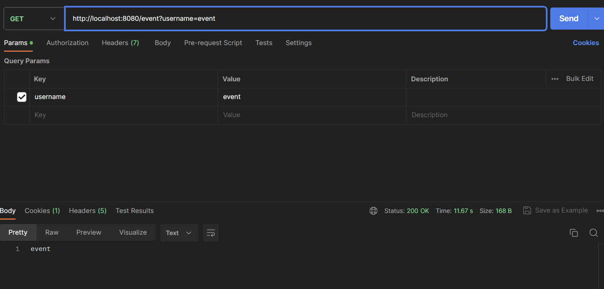
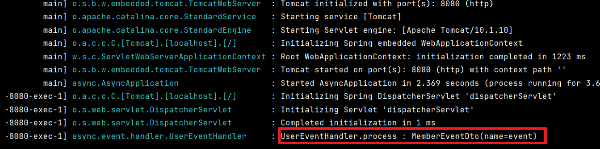
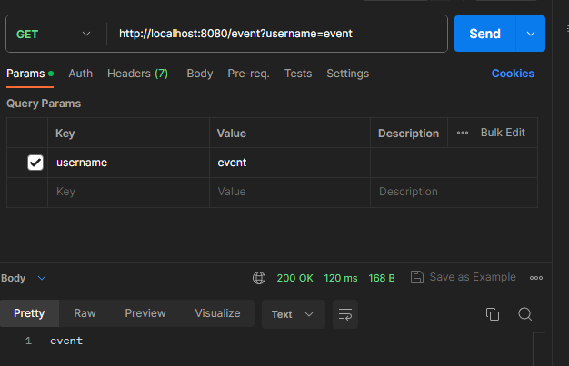
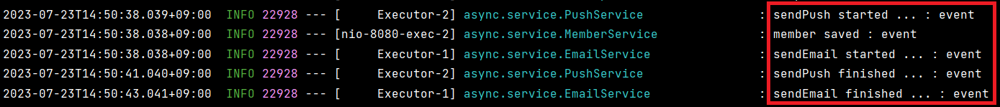

# @EventListener 사용하기

​	`@EventListener` 를 사용하는 이유는 의존성이 강한 로직들의 레이어를 분리할 수 있기 떄문입니다. 예를 들어서 A 서비스에서 로직 실행 시 B 서비스의 b 로직을 실행해야 할 경우 A 서비스는 B 서비스를 의존해야 합니다. 이때 `@EventListener` 를 사용하면 이벤트 핸들러를 통해 레이어를 분리해서 결합 상태를 느슨하게 만들 수 있습니다.

## 간단한 @EventListener 사용

### 이벤트 전달 객체 생성

​	해당 객체가 이벤트 실행의 기준점입니다.

```java
@AllArgsConstructor
@ToString
public class MemberEventDto {

    private String name;

}
```

### 이벤트리스너를 정의할 핸들러 생성

​	특정 이벤트가 발생되면 실행되는 핸들러입니다.

```java
@Component
@Slf4j
public class UserEventHandler {

    @EventListener
    public void process(MemberEventDto memberEventDto) {
        log.info("UserEventHandler.process : {}", memberEventDto);
    }
}
```

### Service 에 이벤트 발행자 사용

```java
@Service
@RequiredArgsConstructor
public class MemberService {

    private final ApplicationEventPublisher applicationEventPublisher;

    public String save(String username){
        applicationEventPublisher.publishEvent(new MemberEventDto(username));
        return username;
    }
}
```

`ApplicationEventPublisher` 를 통해 이벤트를 발행합니다.

### 컨트롤러 정의

```java
@RestController
@RequiredArgsConstructor
public class EventListenerController {

    private final MemberService memberService;

    @GetMapping("/event")
    public String event(String username) {
        String savedMember = memberService.save(username);
        return savedMember;
    }
}
```

`username` 을 받아서 member 로 저장하고 해당 member 를 리턴하는 로직입니다.

### 실행

포스트맨으로 실행해보겠습니다.

`http://localhost:8080/event?username=event` 로 요청하면 다음과 같이 요청이 잘 옵니다.



그리고 콘솔에도 잘 찍히는 걸 확인할 수 있습니다.



# 요구사항 해결을 위한 @EventListener

​	이제 요구사항을 간단하게 정의해보겠습니다.

:white_check_mark: 회원가입 이후 Email 전송

:white_check_mark: 회원가입 이후 Push 알림 발행

:white_check_mark: Email 과 Push 알림은 시간이 오래 걸리니 회원가입 처리가 되면 비동기로 실행

## AsyncConfig

​	비동기 처리를 위한 스레드풀을 생성합니다.

```java
@Configuration
@EnableAsync
public class AsyncConfig {

    @Bean(name = "threadPoolTaskExecutor")
    public Executor threadPoolTaskExecutor() {
        ThreadPoolTaskExecutor taskExecutor = new ThreadPoolTaskExecutor();
        taskExecutor.setCorePoolSize(3);
        taskExecutor.setMaxPoolSize(30);
        taskExecutor.setQueueCapacity(100);
        taskExecutor.setThreadNamePrefix("Executor-");
        return taskExecutor;
    }
}
```


## EmailService & PushService

​	Email 과 Push 알림을 보내는 서비스 클래스를 만듭니다. 실제로 보내지는 않고 로그만 찍겠습니다.

```java
@Service
@Slf4j
public class EmailService {

    @SneakyThrows
    @Async("threadPoolTaskExecutor")
    public void sendEmail(String username) {
        log.info("sendEmail started ... : {}", username);
        Thread.sleep(5000L);
        log.info("sendEmail finished ... : {}", username);
    }
}

@Service
@Slf4j
public class PushService {

    @SneakyThrows
    @Async("threadPoolTaskExecutor")
    public void sendPush(String username) {
        log.info("sendPush started ... : {}", username);
        Thread.sleep(3000L);
        log.info("sendPush finished ... : {}", username);
    }
}
```

비동기로 처리하기 위해 `@Async("threadPoolTaskExecutor")` 를 사용합니다. 각각 sleep 을 줍니다.

## MemberEventDto

​	해당 클래스는 앞과 같습니다.

```java
@AllArgsConstructor
@ToString
@Getter
public class MemberEventDto {

    private String username;

}
```

## MemberEventHandler

```java
@Component
@Slf4j
@RequiredArgsConstructor
public class MemberEventHandler {

    private final EmailService emailService;
    private final PushService pushService;

    @EventListener
    public void process(MemberEventDto memberEventDto) {
        emailService.sendEmail(memberEventDto.getUsername());
        pushService.sendPush(memberEventDto.getUsername());
    }
}
```

`MemberEventHandler` 에서 `EmailService`, `PushService` 를 받아서 이메일 전송, 푸시 알림을 처리합니다. 해당 서비스는 모두 비동기로 실행됩니다.

## MemberService

```java
@Service
@RequiredArgsConstructor
@Slf4j
public class MemberService {

    private final ApplicationEventPublisher applicationEventPublisher;

    public String save(String username){
        
        applicationEventPublisher.publishEvent(new MemberEventDto(username));
        log.info("member saved : {}", username);

        return username;
    }
}
```

`ApplicationEventPublisher` 로 이벤트를 발행합니다.

## EventListenerController

```java
@RestController
@RequiredArgsConstructor
public class EventListenerController {

    private final MemberService memberService;

    @GetMapping("/event")
    public String event(String username) {
        String savedMember = memberService.save(username);
        return savedMember;
    }
}
```

`/event` 요청에 대해 `memberService.save()` 를 실행시킵니다.

## 실행

​	아래와 같이 요청을 보내면 먼저 200 OK 와 "event" 가 리턴됩니다.



그리고 이메일 전송과 푸시 알림이 진행됩니다.



# 요구 사항 추가 : 저장이 안될 때 예외 처리

​	하지만 문제가 있는데요. 아래와 같이 `applicationEventPublisher` 가 발행되고 나서 저장을 할 때 예외가 발생한다면 이메일, 푸시 알림은 비동기로 처리되는데 member 는 저장이 되지 않을 수도 있습니다.

```java
public String saveException(String username){
	applicationEventPublisher.publishEvent(new MemberEventDto(username));
    log.info("member saving... : {}", username);
    exception(username);

    return username;
}

public void exception(String username){
    log.info("member save Exception!! : {}", username);
    throw new RuntimeException("member save Exception!! : " + username);
}
```

위 코드에서는 `exception()` 을 통해 예외를 강제로 발생시킵니다. 이 때 이벤트는 비동기로 실행이 됩니다.

하지만 위와 같이 간단한 상황에서는 순서를 조정하는 걸로 처리할 수 있습니다.

```java
public String saveException(String username){
	
    log.info("member saving... : {}", username);
    exception(username);
    
    applicationEventPublisher.publishEvent(new MemberEventDto(username));

    return username;
}
```

위 코드에서는 `publishEvent()` 메서드를 마지막에 넣어서, 저장 로직이 실패하면 예외가 반환되어 `publishEvent()` 메서드가 실행되지 않게 했습니다.

## 트랜잭션을 통한 이벤트 발생

​	하지만 모든 상황이 위 예시처럼 간단하지만은 않겠죠. 여기서 member 저장에 실패했다는 뜻은 트랜잭션에서 Rollback 이 발생했다는 뜻입니다. 즉 **COMMIT 이 될 때만 Event 를 발행하고 싶습니다.**

​	이 경우에는 `@TransactionalEventListener` 를 사용하면 됩니다.

```java
@Component
@Slf4j
@RequiredArgsConstructor
public class MemberEventHandler {

    private final EmailService emailService;
    private final PushService pushService;

    @TransactionalEventListener(phase = TransactionPhase.AFTER_COMMIT)
    public void process(MemberEventDto memberEventDto) {
        emailService.sendEmail(memberEventDto.getUsername());
        pushService.sendPush(memberEventDto.getUsername());
    }
}
```

` @TransactionalEventListener` 에는 `phase` 속성이 있는데 각각 아래와 같습니니다.

- `AFTER_COMMIT`: 트랜잭션 커밋이 성공적으로 완료된 직후에 이벤트가 발생합니다.
- `AFTER_ROLLBACK`: 트랜잭션이 롤백된 직후에 이벤트가 발생합니다.
- `AFTER_COMPLETION`: 트랜잭션이 커밋이든 롤백이든 완료된 직후에 이벤트가 발생합니다.
- `BEFORE_COMMIT`: 트랜잭션이 커밋되기 직전에 이벤트가 발생합니다.

`TransactionPhase.AFTER_COMMIT` 이면 커밋되었을 때만 이벤트가 수행됩니다.

```java
@Service
@RequiredArgsConstructor
@Slf4j
@Transactional
public class MemberService {

    private final ApplicationEventPublisher applicationEventPublisher;

    public String save(String username){

        applicationEventPublisher.publishEvent(new MemberEventDto(username));

        log.info("member saving... : {}", username);
        log.info("member saved : {}", username);

        return username;
    }

    public String saveException(String username){

        applicationEventPublisher.publishEvent(new MemberEventDto(username));

        log.info("member saving... : {}", username);
        exception(username);
        return username;
    }

    public void exception(String username){
        log.info("member save Exception!! : {}", username);
        throw new RuntimeException("member save Exception!! : " + username);
    }
}
```

`saveException()` 메서드는 unchecked 예외가 발생하기 때문에 트랜잭션이 롤백됩니다. 따라서 `publishEvent()` 메서드를 먼저 실행시킨다고 하더라도 이벤트가 발행되지 않습니다. 더 자세한 내용은 Ref. 2번 블로그를 참고하면 좋을 듯합니다.

# Ref.

1. [spring 이벤트 사용하기(event publisher, event listener)](https://wildeveloperetrain.tistory.com/217)
2. [Spring 의 @EventListener](https://sunghs.tistory.com/139)