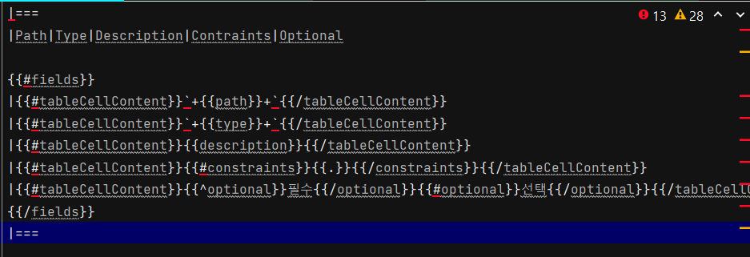
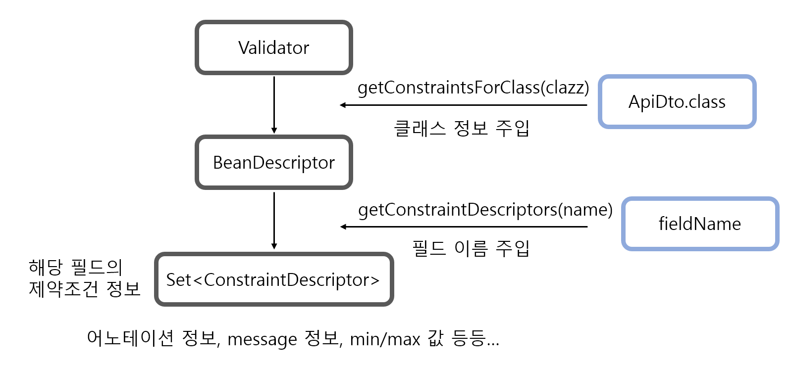

# 문제 상황

​	API 를 만들다보면 ApiDto 레벨에서 Validation 검증을 해야하는 상황이 분명히 있습니다. 특히 해당 값이 필수값이면요. 또한 이러한 제약조건(Constraints) 도 API 문서에 넣을 필요가 있는데요. RestDocs 에는 기본적인 값 (field name, description) 외에도 `Attributes` 클래스를 통해 커스텀 속성 값을 넣을 수 있습니다. 그래서 저는 RestDocs 문서에 Constraints 를 만들어서 제약 조건을 해당 속성에 넣었습니다.



위와 같이 제약조건을 넣은 `request-fields.snippet` 을 만들면 제약조건이 들어갑니다.

제약조건을 설정할 때는 `new Attributes.Attribute("속성 명", "속성 값")` 으로 직접 제약조건을 명시해줍니다. 하지만 문제는 <span style="color:orange">속성 값이 변경되었을 때 직접 일일히 수정해줘야 한다는 점</span>입니다.

예를 들어 아래와 같이 설정했을 때,

```java
new Attributes.Attribute("Constraints", "글자 수는 100글자 이하입니다.")
```

​	만약 해당 값의 제약조건이 50자 이하로 변경되었다해도 RestDocs 를 위한 API 테스트에서는 해당 값을 동적으로 변경하지 못합니다. (물론 Validation 검증을 위한 테스트에서 오류가 나니까 해당 테스트가 실패하면 실패 케이스를 고치면서 RestDocs 도 변경해야겠다는 생각을 할 수도 있습니다.) 그러면 실제 Validation 은 50자 이하인데 RestDocs API 문서에는 100 글자 이하가 제약조건으로 있겠죠.

# 해결 방법

​	위 문제를 해결하기 위해선 당연히 런타임 간 ApiDto 에서 동적으로 Validation 을 읽어서 Value 값을 만들어줘야 합니다.

​	스프링에서 Validation 을 검증하는 클래스는 `Validator` 인데요. 해당 클래스에 ApiDto 클래스를 주면 Validation 에 관한 모든 정보를 읽고 metadata 를 만들어줍니다.



큰 흐름은 위와 같습니다. `Validator` 클래스에 Dto 클래스를 넣으면 해당 클래스의 모든 정보를 가진 `BeanDescriptor` 를 만듭니다. `BeanDescriptor` 에서 필드 이름을 통해 각 필드의 제약조건 정보를 얻을 수 있습니다.

# 코드 레벨

아래와 같은 ApiDto 의 Validation 을 동적으로 받는다고 가정해보겠습니다.

```java
class MemberCreateApiDto {
    @Pattern(regexp = "^[가-힣a-zA-Z]*$", message = "{validation.name}")
    @Size(min = 1, max = 10, message="{validation.size}")
	String name;
    @Email(message="{validation.email}")
	String email;
}

//messages.properties
validation.name="이름은 필수값입니다."
validation.size="가능한 길이는 {min} ~ {max} 입니다."
validation.email="이메일을 정확히 입력해주세요."
```

## Constaint 클래스

```java
public class Constraint {

    @Autowired private MessageSource messageSource;
    //restdocs 에 constraint 를 추출하기 위해 사용
    private final ValidatorFactory factory = Validation.buildDefaultValidatorFactory();
    private Validator validator = factory.getValidator();
    private BeanDescriptor beanDescriptor;
    
    protected void setConstraintClass(Class<?> clazz){
         this.beanDescriptor = validator.getConstraintsForClass(clazz);
    }

protected String getConstraint(String value){
        if(beanDescriptor != null) throw new RuntimeException("set beanDescriptor!"); 

        PropertyDescriptor propertyDescriptor = beanDescriptor.getConstraintsForProperty(value);

        StringBuilder sb = new StringBuilder();

        if(propertyDescriptor == null){
            return new Attributes.Attribute("constraints", sb.toString());
        }

        Set<ConstraintDescriptor<?>> constraintDescriptors = propertyDescriptor.getConstraintDescriptors();

        for (ConstraintDescriptor<?> constraintDescriptor : constraintDescriptors) {

            String type = constraintDescriptor.getAnnotation().annotationType().getSimpleName();
            String message = (String) constraintDescriptor.getAttributes().get("message");
            Integer min = (Integer) constraintDescriptor.getAttributes().get("min");
            Integer max = (Integer) constraintDescriptor.getAttributes().get("max");
            String actualMessage = getActualMessage(message, min, max);

            sb.append(" [");
            sb.append(type);
            sb.append(" : ");
            sb.append(actualMessage);
            sb.append("] ");
        }

        return sb.toString();
    }

	protected String getActualMessage(String messageKey, Integer min, Integer max) {
        String actualMessageKey = messageKey.replace("{", "").replace("}", "");

        String message = messageSource.getMessage(actualMessageKey, null, Locale.getDefault());

        if(min == null || max == null){
            return message;
        }

        return message.replace("{min}", min.toString()).replace("{max}", max.toString());
    }	
```

하나하나 나눠서 살펴보겠습니다.

### 필드값

```java
@Autowired private MessageSource messageSource;
private final ValidatorFactory factory = Validation.buildDefaultValidatorFactory();
private Validator validator = factory.getValidator();
private BeanDescriptor beanDescriptor;

protected void setConstraintClass(Class<?> clazz){
     this.beanDescriptor = validator.getConstraintsForClass(clazz);
}
```

`messageSource` 는 아래에서 `messages.properties` 값을 읽기 위한 클래스입니다. 특정 조건에서는 필요없습니다. (`messages.properties` 를 사용하지 않을 때)

`ValidatorFactory` 는 `Validator` 를 위한 팩토리 메서드입니다. 그리고 `BeanDescriptor` 은 클래스의 Validation 을 가지고 있는 클래스입니다. 해당 클래스의 인스턴스를 계속 사용할 예정이라서 `setConstraintClass()` 를 통해 MemberCreateApiDto 를 받습니다. 예를 들어 외부에서 해당 메서드를 호출하면,

```java
setConstraintClass(MemberCreateApiDto.class);
```

`beanDescriptor` 에는 `MemberCreateApiDto` 클래스에 대한 메타 정보가 생깁니다. 이제 해당 정보를 추출해보겠습니다.

### getConstraint 메서드

해당 메서드의 반환값은 `String` 클래스입니다. 리스트나 해시맵 등 원하는 다른 값으로 해도 당연히 문제없습니다. **파라미터(value) 는 필드 이름입니다.(ex. "name", "email" 등)** 

```java
protected String getConstraint(String value){
        if(beanDescriptor != null) throw new RuntimeException("set beanDescriptor!"); 

        PropertyDescriptor propertyDescriptor = beanDescriptor.getConstraintsForProperty(value);

        StringBuilder sb = new StringBuilder();

        if(propertyDescriptor == null){
            return sb.toString();
        }
        
        ...
    }
```

먼저 `beanDescriptor` 가 `null` 이면 `RuntimeException` 을 발생시킵니다. 

`beanDescriptor` 가 있다면 `value` 를 통해 `PropertyDescriptor` 을 가져옵니다. `PropertyDescriptor` 은 해당 필드에 대한 제약조건 정보들이 있습니다. 만약 제약조건 정보가 없다면 `PropertyDescriptor` 가 `null` 이므로 그대로 반환합니다.

```java
protected String getConstraint(String value){

    ...
    Set<ConstraintDescriptor<?>> constraintDescriptors = propertyDescriptor.getConstraintDescriptors();

        for (ConstraintDescriptor<?> constraintDescriptor : constraintDescriptors) {

        String type = constraintDescriptor.getAnnotation().annotationType().getSimpleName();
        String message = (String) constraintDescriptor.getAttributes().get("message");
        Integer min = (Integer) constraintDescriptor.getAttributes().get("min");
        Integer max = (Integer) constraintDescriptor.getAttributes().get("max");
        String actualMessage = getActualMessage(message, min, max);

        sb.append(" [");
        sb.append(type);
        sb.append(" : ");
        sb.append(actualMessage);
        sb.append("] ");
    }

    return sb.toString();
}
```

​	좀 더 아래를 살펴보겠습니다. `Set<ConstraintDescriptor<?>>` 는 필드의 모든 제약조건 집합입니다. 예를 들어 `name` 필드에는 `@Pattern`, `@Size` 조건이 있는데요. 해당 `Set` 안에 하나의 `ConstraintDescriptor` 로 들어있습니다.

​	따라서 for loop 를 통해 `ConstraintDescriptor` 을 하나하나 꺼내서 속성값을 가져옵니다. 

- `type` 은 어노테이션의 이름으로 `Pattern`, `Size`, `Email` 을 말합니다. `constraintDescriptor.getAnnotation()` 으로 어노테이션 정보를 얻을 수 있습니다.
- `message` 는 `@Pattern(message="message")` 에서의 메시지입니다. `constraintDescriptor.getAttributes()` 로 속성정보를 가져옵니다.
- `min`, `max` 도 마찬가지로 속성정보인데, `@Pattern` 에는 없고 `@Size` 에는 있습니다. 없다면 `Null` 값으로 들어옵니다.

이렇게 가져온 `message` 는 `{validation.name}` 과 같이 `messages.properties` 가 적용되지 않은 상태입니다. 따라서 `getActualMessage()` 메서드를 통해 실제 메시지를 `properties` 에서 가져와야 합니다.

해당 메서드는 아래에서 설명하고, 최종적으로 출력되는 값(`sb.toString()`) 은 아래와 같습니다. (`value` 를 `"name"` 으로 줬을 때)

```
[Pattern : 이름은 필수값입니다.] [Size : 가능한 길이는 1 ~ 10자 입니다.]
```

해당 값이 바로 `MemberCreateApiDto` 의 `name` 필드값의 `validation message` 입니다.

### getActualMessage

```java
protected String getActualMessage(String messageKey, Integer min, Integer max) {
        String actualMessageKey = messageKey.replace("{", "").replace("}", "");

        String message = messageSource.getMessage(actualMessageKey, null, Locale.getDefault());

        if(min == null || max == null){
            return message;
        }

        return message.replace("{min}", min.toString()).replace("{max}", max.toString());
    }
```

`messageKey` 는 `"{validation.name}"` 과 같은 형태로 들어옵니다. 저는 전부 `messages.properties` 를 사용했지만 만약 그렇지 않다면 `{}` 가 없을 때는 그대로 리턴하도록 하는 게 좋을 듯합니다.

예를 들어서 `"{validation.name}"` 값이 들어왔을 때 앞뒤의 `{}` 를 떼고 `messageSource.getMessage()` 로 `messages.properties` 에서 `validation.name` 에 해당하는 값을 읽습니다. (`이름은 필수값입니다.`) 

그리고 `min`, `max` 값이 없다면 그대로 리턴하고, 있다면 해당 값을 넣어줍니다. `@Size` 같은 경우에 `min`, `max` 값이 함께 들어오는데요. `messageSource.getMessage()` 로 `message` 값을 받으면 `{가능한 길이는 {min} ~ {max}자 입니다.}` 과 같은 형태로 받아집니다. 그러면 추가적으로 해당 값을 할당해줘야겠죠. 그게 바로 마지막 리턴값의 `replace()` 입니다.

### 사용

외부 클래스에서 해당 메서드를 사용한다고 해보겠습니다.

```java
setConstraintClass(MemberCreateApiDto.class);
String constraints = getConstraint("name");
```

`constraints` 의 값은 위에서 본대로 `[Pattern : 이름은 필수값입니다.] [Size : 가능한 길이는 1 ~ 10자 입니다.]` 가 됩니다.

```java
setConstraintClass(MemberCreateApiDto.class);
String constraints = getConstraint("email");
```

여기서는 ``[Email: 이메일을 정확히 입력해주세요."]` 이 되구요.

만약 필드값을 따로 지정하는 게 아니라 한번에 모든 필드값의 제약 조건을 다 가져오고 싶다면 `propertyDescriptor` 부터 루프를 돌려서 가져오면 됩니다. 저도 따로 참고한 글은 없고 디버깅 찍으면서 차근차근 했습니다.

## RestDocs 적용

```java
protected Attributes.Attribute getConstraint(String value){

        assert(beanDescriptor != null) : "constraint 설정이 되어있지 않습니다. setConstraintClass() 를 통해 설정해주세요 ";

        PropertyDescriptor propertyDescriptor = beanDescriptor.getConstraintsForProperty(value);

        StringBuilder sb = new StringBuilder();

        if(propertyDescriptor == null){
            return new Attributes.Attribute("constraints", sb.toString());
        }

        Set<ConstraintDescriptor<?>> constraintDescriptors = propertyDescriptor.getConstraintDescriptors();

        for (ConstraintDescriptor<?> constraintDescriptor : constraintDescriptors) {

            String type = constraintDescriptor.getAnnotation().annotationType().getSimpleName();

            String message = (String) constraintDescriptor.getAttributes().get("message");
            Integer min = (Integer) constraintDescriptor.getAttributes().get("min");
            Integer max = (Integer) constraintDescriptor.getAttributes().get("max");
            String actualMessage = getActualMessage(message, min, max);

            sb.append(" [");
            sb.append(type);
            sb.append(" : ");
            sb.append(actualMessage);
            sb.append("] ");
        }

        return new Attributes.Attribute("constraints", sb.toString());
    }
```

 `getConstraint()` 클래스의 반환값만 `Attributes.Attribute` 로 변경해줍니다. 그러면 이제 restdocs 의 필드값으로 넣을 수 있습니다.

```java
requestFields(
	fieldWithPath("name").type(STRING).description("이름")
    	.attributes(getConstraint("name"))
            )
```

예를 들어 `requestField` 에 제약조건을 명시하고자 하면 위와 같이 만들 수 있습니다. `.attributes()` 메서드는 `Attributes.Attribute` 클래스를 받아서 필드값을 만듭니다.