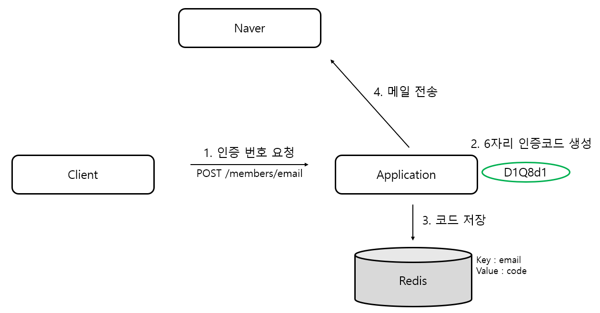
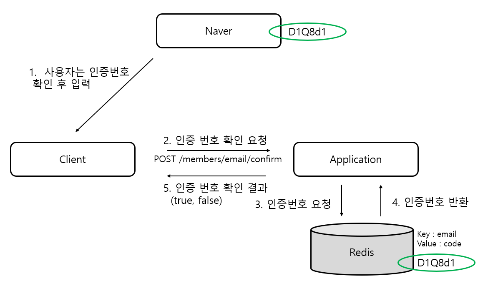
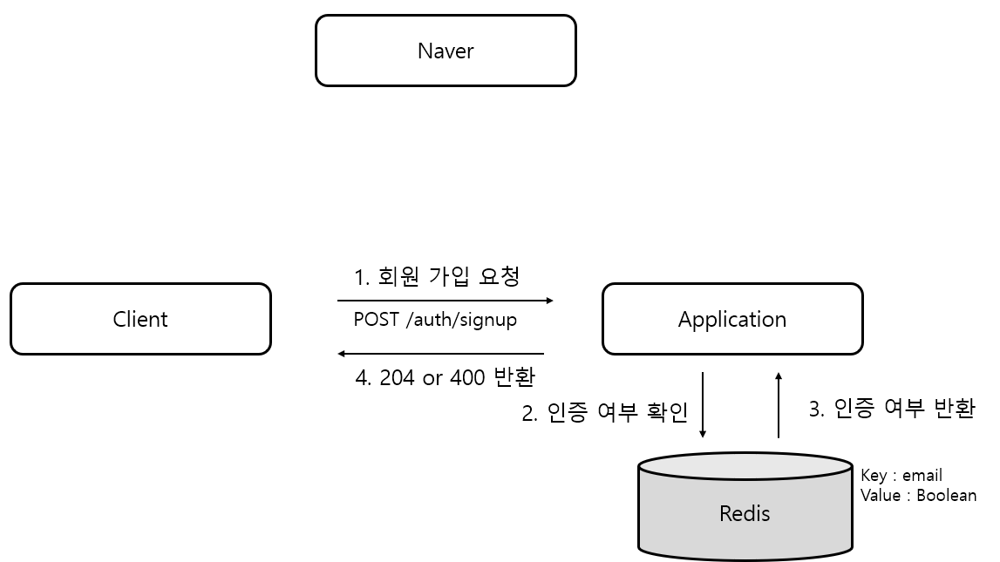
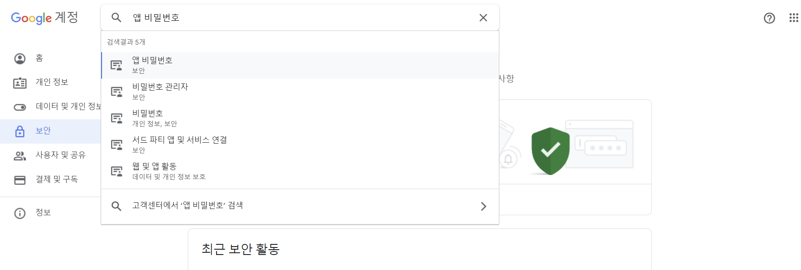
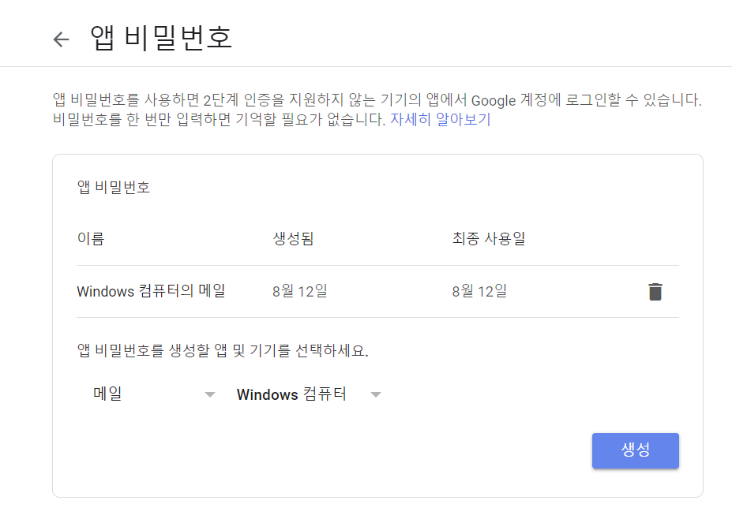
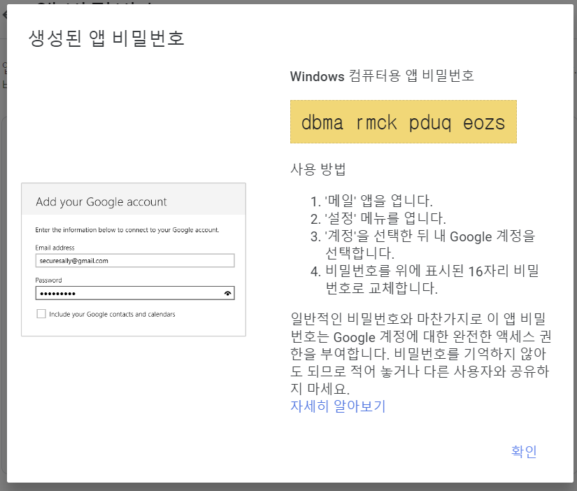
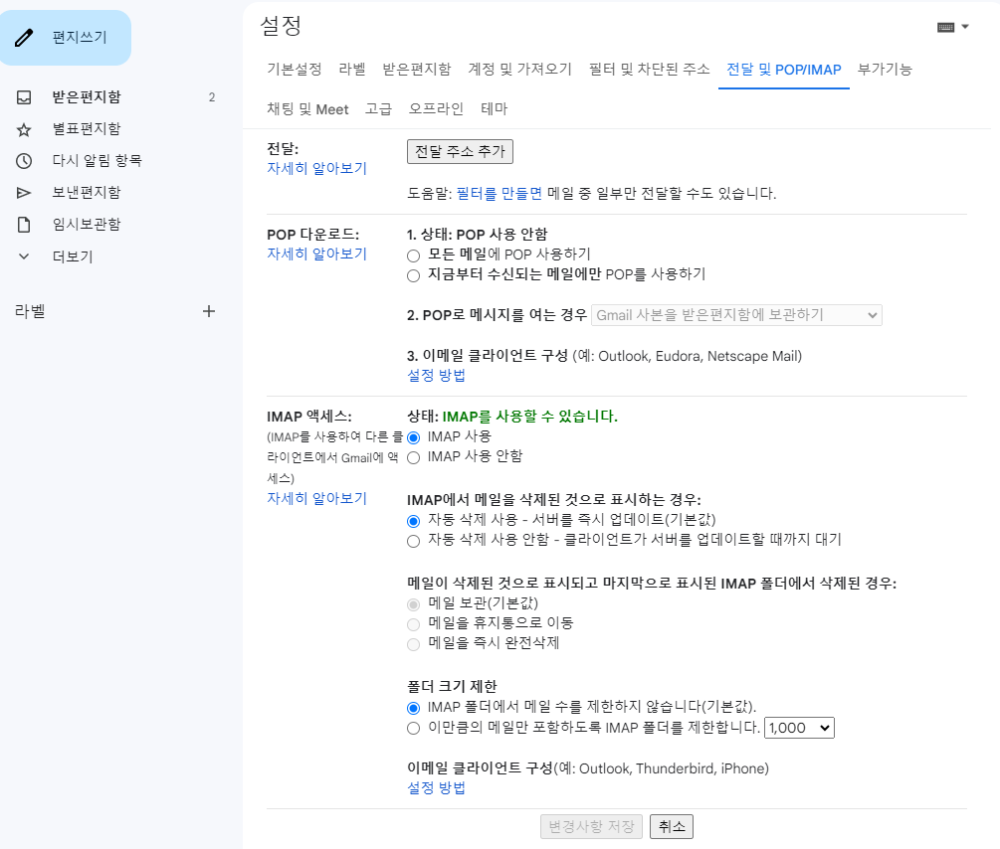

# 1. 문제 상황

​	이번 팀플로 하고 있는 Stackoverflow 클론 코딩 중 회원 가입 방법은 두 가지입니다. 첫번째는 OAuth 인증 시 자동으로 해당 email 로 회원가입을 하거나, 직접 회원가입 페이지에서 이메일로 회원가입을 하는 방법입니다.

​	OAuth 인증을 하면 자동으로 email 인증이 되는 것이니 따로 email 이 유효한지 체크할 필요가 없지만, **회원가입 페이지에서 직접 이메일로 가입을 요청하면 해당 이메일이 유효한지 확인을 해야 합니다.** 그렇지 않으면 `test@test.com` 과 같이 의미없는 더미 메일로 가입할 수도 있어서 사실상 익명 이용을 허용하게 됩니다.

# 2. 해결

​	이메일 인증 방식은 두 가지를 생각했습니다.

1. 이메일로 코드 전송 -> 해당 코드를 확인하고 회원가입 페이지에 입력
2. 이메일로 인증 URL 전송 -> URL 을 누르면 인증 완료

이 중에서 첫번째 방식으로 하기로 했습니다. 과정은 아래와 같습니다.

## 인증 번호 전송



1. 클라이언트 (프론트 페이지) 는 특정 이메일 (ex. `test@naver.com`)  에 인증 번호를 전송해달라고 서버에 요청합니다.
2. 서버는 6자리 인증코드를 생성합니다.
3. 인증 코드를 Redis 에 저장합니다.
4. 3번과 동시에 인증 코드를 메일로 전송합니다.

## 인증 번호 확인



1. 회원가입을 하려는 사용자는 인증번호를 확인하고 웹 페이지에 입력합니다.
2. 클라이언트는 인증번호 확인 요청을 합니다.
3. 서버에서 Redis 에서 해당 이메일에 대한 인증번호를 가져옵니다.
4. Redis 는 인증 번호를 반환합니다. 그리고 인증번호가 맞으면 **해당 email 에 대한 value 를 true 로 변경합니다.** (그러면 현재 Redis 에는 `key : email, value : true` 로 저장되어있습니다. 인증이 완료되었다는 뜻입니다.)
5. 클라이언트에서 인증 번호 확인 결과를 true, false 값으로 반환합니다. 이 때 인증 번호가 틀렸다고 해도 400번대 에러로 반환하지 않고 200 으로 반환하고 메시지만 boolean 값으로 줍니다.

## 회원 가입 요청



마지막으로 회원 가입 요청 시 입니다.

1. 클라이언트는 이메일, 비밀번호, 닉네임 등의 값으로 회원가입 요청을 합니다.
2. 서버는 해당 이메일이 인증을 받았는지 Redis 에 확인합니다.
3. Redis 에서는 email 에 대한 value 를 반환합니다. 만약 인증을 받았다면 반환 값이 true 이고, 아니면 code 값입니다.
4. email 인증이 되었다면 회원가입을 정상적으로 진행하고, 그게 아니면 인증되지 않았다고 반환합니다.

## 레디스를 사용한 이유

Redis 는 메모리 기반으로 데이터를 빠르게 읽고 쓸 수 있습니다. 임시로 사용할 인증코드를 DB 테이블로 관리할 필요없이 빠르게 사용할 수 있습니다. 또한 간편하게 만료 시간(TTL) 을 설정할 수 있어서 인증 코드의 유효 시간을 함께 저장할 수 있습니다.

# 3. 코드레벨

## Redis

​	먼저 Redis 를 설치해야 합니다. Redis 는 AWS 에서 Free tier 로 노드를 생성합니다. 여기서 기본 값이 3개 노드로 클러스터를 구성하는 건데, 프리티어에서는 인스턴스를 1개만 지원하니 노드를 1개로 변경해주어야 합니다. 이렇게 만든 Redis 서버는 VPC 내에서만 통신 할 수 있습니다.

​	AWS 에 Redis 를 생성하면 endpoint 를 받을 수 있습니다. Redis 생성과 엔드포인트 확인까지 끝났다고 가정하고 얘기하겠습니다.

### 의존성 추가

```
dependencies {
    implementation 'org.springframework.boot:spring-boot-starter-data-redis'
}
```

`Spring-Data-Redis` 의존성을 추가합니다.

### 변수 값 설정

```yml
spring:
  redis:
    host: {redis-endpoint} # 직접 입력
    port: 6379
```

config 파일에서 사용할 변수 값입니다. host 엔드포인트는 secret 으로 관리해주세요.

### Config 파일 생성

```java
@Configuration
public class RedisConfig {

    @Value("${spring.redis.host}")
    private String redisHost;

    @Value("${spring.redis.port}")
    private int redisPort;

    @Bean
    public RedisConnectionFactory redisConnectionFactory() {
        LettuceConnectionFactory lettuceConnectionFactory = new LettuceConnectionFactory(redisHost, redisPort);
        return lettuceConnectionFactory;
    }

    @Bean
    public RedisTemplate<String, String> redisTemplate() {
        RedisTemplate<String, String> redisTemplate = new RedisTemplate<>();
        redisTemplate.setConnectionFactory(redisConnectionFactory());
        redisTemplate.setKeySerializer(new StringRedisSerializer());
        redisTemplate.setValueSerializer(new StringRedisSerializer());
        return redisTemplate;
    }
}
```

- `LettuceConnectionFactory` 는 내부적으로 Netty를 사용하여 비동기 & 논블로킹 연산을 지원합니다. 단일 연결로 커넥션을 공유하지만 내부적으로 Netty를 활용하여 다수의 요청을 동시에 처리할 수 있습니다.
- `RedisTemplate`는 Redis 데이터 액세스 코드를 단순화하는 핼퍼 클래스입니다. 이 메소드에서 문자열 키와 값에 대한 직렬화 방법을 `StringRedisSerializer`로 설정하였습니다.

### RedisService

```java
@Service
public class RedisService {

    private final RedisTemplate<String, String> redisTemplate;

    public RedisService(RedisTemplate<String, String> redisTemplate) {
        this.redisTemplate = redisTemplate;
    }

    public void saveValues(String key, String authCode, Duration duration) {

        ValueOperations<String, String> operations = redisTemplate.opsForValue();
        operations.set(key, authCode, duration);
    }

    public String getValues(String key) {

        ValueOperations<String, String> operations = redisTemplate.opsForValue();
        return operations.get(key);
    }

    public void deleteValues(String key) {

            redisTemplate.delete(key);

    }
}
```

- Config 파일에서 생성된 `redisTemplate` 를 사용합니다.
- 기본적인 CRUD 를 정의했습니다. Update 의 경우  `saveValues` 메소드를 사용하여 동일한 `key` 에 새로운 값을 저장하면 기존의 값이 새로운 값으로 수정됩니다.

## email 서비스

### SMTP 계정 생성



저는 제 구글 메일로 인증번호를 전송했습니다. 만약 도메인을 구매했으면 해당 도메인으로 메일을 보내는 게 좋을 듯합니다. 

구글 계정 관리 -> 보안 -> 앱 비밀번호에 접속합니다.



저는 이미 생성한 게 있기는 한데요. 여기서 드롭다운으로 `메일`, `Windows 컴퓨터`를 선택하고 생성을 누릅니다.



앱 비밀번호가 나옵니다. 저는 바로 지워서 상관없는데, 비밀번호 관리는 별도로 해줍시다.



구글 Gmail 에서 설정 → 전달 및 POP/IMAP 로 들어가서 위 이미지처럼 설정한 후 변경사항을 저장합니다.

### 의존성 추가

```
//email
implementation 'org.springframework.boot:spring-boot-starter-mail'
```

`build.gradle` 에 추가합니다.

### 변수 값 설정

```yml
spring:
	mail:
    host: smtp.gmail.com
    port: 587
    username: test@gmail.com # 본인 메일 입력 
    password: dbmarmckpduqeozs # 앱 비밀번호 입력
    properties:
      mail:
        smtp:
          auth: true
          starttls:
            enable: true
            required: true
          connectiontimeout: 5000
          timeout: 5000
          writetimeout: 5000
    auth-code-expiration-millis: 300000  # 5 * 60 * 1000 == 5분
```

- **host**: Gmail의 SMTP 서버 호스트
- **port**: SMTP 서버의 포트 번호. Gmail SMTP 서버는 587번 포트를 사용
- **username**: 이메일을 보내는 용으로 사용되는 계정의 이메일 주소 입력
- **password**: 위에서 생성했던 앱 비밀번호 입력
- **properties**: 이메일 구성에 대한 추가 속성
- **auth**: SMTP 서버에 인증 필요한 경우 true로 지정. Gmail SMTP 서버는 인증을 요구하기 때문에 true로 설정해야 합니다.
- **starttls**: SMTP 서버가 TLS를 사용하여 안전한 연결을 요구하는 경우 true로 설정합니다.
- **connectiontimeout**: 클라이언트가 SMTP 서버와의 연결을 설정하는 데 대기해야 하는 시간(Millisecond). 연결이 불안정한 경우 대기 시간이 길어질 수 있기 때문에 너무 크게 설정하면 전송 속도가 느려질 수 있습니다.
- **timeout**: 클라이언트가 SMTP 서버로부터 응답을 대기해야 하는 시간(Millisecond). 서버에서 응답이 오지 않는 경우 대기 시간을 제한하기 위해 사용됩니다.
- **writetimeout**: 클라이언트가 작업을 완료하는데 대기해야 하는 시간(Millisecond). 이메일을 SMTP 서버로 전송하는 데 걸리는 시간을 제한하는데 사용됩니다.
- **auth-code-expiration-millis:** 이메일 인증 코드의 만료 시간(Millisecond)

### Config 파일 생성

```java
@Configuration
public class EmailConfig {

    @Value("${spring.mail.host}")
    private String host;

    @Value("${spring.mail.port}")
    private int port;

    @Value("${spring.mail.username}")
    private String username;

    @Value("${spring.mail.password}")
    private String password;

    @Value("${spring.mail.properties.mail.smtp.auth}")
    private boolean auth;

    @Value("${spring.mail.properties.mail.smtp.starttls.enable}")
    private boolean starttlsEnable;

    @Value("${spring.mail.properties.mail.smtp.starttls.required}")
    private boolean starttlsRequired;

    @Value("${spring.mail.properties.mail.smtp.connectiontimeout}")
    private int connectionTimeout;

    @Value("${spring.mail.properties.mail.smtp.timeout}")
    private int timeout;

    @Value("${spring.mail.properties.mail.smtp.writetimeout}")
    private int writeTimeout;

    @Bean
    public JavaMailSender javaMailSender() {
        JavaMailSenderImpl mailSender = new JavaMailSenderImpl();
        mailSender.setHost(host);
        mailSender.setPort(port);
        mailSender.setUsername(username);
        mailSender.setPassword(password);
        mailSender.setDefaultEncoding("UTF-8");
        mailSender.setJavaMailProperties(getMailProperties());

        return mailSender;
    }

    private Properties getMailProperties() {
        Properties properties = new Properties();
        properties.put("mail.smtp.auth", auth);
        properties.put("mail.smtp.starttls.enable", starttlsEnable);
        properties.put("mail.smtp.starttls.required", starttlsRequired);
        properties.put("mail.smtp.connectiontimeout", connectionTimeout);
        properties.put("mail.smtp.timeout", timeout);
        properties.put("mail.smtp.writetimeout", writeTimeout);

        return properties;
    }
}

```

yml 파일로 설정한 변수들로 `JavaMailSender` 를 빈으로 등록합니다. 해당 객체로 이메일을 보냅니다.

### MailService

```java
@Transactional
@Service
@Slf4j
public class MailService {

    private final JavaMailSender emailSender;

    public MailService(JavaMailSender emailSender) {
        this.emailSender = emailSender;
    }

    public String sendAuthEmail(String toEmail) {
        String title = "Sixman-Stackoverflow 회원가입 인증 번호";
        String code = createCode();

        try {
            MimeMessage mimeMessage = emailSender.createMimeMessage();

            createEmailForm(toEmail, title, code, mimeMessage);

            emailSender.send(mimeMessage);

            return code;
        } catch (Exception e) {
            throw new EmailSendException();
        }
    }

    private void createEmailForm(String toEmail, String title, String code, MimeMessage mimeMessage) throws MessagingException {

        MimeMessageHelper helper = new MimeMessageHelper(mimeMessage, "utf-8");

        String htmlContent = "<h3>회원가입 인증 번호</h3>"
                +"<p>아래의 인증 번호를 입력해주세요.</p>"
                + "<div style='border: 1px solid #e1e1e1; padding: 10px; width: 100px; text-align: center;'>"
                + code
                + "</div>";

        helper.setTo(toEmail);
        helper.setSubject(title);
        helper.setText(htmlContent, true);
    }

    private String createCode() {
        int length = 6;
        try {
            Random random = SecureRandom.getInstanceStrong();
            StringBuilder builder = new StringBuilder();
            String characters = "0123456789ABCDEFGHIJKLMNOPQRSTUVWXYZabcdefghijklmnopqrstuvwxyz";

            for (int i = 0; i < length; i++) {
                int randomIndex = random.nextInt(characters.length());
                builder.append(characters.charAt(randomIndex));
            }

            return builder.toString();
        } catch (NoSuchAlgorithmException e) {
            log.info("create mail authCode error : " + e.getMessage());
            throw new EmailSendException();
        }
    }
}
```

`sendAuthEmail()` 메서드로 인증 메일을 보냅니다. `MimeMessageHelper` 를 사용하면 html 구조를 사용할 수 있습니다. 코드 생성도 해당 서비스 클래스에서 진행했습니다.

## MemberService

```java
@Service
@Transactional(readOnly = true)
public class MemberService {

    private final MemberRepository memberRepository;
    private final S3Service s3Service;
    private final MailService mailService;
    private final RedisService redisService;
    private final PasswordEncoder passwordEncoder;
    private static final String AUTH_CODE_PREFIX = "AuthCode ";
    @Value("${spring.mail.auth-code-expiration-millis}")
    private long authCodeExpirationMillis;
    @Value("${spring.mail.email-complete-expiration-millis}")
    private long emailCompleteExpirationMillis;

    public MemberService(MemberRepository memberRepository,
                         S3Service s3Service,
                         MailService mailService,
                         RedisService redisService,
                         PasswordEncoder passwordEncoder) {
        this.memberRepository = memberRepository;
        this.s3Service = s3Service;
        this.mailService = mailService;
        this.redisService = redisService;
        this.passwordEncoder = passwordEncoder;
    }

    @Transactional
    public Long signup(MemberCreateServiceRequest request) { //회원가입 메소드

        checkEmailAuthComplete(request.getEmail()); //이메일 인증이 되었는지 체크

        checkDuplicateMember(request.getEmail()); //중복된 이메일인지 체크

        Member member = createMember(request);

        return memberRepository.save(member).getMemberId();
    }

    public void sendCodeToEmail(String toEmail) { //이메일로 코드를 보내는 메소드

        checkDuplicateMember(toEmail); //중복된 이메일인지 체크

        String authCode = mailService.sendAuthEmail(toEmail); //이메일을 보내면 코드를 받음

        redisService.saveValues( //레디스에 코드 저장, 5분
                AUTH_CODE_PREFIX + toEmail,
                authCode,
                Duration.ofMillis(authCodeExpirationMillis));
    }

    public boolean checkCode(String toEmail, String code) { //해당 이메일의 코드가 맞는지 확인하는 메소드

        String authCode = redisService.getValues(AUTH_CODE_PREFIX + toEmail); //레디스에서 코드 꺼내기

        boolean isValid = authCode.equals(code); //코드가 맞는지 확인

        if(isValid) redisService.saveValues( //코드가 맞으면 레디스에 true 로 저장
                AUTH_CODE_PREFIX + toEmail,
                "true",
                Duration.ofMillis(emailCompleteExpirationMillis));

        return isValid; //boolean 값 반환
    }

    private void checkDuplicateMember(String email) {
        if (memberRepository.findByEmail(email).isPresent()) {
            throw new MemberDuplicateException();
        }
    }

    private Member createMember(MemberCreateServiceRequest request) {
        return Member.createMember(
                request.getEmail(),
                request.getNickname(),
                passwordEncoder.encode(request.getPassword())
        );
    }
}
```

필요한 부분만 가지고 왔습니다. 주석 참고해주세요. API 는 해당 public 메소드들을 활용해서 작성하면 되겠습니다.

# Ref.

1. [Spring - 이메일 인증 구현해보기 (랜덤 인증번호 보내기)](https://green-bin.tistory.com/83)