이전 [포스트](https://hobeen-kim.github.io/spring/Spring-MDC-%EB%A5%BC-%EC%9D%B4%EC%9A%A9%ED%95%9C-%EB%A1%9C%EA%B9%85(%EB%A9%80%ED%8B%B0%EC%93%B0%EB%A0%88%EB%93%9C-%EC%8B%9D%EB%B3%84)/) 와 비슷한 내용입니다. 이전에는 slack 으로 error 알림을 보냈다면 이번에는 aws sns 로 구현했습니다. 추가로 요청에 대한 응답 시간 측정 및 대시보드 작성을 했습니다.

# 1. 문제 상황

​	요구사항은 크게 두 가지입니다. 

1. **error 로그 발생 시 개발자에게 알림 전송**
2. **각 리소스별 응답 시간 측정**

​	일단 현재 요구사항은 리소스의 응답 시간이지만 같은 방법으로 DB 조회 응답 시간도 간단하게 추가할 수 있겠습니다.

# 2. 해결

## 에러 발생 시 알림 전송

### **1. 언제 에러 로그를 발생시킬 것인가?**

​	모든 Exception 이 에러 로깅을 남겨야 하는 건 당연히 아니죠. `member 중복`, `request resource 없음` 등은 개발자가 이미 해당 사항에 대해 비즈니스 처리를 해놨을테니까요. 

​	일단 저는 **비즈니스 처리하지 않은 모든 Exception** 을 잠재적인 오류로 간주하고 에러 로깅을 남기도록 했습니다. 예를 들어서 member  의 nickname 으로도 member 를 조회할 수 있게 해놨는데 nickname 필드를 unique 로 하지 않았다면 nickname 이 중복으로 저장된 상황에서는 `findByNickname` 메서드가 Exception 을 발생시키겠죠. 이 Exception 을 비즈니스  예외로 처리하지 않았기 때문에 error 로그가 남게 되고, 저는 그걸 보고 비즈니스 처리를 하든, 로직을 변경하든 조치를 취할 겁니다.

### **2. 어떻게 알림을 전송할 것인가?**

​	우선 알림 전송 방법은 email 로 생각했습니다. 지금은 개발 단계니까 휴대폰 메시지나 푸시 알림 등 실시간은 필요없습니다. 알림 전송 흐름은 아래와 같습니다.

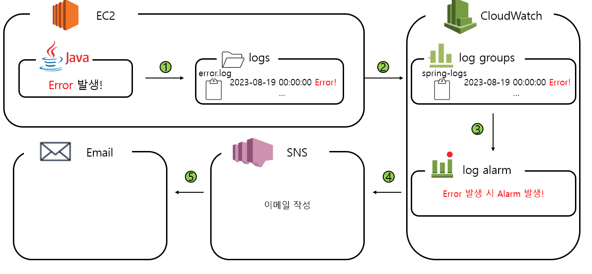

1. `log.error("...")` 로 에러가 발생하면 `logs/error-xxx.log` 파일에 로그 기록
2. cloudwatch 에서 로그 발생 감지
3. error 로그가 1개 이상이면 cloudwatch alarm 에서 alarm 발생
4. alarm 발생 시 SNS 로 publish
5. SNS 가 email 로 메일 전송

## 리소스별 응답시간 측정

​	응답시간을 측정하는 로직은 Filter 로 구현했습니다. 스프링의 제일 앞단 Filter 에 startTime 을 측정하고, 모든 로직이 끝난 후에 endTime 을 측정하고 차이를 기록합니다. 이때 차이는 INFO 레벨로 로그를 남깁니다. 그리고 request 에 요청 리소스 정보가 있으므로 해당 요청의 각 리소스 및 http 메서드도 INFO 레벨로 로깅합니다.

​	그러면 해당 로그 파일도 logs 폴더의 `access.log`  파일로 기록됩니다. 해당 로그는 실행시간을 가지고 있으므로(ex. `duration : 50 ms`) 로그를 파싱해서 cloudwatch 대시보드에 남깁니다. 

​	로그를 파싱할 때는 log group 에서 `Metric filters` 로 파싱합니다.

# 3. 코드 레벨

spring 으로 logs 폴더에 로그 파일 남기기 -> ec2 cloud watch 설정 -> cloud watch metrics 구현 -> dash board 설정 -> alarm 설정 순으로 알아보겠습니다.

## log 파일 남기기

### build.gradle

```
//mdc log
implementation 'org.slf4j:slf4j-api'
implementation 'ch.qos.logback:logback-classic'
```

MDC, logback 을 사용하기 위한 의존성입니다.

### MDCLoggingFilter

```java
@Component
@Order(Ordered.HIGHEST_PRECEDENCE)
@Slf4j
public class MDCLoggingFilter implements Filter {
    @Override
    public void doFilter(ServletRequest request, ServletResponse response, FilterChain chain) throws IOException, ServletException {

        UUID uuid = UUID.randomUUID(); // 1
        MDC.put("request_id", uuid.toString()); // 2
        MDC.put("email", "anonymous"); // 3

        long startTime = System.currentTimeMillis();

        chain.doFilter(request, response);

        long endTime = System.currentTimeMillis();

        long duration = endTime - startTime; // 4

        String method = ((HttpServletRequest) request).getMethod(); // 5
        String[] urlArr = ((HttpServletRequest) request).getRequestURI().split("/"); // 6
        String url = "";
        if(urlArr.length > 2){
            url = urlArr[1];
        }

        log.info("{} {}{} duration: {} ms", method, "/", url, duration); // 7

        MDC.clear(); // 8
    }
}
```

`MDCLoggingFilter` 는 `@Order(Ordered.HIGHEST_PRECEDENCE)` 통해 가장 앞단의 필터가 됩니다. 모든 요청에 대해 로그를 남깁니다.

1. UUID 는 `c50f0981-16d4-4d4f-8959-621d5f72216e` 와 같이 랜덤한 값이 부여됩니다. 요청한 사용자가 같더라도 하나의 요청마다 개별적인 UUID 가 부여됩니다.
2. MDC 는 쉽게 말해 각 스레드별로 가지고 있는 로그 저장소입니다. `request_id` 를 UUID 로 저장하면 해당 스레드는 반환될 때까지 `request_id` 을 가지고 있습니다.
3. `email` 도 MDC 로 설정합니다. 최초에 `email` 을 식별할 수 없기 때문에 `anonymous` 로 설정하고, 인증이 완료되면 해당 이메일을 넣어줄 예정입니다.
4. `duration` 을 계산합니다. `doFilter` 메서드 앞뒤로 넣으면 됩니다.
5. `method` 는 요청 메서드입니다.
6. `url` 은 요청 리소스입니다. 이때 첫번째 위치만 확인합니다. 예를 들어 `/members/1/answers` 를 요청했다면 `/members` 만 기록합니다. 더 자세한 정보가 필요하면 해당 필터가 아닌 더 안쪽 레벨에서 기록하는 게 좋을 것 같습니다.
7. `log.info` 로 지금까지 정보를 출력합니다. `request_id` 와 `email` 을 `logback-spring.xml` 에서 출력할 예정이기 때문에 `method`, `url`, `duration` 만 출력합니다.
8. MDC 내부에 있는 로그를 삭제해줍니다. 다음 사용자가 다시 써야하니까요.

### JwtVerificationFilter

해당 필터는 accessToken 에서 인증정보를 확인하는 로직입니다. 해당 로직을 통과하면 email 값을 알 수 있습니다.

```java
@RequiredArgsConstructor
public class JwtVerificationFilter extends OncePerRequestFilter {

  
    @Override
    protected void doFilterInternal(HttpServletRequest request, HttpServletResponse response, FilterChain filterChain) throws ServletException, IOException {

        try{
            Claims claims = verifyTokenClaims(request); // 1
            setAuthenticationToContext(claims); // 2
            MDC.put("email", claims.getSubject()); // 3

        }catch(BusinessException exception){
            request.setAttribute("businessException", exception);
        }catch(Exception exception){
            request.setAttribute("exception", exception);
        }

        filterChain.doFilter(request, response);
    }
    
    ...
    
}
```

*JwtVerificationFilter 중 일부입니다.*

1. `verifyTokenClaims` 메서드는 request 에서 accessToken 을 빼서 `Claim` 값으로 변환해줍니다.
2. `setAuthenticationToContext` 은 Thread 에 `Authentication` 정보를 저장합니다.
3. `MDC.put("email", claims.getSubject())` 으로 `anoymous` 값을 로그인된 사용자의 email 로 변경합니다. 따라서 인증된 사용자는 email 값에 자신의 email 이 들어가고, 익명 사용자는 그대로 `anoymous` 을 유지합니다.

### logback-spring.xml

`src/main/resources/` 디렉토리에 넣어줍니다.

```java
<?xml version="1.0" encoding="UTF-8"?>
<configuration>
    <include resource="org/springframework/boot/logging/logback/base.xml"/>

    <property name="home" value="logs"/>

    <appender name="DEFAULT_FILE_APPENDER" class="ch.qos.logback.core.rolling.RollingFileAppender">
        <rollingPolicy class="ch.qos.logback.core.rolling.SizeAndTimeBasedRollingPolicy">
            <fileNamePattern>${home}/access-%d{yyyy-MM-dd}.%i.log</fileNamePattern>
            <maxFileSize>15mb</maxFileSize>
            <maxHistory>30</maxHistory>
        </rollingPolicy>
        <encoder>
            <charset>utf8</charset>
            <pattern>%X{request_id} %X{email} ${FILE_LOG_PATTERN}</pattern>
        </encoder>
        <filter class="ch.qos.logback.classic.filter.ThresholdFilter">
            <level>INFO</level>
        </filter>
    </appender>

    <appender name="ERROR_FILE_APPENDER" class="ch.qos.logback.core.rolling.RollingFileAppender">
        <rollingPolicy class="ch.qos.logback.core.rolling.SizeAndTimeBasedRollingPolicy">
            <fileNamePattern>${home}/error-%d{yyyy-MM-dd}.%i.log</fileNamePattern>
            <maxFileSize>15mb</maxFileSize>
            <maxHistory>30</maxHistory>
        </rollingPolicy>
        <encoder>
            <charset>utf8</charset>
            <pattern>%X{request_id} %X{email} ${FILE_LOG_PATTERN}</pattern>
        </encoder>
        <filter class="ch.qos.logback.classic.filter.ThresholdFilter">
            <level>ERROR</level>
        </filter>
    </appender>

    <root level="INFO">
        <appender-ref ref="DEFAULT_FILE_APPENDER"/>
        <appender-ref ref="ERROR_FILE_APPENDER"/>
    </root>

</configuration>
```

로그를 남기기 위한 설정입니다. 이름을 `logback-spring.xml` 로 `resources` 디렉토리에 넣어두면 스프링에서 인식해서 적용시킵니다.

1. `<property name="home" value="logs"/>` : 변수를 설정합니다. home 변수는 logs 로, 저장되는 위치를 변수로 설정했습니다.
2. `appender` 태그 : `DEFAULT_FILE_APPENDER` 와 `ERROR_FILE_APPENDER` 각각 INFO 레벨, ERROR 레벨의 로그를 남깁니다. file 이름은 `fileNamePattern` 태그에 있습니다. 기록되는 내용은 `encoder` 태그의 `pattern` 입니다. MDC 로 설정한 `request_id`, `email` 을 남깁니다.
3. `root` 태그 : 전역 설정으로 어느 레벨의 로그를 남길지 설정합니다. 저는 INFO 레벨로 했습니다. 해당 레벨을 `DEFAULT_FILE_APPENDER`, `ERROR_FILE_APPENDER` 에 적용시킵니다.

### 필요한 곳에 error 로그 남기기

저는 GlobalHandlerException 에 비즈니스 예외가 아닌 모든 Exception 에 대해 error 로그를 남겼습니다.

```java
@RestControllerAdvice
@Slf4j
public class GlobalExceptionHandler {

    ...

    @ExceptionHandler(Exception.class)
    public ResponseEntity<ApiSingleResponse<Void>> handleException(Exception e) {

        log.error("Unknown error happened: {}", e.getMessage());
        e.printStackTrace();

        return new ResponseEntity<>(ApiSingleResponse.fail(e), HttpStatus.INTERNAL_SERVER_ERROR);
    }
}

```

이제 통제되지 않은 Exception 은 모두 error 로그가 남습니다.

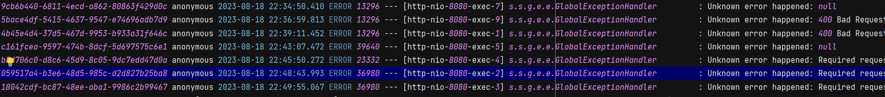

좀 짤리긴 했는데 이런 식으로 logs 폴더에 `error-2023-08-18.0.log` 파일에 저장됩니다. 제일 처음에 UUID, 그다음에 email 값이 있습니다.

##  ec2 cloud watch 설정

해당 블로그를 참고했습니다. -> [Spring, Docker, Jenkins, Blue Green 무중단 배포, VPC, AutoScaling, Load Balancer, S3, CloudWatch, RDS를 활용한 CI/CD 구축하기](https://backtony.github.io/spring/aws/2021-08-28-spring-cicd-3/#ec2-%EC%83%9D%EC%84%B1)

### CloudWatch Agent 설치하기 

```
# 설치 스크립트 다운
wget https://s3.amazonaws.com/amazoncloudwatch-agent/linux/amd64/latest/AmazonCloudWatchAgent.zip

# 압축 해제 및 zip 파일 제거
unzip AmazonCloudWatchAgent.zip -d AmazonCloudWatchAgent
rm AmazonCloudWatchAgent.zip

# 폴더로 이동
cd AmazonCloudWatchAgent

# 설치
sudo ./install.sh

# 설치 마법사 실행
sudo /opt/aws/amazon-cloudwatch-agent/bin/amazon-cloudwatch-agent-config-wizard

=============================================================
= Welcome to the AWS CloudWatch Agent Configuration Manager =
=============================================================
# 운영 체제 선택
On which OS are you planning to use the agent?
1. linux
2. windows
3. darwin
default choice: [1]:
1

# EC2 인스턴스 설치 or 자체 서버 설치
Trying to fetch the default region based on ec2 metadata...
Are you using EC2 or On-Premises hosts?
1. EC2
2. On-Premises
default choice: [1]:
1

# agent run 유저 선택
Which user are you planning to run the agent?
1. root
2. cwagent
3. others
default choice: [1]:
1

# StatsD 데몬 실행 여부
# 사용자 지정 지표를 쉽게 기록할 수 있게 하는 프로토콜
Do you want to turn on StatsD daemon?
1. yes
2. no
default choice: [1]:
2

# CollectD dammon 실행 여부
# StatD와 마찬가지로 사용자 지표 쉽게 기록할 수 있게 하는 프로토콜
Do you want to monitor metrics from CollectD?
1. yes
2. no
default choice: [1]:
2

# CPU, 메모리와 같은 호스트의 지표를 기록하고 싶은지 여부
Do you want to monitor any host metrics? e.g. CPU, memory, etc.
1. yes
2. no
default choice: [1]:
1

# CPU 코어별 기록 여부 -> 추가 요금 발생
Do you want to monitor cpu metrics per core? Additional CloudWatch charges may apply.
1. yes
2. no
default choice: [1]:
2

# 기록 시 가능한 모든 EC2 자원을 기록하고 싶은지 여부
Do you want to add ec2 dimensions (ImageId, InstanceId, InstanceType, AutoScalingGroupName) into all of your metrics if the info is available?
1. yes
2. no
default choice: [1]:
1

# 지표를 기록하는 주기 지정
# 짧을 수록 더 많으 비용 지불
Would you like to collect your metrics at high resolution (sub-minute resolution)? This enables sub-minute resolution for all metrics, but you can customize for specific metrics in the output json file.
1. 1s
2. 10s
3. 30s
4. 60s
default choice: [4]:
4

# 어떤 지표들을 기록할지 지정, 이후에 설명
Which default metrics config do you want?
1. Basic
2. Standard
3. Advanced
4. None
default choice: [1]:
2

# 현재 선택 사항 확인
Current config as follows:
{
	"agent": {
		"metrics_collection_interval": 60,
		"run_as_user": "root"
	},
	"metrics": {
		"append_dimensions": {
			"AutoScalingGroupName": "${aws:AutoScalingGroupName}",
			"ImageId": "${aws:ImageId}",
			"InstanceId": "${aws:InstanceId}",
			"InstanceType": "${aws:InstanceType}"
		},
		"metrics_collected": {
			"cpu": {
				"measurement": [
					"cpu_usage_idle",
					"cpu_usage_iowait",
					"cpu_usage_user",
					"cpu_usage_system"
				],
				"metrics_collection_interval": 60,
				"totalcpu": false
			},
			"disk": {
				"measurement": [
					"used_percent",
					"inodes_free"
				],
				"metrics_collection_interval": 60,
				"resources": [
					"*"
				]
			},
			"diskio": {
				"measurement": [
					"io_time"
				],
				"metrics_collection_interval": 60,
				"resources": [
					"*"
				]
			},
			"mem": {
				"measurement": [
					"mem_used_percent"
				],
				"metrics_collection_interval": 60
			},
			"swap": {
				"measurement": [
					"swap_used_percent"
				],
				"metrics_collection_interval": 60
			}
		}
	}
}
Are you satisfied with the above config? Note: it can be manually customized after the wizard completes to add additional items.
1. yes
2. no
default choice: [1]:
1

# CloudWatch Logs 설정 파일이 있는지 여부
Do you have any existing CloudWatch Log Agent (http://docs.aws.amazon.com/AmazonCloudWatch/latest/logs/AgentReference.html) configuration file to import for migration?
1. yes
2. no
default choice: [2]:
2

# 모니터링 하고 싶은 로그 파일이 있는지 여부
Do you want to monitor any log files?
1. yes
2. no
default choice: [1]:
2

# 설정 값 다시 확인
Saved config file to /opt/aws/amazon-cloudwatch-agent/bin/config.json successfully.
Current config as follows:
{
	"agent": {
		"metrics_collection_interval": 60,
		"run_as_user": "root"
	},
	"metrics": {
		"append_dimensions": {
			"AutoScalingGroupName": "${aws:AutoScalingGroupName}",
			"ImageId": "${aws:ImageId}",
			"InstanceId": "${aws:InstanceId}",
			"InstanceType": "${aws:InstanceType}"
		},
		"metrics_collected": {
			"cpu": {
				"measurement": [
					"cpu_usage_idle",
					"cpu_usage_iowait",
					"cpu_usage_user",
					"cpu_usage_system"
				],
				"metrics_collection_interval": 60,
				"totalcpu": false
			},
			"disk": {
				"measurement": [
					"used_percent",
					"inodes_free"
				],
				"metrics_collection_interval": 60,
				"resources": [
					"*"
				]
			},
			"diskio": {
				"measurement": [
					"io_time"
				],
				"metrics_collection_interval": 60,
				"resources": [
					"*"
				]
			},
			"mem": {
				"measurement": [
					"mem_used_percent"
				],
				"metrics_collection_interval": 60
			},
			"swap": {
				"measurement": [
					"swap_used_percent"
				],
				"metrics_collection_interval": 60
			}
		}
	}
}
Please check the above content of the config.
The config file is also located at /opt/aws/amazon-cloudwatch-agent/bin/config.json.
Edit it manually if needed.

# SSSM parameter store의 설정 여부
Do you want to store the config in the SSM parameter store?
1. yes
2. no
default choice: [1]:
2

# 종료
Program exits now.

# 설치된 에이전트 실행, file 뒤의 경로는 방금 생성한 cloudWatch 에이전트 설정 파일의 경로
sudo /opt/aws/amazon-cloudwatch-agent/bin/amazon-cloudwatch-agent-ctl -a fetch-config -m ec2 -c file:/opt/aws/amazon-cloudwatch-agent/bin/config.json -s

# 실행 확인
sudo /opt/aws/amazon-cloudwatch-agent/bin/amazon-cloudwatch-agent-ctl -m ec2 -a status
```

status가 running 으로 나오면 성공적으로 실행이 된 것입니다. 

**cf) CloudWatch 정의 지표 목록**

- Basic : 메모리 사용량 + Swap 사용량
- Standard : Basic 내용 + CPU 사용량 + Disk 사용량
- Advanced : Standard 내용 + Diskio + Netstat

### CloudWatch logs 설정 

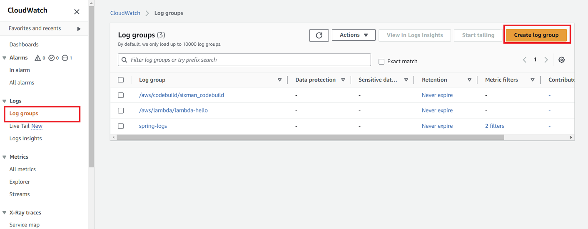

먼저 cloudwatch 의 Log groups 탭에서 `Create log group` 을 누릅니다.

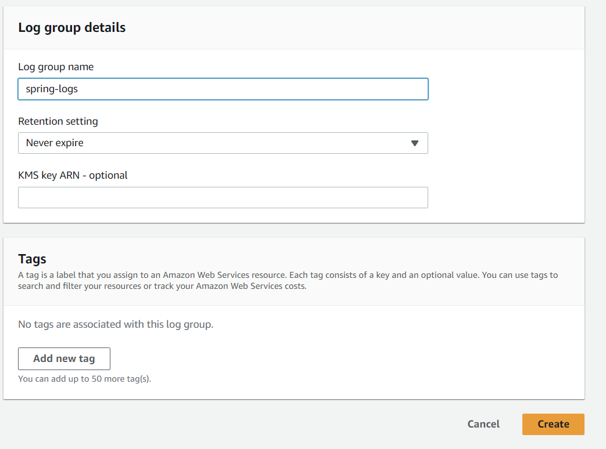

log group name 을 `spring-logs` 로 설정합니다. 임의로 설정하면 되는데, 해당 이름으로 EC2 에 연결되게 됩니다.

### CloudWatch log groups 와 EC2 연결

다시 EC2로 돌아와서 진행합니다.

```
sudo vi /opt/aws/amazon-cloudwatch-agent/bin/config.json

# metrics와 같은 위치에 작성합니다.
# spring log 는 logs/error.log 위치에 생성할 예정입니다.
{
    "logs": {
            "logs_collected": {
                    "files": {
                            "collect_list": [
                                    {
                                            "file_path": "/home/ec2-user/logs/error-*.log",
                                            "log_group_name": "spring-logs",
                                            "log_stream_name": "{instance_id}-error"
                                    },
                                    {
                                            "file_path": "/home/ec2-user/logs/access-*.log",
                                            "log_group_name": "spring-logs",
                                            "log_stream_name": "{instance_id}-access"
                                    }
                            ]
                    }
            }
    },
    "metrics" : {
        ....
    }
}

# CloudWatch 정지
sudo /opt/aws/amazon-cloudwatch-agent/bin/amazon-cloudwatch-agent-ctl -m ec2 -a stop

# 업데이트하고 에이전트 시작
sudo /opt/aws/amazon-cloudwatch-agent/bin/amazon-cloudwatch-agent-ctl -a fetch-config -m ec2 -c file:/opt/aws/amazon-cloudwatch-agent/bin/config.json -s

# CloudWatch 상태 확인
sudo /opt/aws/amazon-cloudwatch-agent/bin/amazon-cloudwatch-agent-ctl -m ec2 -a status

# 제일 첫 줄에 status가 stopped이면 다음 명령어 입력해서 start 시키기
sudo /opt/aws/amazon-cloudwatch-agent/bin/amazon-cloudwatch-agent-ctl -m ec2 -a start
```

 `collect_list` 에 파일 이름, 로그 그룹 이름, 로그 스트림 이름을 설정합니다.

```json
{
        "file_path": "/home/ec2-user/logs/error-*.log", //대상 파일 위치와 이름
        "log_group_name": "spring-logs", //로그 그룹 이름
        "log_stream_name": "{instance_id}-error" //로그 스트림 이름
},
```

- 파일 위치와 이름은 logback-spring.xml 에서 설정한대로  `error-xxx`, `access-xxx` 을 추적하도록 합니다.
- 로그 그룹 이름은 아까 설정한 이름입니다.
- 로그 스트림은 로그 그룹 내에서의 분류입니다. error 와 access 를 구분하기 위해 각각 지정합니다.

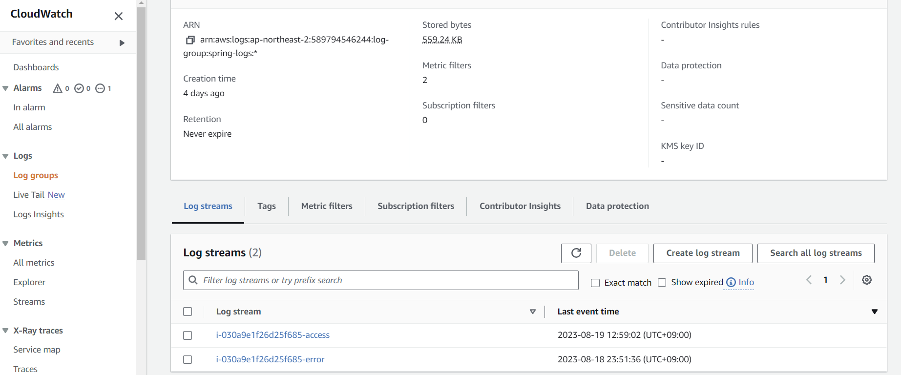

로그를 발생시킨 뒤 확인하면 다음과 같이 spring-logs 의 log streams 에 2개가 들어가있습니다.

## CloudWatch metrics

### 응답 시간 측정을 위한 access log 파싱 

응답시간 로그를 파싱해서 저장하는 매트릭스입니다. 

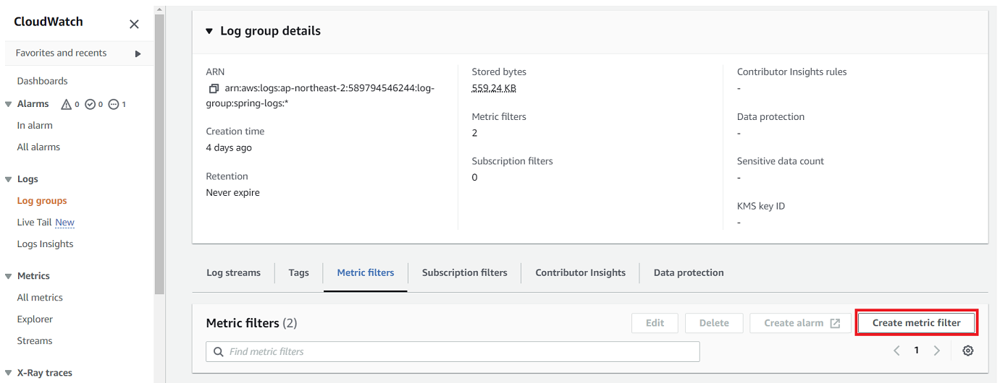

log groups 에서 spring-logs 로 들어간 뒤 `Create metric filter` 를 클릭합니다.

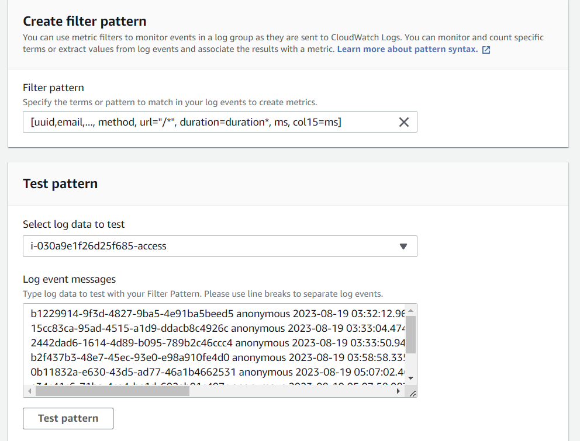

아래의 `Select log data to test` 셀렉트 박스에서 로그 스트림을 선택합니다. 그리고 Filter pattern 을 적용시키면서 결과를 볼건데요. 저는 아래의 데이터를 파싱할 겁니다.

`b2f437b3-48e7-45ec-93e0-e98a910fe4d0 anonymous 2023-08-19 03:58:58.335  INFO 97594 --- [http-nio-80-exec-3] s.s.global.log.MDCLoggingFilter          : GET / duration: 3527 ms`

`MDCLoggingFilter` 에서 남긴 INFO 레벨의 로그가 기록되었는데 여기서 duration 의 값을 추출할 예정입니다. 모든 column 은 스페이스 기준으로 적용됩니다. 예외가 있는데, `[xxx xxx]` 와 같이 대괄호로 묶여있다면 띄워쓰기가 있어도 하나의 컬럼으로 관리됩니다. 아래와 같이 Filter pattern 를 적용시킵니다.

`[uuid,email,..., method, url="/*", duration=duration*, ms, col15=ms]`

첫 컬럼은 uuid, 두번째 컬럼은 email 입니다. `...` 으로 중간 컬럼을 생략하고 method, url, duration, ms 등을 설정합니다. `col15=ms` 는 15번째 컬럼이 ms 라는 뜻입니다. `... GET / duration: 3527 ms` 에서 마지막에 `ms` 가 있죠? 해당 부분이 15번째 컬럼이라고 지정해주는 겁니다. 그러면 앞에 있는 method, url, duration, ms 가 자동으로 11, 12, 13, 14번째 컬럼이 됩니다.

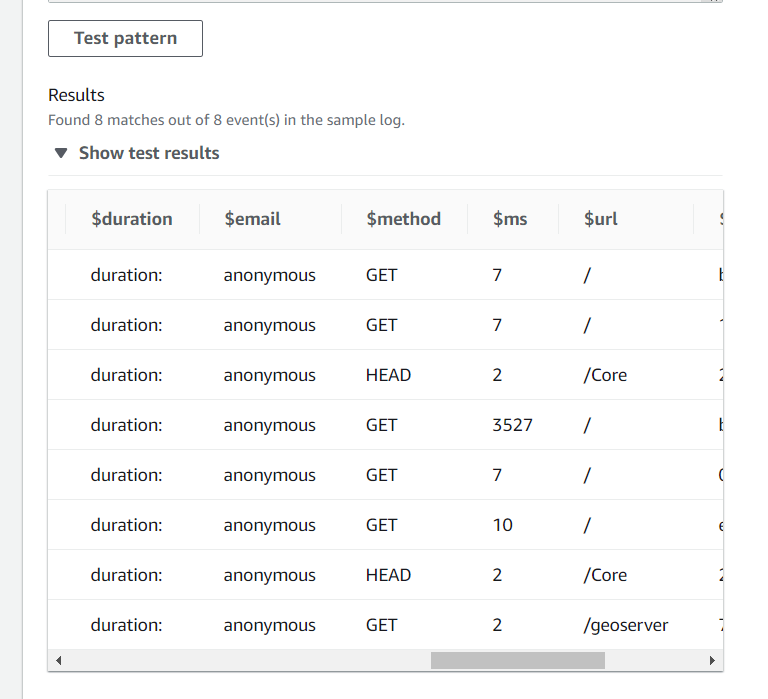

`Test Pattern` 입력하면 위와 같이 파싱이 되어서 테이블 형태가 됩니다. `ms` 컬럼이 원하는 값입니다.

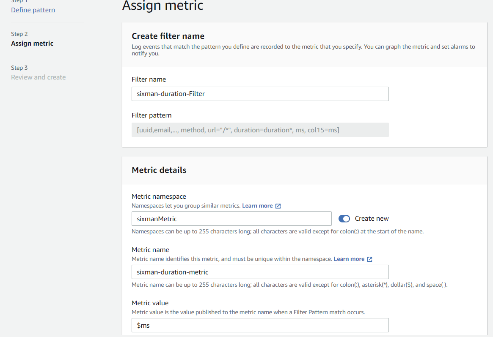

다음으로 넘어가면 Filter name, Metric namespace, Metric name 을 설정합니다. 모두 임의 값입니다. Metric value 는 측정할 `$ms` 로 합니다.

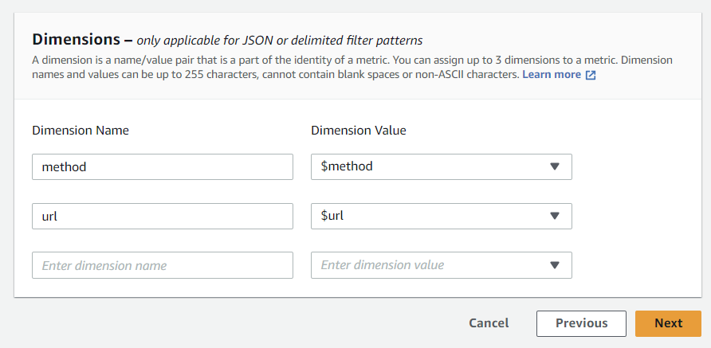

Dimension 은 어떤 항목에 따라 ms 를 보여주느냐 입니다. 저는 `GET /members`, `POST /questions` 등 method 와 url 에 따른 응답시간을 측정하고 싶기 때문에 method 와 url 로 dimension 을 정했습니다.

### 에러 로그 확인을 위한 매트릭스

에러 로그를 확인하는 매트릭스입니다. 에러 로그는 파싱할 필요없이 그대로 측정합니다.

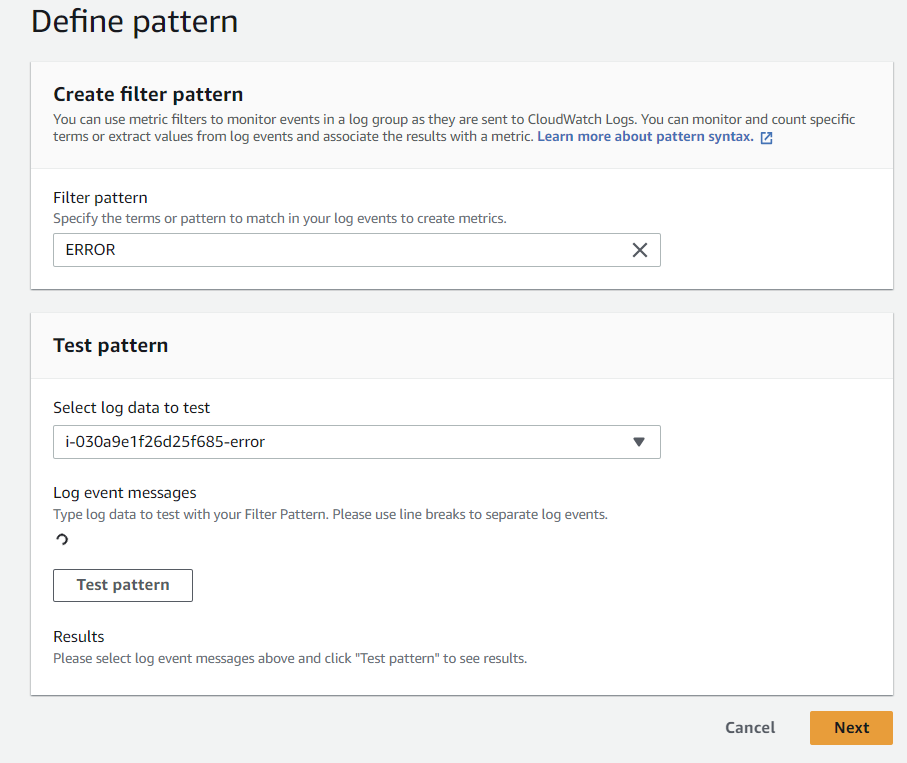

Filter pattern 에 `ERROR` 라고 넣으면 해당 단어를 가진 모든 로그를 필터링합니다. 다음을 누릅니다.

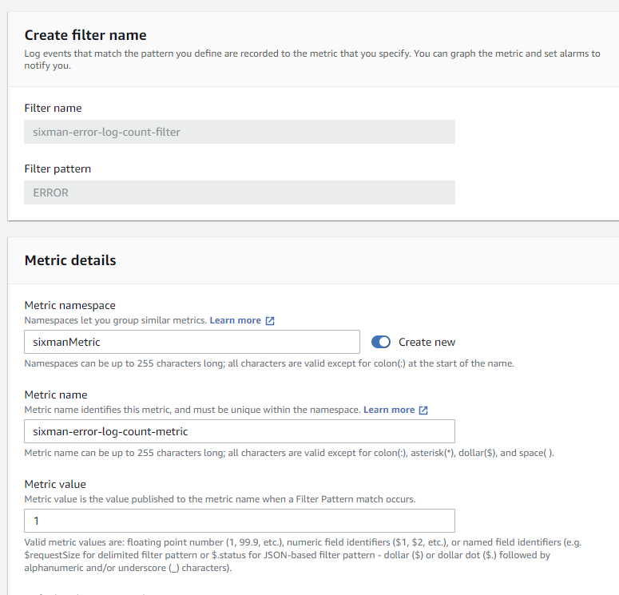

다음으로 넘어가면 Filter name, Metric namespace, Metric name 을 설정합니다. Metric value 를 1 로 두면 해당 로그발생 시 count 를 합니다. 이렇게 설정하고 생성합니다.

## cloudWatch 대시보드 응답시간 설정

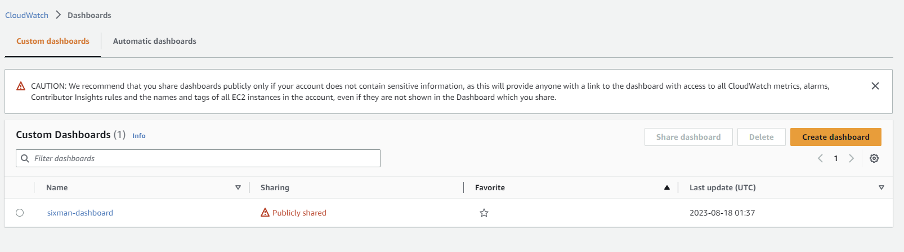

cloudWatch Dashboard 에서 대시보드 생성을 누릅니다.

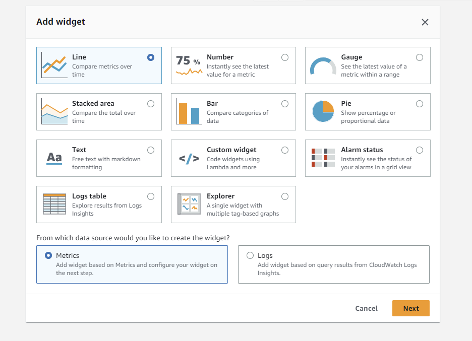

Line, Metrics 를 누릅니다.

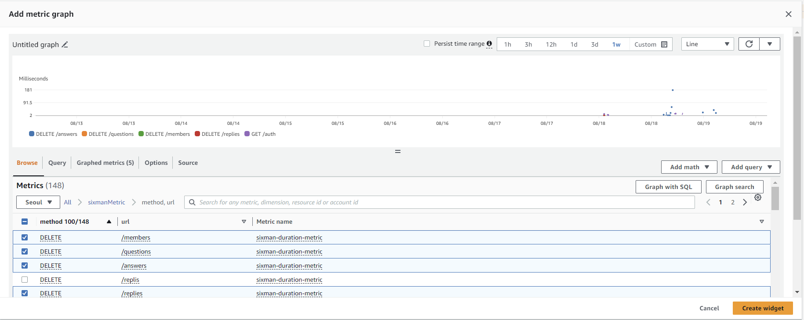

Browse > sixmanMetric > method, url 을 들어가서 필요한 정보를 체크해줍니다. 생각보다 측정에 의미없는 요청들도 많이 들어오는군요. 필요없는 로그 데이터는 매트릭스에서 빼도록 설정할 수도 있겠습니다.

다 만들면 create widget 으로 만들어줍니다.


아래에 보면 요청별 응답시간이 있습니다. 어째서인지 POST /members 가 응답시간이 오래걸립니다. 3000ms 까지 걸리는 경우도 있는데, POST /members/email 이 이메일 전송인데, 이메일 전송에 많은 시간이 걸릴 수 있습니다. 이 부분은 어쩔 수 없네요. 비동기로 처리할 수도 있겠지만 이메일 인증같은 경우는 사용자 입장에서 인증 요청 이후에 이메일로 들어가는 시간도 있고, 해당 과정에서 빠른 피드백을 원하는 건 아닐테니 크게 문제 없을 듯 합니다.   

## Error 로그 알람 설정

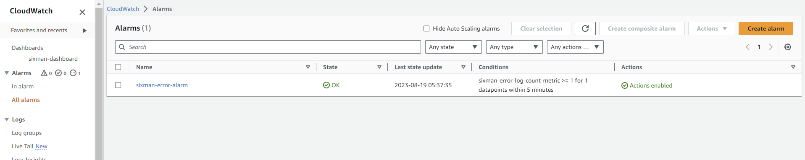

CloudWatch 에서 Alarms 로 들어가 `Create alarm` 버튼을 누릅니다. 

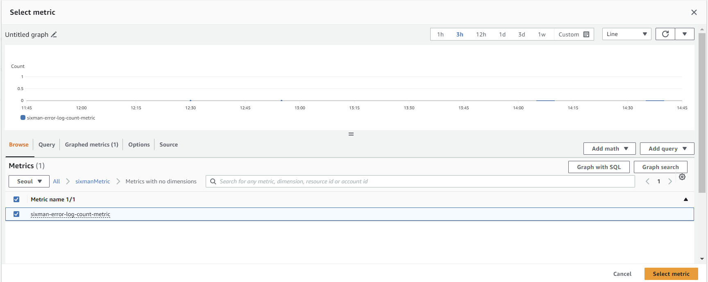

첫 화면에서 `Select metric` 버튼을 누르고 sixman > Metircs with no dimensions 에서 sixman-error-log-count-metric 를 선택해줍니다. 

 

해당 메트릭스의 statistic 은 sum 으로 하고, 기간은 5분으로 하겠습니다. 저같은 경우에는 에러 로그를 보고 비즈니스 예외를 처리하기 위한 목적이기 때문에 급박한 건 아닙니다.

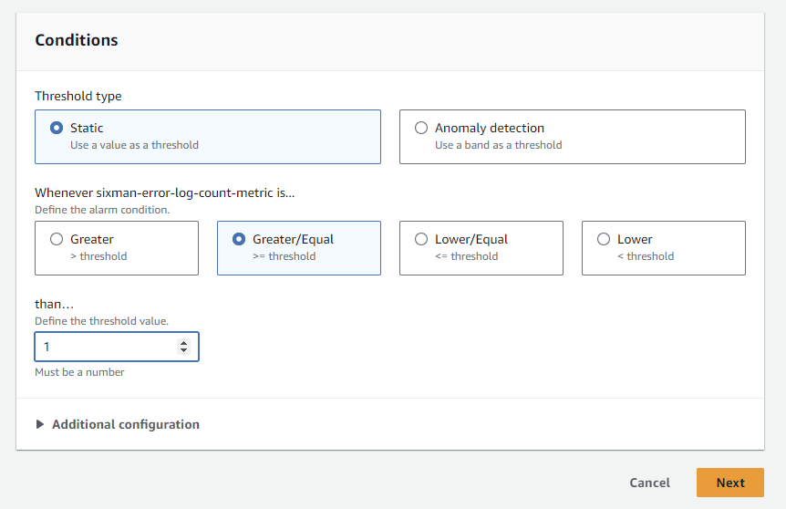

conditions 는 알람 발생 기준입니다. 1개 이상 발생 시 알람이 되도록 하겠습니다. next 버튼을 누릅니다.

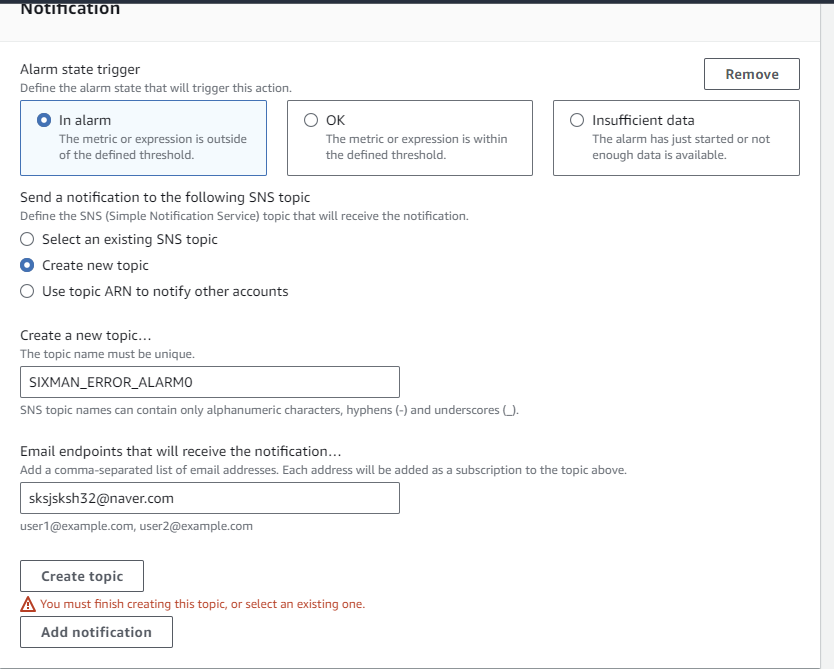

Alarm state trigger 는 `In alarm` 으로 합니다. 알람 상태가 되면 트리거가 발생합니다. OK 를 선택하면 OK 상태가 될 때 트리거가 발생하는데, 비정상 상황에서 정상 상황으로 복귀할 때라고 생각하면 됩니다.

SNS topic 을 새로 생성하고 Email endpoint 를 작성한다음 `Create topic` 을 누릅니다. 그러면 SNS 에 토픽을 등록됩니다.

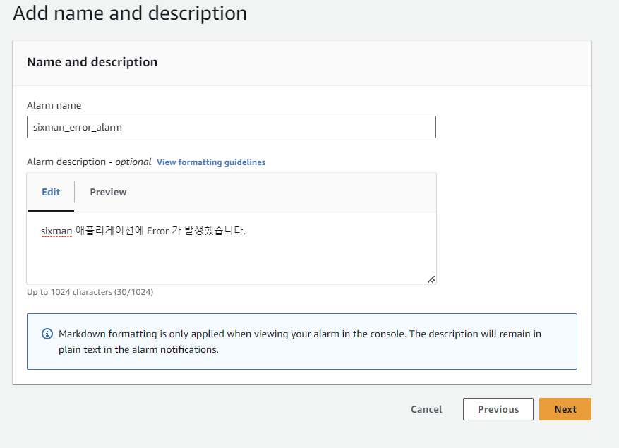

알람 이름과 내용을 작성합니다. 내용은 이메일에 추가되어 발송됩니다. next 버튼을 누르고 알람을 생성합니다.

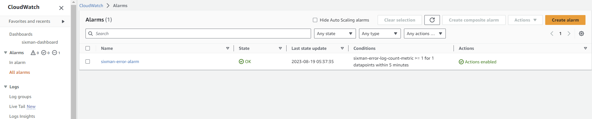

알람이 생성되면 먼저 SNS 의 구독을 승인해야 하기 때문에 endpoint 에 등록한 Email 로 접속해 메일을 확인하고 confirm 을 합니다. 그러면 Alarm 의 actions 가 Actions enabled 로 변경되고, Error 로그 발생 시 알람(이메일 전송) 이 옵니다.

# 4. loging 을 통한 에러 식별 및 해결


Error 로그가 1개 이상 발생하면 이메일이 오는데 잠깐동안 많은 알람이 왔습니다.SNS 의 Email 프리티어 기준이 1000개라고 알고 있는데 빨리 해결하지 않으면 과금이 되게 생겼네요.

이메일 자체에 로그 내용을 남기지 않았으니 cloudWatch 로 들어가서 로그내용을 확인해줍니다.

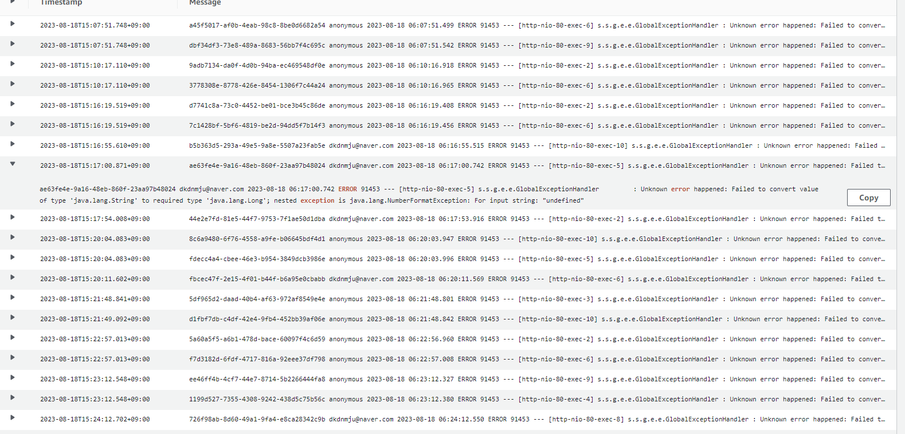

이런 식으로 에러가 있는데, 클릭해보면 String 을 Long 으로 변경하지 못해서 발생했습니다. 해당 에러를 GlobalExceptionHandler 에서 처리하고 있지 않습니다.

결과적으로, `/questions/{question-id}` 엔드 포인트의 `question-id` 값에 Long 을 넣어야 하는데 `/questions/string` 처럼 string 을 넣어서 요청하다보니 에러가 났습니다. 해당 에러는 `HttpRequestMethodNotSupportedException` 에서 처리될 줄 알았는데 아니더군요. `TypeMismatchException` 으로 따로 처리를 해줘야 합니다.

```java
@ExceptionHandler(TypeMismatchException.class)
public ResponseEntity<ApiSingleResponse<Void>> handleTypeMismatchException(
        TypeMismatchException e) {

    String value = (String) e.getValue();

    return new ResponseEntity<>(ApiSingleResponse.fail(new RequestTypeMismatchException(value)), HttpStatus.NOT_FOUND);
}
```

`GlobalExceptionHandler` 에서 `handleTypeMismatchException()` 메서드로 해당 에러를 비즈니스 처리해줍니다. 400 과 405 응답 중에 고민을 했는데, 400 에러로 던져주겠습니다. 

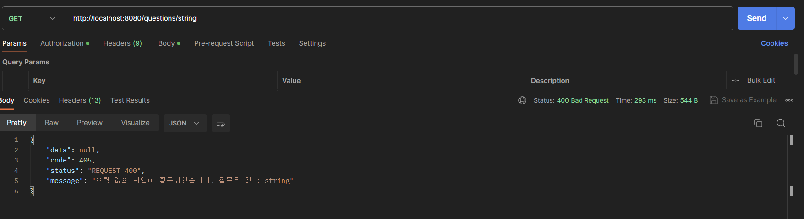

이제 다시 요청해보면 500 에러가 아닌 비즈니스 처리가 된 400 예외가 됩니다. 통제되는 예외가 하나 늘어나니 마음이 편안하네요.

# 남은 과제

## 람다 함수를 이용해서 log 내용을 이메일에 추가

현재 error 로그가 와도 이메일에는 내용이 없는데 람다 함수를 이용하면 됩니다.

- CloudWatch Alarms에서 알림을 받으면, 해당 알림을 처리하는 AWS Lambda 함수를 트리거합니다.
- Lambda 함수 내에서 CloudWatch Logs API를 사용하여 최근의 에러 로그 데이터를 조회합니다.
- 조회된 로그 데이터를 사용하여 이메일 메시지를 구성합니다.
- 구성된 이메일 메시지를 Amazon SES (Simple Email Service) 등을 사용하여 전송합니다.

## 응답 시간이 길어지면 알람 발생

응답 시간이 xxx ms 를 넘어가면 알람이 발생하게 할 수 있는데요. 사실 알람 발생 기준을 따로 생각하지 못해서 아직 설정하지 못했습니다. 몇 ms 를 넘어가면 느리다고 판단하고 알람을 발생시켜야 할지 잘 모르겠네요.

또한 비즈니스적인 요구사항도 있을텐데, 기본적인 페이지의 CRUD 는 사용자가 빠른 응답속도를 요구할 것이고, 보안이 중요한 은행어플은 어느정도 느린 걸 감안할 수도 있겠습니다. 또한 서버의 자원에 따라 사용자가 몰리면 응답 속도가 높아질 거구요. 이 부분은 고민을 더 해봐야겠네요.