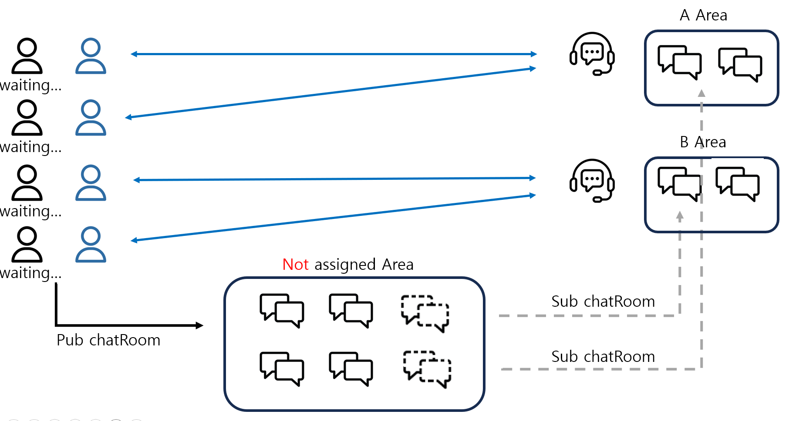
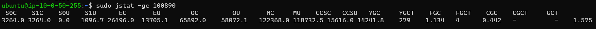
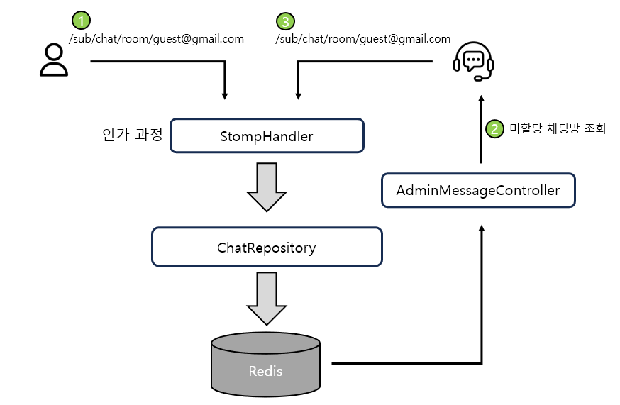
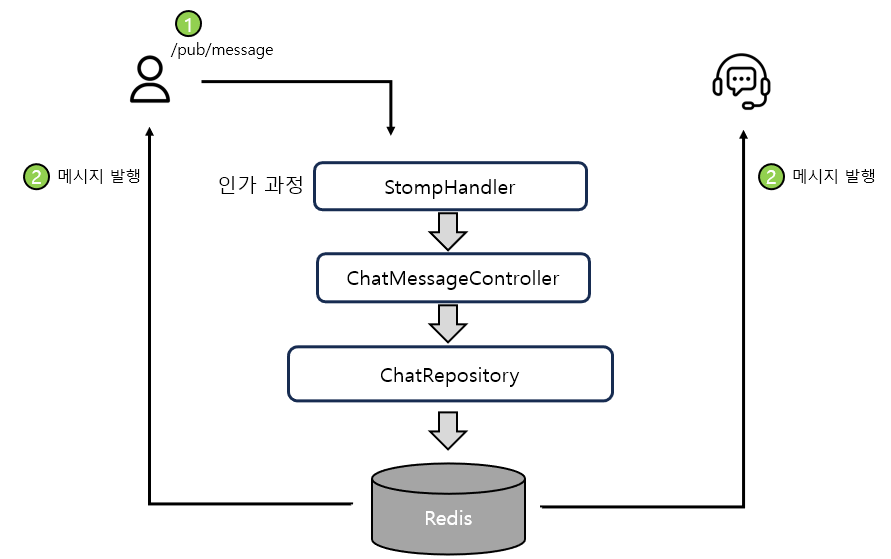
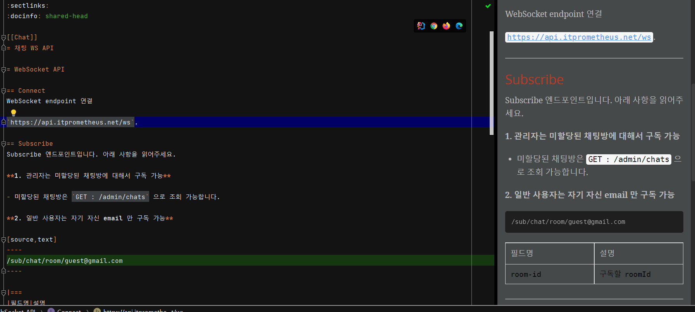

*이 포스팅에서 모든 코드레벨을 작성하지 않았습니다. 코드는 [깃허브 주소](https://github.com/codestates-seb/seb45_main_026/tree/beDev/Server/src/main/java/com/server/chat)로 봐주세요*

# 0. 요구사항 및 설계

관리자 기능을 만들면서 관리자와 일반 회원 간 소통채널이 있으면 좋겠다는 의견이 나왔습니다. 그래서 추가 가능 개발 중 가장 후순위에 두었는데 마침 나머지 추가기능 개발이 빠르게 끝나서 채팅방 기능도 구현하려고 했습니다.

## 요구사항

기능 요구사항은 아래와 같습니다.

### User

- 고객센터에 메시지 보낼 수 있다.
- 현재까지 메시지 내용을 볼 수 있다.
- 채팅창 종료 후 다시 채팅창을 키면 최근 20개의 메시지를 보여준다. 위로 올리면 20개씩 추가로 로딩한다. (페이징)
- 웹페이지에 접속해있으면 고객센터에서 메시지가 왔을 때 알림을 받을 수 있다.
- 대화가 종료되었다면 채팅방을 종료할 수 있다.

### Admin

- 담당자가 배정되지 않은 채팅방 목록을 볼 수 있다.
- 자신이 담당하고 있는 채팅방 목록을 볼 수 있다.
- 담당자가 배정되지 않은 채팅방의 담당자를 자신으로 지정할 수 있다.
- User 에게 메시지를 보낼 수 있다.
- 현재까지 메시지 내용을 볼 수 있다.
- 채팅창 종료 후 다시 채팅창을 키면 최근 20개의 메시지를 보여준다. 위로 올리면 20개씩 추가로 보여준다. (페이징)
- 웹페이지에 접속해있으면 User 에게서 메시지가 왔을 때 알림을 받을 수 있다.
- 대화가 종료되었다면 채팅방을 종료할 수 있다.

### 구현하지 않는 기능

일반적으로 고객센터 챗봇과 같은 기능에는 있지만 저희 프로젝트에서는 구현하지 않을 기능입니다.

- 자동응답
- 채팅방을 종료했을 때 메시지를 일정 기간동안 보관
- 어떤 QnA 내용인지 분류 카테고리

## 설계



1. User 그룹은 채팅방을 생성합니다. (Publish)
2. Admin 그룹은 Not assigned Area 에 있는 채팅방을 가져와서 자신의 Area 에 넣습니다. (Subscribe)
3. User 와 Admin 은 N : 1 관계로 고객상담이 이루어집니다.

# 1. 사용 기술

어떤 기술을 사용할 것인지에 대한 내용입니다.

## STOMP

**Stomp** 는 websocket 와 같이 양방향(클라이언트-서버)네트워크 프로토콜로 HTTP에서 모델링되는 프레임기반의 프로토콜입니다. spring에서 stomp를 사용한다면, spring websocket 어플리케이션은 Stomp Broker 로 작동하게 됩니다. websocket 에서는 text 나 binary 데이터를 전송하면서 추가적인 정보(예를들면, 어디로 route하고 어떻게 처리할지)의 부재로 추가코드작성이 불가피해지는데 이를 해결하기위한 서브프로토콜이 stomp 입니다. stomp 덕분에 CONNECT, SUBSCRIBE, UNSUBSCRIBE, ACK, SEND 와 같은 웹소켓 프레임을 통해서 클라이언트들과 broker 들이 서로 다른 언어로 메세지를 주고받을 수 있게 됩니다. 이 stomp의 요청 프레임 안에는 header가 포함되어, 어디에서 이 메세지를 수신할 지에 대한 정보가 담겨있습니다.

어쨋든 저는 Socket 통신을 처음 구현해보는 입장으로, 마땅히 조언 구할 곳도 없어서 최대한 대중적이고 많은 자료가 있는 기술에 가중치를 많이 두고 생각했습니다. 그래서 Socket.io 와 STOMP 중에 비교했는데요. Socket.IO가 주로 Node.js 환경에서 사용된다는 걸 알았고 실제로 STOMP 가 더 양질의 자료가 있어서 최종적으로 STOMP 를 선택했습니다.

기능 상에 대단히 특징적인 요구사항이 있어서 특정한 기술을 필요로 하는 게 아니면 최소한의 요구사항을 맞출 수 있는 STOMP 가 괜찮은 선택이라고 생각합니다.

## 서버

<u>새로운 모듈로 AWS lambda 에 배포하는 것</u>과 다른 기능과 함께 <u>단일 모듈로 EC2 에 배포하는 것</u> 중 고민했고, **결론적으로 단일 모듈로 EC2 에 함께 배포하자고 결론**지었습니다.

**메모리 문제**

스프링 부트에서 STOMP를 사용하면 각 소켓 연결에 대해 입출력 버퍼가 할당됩니다. 예를 들어, 버퍼 사이즈가 64KB로 설정되어 있다면, 100명의 사용자가 동시에 소켓 통신을 하는 경우, 입출력 버퍼만으로도 대략 6~7MB의 메모리가 필요합니다 (64KB * 100 = 6,400KB = 6.25MB). 

그러나 이는 입출력 버퍼의 메모리 사용량만을 고려한 것입니다. 실제로는 각 소켓 연결 및 세션에 대한 추가 데이터, 객체, 그리고 시스템 오버헤드 등도 메모리를 소비하게 됩니다. 이러한 부가적인 메모리 사용량을 고려하면, 대략적으로 10MB 정도의 총 메모리가 필요하다고 추정할 수 있습니다. 

물론, 이는 근사치에 불과하며, 정확한 메모리 사용량은 서버 환경, 애플리케이션 로직, 그리고 트래픽 패턴 등 다양한 요소에 따라 달라질 수 있습니다. 따라서, 실제 메모리 사용량을 정확히 알고 싶다면, 실제 서버 환경에서 성능 테스트를 진행하여 측정해보는 것이 좋습니다.

**현재 서버**의 성능은 RAM 1GB 에 70% 정도 사용 중입니다. JVM 힙 메모리는 기본 설정으로 최대치가 25% 인 256MB 정도입니다. 그런데 EC2 에서 힙영역을 확인한 결과는 아래와 같습니다.



여러 영역에 대한 총 용량과 사용량을 표시한 것인데, 결론적으로 총 용량 96.6MB 중 **71MB 를 사용**하고 있습니다. 최대 스레드 개수가 200개로 늘어난다고 하면 스레드의 스택 영역 할당(200MB) + 추가적인 힙 영역으로 메모리가 부족해질 수도 있겠다고 생각하지만, 이 상황에서 소켓의 메모리를 아끼는 것보다 스케일업이나 스케일아웃이 필요한 시점이라고 생각합니다.

**운영적인 측면**

새로운 모듈로 분리하는 이유가 사실 운영을 쉽게 하고 독립성을 확보하기 위해서인데요. 각 모듈 간의 독립적인 발전과 확장이 가능하고, 장애가 모듈 단위로 격리된다는 점이 있습니다. 또한 작은 단위로 분리되기 때문에 유지보수가 용이합니다.

하지만 모듈 간 추가적인 통신이 필요하고, 로깅 및 모니터링도 람다에서 추가적으로 구성해줘야 합니다. 특히 EC2 에서 사용하고 있는 cloudwatch agent 를 사용하지 못하니까 새로운 방법을 찾아야하긴 합니다.

**비용**

EC2 를 하나 사용하는 것과 lambda 를 함께 사용하는 것을 비교하면 EC2 를 하나 사용하는 게 산술적으로 비용이 최소가 됩니다. 하지만 지금은 프리티어이기 때문에 최대 백만 건의 함수 실행은 무료이긴 합니다. 또한 EC2 에 기능을 모두 넣으면 메모리, CPU 자원을 추가적으로 소모하는 것이니 해당 소모량이 특정 임계점을 넘으면 스케일업이나 아웃을 해야 하고 따라서 비용이 추가적으로 든다고도 볼 수 있습니다.

### 결론

소켓 사용에 있어서 산술적으로 계산했을 때 리소스 소모가 크지 않다고 판단했고, 비용도 큰 고려사항이 되지 않았습니다. 또한 서비스 전체의 크기가 크지 않아서 서버를 이원화하여 독립성을 확보하는 메리트가 적었고, 무엇보다 현재 시점에서 백엔드 개발은 저 혼자하고 있어서 독립적인 확장과 발전, CI/CD 가 크게 중요하지 않았습니다. 오히려 람다에 대한 로깅을 추가적으로 한다는 게 개발을 더 복잡하게 한다고 생각했구요. 따라서 계속해서 단일 모듈로 EC2 에 배포하고자 했습니다.

## 저장소

메시지에 대한 임시 저장은 Redis 를 사용하도록 결정했습니다. 채팅 서비스는 빠른 응답속도가 중요하기 때문입니다. 또한 채팅 자체를 중요한 비즈니스 데이터로 저장할 것도 아니기도 하구요.

또한 현재 이메일 인증을 위해 레디스 서버가 운영되고 있는데, 이메일 인증 자체의 요청도 적고 사용하는 용량도 적다보니 그대로 사용하기도 문제가 없었습니다. 또한 Redis의 Publish/Subscribe 메커니즘을 활용하여 실시간 채팅 기능을 구현할 수 있습니다.

요구사항은 아니긴 한데, 만약에 데이터의 아카이브가 필요하면 MySQL 을 사용하기보다는 S3 를 사용할 것 같습니다.

# 2. 설정

필요한 dependency 는 아래와 같습니다.

```
implementation 'org.springframework.boot:spring-boot-starter-data-redis'
implementation 'org.springframework.boot:spring-boot-starter-websocket'
```

이중 `redis` 는 이미 설치되어있어서 `websocket` 만 설치했습니다.

## WebSocketConfig

```java
@Configuration
@EnableWebSocketMessageBroker
public class WebSocketConfig implements WebSocketMessageBrokerConfigurer {

    private final StompHandler stompHandler;

    public WebSocketConfig(StompHandler stompHandler) {
        this.stompHandler = stompHandler;
    }

    @Override
    public void configureMessageBroker(MessageBrokerRegistry config) {
        config.enableSimpleBroker("/sub");
        config.setApplicationDestinationPrefixes("/pub");
    }

    @Override
    public void registerStompEndpoints(StompEndpointRegistry registry) {
        registry.addEndpoint("/ws")
                .setAllowedOriginPatterns("*")
                .withSockJS();
    }

    @Override
    public void configureClientInboundChannel(ChannelRegistration registration) {
        registration.interceptors(stompHandler);
    }
}
```

- `configureMessageBroker()` 로 pub, sub prefix 를 지정합니다.
- `registerStompEndpoints()` 로 엔드포인트를 지정합니다. `SockJS` 를 사용해서 ws 통신을 http 기술로 변경합니다. SockJS 란 순수 WebSocket 에서 지원하지 않는 브라우저에서도 동작하게끔 도와주는 역할인데, WebSocket Emulation 을 이용해서 우선 WebSocket 통신을 시도하고, 실패할 경우 Http Streaming, Long-Polling 같은 **HTTP** 기반의 다른 기술로 전환해 다시 연결하는 것을 시도합니다.
- `configureClientInboundChannel()` 으로 `stompHandler` 를 인터셉터로 등록하여 WebSocket 앞에서 인증/인가 과정이 이루어질 수 있도록 합니다.

## RedisConfig

```java
@Configuration
public class RedisConfig {

    @Bean
    public ChannelTopic channelTopic() {
        return new ChannelTopic("chatroom");
    }
    
    //발행된(pub) 메시지를 처리하는 리스너 설정
    @Bean
    public RedisMessageListenerContainer redisMessageListener(RedisConnectionFactory connectionFactory,
                                                              MessageListenerAdapter listenerAdapter,
                                                              ChannelTopic channelTopic) {
        RedisMessageListenerContainer container = new RedisMessageListenerContainer();
        container.setConnectionFactory(connectionFactory);
        container.addMessageListener(listenerAdapter, channelTopic);
        return container;
    }

    //실제 메시지를 처리하는 Subscriber
    @Bean
    public MessageListenerAdapter listenerAdapter(RedisSubscriber redisSubscriber) {
        return new MessageListenerAdapter(redisSubscriber, "sendMessage");
    }

    //redis 저장 시 직렬화
    @Bean
    public RedisTemplate<String, Object> redisTemplate(RedisConnectionFactory connectionFactory) {
        RedisTemplate<String, Object> redisTemplate = new RedisTemplate<>();
        redisTemplate.setConnectionFactory(connectionFactory);
        redisTemplate.setKeySerializer(new StringRedisSerializer());
        redisTemplate.setValueSerializer(new Jackson2JsonRedisSerializer<>(String.class));
        return redisTemplate;
    }

    //redis 저장 시 ChatMessage 직렬화
    @Bean
    public RedisTemplate<String, ChatMessage> redisTemplateChatMessage(RedisConnectionFactory connectionFactory) {
        RedisTemplate<String, ChatMessage> redisTemplate = new RedisTemplate<>();
        redisTemplate.setConnectionFactory(connectionFactory);
        redisTemplate.setKeySerializer(new StringRedisSerializer());
        redisTemplate.setValueSerializer(new Jackson2JsonRedisSerializer<>(ChatMessage.class));
        return redisTemplate;
    }
}
```

`RedisConfig` 에는 리스너 및 Subscriber 설정, 그리고 저장 시 직렬화 설정이 있습니다. 특히 `ChatMessage` 를 객체 형태로 저장 시 다시 읽히지 않는 문제가 있었는데 직렬화 설정으로 해결했습니다.

# 3. API 및 모듈 설계

API 는 아래와 같이 구성되었습니다.

## web 소켓 채팅 API

- `/ws` : 웹소켓 통신 연결

- `/pub/message` : 메시지 publish

  - ```json
    {
    	"roomId":"guest@gmail.com",
    	"message":"messages"
    }
    ```

- `/sub/chat/room/{room-id}` : `room-id` subcribe

pub 이 메시지를 보내는 기능이고, sub 가 `room-id` 로 발행되는 메시지를 받겠다는 의미입니다. 자세한 API 는 [API 문서](https://api.itprometheus.net/snippets/chat/chat.html)를 참고해주세요.

### Sub

채팅을 하기 위해선 먼저 소켓을 열고 Subscribe 를 해야합니다. Subscribe 는 해당 `room-id` 로 발행되는 메시지를 받겠다는 의미입니다. 아래와 같은 과정으로 진행됩니다.



1. 먼저 guest 가 채팅방을 subscribe 합니다. 이때 StompHandler 에서 인가 과정을 진행하고, 채팅방이 없다면 새로 생성하고 Redis 에 저장합니다. 이제 guest 는 `/guest@gmail.com` 으로 publish 되는 메시지를 받을 수 있습니다.
2. Admin 은 미할당 채팅방을 조회합니다.
3. Admin 은 조회된 채팅방 중 선택하여 subscribe 합니다. 이제 publish 되는 메시지는 User 와 Admin 모두 받을 수 있습니다.

### Pub



`/pub/message` 를 통해 메시지를 발행합니다. 중간에 ChatMessageController 에서 설정한 엔드포인트로 보내는 겁니다. 그러면 Redis 의 리스너가 받아서 모든 Subscriber 에게 메시지를 보냅니다. **이때 자기 자신도 해당 채팅방을 Sub 하고 있으므로 자기가 보낸 메시지를 받게 됩니다.**

## UserChatController

해당 컨트롤러의 API 는 웹 소켓 통신은 아니지만, 요구사항에 맞는 채팅방 기능 구현에 필요한 내용입니다.

```java
@RestController
@RequestMapping("/user/chats")
public class UserChatController {

    private final ChatService chatService;

    public UserChatController(ChatService chatService) {
        this.chatService = chatService;
    }

    @GetMapping("/my-rooms")
    public ResponseEntity<ApiPageResponse<ChatMessage>> getMessages(
            @RequestParam(value = "page", defaultValue = "1") int page
    ) {

        String email = SecurityUtil.getEmail();
        Page<ChatMessage> chatRecord = chatService.getChatRecord(email, email, page - 1);

        return ResponseEntity.ok(ApiPageResponse.ok(chatRecord, "채팅 메시지 조회 성공"));
    }

    @DeleteMapping
    public ResponseEntity<Void> exitChat() {

        String email = SecurityUtil.getEmail();

        chatService.removeChatRoom(email);

        return ResponseEntity.noContent().build();
    }
}

```

2가지 API 가 있습니다. 

-  `GET: /user/chats/my-rooms` : **이전 채팅 기록 조회**입니다. 브라우저 종료 등 웹 소켓 연결이 끊어진 후 다시 채팅 기록을 불러오기 위해 사용합니다. 최신순 페이징을 했습니다.
- `DELETE: /user/chats` : **채팅방 나가기 기능**입니다. Redis 에서 모든 채팅 기록과 연결을 제거합니다.

## AdminChatController

```java
@RestController
@RequestMapping("/admin/chats")
public class AdminChatController {

    private final ChatService chatService;

    public AdminChatController(ChatService chatService) {
        this.chatService = chatService;
    }

    @GetMapping
    public ResponseEntity<ApiSingleResponse<List<String>>> rooms() {

        List<ChatRoom> chatRooms = chatService.getChatRooms();

        List<String> chatRoomIds = chatRooms.stream()
                .map(ChatRoom::getRoomId)
                .collect(Collectors.toList());

        return ResponseEntity.ok(ApiSingleResponse.ok(chatRoomIds, "미할당 채팅방 목록 조회 성공"));
    }

    @GetMapping("/my-rooms")
    public ResponseEntity<ApiSingleResponse<List<String>>> myRooms() {

        String email = SecurityUtil.getEmail();

        List<String> chatRoomIds = chatService.getMyAdminRooms(email);

        return ResponseEntity.ok(ApiSingleResponse.ok(chatRoomIds, "자신이 참여한 채팅방 목록 조회 성공"));
    }

    @GetMapping("/{room-id}")
    public ResponseEntity<ApiPageResponse<ChatMessage>> getMessages(
            @PathVariable("room-id") String roomId,
            @RequestParam(value = "page", defaultValue = "1") int page
    ) {

        String email = SecurityUtil.getEmail();
        Page<ChatMessage> chatRecord = chatService.getChatRecord(email, roomId, page - 1);

        return ResponseEntity.ok(ApiPageResponse.ok(chatRecord, "채팅 메시지 조회 성공"));
    }

    @PatchMapping("/{room-id}")
    public ResponseEntity<Void> completeChat(@PathVariable("room-id") String roomId) {

        String email = SecurityUtil.getEmail();

        chatService.completeChat(email, roomId);

        return ResponseEntity.noContent().build();
    }
}

```

4가지 API 가 있습니다. 

-  `GET: /admin/chats` : **미할당 채팅 목록 조회**입니다.
-  `GET: /admin/chats/my-rooms` : **자신으로 할당된 채팅 목록**입니다.
-  `GET: /admin/chats/{room-id}` : `room-id` 의 **이전 채팅 기록 조회**입니다. 목적은 `UserChatController` 의 이전 채팅 기록 조회와 같습니다.
- `Patch: /admin/chats/{room-id}` : **채팅방 완료 처리**입니다. Redis 에서 자신으로 할당된 채팅 목록에서 제거합니다. 채팅 기록 등은 사라지지 않습니다.

## ChatRoomRepository

```java
@Repository
@RequiredArgsConstructor
public class ChatRoomRepository {
    // Redis CacheKeys
    private static final String CHAT_ROOMS = "CHAT_ROOM"; // 채팅룸 저장
    private static final String ADMIN_ASSIGN = "ADMIN_INFO";

    @Resource(name = "redisTemplate")
    private HashOperations<String, String, ChatRoom> hashOpsChatRoom;
    @Resource(name = "redisTemplate")
    private HashOperations<String, String, HashSet<String>> hashOpsAdminInfo;
    @Resource(name = "redisTemplateChatMessage")
    private ZSetOperations<String, ChatMessage> zSetOpsChatRecord;

    private final StringRedisTemplate stringRedisTemplate;

    // 모든 채팅방 조회
    public List<ChatRoom> findNotAssignedRoom() {
        List<ChatRoom> allRooms = hashOpsChatRoom.values(CHAT_ROOMS);

        List<ChatRoom> notAssignedRooms = new ArrayList<>();

        for(ChatRoom chatRoom : allRooms) {
            if(!chatRoom.isAssigned()) {
                notAssignedRooms.add(chatRoom);
            }
        }

        return notAssignedRooms;
    }

    // 특정 채팅방 조회
    public Optional<ChatRoom> findRoomById(String roomId) {
        return Optional.ofNullable(hashOpsChatRoom.get(CHAT_ROOMS, roomId));
    }

    //채팅방 대화 내용 조회
    public Page<ChatMessage> getChatRecord(String roomId, int page) {
        Pageable pageable = PageRequest.of(page, 20);
        Long size = zSetOpsChatRecord.size(roomId);
        if(size == null || size == 0) {
            return Page.empty();
        }

        long start = Math.max(0, size - (page + 1) * 20L);
        long end = Math.max(0, size - page * 20L - 1);

        Set<ChatMessage> messages = zSetOpsChatRecord.range(roomId, start, end);
        List<ChatMessage> listMessages = new ArrayList<>(messages);

        return new PageImpl<>(listMessages, pageable, size);
    }

    //채팅 내용 기록
    public void addChatRecord(String roomId, ChatMessage chatMessage) {

        LocalDateTime now = LocalDateTime.now();
        chatMessage.setSendDate(now);
        double timestamp = now.atZone(ZoneId.systemDefault()).toInstant().toEpochMilli();
        zSetOpsChatRecord.add(roomId, chatMessage, timestamp);
    }

	//채팅방 생성
    public ChatRoom createChatRoom(String name) {
        ChatRoom chatRoom = ChatRoom.create(name);
        hashOpsChatRoom.put(CHAT_ROOMS, chatRoom.getRoomId(), chatRoom);
        return chatRoom;
    }

    //채팅방 할당
    public void assignRoom(String adminEmail, ChatRoom chatRoom) {

        if(!hashOpsAdminInfo.hasKey(ADMIN_ASSIGN, adminEmail)) {
            HashSet<String> hashSet = new HashSet<>();
            hashSet.add(chatRoom.getRoomId());
            hashOpsAdminInfo.put(ADMIN_ASSIGN, adminEmail, hashSet);
        }else {
            hashOpsAdminInfo.get(ADMIN_ASSIGN, adminEmail).add(chatRoom.getRoomId());
        }
        hashOpsChatRoom.put(CHAT_ROOMS, chatRoom.getRoomId(), chatRoom);
    }

    //채팅방 저장 (업데이트용)
    public void saveChatRoom(ChatRoom chatRoom) {
        hashOpsChatRoom.put(CHAT_ROOMS, chatRoom.getRoomId(), chatRoom);
    }

    //Admin 에게 할당된 채팅방 삭제
    public void removeAdminChatRoom(String adminEmail, String roomId) {
        if(!hashOpsAdminInfo.hasKey(ADMIN_ASSIGN, adminEmail)) {
            return;
        }
        hashOpsAdminInfo.get(ADMIN_ASSIGN, adminEmail).remove(roomId);
    }

    //채팅방 삭제
    public void removeChatRoom(String roomId) {

        ChatRoom chatRoom = hashOpsChatRoom.get(CHAT_ROOMS, roomId);

        if(chatRoom.getAdminEmail() != null) {
            removeAdminChatRoom(chatRoom.getAdminEmail(), roomId);
        }

        hashOpsChatRoom.delete(CHAT_ROOMS, roomId);
        zSetOpsChatRecord.removeRange(roomId, 0, -1);
    }

    //Admin 이 가진 모든 채팅방 조회
    public HashSet<String> getUserEnterRoomId(String email) {

        if(!hashOpsAdminInfo.hasKey(ADMIN_ASSIGN, email)) {
            return new HashSet<>();
        }

        return hashOpsAdminInfo.get(ADMIN_ASSIGN, email);
    }

    public void setSessionId(String sessionId, String email) {

        ValueOperations<String, String> valueOperations = stringRedisTemplate.opsForValue();
        valueOperations.set(sessionId, email);
    }

    public String getEmailFrom(String sessionId) {
        ValueOperations<String, String> valueOperations = stringRedisTemplate.opsForValue();
        return valueOperations.get(sessionId);
    }
}
```

개략적인 메서드 내용은 주석으로 적었습니다. 여기서 2가지만 살펴보겠습니다.

### 채팅방 대화 내용 조회 (ZSetOperations)

채팅방 대화 내용 조회 시 최신순 20개가 필요했습니다. 따라서 `ZSetOperations` 을 사용해 조회했습니다. `ZSetOperations` 은 Sorted Set 으로, score 값에 따라 저장된 값을 자동으로 정렬합니다. 따라서 시간을 score 로 저장하고 필요한 범위를 페이징하여 들고 오면 됩니다.

### HashOperations 사용

`HashOperations`는 Spring Data Redis 에서 제공하는 인터페이스로, Redis의 Hash 데이터 구조를 사용할 수 있습니다. Redis 가 Memcached 와 비교해서 가장 좋은 점은 이러한 자료구조를 이용해 데이터를 저장할 수 있다는 것입니다. 나중에 Key 값으로 찾을 때도 Hash 이기 때문에 검색 속도가 빠릅니다.

# 4. 마무리

여기에 없는 클래스는 [Repo](https://github.com/codestates-seb/seb45_main_026/tree/beDev/Server/src/main/java/com/server/chat) 를 확인해주세요.

## 문제점

하면서 발생했던 몇 가지 문제점들입니다. 해결된 것도 있고 고민 중인 것도 있습니다.

### Redis 설정으로 인한 테스트 불가

Redis 를 설정하면서 스프링 로딩이 되지 않았습니다. RedisConfig 에 들어갈 레디스가 없었기 때문입니다. 방법은 3가지가 있고 결론적으로 `Test Container` 를 사용했습니다.

1. 테스트 시 로컬 Redis 실행

   이 방법은 최악의 수입니다. 테스트가 환경에 독립적이어야 한다는 FIRST (R) 원칙에 맞지 않습니다. 정말 급할 때 한번 쓸 수는 있겠습니다.

2. Embedded Redis 실행

   Embedded Redis 의존성을 추가하는 방법입니다. 좋은 방법이지만 두 가지 문제점이 있습니다. 첫번째는 해당 라이브러리가 2019년 이후로 업데이트가 멈췄다는 것이고, SpringContext 로딩 시마다 새로 띄워지기 때문에 2개 이상의 Spring 이 로딩된다면 포트가 겹쳐 오류가 발생한다는 점입니다. 

3. **Test Container** 실행

   Test Container 는 Docker 로 가상 환경에 Redis 를 띄우고 테스트를 실행하는 것입니다. Docker 가 필요하고 이미지를 띄우는 데 오랜 시간이 걸립니다. 하지만 CI/CD 환경인 Git Actions 에는 기본적으로 도커가 깔려있기 때문에 셋 중 가장 괜찮다고 생각해서 채택했습니다.

   다음 의존성을 추가합니다.

   ```
   testImplementation group: 'org.testcontainers', name: 'testcontainers', version: '1.17.2'
   ```

   그리고 아래와 같이 설정합니다.

   ```java
   @Configuration
   public class RedisTestContainers {
   
       private static final String REDIS_DOCKER_IMAGE = "redis:5.0.3-alpine";
   
       static {
           GenericContainer<?> REDIS_CONTAINER =
                   new GenericContainer<>(DockerImageName.parse(REDIS_DOCKER_IMAGE))
                           .withExposedPorts(6379)
                           .withReuse(true);
           REDIS_CONTAINER.start();   
   
           System.setProperty("spring.redis.host", REDIS_CONTAINER.getHost());
           System.setProperty("spring.redis.port", REDIS_CONTAINER.getMappedPort(6379).toString());
       }
   }
   ```

   CI/CD 환경에서 실행 결과 Redis 라 그런지 많은 시간이 걸리지 않았습니다. 빌드 시간은 2분 10초 ~ 30초 정도 되는 것 같고 평균 빌드 시간 확인 결과 **10초 정도 늘어난 것 같습니다.**

### Chat 기능 생성, 변경 시 전체 재배포가 필요

​	서버 구조를 결정할 때 독립적인 확장과 발전, CI/CD 가 중요하지 않을거라고 생각했는데 하다보니 50:50 인 것 같습니다. Chat 기능 자체가 처음이다보니 실수도 많을 뿐더러 테스트 서버도 없어서 실제 서버에 배포하고 확인을 해야하는데 그럴 때마다 계속 서버가 중단되는 일이 있었습니다.

​	블루/그린 배포도 2개 이상의 서버가 필요한데, 원래는 서버 2개를 운용하다가 비용 문제로 하나를 닫은 지금으로선 딱히 방도가 없습니다. 다만 지금으로선 서버를 분리하려면 채팅 기능을 분리하는 게 아니라 Admin 기능 자체를 분리하고 싶기는 합니다. 어쨌든 독립적인 확장과 발전이 중요하다고 느꼈습니다.

### API 문서화가 힘듦

웹 소켓 테스트 툴은 있지만 현재 사용하고 있는 Rest Docs 를 사용하지는 못합니다. 다만 이 대신 잇몸이라고 하드 코딩으로 적는 수밖에 없었습니다.



일부분이긴 한데, 위와 같이 작성해서 활용했습니다.

### 채팅 기능에 Admin 과 User 가 섞여 있음

현재 `ChatService`, `ChatRoomRepository` 에 Admin 과 User 가 섞여있습니다. 이 부분은 하나의 `Chat` 으로 생각하고 묶었었는데 Repository 레벨에서 나눠야하지 않을까 싶습니다. 왜냐하면 저는 Admin 기능 자체를 분리하고 싶거든요. 이 부분은 나중에 리팩토링을 할 예정입니다.

## 느낀 점

​	사실 소켓 기능을 한번 하려다가 못한 적이 있습니다. `Prometheus` 기능 요구사항을 정의할 때 알림 기능을 넣자는 얘기가 있었는데요. 알림 기능은 구독하고 있는 채널에 동영상이 올라오면 알림을 주는 기능입니다. 그 당시에는 소켓에 대해 자세히 모르고 있던 때라 "Get 요청을 짧게 여러 번 보내야 하나?" 라는 생각을 했구요. 그 이후에 찾아보고 소켓 기능을 사용한다는 걸 알았습니다. 

​	하지만 당시에 요구사항이 많기도 했고, 극 후순위로 미룬 요구사항이라서 결국 구현하지는 않았습니다. 프로젝트가 끝난 후 추가 기능 요구사항을 도출하면서 저는 이전에 못했던 소켓 기능도 넣어보고 싶었구요. 그래서 고객센터 채팅 기능을 구현하게 됐습니다. HTTP 통신과 조금 다르다보니 Apic 등 다른 툴을 쓰면서 재밌게 개발한 것 같습니다.
