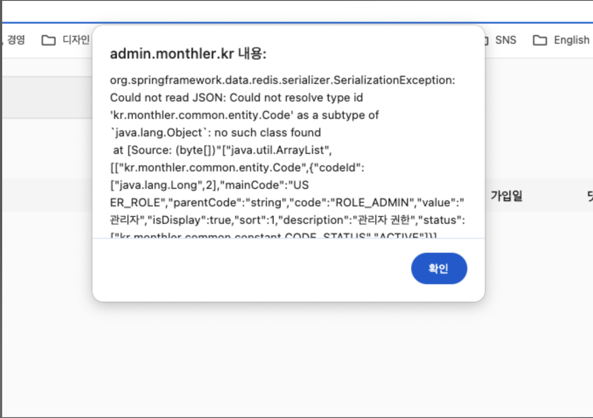

# 0. 문제 상황

아래와 같은 에러가 발생했습니다.



에러 메시지가 그대로 노출되는 문제는 이 주제가 아니니 넘어가겠습니다.(해결함) 😅 에러 메시지를 잘 읽어보면 redis 에서 발생한 문제라는걸 알 수 있습니다.

## 0.1 문제 원인

문제 원인은 업데이트 간 **Redis 에 저장된 클래스와 반환 클래스가 달라져서** 입니다. 간단하게 예시로 설명해보겠습니다.


Amethod 가 있을 때 캐싱은 `@Cacheable` 로 진행됩니다. 반환값이 cacheDB 에 있으면 해당 반환값을 반환하고, 없다면 반환값을 cacheDB 에 저장합니다. 저는 Redis 를 사용했습니다. cacheDB 에는 반환Dto 클래스가 serialize 돼서 저장됩니다.

여기서 저는 ResponseA dto 에 nickname 을 추가하고 재배포했다고 해보겠습니다. 하지만 Redis 에는 이전 버전의 dto class 가 남게 됩니다.


위 그림처럼 nickname 이 not null 제약인데 Redis 에는 nickname 이 없으니 에러가 발생하게 됩니다.

# 1. 문제 해결

문제 해결방법은 간단합니다.

1. 서버 시작 전 캐시 무효화
2. 이전 dto 도 호환가능하도록 설정

## 1.1 캐시 무효화

 서버를 시작할 때 문제가 되는 캐시를 무효화하는 로직을 추가하면 간단하게 해결할 수 있습니다. 변경된 dto 로 새로 저장될테니까요. 하지만 **rolling 배포에서 모든 서버가 한번에 배포되지 않는 문제가 있습니다.** 1대의 새로운 서버와 1대의 이전 서버가 있다고 가정해보겠습니다. 캐시를 무효화했는데 이전 서버의 반환값이 다시 DB 에 저장된다면 새로운 서버에서는 캐시를 읽을 때 똑같은 문제가 발생합니다.

당장 문제해결은 가능합니다. 문제를 인지하는 즉시 한 행동이 캐시 무효화였으니까요. 하지만 장기적인 전략은 아닙니다.

## 1.2 이전 dto 도 호환가능하도록 만들기

호환가능하도록 만드는 첫번째 방법은 nickname 을 nullable 하게 설정하는 것입니다. 원래부터 없었으니까 nullable 해도 당장 문제가 되지는 않습니다.

두번째는 좀 더 깔끔한 방법인데, **응답값이 변경되었으니 api 를 분리하는 방법입니다.** 그러면 cache key 도 따로 쓸테니 서로 이전 dto 가 새로운 dto 에 영향을 미치는 일이 없어집니다. 하지만 수시로 변하는 초기 개발에서 api 수정 시마다 버저닝을 하기에는 힘들었습니다. 그래서 저는 주로 첫번째 방법을 사용했습니다.

# 2. 추가적인 고민

 에러를 해결했다고 하더라도, 이후에도 cacheDB 에 문제가 있으면 에러를 반환하면서 서비스에 영향을 줄텐데요. 사실 cacheDB 에서 발생하는 문제는 근본적으로 부차적인 문제입니다. 왜냐하면 메인DB(Mysql)에서 읽어오는 정보를 빠르게 반환할 뿐, 실제 정보는 메인DB 에 있기 때문입니다.

 따라서 cacheDB 에서 여러 에러 케이스를 고민해봐야하지만, 기본적인 에러핸들링의 동작은 에러 시 에러를 반환하는 것이 아닌 메인DB 를 조회하는 것이 되어야 합니다. cacheDB 가 잘못되어도 메인DB 를 조회하면 그만이니깐요. 아래와 같이 `CacheErrorHandler` 클래스를 구현해서 에러 시 어떻게 행동할지 만들어줍니다.

```kotlin
@Component
class CacheErrorHandlerCustom(
    private val slackService: SlackService,
): CacheErrorHandler {
    override fun handleCacheGetError(exception: RuntimeException, cache: Cache, key: Any) {
        slackService.sendSlackMessageCacheError(exception, key.toString())
    }

    override fun handleCachePutError(exception: RuntimeException, cache: Cache, key: Any, value: Any?) {
        slackService.sendSlackMessageCacheError(exception, key.toString())
    }

    override fun handleCacheEvictError(exception: RuntimeException, cache: Cache, key: Any) {
        slackService.sendSlackMessageCacheError(exception, key.toString())
    }

    override fun handleCacheClearError(exception: RuntimeException, cache: Cache) {
        slackService.sendSlackMessageCacheError(exception, cache.toString())
    }
}
```

슬랙으로 cacheError 메시지를 보내는 동작으로 에러핸들링을 끝내면 자동적으로 메인DB 를 조회하게 됩니다.

이렇게 구현하면 단일장애점도 어느정도 해결해주는데요. 현재 cacheDB 는 클러스터링 없이 1개만 사용하고 있습니다. 따라서 cacheDB 에 문제가 생기면 캐시 조회, 생성을 할 수 없는데요. 당장 cacheDB 를 사용하지 못하더라도 메인DB 를 사용하면 되니까 굳이 에러를 반환할 필요는 없습니다.