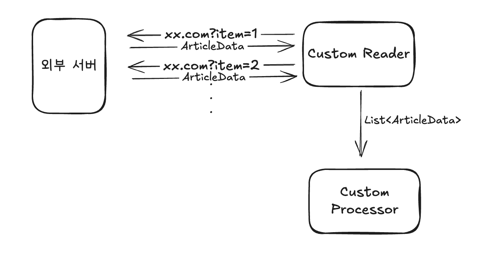

# 0. 문제상황

Spring Batch 에서 Jpa 나 JDBC 를 페이징해서 여러 개(ex. 1000개)를 가져오는 Reader 는 많습니다. (JpaPagingItemReader, JdbcPagingItemReader 등등...)

그런데 제가 원하는 기능은 특정 url 여러 개로 요청을 보낸 뒤 해당 응답값을 읽는 Reader 가 필요했습니다. JsonItemReader 가 있기는 한데 하나의 Json 만 읽는거고, 여러 개 요청을 한번에 묶어서 처리하는 Reader 가 없어보였습니다.



제가 원하는 기능은 위처럼 xx.com?item=n (n 은 1 ~ 10) 으로 요청을 10개 보낸 후 리스트로 묶에 Processor 에 보내는 겁니다. (개수가 작아서 페이징할 필요는 없습니다.)

그런데 JsonItemReader 는 하나의 Json 파일만 읽는거여서 http 요청을 여러 개 조합하기가 어려웠습니다.

# 1. 커스텀 리더 만들기

JsonItemReader 를 참고하여 만들었습니다.


## 1.1 JsonItemReader 분석

```java
public class JsonItemReader<T> extends AbstractItemCountingItemStreamItemReader<T> {

		private Resource resource; //1
    private JsonObjectReader<T> jsonObjectReader; //2
    
		protected T doRead() throws Exception {
        return (T)this.jsonObjectReader.read(); //3
    }

    protected void doOpen() throws Exception {
	      this.jsonObjectReader.open(this.resource); //4
    }

    protected void doClose() throws Exception {
	      this.jsonObjectReader.close(); //5
    }
```

1. Json 의 위치(자원)입니다. 파일 위치 또는 url 로 만들면 jsonObjectReader 가 읽습니다.

2. jsonObjectReader 는 자원을 열고, 읽고, 해제합니다.

3. doRead 는 json 값을 주어진 타입대로 읽습니다. jsonObjectReader 에서 아래처럼 구현되어있습니다.

   - ```java
     public T read() throws Exception {
         try {
             return (T)(this.jsonParser.nextToken() == JsonToken.START_OBJECT ? this.mapper.readValue(this.jsonParser, this.itemType) : null);
         } catch (IOException e) {
             throw new ParseException("Unable to read next JSON object", e);
         }
     }
     ```

4. doOpen 은 jsonObjectReader 가 리소스에서 json 을 가져옵니다. 아래처럼 구현되어있습니다. JsonToken 이 array 로 시작해야 유효합니다.

   - ```java
     public void open(Resource resource) throws Exception {
         Assert.notNull(resource, "The resource must not be null");
         this.inputStream = resource.getInputStream();
         this.jsonParser = this.mapper.getFactory().createParser(this.inputStream);
         Assert.state(this.jsonParser.nextToken() == JsonToken.START_ARRAY, "The Json input stream must start with an array of Json objects");
     }
     ```

5. 자원을 해제합니다.

## 1.2 AbstractItemCountingItemStreamItemReader 로 구현한 CustomReader

AbstractItemCountingItemStreamItemReader 으로 JsonItemReader 뿐만 아니라 Jdbc, Jpa Reader 가 구현되어 있어서 해당 클래스를 구현해서 CustomReader 를 만들어보겠습니다. JsonItemReader 와 비슷하게 구현할 생각입니다.

```java
open class ArticleRankJsonItemReader(
    private val objectMapper: ObjectMapper
): AbstractItemCountingItemStreamItemReader<ArticleRankList>() {

    private val articleRequestReader: HttpRequestReader<ArticleRankList> = ArticleRequestReader(objectMapper) //1

    override fun doRead(): ArticleRankList? {

        return articleRequestReader.read()
    }

    init { //2
        super.setExecutionContextName("articleRankJsonItemReader")
    }

    override fun doOpen() { //3

        println("read article rank data")

        for (section in SECTIONS) {
            val request = HttpRequest.newBuilder()
                .uri(URI.create("https://xxx.com?item=${getSectionQuery(section)}"))
                .GET()
                .build()
            articleRequestReader.request(request)
        }
    }

    override fun doClose() { //4
        // do nothing
    }

    private fun getSectionQuery(section: String?): String {
        return if (section.isNullOrBlank() || section == "전체") {
            ""
        } else {
            "section=$section"
        }
    }
}
```

1. articleRequestReader 에 위임하여 read, request 를 수행합니다.
2. AbstractItemCountingItemStreamItemReader 구현 클래스는 contextName 을 설정해줘야 합니다. 그렇지 않으면 빈생성 시점에 에러가 발생합니다. 더군다나 Step 빈들은 실행시점에 생성되는 빈이라 런타임에 에러가 발생합니다.
3. articleRequestReader 에 요청할 Url 을 전달합니다. articleRequestReader 은 해당 url 에 요청을 한다음 내부 데이터로 저장합니다.
4. 자원 해제는 필요없기 때문에 따로 구현하지 않았습니다.

## 1.3 ArticleRequestReader

```java
class ArticleRequestReader(
    private val objectMapper: ObjectMapper,
): HttpRequestReader<ArticleRankList> {

    private val data = mutableListOf<ArticleRankList>()

    override fun request(httpRequest: HttpRequest) {

        val httpClient = HttpClient.newHttpClient()

        val response = httpClient.send(httpRequest, HttpResponse.BodyHandlers.ofString())

        val sectionResponse = objectMapper.readValue(response.body(), ArticleRankList::class.java)

        data.add(sectionResponse)
    }

    override fun read(): ArticleRankList? {
        return if (data.isEmpty()) {
            null
        } else {
            data.removeAt(0)
        }
    }
}
```

  request() 는 단순하게 HttpClient 로 구현하고 내부 data 에 저장하는 걸로 구현했습니다. @StepScope와 @JobScope가 지정된 빈들은 Job이 실행될 때마다 새로 생성됩니다. 따라서 클래스 내부에 상태값 유지하는 게 동시성 문제가 없다면 이렇게 사용하는게 편할 듯 합니다.

  read() 는 data 에서 하나씩 꺼내서 읽습니다. processor 에서 필요한 메서드입니다.


# 2. 개선할 수 있는 사항

1. http 요청 비동기 처리
   - 지금은 요청이 10개 정도밖에 되지 않아서 url 요청을 비동기 처리할 필요가 없지만 더 많아지면 비동기 처리를 해야합니다. 이 때는 요청을 받는 쪽을 고려해서 너무 많은 요청이 한번에 가지 않도록 해야 합니다.
2. 데이터 저장 위치 고민
   - 지금은 ArticleRequestReader 에 저장하고 있는데 밖으로 꺼내도 될 것 같기도 합니다. 기존의 JsonItemReader 를 따라하긴 했는데 ArticleRankJsonItemReader 가 데이터를 다루는 주체이면 `private val data = mutableListOf<ArticleRankList>()` 가 거기 있어도 될 것 같습니다. 이 부분은 JsonItemReader 구조에 대한 고민이 필요할 것 같은데... jsonObjectReader 가 resource 에 대한 접근을 가진다고 생각하면 그냥 현재 상태가 더 맞을 수도 있겠습니다.


