대규모 시스템 설계의 바이블

<description />

# 개략적인 규모 추정

개략적인 규모 추정은 사고 실험을 통해 요구사항에 부합하는 설계 규모를 계산하는 것입니다. 

## 응답 지연 값 

2010년에 발표된 각종 연산들의 레이턴시 입니다. 성능 발전으로 몇몇 값들은 맞지 않지만, 그 비례 관계는 아직 유효하다고 볼 수 있습니다.

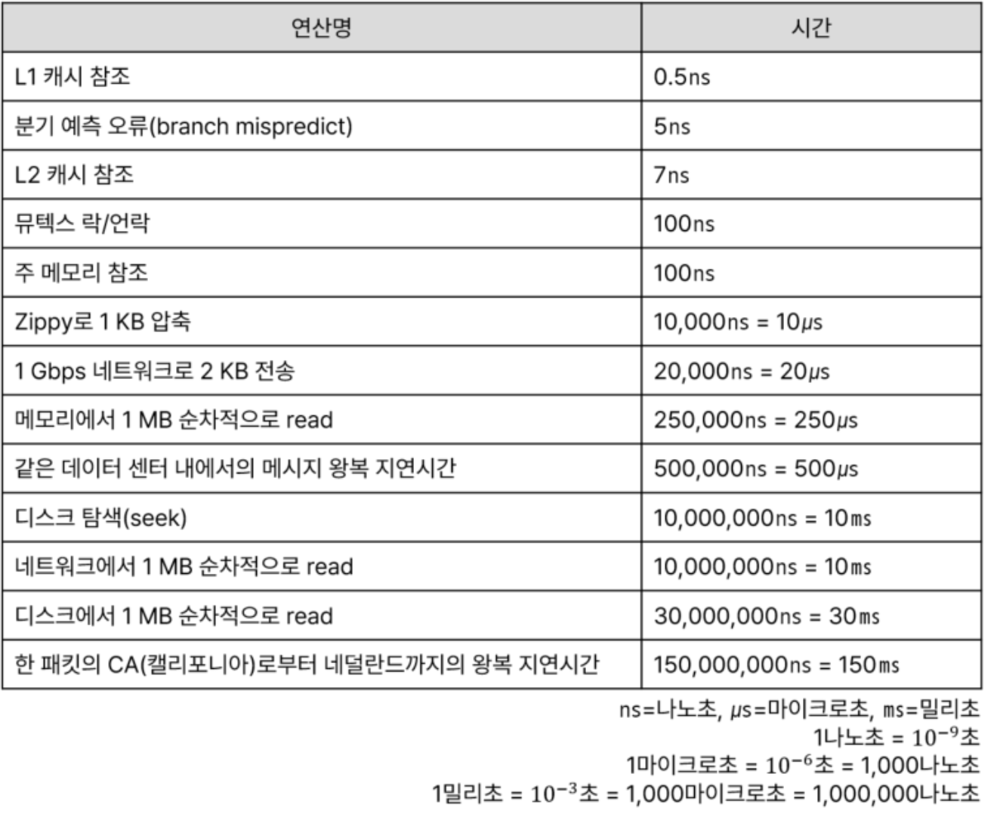

이를 통해 다음과 같은 결론을 내릴 수 있습니다.

- 메모리는 빠르지만 디스크는 느리다. 따라서 디스크 탐색을 피해야 한다.
- 단순한 압축 알고리즘은 빠르다. 데이터를 인터넷에 전송하기 전에 가능하면 압축해라.
- 데이터 센터는 여러 곳에 분산되어 있고, 센터들 간 데이터를 주고 받는 데도 시간이 걸린다.

## 예제) 트위터 QPS 와 저장소 요구량 추정

트위터의 요구사항에 대한 개략적 추정입니다. (예시를 위한 값입니다.)

#### 가정

- 월간 능동 사용자 3억 명
- 50% 가 매일 트위터를 사용
- 평균적으로 2건의 트윗을 올림
- 미디어 포함 트윗은 10%
- 데이터는 5년 간 보관됨

#### 추정

- QPS (Query Per Second) 추정치
  - 일간 능동 사용자(Daily Actice User, DAU) = 1.5억 명
  - QPS = 1.5억 x 2 트윗 / 24시간 / 3600초 = 약 3500
  - 최대 QPS(Peek QPS) = 2 x QPS = 약 7000
- 미디어 보관을 위한 저장소 요구량
  - 평균 트윗 크기
    - tweet_id 64bytes
    - text 140bytes
    - media 1MB
  - 미디어 저장소 요구량 = 1.5억 x 2 x 10% x 1MB = 30TB/일
  - 5년 = 약 55PB

####  

# 효과적인 면접을 위한 4단계 접근법

## 1단계 : 문제 이해 및 설계 범위 설정

문제에 대해 깊이 생각하고 요구사항과 가정을 명확히 하기 위해 질문해야 합니다. 아래와 같은 질문을 할 수 있습니다.

- 구체적으로 어떤 기능을 만들어야 하나?
- 제품 사용자 수는 얼마나 되나?
- 규모는 얼마나 빨리 커지나?
- 주로 사용하는 스택은?
- 설계를 단순화하기 위해 사용할 수 있는 기존 서비스가 있나?

## 2단계 : 개략적인 설계안 제시 및 동의 구하기

설계안에 대해 개략적인 안을 그리며 면접관에게 동의를 구하는 단계입니다. 화이트보드나 종이에 핵심 컴포넌트를 그리면서 제약사항들을 만족하는지 계산합니다. 

## 3단계 : 상세 설계

이 단계에서는 **설계 대상 컴포넌트 사이의 우선순위**를 정하고 집중해야 하는 영역에 대해 설명해야 합니다. 예를 들어 시스템의 병목 구간이나 자원 요구량 추정치에 초점을 맞출 수도 있고, 채팅 시스템이라면 지연시간을 줄이고 사용자의 온/오프라인 상태를 표시하는 데 초점을 맞출 수도 있습니다.

## 4단계 : 마무리

이 단계에서 후속질문이 있거나 스스로 추가 논의를 진행할 수 있습니다. 

-  만든 시스템에 대한 요약
- 오류 발생 시 무슨 일이 생기는지
- 운영 이슈 (매트릭 수집, 로그, 배포 등)
- 미래의 규모 확장 요구에 대한 대처 방법

# 4장 - 처리율 제한 장치의 설계

처리율 제한 장치(rate limiter) 는 들어오는 트래픽의 처리율(rate)을 제어하기 위한 장치입니다. 아래와 같은 예시가 있습니다.

- 사용자는 초당 2회 이상 새 글을 올릴 수 없다.
- 같은 IP 주소로는 하루에 10개 이상의 계정을 생성할 수 없다.
- 같은 디바이스로 주당 5회 이상 리워드를 요청할 수 없다.

이를 통해 **DoS 공격을 방지**하고, 서버 또는 서비스 사용료의 **비용을 절감**할 수 있습니다. 또한도 방지할 수 있습니다.

## 1단계 : 문제 이해 및 설계 범위 확정

해당 단계는 면접관과 소통하면서 시스템 요구사항을 도출하는 단계입니다. 어떤 종류의 제한 장치인지, 어떤 기준으로 제어하는지, 시스템 규모는 얼마인지 등의 요구사항을 명확하게 해야 합니다.

## 2단계 : 개략적 설계안 제시 및 동의 구하기

처리율 제한 장치는 **클라이언트, 서버, 미들웨어** 3군데에 설계할 수 있습니다. 하지만 클라이언트는 위·변조가 쉽기 때문에 추천하지 않습니다. 서버, 미들웨어는 기술 스택, 알고리즘, 프로그램 설계 등을 고려하여 선택하면 됩니다.

### 처리율 제한 알고리즘

처리율 제한 알고리즘 중 널리 알려진 건 아래와 같습니다.

- 토큰 버킷(token bucket) : 지정된 용량의 컨테이너를 갖고, 토큰이 주기적으로 채워집니다. 요청마다 토큰이 사용되며, 토큰이 없다면 요청을 버려집니다.
- 누출 버킷(leaky bucket) : 일정 크기의 큐를 선언하고, 요청이 들어오면 큐에 요청을 추가합니다. 지정된 시간마다 큐에서 요청을 꺼내 처리합니다.
- 고정 윈도 카운터(fixed window counter) : 타임라인을 고정된 간격의 윈도로 나누고, 각 윈도마다 카운터를 붙입니다. 요청이 접수될 때마다 카운터 값이 1 증가하며, 이 값이 임계치에 도달하면 요청은 새 윈도가 열릴 때까지 버려집니다.
- 이동 윈도 로그(sliding window log) : 고정 윈도 카운터에서 트래픽이 집중될 때의 문제를 해결할 수 있는 알고리즘입니다. 요청의 타임스탬프를 추적하면서 캐시에 보관하고, 일정 시간이 지나면 타임스탬프를 만료시킵니다. 만료되지 않은 타임스태프의 개수로 허용한도를 판단합니다.
- 이동 윈도 카운터(sliding window counter) : 고정 윈도 카운터와 이동 윈도 로깅 알고리즘을 결합한 형태입니다.

### 개략적인 아키텍처

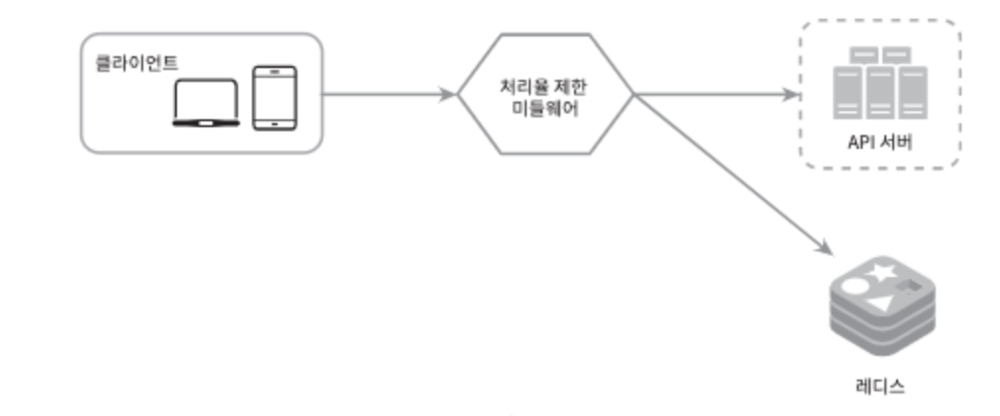

- 클라이언트가 처리율 제한 미들웨어에 요청을 보냄
- 미들웨어는 레디스의 버킷에서 카운터를 가져와서 검사 후 요청 처리

## 3단계 : 상세 설계

상세 설계에서는 아래와 같은 내용을 생각할 수 있습니다.

- 처리율 제한 규칙
- 체리율 한도 초과 트래픽의 처리 : 초과된 요청을 버리거나 MQ 에 보관하여 나중에 처리
- 분산 환경에서의 경쟁 상태 : 루아 스크립트 또는 레디스의 정렬집합 사용
- 분산환경에서의 동기화 이슈 : 중앙 집중형 데이터 저장소 사용

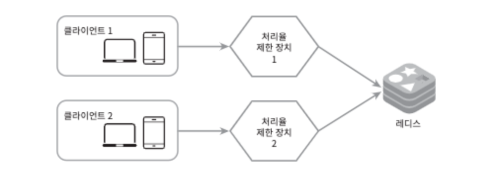

- 성능 최적화 : edge server 를 통한 지연시간 감소
- 모니터링
  - 채택된 처리율 제한 알고리즘이 효과적인지? -> 트래픽 급증 시 비효율적으로 동작할 수 있음
  - 정의한 처리율 제한 규칙이 효과적인지? -> 너무 빡빡하게 설정되었다면 많은 유휴 요청이 처리되지 못함

## 4단계 : 마무리

다음과 같은 부분을 언급할 수 있습니다.

- 경성(hard) 또는 연성(soft) 처리율 제한
- 처리율 제한 회피 방법, 클라이언트를 어떻게 설계하는 것이 최선인가?
  - 캐시를 사용하며 API 호출 횟수를 줄임
  - 예외 처리 코드를 통해 예외적인 상황이 우아하게 복구될 수 있도록 함
  - 재시도 로직은 충분한 백오프 시간을 둠

 

# 5장 - 안정 해시 설계

안정 해시는 수평적 규모 확장을 위해 요청을 서버에 균등하게 보낼 때 사용되는 기술입니다. 나머지 연산을 통한 해시 값은 서버가 추가되거나 기존 서버가 삭제될 때 문제가 생깁니다. 서버 인덱스 값이 달라지기 때문입니다.

안정 해시는 아래와 같이 링 형태로 되어있습니다. 어떤 키가 저장되는 서버는, 해당 키의 위치로부터 시계 방향으로 링을 탐색해나가면서 만나는 첫 번째 서버입니다.

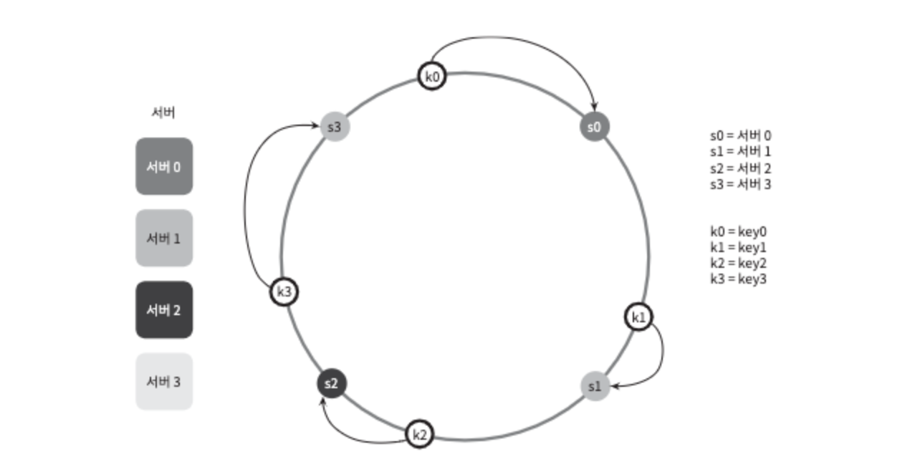

따라서 서버가 추가되거나 삭제되더라도 일부 키만 재배치됩니다. 하지만 이 방법에도 몇가지 문제가 있습니다.

- 서버가 추가되거나 삭제되면 파티션의 크기를 균등하게 유지하는 게 불가능
- 키의 균등 분포 달성이 힘듦

이를 해결하기 위해 가상 노드(virtual node) 기법을 사용할 수 있습니다.

## 가상 노드

가상 노드는 실제 노드 또는 서버를 가리키는 노드로, 하나의 서버는 여러 개의 가상 노드를 가질 수 있습니다. 

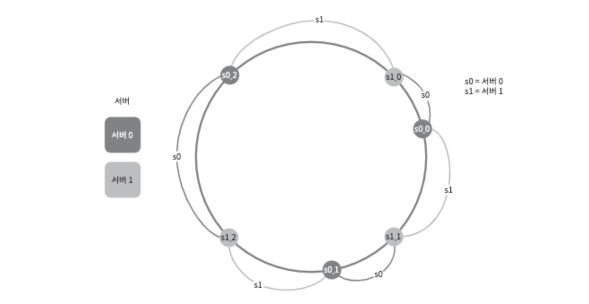

위 그림에서 s0 으로 표시된 파티션은 서버 0 이 관리하고, s1 으로 표시된 파티션은 서버 1 이 관리합니다. 가상 노드의 개수를 늘리면 표준 편차가 작아져서 키의 분포가 균등하게 됩니다.

## 안정 해시의 이점

지금까지 살펴본 안정 해시의 이점은 다음과 같습니다.

- 서버 추가, 삭제 시 재배치되는 키의 수 최소화
- 데이터가 보다 균등하게 분포되어 수평적 규모 확장성을 달성하기 쉬움
- 핫스팟 키 문제를 줄임

# 키-값 저장소 설계

많은 데이터를 저장하기 위해서는 분산된 키-값 저장소를 설계해야 합니다. 이를 위해서는 우선 CAP 에 대한 이해가 필요합니다.

## CAP

CAP 는 데이터 일관성(consistency), 가용성(availability), 파티션 감내성(partition tolerance) 세 가지를 동시에 만족하는 분산 시스템을 설계하는 것은 불가능하다는 정리입니다.

- 데이터 일관성 : 모든 클라이언트가 어떤 노드에 접속했느냐에 상관없이 같은 데이터를 봐야 함
- 가용성 : 일부 노드의 장애가 발생하더라도 같은 응답을 받을 수 있어야 함
- 파티션 감내성 :파티션은 두 노드 사이에 통신 장애가 발생하였음을 의미. 네트워크에 파티션이 생기더라도 시스템은 계속 동작해야 함

아래와 같은 분산 시스템을 예시로 살펴보겠습니다.

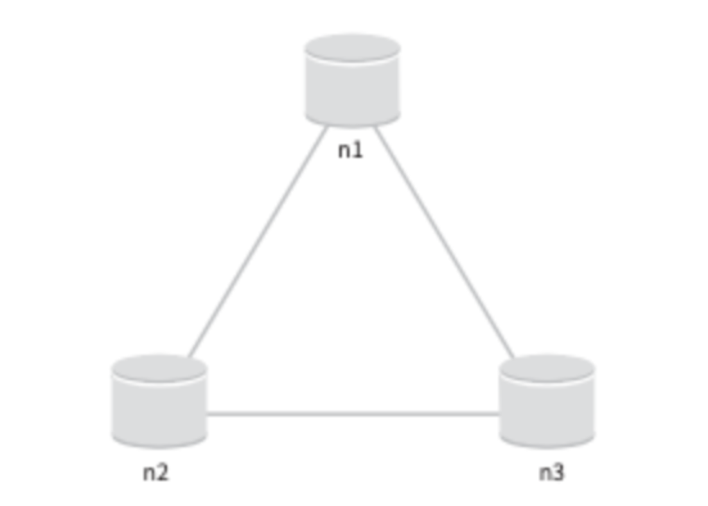

이상적인 저장소에서 n1 에 기록된 데이터는 자동적으로 n2, n3 에 복제됩니다. 또한 파티션이나 서버 장애가 발생하지 않는 저장소입니다. 이는 CAP 에 만족하는 이상적인 저장소입니다.

하지만 **실세계에서는 파티션 문제를 피할 수 없습니다**. 따라서 설계 시 CP 와 AP 중 하나를 선택해야 합니다.

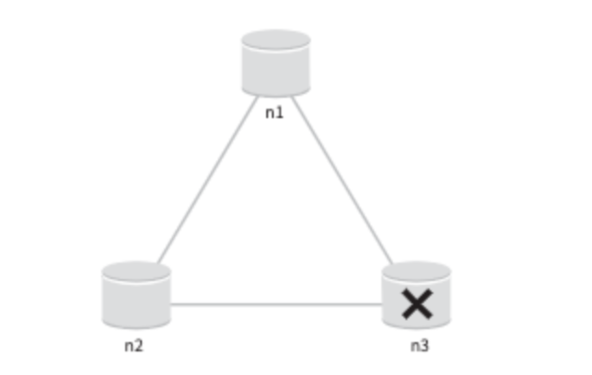

위와 같이 n3 에 장애가 발생하여 n1, n2 와 통신할 수 없을 때 CP 시스템은 데이터 불일치 문제를 해결하기 위해 n1, n2 에 대해 쓰기 연산을 중단해야 합니다. 그렇게 되면 가용성이 깨지게 됩니다. 반대로 AP 시스템은 n1, n2 에 대해 계속 읽기 연산을 허용합니다. 이때 n3 에 새로운 데이터가 삽입되더라도 n1, n2 에는 삽입되지 않기 때문에 일관성이 깨지게 됩니다.

# 분산 시스템을 위한 유일 ID 생성기 설계

여러 DB 서버를 사용하는 경우 auto_increment 속성은 요구를 감당할 수 없습니다. 따라서 ID 설계를 위한 시스템을 고려해야 합니다.

## 1단계 : 문제 이해 및 설계 범위 확정

면접관과 질문을 통해 다음과 같은 요구사항을 도출해볼 수 있습니다.

- ID 는 유일해야 한다.
- ID 는 숫자로만 구성되어 있다.
- ID 는 64비트로 표현될 수 있는 값이다.
- ID 는 발급 날짜에 따라 정렬 가능해야 한다.
- 초당 10,000개의 ID 를 만들 수 있어야 한다.

## 2단계 : 개략적 설계안 제시 및 동의 구하기

다음과 같은 선택지가 있습니다.

- 다중 마스터 복제(multi-master replication) : 다음 ID 값을 구할 때 k(DB 서버 수) 만큼 증가시킵니다. 하지만 값이 시간에 맞추어 커지도록 보장할 수 없고, 서버 추가/삭제 시 잘 동작하게 하기 위해 추가적인 설정이 필요합니다.
- UUID : 중복 가능성이 매우 낮기 때문에 규모 확장이나 동기화가 쉽습니다. 하지만 ID 가 128비트로 길고, 숫자가 아닌 값이 포함됩니다.
- 티켓 서버(ticket server) : auto_increment 기능을 갖춘 티켓서버(DB) 를 중앙 집중형으로 하나만 사용하는 것입니다. 유일성이 보장되고 구현하기가 쉽지만 티켓 서버가 SPOF 가 됩니다. 이슈를 피하기 위해 서버를 여러 대 준비한다면 데이터 동기화 문제가 생깁니다.
- 트위터 스노플레이크 접근법 : 아래 그림과 같이 64비트 ID 를 분할하여 각각의 의미를 갖도록 부여합니다. 


## 3단계 : 상세 설계

트위터 스노플레이크 접근법으로 설계를 해보겠습니다.

- 타임스탬프 : 41비트로, 밀리초기준으로 69년을 표현할 수 있습니다. 따라서 69년 이후에는 기원 시각을 바꾸거나 ID 체계를 다른 것으로 이전해야 합니다.
- 일련번호 : 일련번호는 12비트이므로, 4096개의 값은 가질 수 있습니다. 어떤 서버가 같은 밀리초 동안 하나 이상의 ID 를 만들어낸 경우에만 0 보다 큰 값을 갖게 됩니다.

## 4단계 : 마무리

4가지 방식 중 스노플레이크를 선택한 이유는, 모든 요구사항을 만족하면서도 분산 환경에서 규모 확장이 가능했기 때문입니다. 다음과 같은 내용을 추가로 논의해볼 수 있습니다.

- 시계 동기화(clock synchronization) : 하나의 서버가 여러 코어에서 실행될 경우 같은 시계를 사용하지 않을 수 있습니다. NTP(Network Time Protocol)은 이 문제를 해결하기 위한 가장 보편적 수단입니다.
- 각 section 길이 최적화 : 동시성(concurrency)이 낮고 수명이 긴 애플리케이션이라면 일련번호 섹션의 길이를 줄이고 타임스탬프 섹션의 길이를 늘릴 수 있습니다.
- 고가용성 : ID 생성기는 필수 불가결(mission critical) 컴포넌트이므로 아주 높은 고가용성을 제공해야 합니다.

# URL 단축기 설계

tinyurl 같은 URL 단축기 설계 문제입니다.

## 1단계 : 문제 이해 및 설계 범위 확정

면접관과의 질문으로 개략적인 추정을 합니다.

- 매일 1억 개의 단축 URL 생성 -> 초당 1160개 쓰기 연산
- 읽기 연산과 쓰기 연산 비율은 10:1 이라고 가정하고, 읽기 연산은 초당 11600회 발생
- URL 단축 서비스를 10년간 운영한다고 가정하면 3650억 개의 레코드 보관 필요
- 축약전 URL 평균 길이가 100 이면 10년 간 36.5TB 저장 용량 필요

## 2단계 : 개략적 설계안 제시 및 동의 구하기

API 엔드포인트, URL 리디렉션, URL 단축 플로에 대한 개략적인 내용이 필요합니다.

### API 엔드포인트

1. URL 단축용 엔트포인트 : POST /api/v1/data/shorten
   - 인자 : 기존 url
   - 반환 : 단축 url
2. URL 리다이렉션용 엔드포인트 : GET /api/v1/shortUrl
   - 반환 : 기존 url

### URL 리다이렉션

단축 URL 서버는 클라이언트에게 요청을 받아서 301 또는 302 응답으로 원래 URL 로 리다이렉션합니다. 여기서 두 응답은 모두 리다이렉션이지만 차이가 있습니다.

- 301 Permanently Moved : 해당 URL 에 대한 요청 처리 책임이 영구적으로 Location 헤더에 반환된 URL 로 이전됩니다. 브라우저는 이 응답을 캐시하기 때문에 추후 같은 단축 URL 에 요청을 보낼 필요가 있을 때 브라우저는 캐시된 원래 URL 로 요청을 보냅니다. **따라서 서버 부하를 줄일 수 있습니다.**
- 302 Found : 주어진 URL 로의 요청이 일시적으로 Location 헤더에 반환된 URL 에 의해 처리된다는 응답입니다. 따라서 클라이언트의 요청은 언제나 단축 URL 서버로 먼저 보내집니다. **클릭 발생률이나 발생 위치 추적 등 트래픽 분석이 중요할 때 사용합니다.** 

### URL 단축

이 시스템에서 중요한 부분은 긴 URL 을 해시값으로 대응시킬 해시 함수를 찾는 일입니다. 다음 요구사항을 만족해야 합니다.

- 기존 URL 이 다른 값이면 해시 값도 달라야 합니다.
- 계산된 해시 값은 원래 입력으로 주어졌던 기존 URL 로 복원될 수 있어야 합니다.

## 3단계 : 상세 설계

### 데이터 모델

데이터는 관계형 데이터베이스로 단축 URL, 원래 URL 을 저장할 수 있습니다.

### 해시함수

해시함수는 원래 URL 을 단축 URL 로 변환하는 데 사용됩니다. 해시값은 0-9, a-zA-Z 문자들로 구성되는데, 총 62개입니다. 이 시스템은 3650억 개의 URL 을 만들어낼 수 있어야 하므로 해시값의 길이가 7 이상이어야 합니다. (7 일 때 3.5조 개) 따라서 해시길이는 7 로 해도 됩니다.

해시 충돌 해결 전략은 다음 두 가지를 사용할 수 있습니다.

- 해시 후 충돌 해소 : 원래 URL 을 CRC32 와 같은 해시함수로 줄인 후 DB 에 해당 해시값이 있는지 질의합니다. 있다면 충돌 상황으로, 원래 URL 뒤에 사전에 정한 문자열을 추가하고 다시 해시값을 계산합니다.
- base-62 변환 : 62진법을 통해 ID 값을 62진수로 변환합니다.

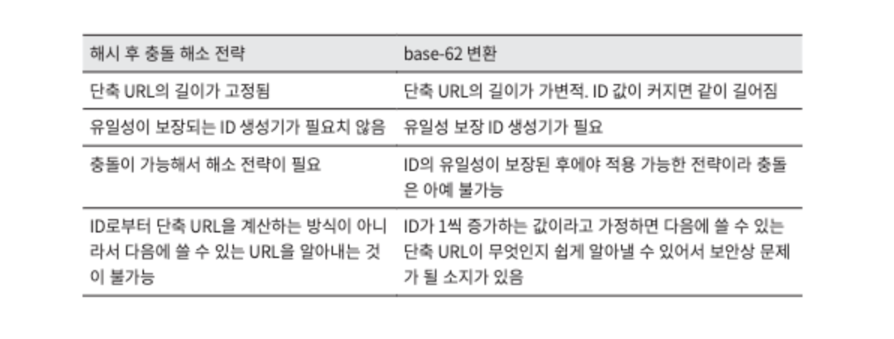

### URL 단축기 상세 설계

base-62 변환을 통해 해시값을 생성하는 방법으로 설계하였습니다.

1. URL 이 입력됨 (https://en.wikipedia.org/wiki/Systems_design)
2. ID 생성기가 반환한 ID 는 2009215674938
3. 이 ID 를 62 진수로 변환하면 zn9edcu 를 얻음
4. 해당 값으로 새로운 레코드를 만듦

이 때 ID 를 전역적으로 유일하게 보장하기 위해 이전의 분산 ID 생성기를 구현해야 합니다.

### URL 리다이렉션 상세 설계

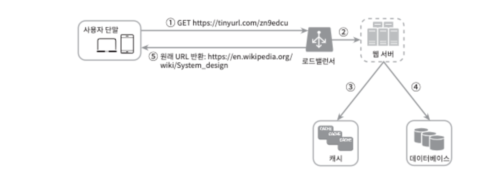

## 4단계 : 마무리

다음과 같은 사항들을 추가로 논의할 수 있습니다.

- 처리율 제한 장치
- DB 다중화 또는 샤팅을 통한 규모확장
- 데이터 분석 솔루션으로 어떤 링크를 얼마나 많은 사용자가 클릭했는지, 언제 주로 클릭했는지 등 중요한 정보를 얻을 수 있음
- 가용성, 데이터 일관성, 안정성 등 

# 웹 크롤러 설계

웹 크롤러는 검색 엔진에서 널리 쓰는 기술로, 웹에 새로 올라오거나 갱신된 콘텐츠를 찾아내는 것이 주된 목적입니다. 기본 알고리즘은 간단합니다.

- URL 집합이 입력으로 주어지면, 해당 URL 들이 가리키는 모든 웹페이지를 다운로드합니다.
- 다운받은 웹페이지에서 URL 들을 추출합니다.
- 추출된 URL 들을 다운로드할 URL 목록에 추가하고 위 과정을 계속 반복합니다.

## 1단계 : 문제 이해 및 설계 범위 확정

먼저 질문을 통해 요구사항을 알아내고 설계 범위를 좁혀야 합니다.

- 크롤러의 용도 -> 검색 엔진 인덱싱
- 매달 10억 개 웹페이지 수집
- 새로 만들어진 페이지나 수정된 웹 페이지도 고려
- 5년 간 저장
- 중복된 컨텐츠 무시

그리고 요구사항을 통해 개략적인 규모를 추정해야 합니다.

- 매달 10억 개의 웹 페이지를 다운로드 하므로, QPS 는 대략 400페이지/s 
- 최대(Peak) QPS 는 800
- 웹 페이지 평균 크기를 500k 라고 했을 때 월 500TB, 5년에 30PB 필요

## 2단계 : 개략적 설계안 제시 및 동의 구하기

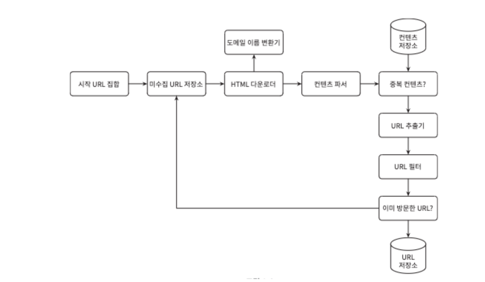

- 시작 URL 집합 : 웹 크롤러가 크롤링을 시작하는 출발점입니다.
- 미수집 URL 저장 : 다운로드할 URL 저장소로, FIFO 큐 입니다.
- HTML 다운로더 : 웹페이지를 다운로드하는 컴포넌트입니다.
- 도메인 이름 변환기 : 다운받은 URL 을 IP 주소로 변환합니다.
- 콘텐츠 파서 : 웹페이지를 파싱, 검증합니다. 문제를 일으킬 수 있는 웹페이지를 걸러냅니다.
- 중복 컨텐츠인지 확인 : 문자열로 비교하는 게 간단하지만, 비교 대상 문서 수가 많을 경우 비효율적이므로 웹 페이지의 해시값을 비교합니다.
- 컨텐츠 저장소 : HTML 문서를 보관하는 시스템입니다. 본 설계에서는 디스크와 메모리를 동시에 이용합니다.
- URL 추출기 : HTML 페이지를 파싱하여 링크를 골라냅니다. 상대 경로는 모두 절대 경로로 바꿉니다.
- URL 필터 : 특정 컨텐츠 타입이나 파일 확장자를 갖는 URL, 접속 시 오류가 발생하는 URL, 접근 제외 목록 URL 등을 크롤링 대상에서 배재합니다.
- 이미 방문한 URL? : 이미 방문한 URL 인지 확인하고, 여러 번 처리되는 일이 없도록 합니다.
- URL 저장소 : 이미 방문한 URL 을 보관하는장소입니다.

## 3단계 : 상세 설계

### DFS vs BFS

DFS 는 그래프의 크기가 클 경우 어느 정도로 깊숙이 가게 될지 모르기 때문에 좋은 선택이 아닙니다. 웹 크롤러는 보통 BFS 방법을 사용하게 되는데, BFS 도 아래와 같은 문제가 있습니다.

- 한 페이지에서 나오는 링크는 같은 서버로 돌아가기 때문에, 해당 서버는 과부하가 걸리게 된다. (impolite)
- 처리 순서에 있어서 우선순위가 없다.

### 미수집 URL 저장소

미수집 URL 저장소를 활용해 BFS 문제를 해결할 수 있습니다. 

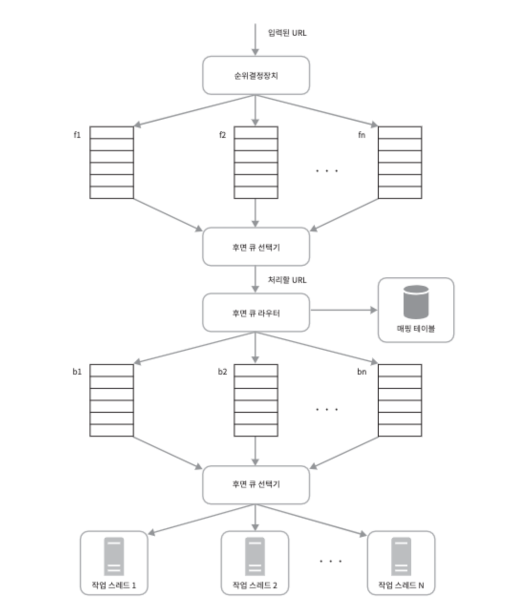

입력된 URL 은 순위결정장치에 의해 우선순위가 결정되어 큐에 들어갑니다. 그러면 큐 선택기가 우선순위를 고려하여 큐에서 URL 을 큐 라이터에게 전달합니다. 그리고 사이트별로 나눠져있는 큐에 다시 해당 URL 을 넣으면 각 사이트별 작업 스레드가 URL 을 처리합니다.

이렇게 하면 BFS 로 많은 동일 URL 이 큐에 들어가 있어도 처리하는 스레드는 일정하므로 서버 과부하가 생기지 않습니다.

### HTML 다운로더

Robots.txt 는 웹사이트와 크롤러가 소통하는 표준적인 방법입니다. 해당 파일에는 어떤 경로를 허락하고 허락하지 않는지 나열되어 있습니다.

또한 HTML 다운로더는 성능 최적화도 매우 중요합니다. 아래와 같은 기법들을 사용할 수 있습니다.

1. 분산 크롤링
2. DNS 결과 캐시 : DNS 조회 결과로 얻어진 결과를 캐시에 보관해놓고 크론 잡 등으로 주기적으로 갱신하도록 합니다.
3. 지역성 : 크롤링 작업을 수행하는 서버를 지역별로 분산하여 지역적으로 가까운 서버의 페이지 다운로드 시간을 줄입니다.
4. 짧은 타임아웃 : 어떤 웹 서버는 응답이 느리거나 아예 응답하지 않으므로 해당 페이지는 다운로드를 중단합니다.

또한 다운로더 설계 시 **안정성**도 중요하게 고려해야 할 부분입니다. 이는 안정해시, 복구를 위한 크롤링 상태 및 수집 데이터 저장, 예외 처리, 데이터 검증 등으로 보장할 수 있습니다. 또한 **확장성**을 위해 새로운 형태의 콘텐츠를 쉽게 지원할 수 있도록 해야 합니다.

### 문제 있는 콘텐츠 감지 및 회피

웹 컨텐츠의 30% 가량은 중복이기 때문에 해시나 체크섬을 사용해 중복 컨텐츠를 탐지합니다. 또한 크롤러를 무한 루프에 빠뜨리도록 설계한 웹 페이지를 거미덫이라고 부르는데, 다음과 같은 디렉터리 구조를 포함합니다.

```
spidertrapexample.com/foo/bar/foo/bar/foo/bar/...
```

덫을 자동으로 피해가는 알고리즘을 만들어내는 것은 까다롭기 때문에 사람이 수작업으로 덫을 확인하고 필터링하는 방법이 가장 좋습니다.

## 4단계 : 마무리

다음과 같은 사항을 추가적으로 논의해볼 수 있습니다.

- 서버 측 렌더링 : 동적으로 생성되는 링크를 발견하기 위해 사용합니다.
- 원치 않는 페이지 필터링
- DB 다중화 및 샤딩
- 수평적 규모 확장성, 가용성, 일관성 안정성
- 데이터 분석 솔루션

<Footer/>
