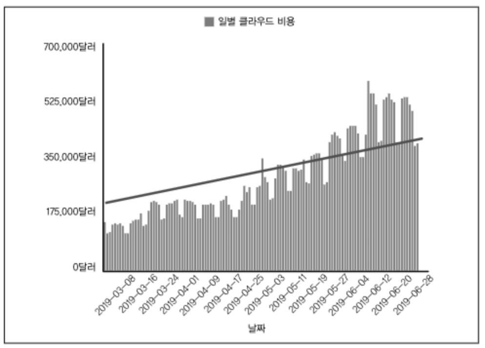

<Header />

클라우드 비용 절감 프로젝트를 하면서 읽은 책이다. 많은 내용이 있었지만 실질적으로 내가 필요한 부분만 담았다.

<description />

# 태그 기반 비용 할당

  청구 데이터에 비용 할당 데이터를 추가하는 주요 방법

- 리소스 수준 태그: 리소스 수준에서 직접 적용
- 계정: 공급업체에서 제공하고 청구서에 표시
- 청구서 발행 이후: 데이터 처리용 같은 타사 분석도구로 데이터를 변경하고 추가 정보 표시

## 전략

1. 계획 공지
2. 단순하게 유지 : 사업부, 제품, 소유자, 역할을 중점적으로 태깅
3. 질문을 공식화 : 클라우드를 어떻게 사용하는지에 대한 질문이 필요

# 태그와 레이블

- 태깅 표준이 시작될 때 수정이 없는 방향으로 고민해야 함
- 적당량의 태를 선택해야 함. 아래는 성공적으로 핀옵스를 활용하는 회사의 태깅 표준
  - 코스트센터, 상버부 태그 : 리소스 비용 위치
  - 서비스, 워크로드 태그 : 리소스가 속한 비즈니스 서비스를 구별
  - 리소스 소유자 태그 : 리소스를 담당하는 개인, 팀을 식별
  - 리소스 이름 태그 : 리소스의 이름
  - 환경 태그 : 개발, 테스트, 스테이징, 사용 등
- 태깅은 모든 클라우드 업체에 적용할 수 있도록 고민해야함. 예를 들어 특정 클라우드 업체에서는 '&' 문자 등을 허용하지 않을 수도 있음
- 태그가 잘 지정되었는지에 대한 보고가 필요함

# 목표 설정 

- 핀옵스의 첫 번째 목표는 알맞은 비용 할당

## 철의 삼각 : 좋은 품질, 빠른 속도, 저렴한 비용의 관계

- 품질과 개발속도, 비용을 모두 만족시킬 수는 없음

## OKR : 목표와 핵심 결과 지표 (Objective and key results)

  OKR 은 목표와 결과를 정의하고 추적하기 위한 프레임 워크임.

- OKR 중점 항목 #1 : 신용
- OKR 중점 항목 #2 : 지속 가능성
  - 자동화된 태깅 등으로 지속 가능한 방식 사용
- OKR 중점 항목 #3 : 제어

**목적을 목표 수치로**

  데이터에 더 많은 정보를 제공하기 위해서는 항상 목표선이 있어야 함. (아래는 예시)

  목표선에 따라 이상 징후를 탐지한다든지, 예측 충족을 위한 행동을 할 수 있다.

# 낭비는 어디서 생길까

  클라우드 리소스가 처음 배포될 때 요구 사항이 제대로 알려지지 않거나 잘 이해하지 못하는 경우 (배포 초기) 불확실성으로 인해 성능 문제가 발생하지 않도록 용량을 초과하여 배포하게 됨. 팀이 활용률 지표를 기반으로 리소스를 관리하지 않으면 낭비되는 양이 커짐.

## 사용량 감소

1. 제거, 이동을 통한 사용량 감소
   - 잊힌 리소스를 찾아서 삭제
2. 라이트 사이징을 통한 삭제
   - 값싼 리소스를 라이트사이징할 때는 최소 절감 금액인 한계점을 고려해야 함.
   - 값싼 리소스의 경우 비용 절감이 크게 되지 않는데, 인력이 투입되기 때문에 비즈니스 영향도를 고려해야 함

**일반적인 라이트 사이징 실수**

- 사용량 평균값(cpu 평균 등)으로 라이트사이징을 하면 리소스 성능 문제가 있을 수 있음. 최대값을 고려하지 않았기 떄문
- 리소스 형태를 고려하지 않는 실수. r5.large 를 사용하지만 메모리 사용량이 낮을 때, c5.large 로 변경할 수 있음
- 라이트사이징 전에 성능을 시뮬레이션하지 않는 실수. 클리핑에 대해 우려하면서 최적의 결정을 내릴 수 없게 됨
- 예약 인스턴스의 불확실성으로 인한 망설임

**EC2 를 넘너서: 블록 스토리지 비용을 통제하는 팁**

- 분리된 볼륨은 제거
- 처리량 0 이나 IOPS 0 에 집중
- 성능이 더 좋은 iOPS 볼륨을 줄이기

## 재설계를 통한 사용량 절감

1. 리소스 크기 변경 -> 서비스를 수평적으로 확장 및 축소
2. 예정된 작업을 통해 리소스가 불필요할 때 자동으로 끄기

## 서버리스 컴퓨팅

  서버리스는 사용이 안되거나 활용률이 낮아 발생하는 비용을 줄임. 하지만 서버리스로의 전환에 필요한 재설계는 비쌈. 소프트웨어 개발에서 가장 큰 비용은 인건비이기 때문에 노력 대비 이익을 고려해야 함.

<Footer/>
