<Header />


카프카는 이벤트, 디커플링 키워드에서 다재다능하게 사용된다. 특히 카프카를 설명할 수 있는 단어는 '안정적인 운영'과 '빠른 확장성'이다. 이러한 특성때문에 의외로 스타트업에서 많이 사용된다. 빠른 성장 속에서도 데이터 관련 작업을 안정적으로 할 수 있기 때문이다. 스타트업 개발자든, 대기업 개발자든 카프카는 이제 필수이다.

<description />

> [!NOTE]  
> 책 전체가 아닌 필요한 부분만 정리함

# 1. 카프카가 데이터를 저장하는 방법

카프카는 프로듀서에게 데이터를 전달받아 파티션에 데이터를 저장한다. 이때 전달받은 데이터는 파일 시스템에 저장된다.

파일은 config/server.properties 의 log.dir 옵션에 정의한 디렉토리에 저장된다. 그리고 토픽이름과 파티션 번호의 조합으로 하위 디렉토리를 생성하여 데이터를 저장한다.

```
tmp/
 ㄴ kafka-logs/
    ㄴ hello.kafka-1/
       ㄴ 00000000000000000000.index
       ㄴ 00000000000000000000.log
       ㄴ 00000000000000000000.timeindex
       ㄴ partition.metadata
       ㄴ leader-epoch-checkpoint
    ㄴ hello.kafka-2/
       ㄴ ...
       ㄴ ...
    ㄴ hello.kafka-3/
       ㄴ ...
       ㄴ ...
```

- index : 메시지의 오프셋을 인덱싱한 정보를 담은 파일
- log : 메시지와 메타데이터
- timeindex : 메시지에 포함된 timestamp 값을 기준으로 인덕싱한 정보가 담겨있음

## 1.1 파일에 저장하면 느리지 않을까?

카프카는 데이터를 메모리나 데이터베이스에 저장하지 않고 파일에 직접 저장한다. 하지만 파일 입출력으로 인한 속도 이슈가 발생하지 않는다.

그 이유는 **페이지 캐시를 사용하여 디스크 입출력 속도를 높였기 때문**이다. 페이지 캐시란 OS 에서 파일 입출력의 성능 향상을 위해 만들어 놓은 메모리 영역이다. 한번 읽은 파일의 내용은 메모리의 페이지 캐시에 저장되고, 추후 동일한 파일의 접근이 일어나면 디스크에서 읽지 않고 메모리에서 직접 읽는다.

## 1.2 데이터 복제

카프카는 데이터를 다른 브로커에도 저장하여 장애에 대응한다. 카프카의 복제는 파티션 단위로 이루어진다. 같은 토픽의 파티션이라도 리 브로커가 다를 수 있다.


복제된 파티션은 리더와 팔로워로 구성된다. 팔로워 파티션은 리더 파티션과 오프셋이 차이날 경우 데이터를 가져온다. (복제, replication)

만약 리더 파티션을 가진 브로커에서 장애가 발생하면 팔로워 파티션 중 하나가 리더 파티션 지위를 넘겨받는다.


## 1.3 데이터 삭제

카프카는 파일 단위(세그먼트)로 삭제가 이루어진다. 그리고 오직 브로커만 파일을 삭제할 수 있고 컨슈머나 프로듀서에서는 삭제할 수 없다.

세그먼트는 log.segment.bytes 또는 log.segment.ms 옵션값을 통해 닫힌다. 기본값은 1GB 이다.

닫힌 세그먼트 파일은 log.retention.bytes 또는 log.retention.ms 옵션의 설정값으로 체크되어 삭제된다.

# 2. 프로듀서의 파티션 결정

KafkaProcducer 가 send() 메서드를 호출하면 ProducerRecord 는 어느 파티션으로 전송될 것인지 결정된다. UniformStickyPartitioner 와 RoundRobinPartitioner 가 있는데 기본적으로 UniformStickyPartitioner 로 지정된다. 

> 메시지 키가 있을 때는 메시지 키 값에 따라 전송됨

- UniformStickyPartitioner : 어큐뮬레이터에서 데이터가 배치로 모두 묶일 떄까지 기다렸다가 배치로 묶인 데이터는 모두 동일한 파티션에 전송
- RoundRobinPartitioner : 파티션을 순회하면서 전송

될 수 있으면 많은 데이터가 배치로 묶여 전송되어야 성능 향상을 기대할 수 있다.

# 3. 컨슈머의 오프셋 커밋

일부 컨슈머에서 장애가 발생하면 해당 컨슈머에게 할당된 파티션은 다른 컨슈머에게 "리밸런싱"된다. 이는 새로운 컨슈머가 추가돼도 마찬가지이다. 그룹 조정자(group coordinator)는 리밸런싱을 발동시키는 역할을 하는데, 카프카 브로커 중 한 대가 그룹 조정자 역할을 한다.

컨슈머는 카프카 브로커로부터 데이터를 어디까지 가져갔는지 오프셋 기록을 커밋(commit)을 통해 기록하는데, 이는 브로커 내부의 토픽(_consumer_offsets)에 기록된다. 기록이 정상적으로 되지 않는다면 데이터가 중복 처리될 수 있다.

커밋은 명시적, 비명시적으로 할 수 있다. 기본값은 비명시적으로, 다음 설정으로 이루어진다.

- enable.auto.commit=true : 오토 커밋(비명시적)
- auto.commit.interval.ms=1000 : 1초마다 커밋

하지만 비명시적으로 이루어지면 컨슈머 강제 종료 발생 시 컨슈머가 처리하는 데이터가 중복될 수 있다. 명시적으로 오프셋을 커밋하려면 poll() 메서드 호출 이후 데이터 처리가 완료되면 commitSync() 나 commitASync() 메서드를 호출하면 된다.

## 3.1 컨슈머의 poll()

컨슈머는 poll() 메서드로 레코드를 반환받지만 poll() 호출 시점에 가져오는 게 아니다. 컨슈머 애플리케이션 내부의 Fetcher 인스턴스가 poll() 인스턴스를 호출하기 전에 미리 레코드를 내부 큐로 가져온다. 이후 사용자가 명시적으로 poll() 메서드를 호출하면 컨슈머는 내부 큐에 있는 레코드들을 반환받는다.

## 3.2 auto.offset.reset 옵션

- latest : 가장 높은(최근의) 오프셋부터 읽음
- earliest : 가장 낮은(오래전) 오프셋부터 읽음
- none : 커밋기록이 있으면 기존 커밋 이후로 소비, 없으면 오류 반환

## 3.3 리밸런싱 전에 커밋하기

리밸런싱이 발생하면 ConsumerRebalnceListener 인터페이스로 해당 이벤트를 수신할 수 있다. 이중 onPartitionRevoked() 가 리밸런스가 시작되기 직전에 호출되는 메서드이므로 해당 메서드 안에서 커밋을 구현하면 된다.

## 3.4 컨슈머의 안전한 종료

컨슈머가 정상적으로 종료되지 않으면 세션 타임아웃이 발생할 때까지 컨슈머 그룹에 좀비처럼 남아있다. 좀비 컨슈머 때문에 해당 컨슈머에 배정된 파티션이 정상적으로 소모되지 못한다.

KafkaConsumer 는 wakeup() 메서드를 지원한다. wakeup() 메서드 이후에 poll() 메서드가 호출되면 WakeupException 예외가 발생하고, finally 에서 이후 close() 로 자원을 해제하면 된다.

# 4. 카프카 스트림즈

## 4.1 카프카 스트림즈와 토폴로지

토폴리지의 종류로 링형, 트리형, 성형(star) 등이 있는데 스트림즈에서 사용되는 토폴로지는 트리 형태와 유사하다.

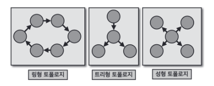

**카프카 스트림즈에서는 노드를 '프로세서'라고 부르고 간선을 '스트림'이라고 부른다.** 스트림은 토픽의 데이터를 뜻한다. 프로세서에는 소스 프로세서, 스트림 프로세서, 싱크 프로세서가 있다.

- 소스 프로세서 : 하나 이상의 토픽에서 데이터를 가져오는 역할
- 스트림 프로세서 : 다른 프로세서가 반환한 데이터를 처리하는 역할
- 싱크 프로세서 : 데이터를 특정 카프카 토픽으로 저장하는 역할

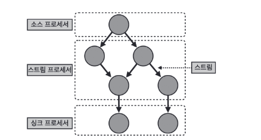


## 4.2 KStream, KTable, GlobalKTable

스트림즈DSL 엔느 레코드의 흐름을 추상화한 3가지 개념인 KStream, KTable, GlobalKTable 이 있다.

### 4.2.1 KStream

레코드의 흐름을 표현한 것으로 토픽에 존재하는 모든 레코드가 출력된다.

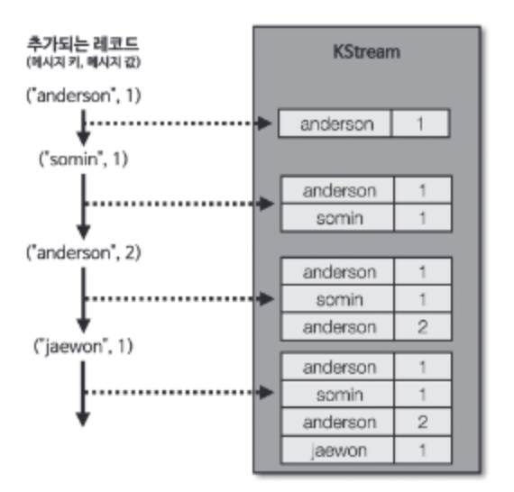

### 4.2.2 KTable

KTable 은 유니크한 메시지 키를 기준으로 가장 최신 레코드를 사용한다. 따라서 동일한 키가 들어오면 하나만 출력된다.

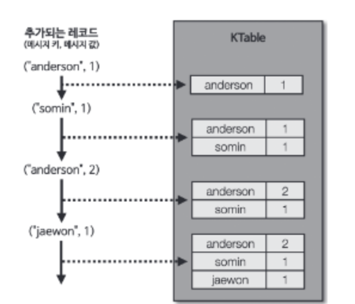

### 4.2.3 GlobalKTable

KTable 과 동일하게 메시지 키를 기준으로 묶어서 사용한다. 하지만 KTable 로선언된 토픽은 1개 파티션이 1개 태스크에 할당되어 사용되고, GlobalKTable 로 선언된 토픽은 모든 파티션 데이터가 각 태스크에 할당되어 사용된다는 차이점이 있다.

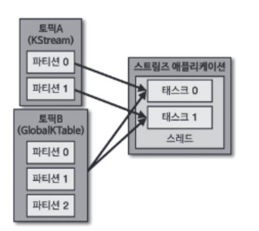

# 5. 적정 파티션 개수

토픽 생성 시 파티션 개수 고려사항

1. 데이터 처리량
2. 메시지 키 사용 여부
3. 브로커, 컨슈머 영향토

## 5.1 데이터 처리량

데이터 처리량을 올리는 방법은 **컨슈머를 추가하거나 컨슈머의 처리량을 늘리는 것이다.**

가장 확실한 방법은 파티션 개수를 늘리고 파티션 개수만큼 컨슈머를 추가하는 방법이다. 하지만 파티션 개수를 늘리게 됨에 따라 컨슈머, 브로커의 부담이 생긴다.

## 5.2 메시지 키 사용 여부

메시지 키를 사용하면서 처리 순서를 지켜야 하는 경우, **파티션 개수가 달라지만 매칭이 깨진다.** 따라서 메시지 순서 처리가 보장되어야 할 경우, 파티션 개수를 데이터 양보다 넉넉하게 생성해야 한다.

## 5.3 브로커와 컨슈머 영향도

파티션이 늘어날 때마다 브로커가 접근하는 파일 개수가 많아진다. 그런데 운영체제는 프로세스 당 열 수 있는 파일 최대 개수를 제한하고 있다. 따라서 각 브로커당 파티션 개수를 모니터링해야 한다.

# 6. 토픽 압축 정책

여기서 압축이란 메시지 키별로 해당 메시지 키의 레코드 중 오래된 데이터를 삭제하는 것이다. **토픽 압축 정책은 KTable 과 같이 메시지 키를 기반으로 데이터를 처리할 때 유용하다.**

압축 정책은 min.cleanable.dirty.raito 옵션값을 따른다. 액티브 세그먼트를 제외한 데이터의 테일(tail) 영역의 레코드 개수와 헤드(head) 영역의 레코드 개수의 비율을 뜻한다.

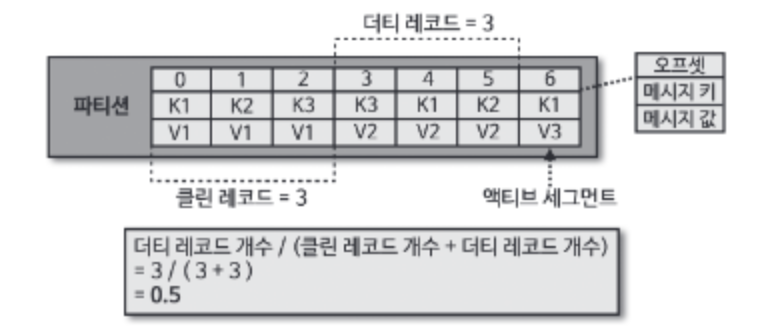

테일 영역은 '클린 로그'라 부르고 압축이 완료되어 중복된 메시지 키가 없다. 헤드 영역은 '더티 로그'라고 부른다.

ratio 값을 0.9 와 같이 크게 설정하면 한번에 많이 압축하므로 압축 효과가 좋다. 하지만 0.9 비율이 될 때까지 용량을 차지하므로 용량 효율이 좋지 않다.

반면 0.1 과 같이 작게 설정하면 최신 데이터만 유지할 수 있지만 압축이 자주 일어나 브로커에 부담을 줄 수 있다.

# 7. ISR(In-Sync-Replicas)

**ISR 은 리더 파티션과 팔로워 파티션이 모두 싱크된 상태**를 뜻한다. 모든 오프셋이 복제되어야 한다.

리더 파티션은 replica.lag.time.max.ms 값만큼의 주기를 가지고 팔로워 파이션이 데이터를 복제하는지 확인한다. 만약 팔로워 파티션이 해당 값보다 긴 시간동안 가져가지 않으면 ISR 그룹에서 제외한다.

ISR 로 묶인 팔로워 파티션은 리더 파티션으로 새로 선출될 자격을 가진다. **ISR 이 아닌 팔로워 파티션을 리더로 선출하도록 하려면 unclean.leader.election.enable 을 true 로 해야 한다. 하지만 일부 데이터가 유실될 수도 있다.** false 로 하면 리더 파티션을 가진 브로커가 실행될 때까지 서비스가 중단된다.

# 8. 프로듀서 acks 옵션

acks 옵션은 프로듀서가 전송한 데이터가 클러스터에 얼마나 신뢰성 높게 저장할지이다.

acks=0 이면 프로듀서가 데이터 전송 후 데이터가 저장되었는지 확인하지 않는다. 따라서 데이터 유실 여부를 체크할 수 없지만 속도는 가장 빠르다.

acks=1 이면 프로듀서는 리더 파티션에만 정상적으로 적재되었는지 확인한다. 하지만 팔로워 파티션의 데이터 동기화까지는 확인하지 않는다.

acks=all 또는 -1 이면 팔로워 파티션까지 정상적으로 적재되었는지 확인한다. 가장 속도가 느리지만 데이터를 안전하게 전송할 수 있다.

all 옵션값은 ISR 에 포함된 파티션들을 뜻한다. 이때 **min.insync.replicas** 옵션을 설정해서 ISR 중 최소 몇개의 파티션에 데이터가 적재되는지 확인한다. 1 을 설정하면 acks=1 과 같은 동작이고, 2 이상을 설정하면 1개 이상의 팔로워 파티션에 적재되는 것을 보장한다.

만약 min.insync.replicas 의 값이 3 이고 브로커가 3대일 때, 브로커 3대 중 1대가 동작하지 못하면 데이터가 전송될 수 없다. 파티션 3개에 복제되어야 하는데 2대만 동작하기 때문이다. 이 경우에는 Exception 이 발생한다.

## 8.1 추가 : acks=all 이 기본옵션이 됨

카프카 3.0 부터 acks 옵션 기본이 all 이다. **acks=all이 기본값으로 지정된 이유 중 하나는 프로듀서와 브로커 간 통신을 멱등성(idempotence)있게 만들기 위함**이다. 그리고 중복 전달을 제거하기 위해 enable.idempotence 가 true 로 변경되었다.

이는 max.inflight.requests.per.connection과 관련 있는데 acks=all로 설정하더라도 max.in.flight.requests.per.connection를 3으로 설정하고 비동기 프로듀서(Asynchronous producer)를 사용하면 acks=1과 동일한 성능을 낼 수 있다. 비동기 프로듀서란 브로커로부터의 응답을 동기로 받지 않는 것을 뜻한다. 

즉, 프로듀서의 샌더가 max.in.flight.requests.per.connection 개수만큼 병렬로 레코드를 전송하면 된다.

**내부 프로세스**

- 메시지는 먼저 프로듀서의 버퍼에 저장
- 별도의 Sender 스레드가 버퍼의 메시지들을 배치로 전송
- max.in.flight.requests.per.connection(예: 3)만큼 동시에 요청을 보냄
- 각 요청에 대한 응답은 Callback으로 비동기 처리

Ref. [데브원영](https://blog.voidmainvoid.net/507)

# 9. 컨슈머 렉 모니터링

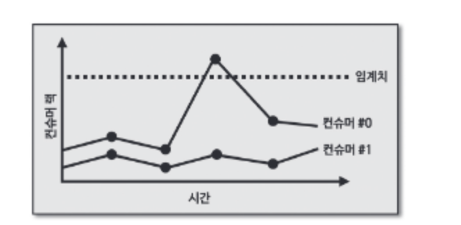

렉을 모니터링하는데 임계치로 알림을 받는다면 문제가 발생한다. 위 그래프에서 컨슈머 렉은 임계치를 넘었지만 점점 줄어들고 있다. 갑자기 대용량의 데이터가 들어오는 시점에서 렉 스파이크가 발생할 수 있지만 컨슈머가 정상적으로 동작하며 렉을 줄이고 있다. 이럴 땐 정상이라고 판단해야 한다.

링크드인에서 개발한 버로우 모니터링툴은 임계치가 아닌 슬라이딩 윈도우 계산을 통해 컨슈머 렉 상태를 평가한다.

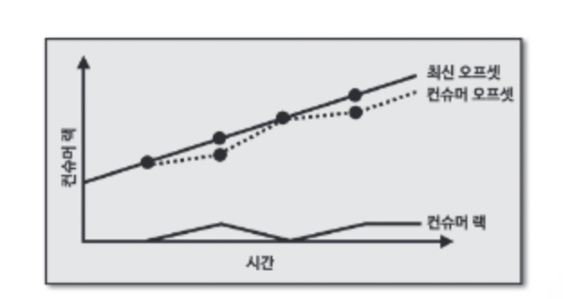

위 그래프에서 컨슈머 렉은 때때로 증가하지만 0 으로 줄어든다. 컨슈머가 정상동작하고 있다.

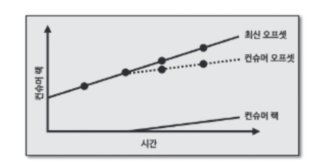

위 그래프에서는 컨슈머 렉이 점점 증가하고 있다. 컨슈머 오프셋이 최신 오프셋을 따라가고 있지만, 컨슈머의 **데이터 처리량이 부족하다는 뜻이다.**

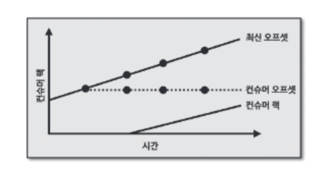

위 그래프는 컨슈머 오프셋이 멈췄다. 이는 **컨슈머가 이슈가 생겨 더이상 데이터를 더 이상 가져가지 않는다**는 뜻이다.

# 10. 컨슈머 배포

컨슈머 배포에는 중단 배포와 무중단 배포가 있다. 

## 10.1 중단 배포

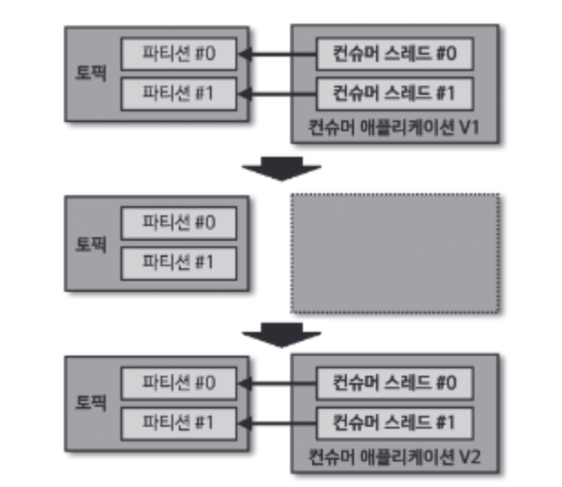

중단 배포를 사용하면 새로운 로직이 적용된 신규 애플리케이션의 실행 전후를 명확하게 특정 오프셋 지점으로 나눌 수 있다는 점이 장점이다.

## 10.2 무중단 배포

### 10.2.1 블루/그린 배포

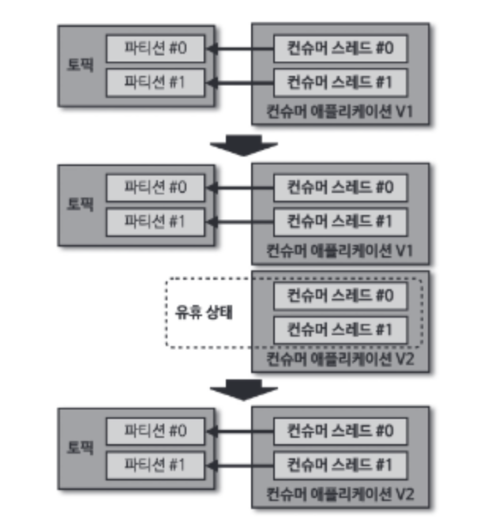

이 방법은 **파티션 개수와 컨슈머 개수를 동일하게 실행하는 애플 리케이션일 때 유용**하다. 새로운 컨슈머가 곧바로 파티션을 할당받는 게 아니라 유휴 상태가 되기 때문이다. 그렇지 않다면 일부 파티션은 기존 애플리케이션에, 일부 파티션은 신규 애플리케이션에 할당되어 뒤섞인다.

블루/그린 배포는 **리밸런싱이 한번만 발생**하기 때문에 많은 수의 파티션을 운영하는 경우에도 **짧은 리밸런스 시간으로 배포를 수행**할 수 있다.

### 10.2.2 롤링 배포

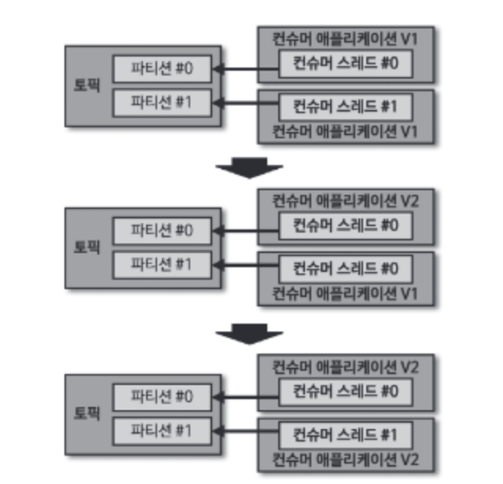

롤링 배포는 인스턴스 할당과 반환으로 인한 리소스 낭비를 줄일 수 있다. 하지만 리밸런싱 시간이 길어진다.

### 10.2.3 카나리 배포

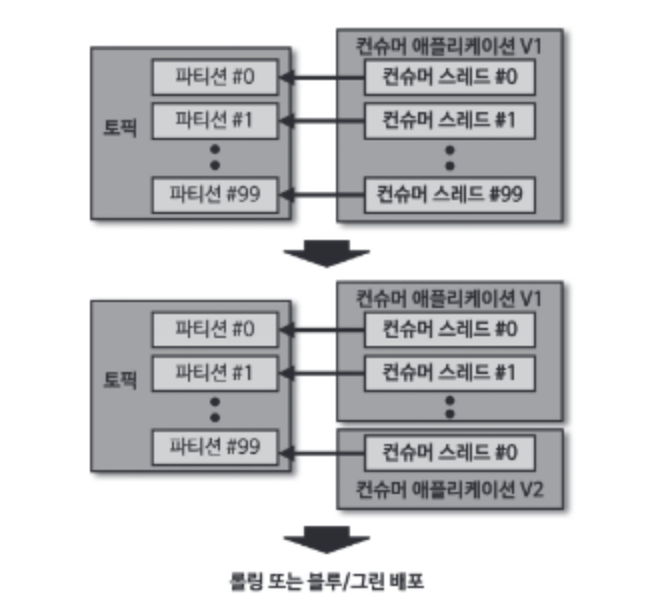

100개의 파티션이 있다면 1개의 파티션에 컨슈머를 따로 배정하여 우선적으로 신규 버전을 처리한다. 그리고 나머지는 롤링 또는 불루/그린 배포로 무중단 배포를 수행한다.


<Footer />