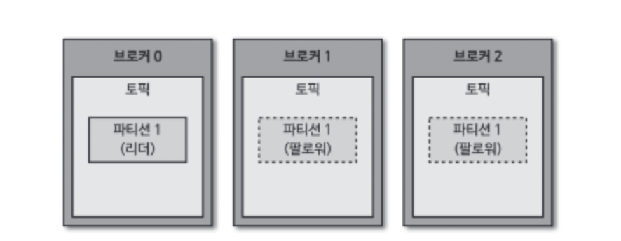
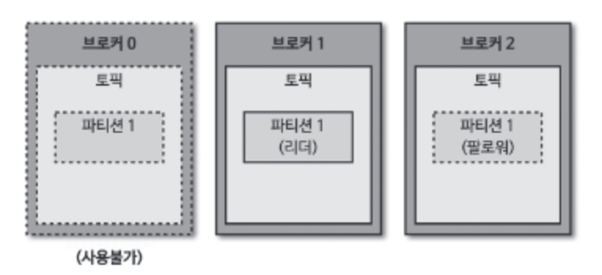

카프카는 이벤트, 디커플링 키워드에서 다재다능하게 사용된다. 특히 카프카를 설명할 수 있는 단어는 '안정적인 운영'과 '빠른 확장성'이다. 이러한 특성때문에 의외로 스타트업에서 많이 사용된다. 빠른 성장 속에서도 데이터 관련 작업을 안정적으로 할 수 있기 때문이다. 스타트업 개발자든, 대기업 개발자든 카프카는 이제 필수이다.

<description />

> [!NOTE]  
> 책 전체가 아닌 필요한 부분만 정리함

# 1. 카프카가 데이터를 저장하는 방법

카프카는 프로듀서에게 데이터를 전달받아 파티션에 데이터를 저장한다. 이때 전달받은 데이터는 파일 시스템에 저장된다.

파일은 config/server.properties 의 log.dir 옵션에 정의한 디렉토리에 저장된다. 그리고 토픽이름과 파티션 번호의 조합으로 하위 디렉토리를 생성하여 데이터를 저장한다.

```
tmp/
 ㄴ kafka-logs/
    ㄴ hello.kafka-1/
       ㄴ 00000000000000000000.index
       ㄴ 00000000000000000000.log
       ㄴ 00000000000000000000.timeindex
       ㄴ partition.metadata
       ㄴ leader-epoch-checkpoint
    ㄴ hello.kafka-2/
       ㄴ ...
       ㄴ ...
    ㄴ hello.kafka-3/
       ㄴ ...
       ㄴ ...
```

- index : 메시지의 오프셋을 인덱싱한 정보를 담은 파일
- log : 메시지와 메타데이터
- timeindex : 메시지에 포함된 timestamp 값을 기준으로 인덕싱한 정보가 담겨있음

## 1.1 파일에 저장하면 느리지 않을까?

카프카는 데이터를 메모리나 데이터베이스에 저장하지 않고 파일에 직접 저장한다. 하지만 파일 입출력으로 인한 속도 이슈가 발생하지 않는다.

그 이유는 **페이지 캐시를 사용하여 디스크 입출력 속도를 높였기 때문**이다. 페이지 캐시란 OS 에서 파일 입출력의 성능 향상을 위해 만들어 놓은 메모리 영역이다. 한번 읽은 파일의 내용은 메모리의 페이지 캐시에 저장되고, 추후 동일한 파일의 접근이 일어나면 디스크에서 읽지 않고 메모리에서 직접 읽는다.

## 1.2 데이터 복제

카프카는 데이터를 다른 브로커에도 저장하여 장애에 대응한다. 카프카의 복제는 파티션 단위로 이루어진다. 같은 토픽의 파티션이라도 리 브로커가 다를 수 있다.



복제된 파티션은 리더와 팔로워로 구성된다. 팔로워 파티션은 리더 파티션과 오프셋이 차이날 경우 데이터를 가져온다. (복제, replication)

만약 리더 파티션을 가진 브로커에서 장애가 발생하면 팔로워 파티션 중 하나가 리더 파티션 지위를 넘겨받는다.



## 1.3 데이터 삭제

카프카는 파일 단위(세그먼트)로 삭제가 이루어진다. 그리고 오직 브로커만 파일을 삭제할 수 있고 컨슈머나 프로듀서에서는 삭제할 수 없다.

세그먼트는 log.segment.bytes 또는 log.segment.ms 옵션값을 통해 닫힌다. 기본값은 1GB 이다.

닫힌 세그먼트 파일은 log.retention.bytes 또는 log.retention.ms 옵션의 설정값으로 체크되어 삭제된다.

# 2. 프로듀서의 파티션 결정

KafkaProcducer 가 send() 메서드를 호출하면 ProducerRecord 는 어느 파티션으로 전송될 것인지 결정된다. UniformStickyPartitioner 와 RoundRobinPartitioner 가 있는데 기본적으로 UniformStickyPartitioner 로 지정된다. 

> 메시지 키가 있을 때는 메시지 키 값에 따라 전송됨

- UniformStickyPartitioner : 어큐뮬레이터에서 데이터가 배치로 모두 묶일 떄까지 기다렸다가 배치로 묶인 데이터는 모두 동일한 파티션에 전송
- RoundRobinPartitioner : 파티션을 순회하면서 전송

될 수 있으면 많은 데이터가 배치로 묶여 전송되어야 성능 향상을 기대할 수 있다.

# 3. 컨슈머의 오프셋 커밋

일부 컨슈머에서 장애가 발생하면 해당 컨슈머에게 할당된 파티션은 다른 컨슈머에게 "리밸런싱"된다. 이는 새로운 컨슈머가 추가돼도 마찬가지이다. 그룹 조정자(group coordinator)는 리밸런싱을 발동시키는 역할을 하는데, 카프카 브로커 중 한 대가 그룹 조정자 역할을 한다.

컨슈머는 카프카 브로커로부터 데이터를 어디까지 가져갔는지 오프셋 기록을 커밋(commit)을 통해 기록하는데, 이는 브로커 내부의 토픽(_consumer_offsets)에 기록된다. 기록이 정상적으로 되지 않는다면 데이터가 중복 처리될 수 있다.

커밋은 명시적, 비명시적으로 할 수 있다. 기본값은 비명시적으로, 다음 설정으로 이루어진다.

- enable.auto.commit=true : 오토 커밋(비명시적)
- auto.commit.interval.ms=1000 : 1초마다 커밋

하지만 비명시적으로 이루어지면 컨슈머 강제 종료 발생 시 컨슈머가 처리하는 데이터가 중복될 수 있다. 명시적으로 오프셋을 커밋하려면 poll() 메서드 호출 이후 데이터 처리가 완료되면 commitSync() 나 commitASync() 메서드를 호출하면 된다.

## 3.1 컨슈머의 poll()

컨슈머는 poll() 메서드로 레코드를 반환받지만 poll() 호출 시점에 가져오는 게 아니다. 컨슈머 애플리케이션 내부의 Fetcher 인스턴스가 poll() 인스턴스를 호출하기 전에 미리 레코드를 내부 큐로 가져온다. 이후 사용자가 명시적으로 poll() 메서드를 호출하면 컨슈머는 내부 큐에 있는 레코드들을 반환받는다.

## 3.2 auto.offset.reset 옵션

- latest : 가장 높은(최근의) 오프셋부터 읽음
- earliest : 가장 낮은(오래전) 오프셋부터 읽음
- none : 커밋기록이 있으면 기존 커밋 이후로 소비, 없으면 오류 반환

## 3.3 리밸런싱 전에 커밋하기

리밸런싱이 발생하면 ConsumerRebalnceListener 인터페이스로 해당 이벤트를 수신할 수 있다. 이중 onPartitionRevoked() 가 리밸런스가 시작되기 직전에 호출되는 메서드이므로 해당 메서드 안에서 커밋을 구현하면 된다.

## 3.4 컨슈머의 안전한 종료

컨슈머가 정상적으로 종료되지 않으면 세션 타임아웃이 발생할 때까지 컨슈머 그룹에 좀비처럼 남아있다. 좀비 컨슈머 때문에 해당 컨슈머에 배정된 파티션이 정상적으로 소모되지 못한다.

KafkaConsumer 는 wakeup() 메서드를 지원한다. wakeup() 메서드 이후에 poll() 메서드가 호출되면 WakeupException 예외가 발생하고, finally 에서 이후 close() 로 자원을 해제하면 된다.

