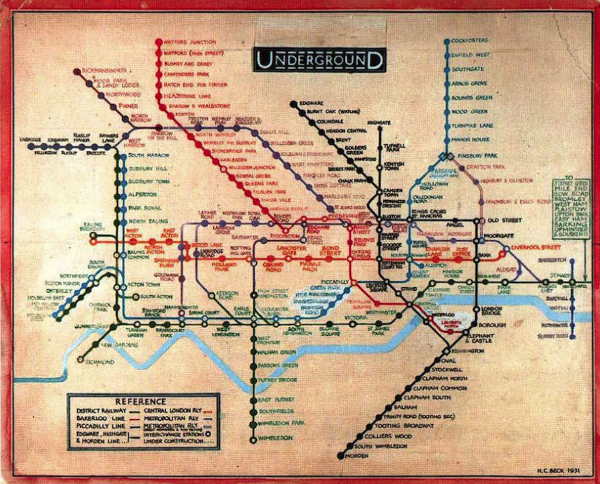

<Header />

'객체지향'이 중요하는 점은 알고있지만 '객체지향'이 뭔지 설명해보라고 하면 한두 줄 설명하다가 막힌다. 면접을 위해서 줄줄 외는 객체지향이 아니라 '객체'에 대해 깊게 공부하고 싶었다. 이 책은 역할, 책임, 협력을 통해서 객체와 객체지향을 설명하고 있다. 그리고 객체지향에 대한 여러 오해들을 바로 잡고 있다.

<description />

# 협력하는 객체

객체는 역할과 책임을 수행하며 협력한다. 역할은 책임이라는 개념을 내포한다. 역할과 책임은 협력을 원활하게 하는 필수요소이다. 역할의 주요 개념은 다음과 같다.

- 여러 객체가 동일한 역할을 수행할 수 있다.
- 역할은 대체 가능성을 의미한다. 객체가 수행하고 있는 역할을 다른 객체가 대체할 수 있다.
- 책임을 수행하는 방법은 객체마다 자율적으로 정한다.

## 협력 속의 객체

**객체는 협력에 참여하는 주체이다.** 객체는 충분히 협력적이어야 하고, 자율적이어야 한다. 다른 객체의 요청을 충실히 이행하면서 행동을 스스로 결정하고 책임진다. 객체지향을 간략히 정리하면 다음과 같다. (p. 35)

- 객체지향이란 시스템을 상호작용하는 **자율적인 객체들의 공동체**를 바라보고 객체를 이용해 시스템을 분할하는 방법이다.
- 자율적인 객체란 **상태**와 **행위**를 함께 지니며 스스로 자기 자신을 책임지는 객체를 의미한다.
- 객체는 시스템의 행위를 구현하기 위해 다른 객체와 **협력**한다. 각 객체는 협력 내에서 정해진 **역할**을 수행하며 역할은 관련된 **책임**의 집합이다.
- 객체는 다른 객체와 협력하기 위해 메시지를 전송하고, **메시지**를 수신한 객체는 메시지를 처리하는 데 적합한 **메서드**를 자율적으로 선택한다.

## 객체지향이 클래스 지향이라는 오해

나도 그렇고, "객체를 만든다"와 "클래스를 설계한다"를 똑같이 봤었다. 하지만 객체 지향과 클래스 지향은 엄연히 다르다. 클래스는 객체들의 협력관계를 코드로 옮기는 도구일 뿐이다. 예를 들어 자바스크립트는 프로토타입 기반의 객체지향언어이기 때문에 오직 객체만 있다. 객체 지향의 핵심은 클래스가 아니라 적절한 책임을 수행하는 역할 간의 유연하고 견고한 협력 관계이다.

# 객체는 상태, 행동, 식별자이다.

객체는 상태, 행동, 식별자의 조합으로 이루어져있다. 소프트웨어 안에서 객체는 저장된 상태와 실행 가능한 코드를 통해 구현된다. (p 47)

## 상태

상태를 변화시키는 건 "행동"이며 행동의 결과는 상태에 의존적이다. 예를 들어 "우유" 객체에 "용량" 상태가 있다고 하자. (현재 1L). "한 모금(0.1L)을 마신다"라는 행동의 결과는 0.9L 의 상태값이다. 그리고 같은 행동("마신다")을 반복하더라도 결과는 0.8L 이 되므로 이전 결과와 같지 않다. 행동의 결과가 상태에 의존적이기 때문이다.

상태는 "단순한 값"과 다른 객체를 참조하는 "링크"로 구분할 수 있다. 링크는 객체와 객체 사이의 의미있는 연결을 뜻한다. (사람이 우유를 가지고 있다는 것처럼)

## 행동

객체가 취하는 행동은 자신의 상태를 변화시킨다. 행동의 결과는 상태에 의존적이다(위에서 우유를 마시는 예시처럼). **행동**이란 외부으 요청 또는 수신된 메시지에 응답하기 위해 동작하고 반응하는 활동이다. 행동의 결과로 객체는 자신의 상태를 변경하거나 다른 객체에게 메시지를 전달할 수 있다. 객체는 행동을 통 다른 객체와의 협력에 참여하므로 행동은 외부에 가시적이어야 한다.

## 캡슐화

객체는 상태를 캡슐 안에 감춰둔 채 행동만 노출한다. 객체의 상태를 변경할지 여부는 객체 스스로 결정한다. 이는 결과적으로 객체의 자율성을 높이고 협력이 유연하고 간결해진다.

## 식별자

객체란 식별 가능한 경계를 가진 모든 사물을 의미하는데, 이 특징을 가진 프로퍼티를 **식별자**라고 한다. **"값"과 "객체"의 가장 큰 차이점은 식별자 여부이다.** 값은 숫자, 문자열, 금액, 시간 등 변하지 않는 것을 모델링한다. 두 인스턴스의 상태가 똑같다면 같은 인스턴스로 판단한다. 이를 동등성 비교라고 한다. (*변하지 않는 것이라는 뜻은, 객체의 프로퍼티를 변경해도 값 자체가 변하는 게 아니라 다른 값으로 대체된다는 것을 의미하는 것 같다.*)

객체는 시간에 따라 변경되는 상태를 포함하며 두 객체의 상태가 같더라도 독립적인 객체로 다뤄야 한다. 하지만 상태에 무관하게 식별자를 통해 두 객체가 같은지 판단할 수 있는데 이를 동일성이라고 한다.

## "행동이 상태를 결정한다." - 상태를 먼저 결정하는 오류

객체를 설계할 때 상태를 먼저 결정하고 행동을 나중에 결정하는 방법은 설계에 나쁜 영향을 미친다. (*객체의 인터페이스, API 를 먼저 고민해야 한다. 부트캠프에선 멘토들도 항상 상태를 먼저 정의했었다.*) 그 이유는 다음과 같다.

1. 상태를 먼저 결정할 경우 상태가 객체 내부로 깔끔하게 캡슐화되지 못하고 공용 인터페이스에 그대로 노출될 수 있다.
2. 객체를 협력자가 아닌 고립된 섬으로 만든다. 상태를 먼저 고려하면 협력이라는 문맥에서 벗어난다.
3. 상태에 초점을 맞추면 다양한 협력에 참여하기 어려워 재사용성이 저하된다.

객체 지향 설계는 애플리케이션에 필요한 협력을 생각하고, 협력에 참여하는데 필요한 행동을 생각한 후, 행동을 수행할 객체를 선택하는 방식으로 수행된다. 행동을 결정한 후에야 행동에 필요한 정보인 상태가 결정된다.

(*나도 최근들어 인터페이스로 메서드를 정의하고 클래스를 설계하는 게 더 깔끔하게 설계되는 것 같은 느낌을 받았다. 책을 읽어보니 이러한 이유였던 것 같다.*)

## 오해 : 객체지향은 현실 세계의 모방이다?

제일 많이 듣는 얘기다. 하지만 소프트웨어 속 객체는 현실 세계와 다르다. 소프트웨어 속 객체는 현실 객체가 가지지 못한 추가 능력을 보유한다. 예를 들어, 현실 세계에서 우유는 스스로 자신의 상태(용량)을 변화시킬 수 없다. 하지만 소프트웨어 속 객체 지향 세계에서는 우유는 스스로의 상태를 자율적으로 결정한다. 이처럼 소프트웨어 세계는 어떤 일이라도 가능하다. 이런 특징을 "**의인화**"라고 한다.

그렇다고 현실세계와 소프트웨어의 객체가 완전히 다른 건 아니다. 소프트웨어 내 객체는 현실 속 객체의 "**은유**라고 할 수 있다. 은유 관계에 있으면 소프트웨어의 객체에 대한 역할을 쉽게 이해할 수 있다. 객체를 "우유"라고 하면 "마신다", "채운다" 등이 가능할 것이라고 예상할 수 있으니 말이다.

# 추상화

> 핸리백의 지하철 노선도는 불필요한 지형 정보를 제거함으로써 단순함을 달성한 추상화의 훌륭한 예다.

객체 지향 패러다임은 객체라는 추상화를 통해 현실의 복잡성을 극복한다. 그리고 추상화의 개념을 이용하면 객체를 여러 그룹으로 '분류'할 수 있다. 분류는 각 객체별로 공통된 '개념'을 추출한 뒤 이루어진다. 즉, 개념은 공통점을 기반으로 객체를 분류하는 일종의 체라고 할 수 있다.

객체는 특정한 개념을 포현하는 그룹의 일원으로 포함된다. 객체에 어떤 개념을 적용하는 것이 가능해서 개념 그룹으 ㅣ일원이 될 때 객체를 그 개념의 '인스턴스'라고 한다. 따라서 객체를 다음과 같이 정의할 수 있다.

<u>"객체란 특정한 개념을 적용할 수 있는 구체적인 사물을 의미한다. 개념이 객체에 적용되었을 때 객체를 개념의 인스턴스라고 한다."</u>

## 객체의 세가지 관점

일반적으로 객체의 분류 장치로서 개념을 이야기할 때는 아래 세 가지 관점을 함께 언급한다.

- 심볼 : 개념을 가라키는 간략한 이름이나 명칭
- 내연 : 개념의 완전한 정의를 나타내며 내연의 의미를 이용해 객체가 개념에 속하는지 여부를 확인할 수 있다.
- 외연 : 개념에 속하는 모든 객체의 집합

하지만 이런 사실보다는 개념을 이용해 객체를 분류할 수 있다는 사실이 더 중요하다.

## 객체를 분류하기 위한 틀

''분류'란 특정 객체를 특정한 개념의 객체 집합에 포함시키거나 포함시키지 않는 작업을 의미한다. **분류는 객체지향의 가장 중요한 개념이다. 객체를 적절한 개념으로 분리하지 못하면 애플리케이션은 유지보수가 어려워지고 변화에 쉽게 대처하지 못한다.**

## 타입 - 타입에 대한 사실

1. 타입은 데이터가 어떻게 사용되냐에 관한 것이다.
2. 타입에 속한 데이터를 메모리에 어떻게 표현하는지는 외부에 철저하게 감춰진다. 개발자는 해당 데이터 타입이 어떤 형식으로 메모리에 저장되는지 알 필요가 없다.

객체지향을 사용할 때 객체를 일종의 데이터 타입처럼 사용한다. 물론, 그렇다고 객체가 데이터인 것은 아니다. 객체에서 중요한 건 행동을 통한 협력이기 때문이다. 따라서 '타입에 관한 사실'을 '객체의 타입'에 대입할 수 있다.

1. 어떤 객체가 어떤 타입에 속하는지 결정하는 건 객체가 수행하는 행동이다. 어떤 객체들이 동일한 행동을 수행할 수 있다면 그 객체들은 동일한 타입으로 분류할 수 있다.
2. 객체 내부의 표현은 감춰지고, 어떤 방식으로 표현되더라도 무방하다.

## 행동이 우선이다 - 다형성, 캡슐화

'객체의 타입'의 첫번째 조건에 따르면, 같은 역할로 분류할지는 그 객체들이 동일하게 행동하는지 확인해야 한다. 반대로 어떤 데이터를 가지고 있는지는 중요하지 않다. 같은 타입의 객체는 행동만 동일하면 서로 다른 데이터 타입을 가질 수 있다. 다만 내부 표현 방식이 달라지는데 이를 다형성이라고 한다. 다형성이란 동일한 응답에 대해 서로 다른 방식으로 응답할 수 있는 능력이다. 또한 행동만이 고려대상이기 때문에 데이터는 외부에 감춰져야 한다. 이를 캡슐화라고 한다.

## 타입의 목적

왜 타입을 사용하는가? 객체만 다루면 되지 않는가? 타입을 사용하는 이유는 인간의 인지능력으로는 사간에 따라 동적으로 변하는 객체의 복잡성을 극복하기 어렵기 때문이다. 타입은 시간에 따라 변하는 객체의 상태를 시간과 무관하게 정적인 모습으로 다룰 수 있게 해준다. 이런 관점에서 타입은 추상화이다.

객체지향 프로그래밍 언어에서 타입은 클래스로 구현된다. 하지만 둘은 같은 개념이 아니며, 타입을 구현하는 여러 메커니즘 중 하나일 뿐이다. 클래스는 타입의 용도 외에도 코드를 재사용하는 목적으로도 사용되기 때문에 둘을 혼동하면 오해와 혼란이 생긴다. <u>"객체를 분류하는 기준은 타입이며 타입을 나누는 기준은 객체가 수행하는 행동"이다.</u>

# 역할, 책임, 협력

"개별적인 객체의 행동이나 상태가 아니라 객체들 간의 협력에 집중해라"

## 책임

각 객체는 어떤 요청에 대해 대답해 줄 수 있거나 적절한 행동을 할 의무가 있을 때 해당 객체가 **"책임"**을 가진다고 말한다. 객체의 책임은 무엇을 알고 있는가(knowing)와 무엇을 할 수 있는가?(doing)로 구성된다.

객체 지향 설계는 적절한 객체에게 이러한 적절한 책임을 할당하는 데 있다. 객체의 책임을 이야기할 때는 외부에서 접근 가능한 공용 서비스 관점에서 얘기되는데, 따라서 책임은 객체의 공용 인터페이스를 구성한다. 그리고 특정 객체에서 "메시지"를 보냄으로써 이 책임을 수행하게끔 한다.

## 역할

역할은 협력 내에서 다른 객체로 대체될 수 있음을 말한다. 역할의 개념으로 유사한 협력을 추상화해서 다양한 객체가 협력에 참여할 수 있게 된다. 이를 통해 협력이 좀 더 유연해지며 재사용성이 높아진다. 역할은 객체지향설계의 단순성, 유연성, 재사용성을 뒷받침하는 핵심개념이다.

<Footer />
