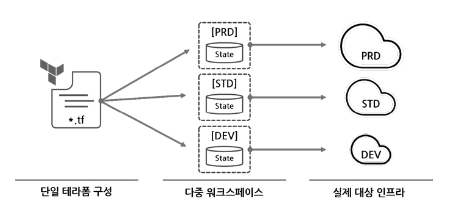

처음 AWS 를 배울 때 클라우드는 나에게 미지의 영역이었고 깊은 안개 속에 있었다. 그런 점에서 테라폼을 처음 접했을 때는 놀라웠다. 잘 작성된 tf 파일 하나면 aws 콘솔에 접근할 필요없이 몇 분이면 서버와 애플리케이션을 배포할 수 있다. 테라폼을 깊게 배워서 업무에 적용하고 싶다는 생각이 강하게 들었고 지금도 조금씩 배우며 적용하고 있다.

<description />

> [!NOTE]  
> 책 전체가 아닌 필요한(모르는) 부분만 정리함

# IaC 와 테라폼

IaC 도입의 긍정적인 측면은 다음과 같다.

- 속도와 효율성
- 버전 관리
- 협업
- 재사용성
- 기술의 자산화

# 기본 사용법

```terraform
resource "local_file" "abc" {
    content = "Hello, World!"
    filename = "${path.module}/hello.txt"
}
```

- 리소스 삭제 후 생성 (대체)
  - `terraform apply -replace=local_file.abc`
- 승인 절차 없는 apply
  - `terraform apply --auto-approve`
- lifecycle 종류
  - create_before_destory (bool) : 리소스 수정 시 신규 리소스를 우선 생성하고 기존 리소스 삭제
  - prevent_destroy (bool) : 해당 리소스를 삭제하려 할 때 명시적으로 거부(오류)
  - ignore_changes (list) : 리소스 요소에 선언된 인수의 변경사항을 테라폼 실행 시 무시
  - precondition : 리소스 요소에 선언된 인수의 조건을 검증
  - postcondition : Plan 과 Apply 이후의 결과를 속성 값으로 검증

## Variable

### validation

변수는 validation 으로 유효성을 검사할 수 있다. 중복으로 선언 가능하다.

```terraform
variable "image_id" {
  type        = string
  description = "The ID of the AMI to use for the instance"
  default     = "ami-0c55b159cbfafe1f0"

  validation {
    condition     = length(var.image_id) > 4
    error_message = "The image ID must be at least 4 characters long."
  }

  validation {
    condition     = can(regex("^ami-", var.image_id))
    error_message = "The image ID must start with 'ami-'."
  }
}
```

### 변수 우선 순위

숫자가 클수록 우선순위가 높음

1. 실행 후 입력 (변수에 값이 선언되지 않ㅇ나 cli 에서 입력)

2. variable 블록의  default 값

3. 환경변수 (TF_VAR_변수명)

4. terraform.tfvars 에 정의된 변수

5. *.auto.tfvars 에 정의된 변수

6. *.auto.tfvars.json 에 정의된 변수

7. CLI 실행 시 -var 인수 지정 또는 -var-file 지정

   - terraform plan -var="my_var=var" -var-file="var9.txt"

     ```
     //var9.txt
     my_var = "var9"  
     ```

## local

local 값은 외부에서 입력되지 않고 코드 내에서만 가공되고 동작한다. 선언된 모듈 내에서만 접근 가능하다.

```terraform
variable "prefix" {
    default = "hello"
}

locals {
    name = "terraform"
    content = "${var.prefix}-${local.name}"
}

resource "local_file" "local_file" {
    content = local.content
    filename = "${path.module}/hellolocal.txt"
}
```

## output

자바의 getter 와 비슷한 역할로 모듈의 인터페이스다. 출력 값의 용도는 다음과 같다.

- 루트 모듈에서 사용자가 확인하고 하는 특정 속성 출력
- 잣기 모듈의 특정 값을 정의하고 루트 모듈에서 결과를 참조
- 서로 다른 루트 모듈의 결과를 원격으로 읽기 위한 접근 요소

```terraform
resource "local_file" "abcd" {
    content = "hello"
    filename = "${path.module}/abcd.txt"
}

output "abcd_content" {
    value = local_file.abcd.content
}

output "abcd_abspath" {
    value = abspath(local_file.abcd.filename)
}

output "abcd_id" {
    value = local_file.abcd.id
}
```

## for

for 구문의 규칙

- list 는 반환 받는 값이 하나로 되어있으면 값을, 두 개인 경우 앞의 인수가 인덱스를 반환하고 뒤의 인수가 값을 반환 (관용적으로 i, v)
- map 유형은 반환받는 값이 하나로 되어있으면 키를, 두 개인 경우 앞의 인수가 키, 뒤의 인수가 값을 반환 (관용적으로 k, v)
- 결과 값은 for 문을 묶는 기회가 [ ] 인 경우 tuple 로 반환되고 { } 인 경우 object 형태로 반환
- object 형태의 경우 키 값에 대한 쌍은 => 기호로 구분
- { } 형식을 사용해 object 형태로 결과를 반환하는 경우 키 값은 고유해야 하므로 값 뒤에 그룹화 모드 심볼 (...)을 붙여서 키의 중복을 방지
- if 구문을 추가해 조건 부여 가능

```terraform
variable "names" {
    type = list(string)
    default = ["alice", "bob", "charlie"]
}

output "A_uuper_values" {
    value = [for v in var.names : upper(v)]
}

output "B_index_and_value" {
    value = [for i, v in var.names : "${i} : ${v}"]
}

output "C_make_object" {
    value = {for v in var.names : v => upper(v)}
}

output "D_with_filter" {
    value = {for v in var.names : v => upper(v) if v != "bob"}
}
  
variable "members" {
  type = map(object({
      role = string
      age = number
  }))
  default = {
      alice = {role = "admin", age = 20}
      bob = {role = "user", age = 25}
      charlie = {role = "user", age = 30}
  }
}

output "E_to_tuple" {
    value = [for k, v in var.members : "${k} : ${v.role}"]
}

output "F_get_only_role" {
    value = {
        for name, user in var.members : name => user.role
        if user.role == "admin"
    }
}
  
# output
A_uuper_values = [
  "ALICE",
  "BOB",
  "CHARLIE",
]
B_index_and_value = [
  "0 : alice",
  "1 : bob",
  "2 : charlie",
]
C_make_object = {
  "alice" = "ALICE"
  "bob" = "BOB"
  "charlie" = "CHARLIE"
}
D_with_filter = {
  "alice" = "ALICE"
  "charlie" = "CHARLIE"
}
E_to_tuple = [
"alice : admin",
"bob : user",
"charlie : user",
]
F_get_only_role = {
"alice" = "admin"
}
G_age = {
"admin" = [
  "alice",
]
"user" = [
    "bob",
    "charlie",
  ]
}
```

## 함수

`terraform console` 명령어로 함수의 동작을 콘솔로 테스트할 수 있다.

## 프로비저너

프로바이더로 실행되지 않는 커맨드와 파일 복사같은 역할을 수행한다. 종류로는 file, local-exec, remote-exec 가 있다.

## Moved

테라폼의 state 에서 리소스 주소의 이름이 변경되면 기존 리소스는 삭제되고 새로운 리소스가 생성된다. 하지만 리소스 이름을 변경하면서 프로비저닝된 환경을 그대로 유지하고자 하면 moved 블록을 사용하면 된다.

**기존 코드**

```terraform
resource "local_file" "moved_file" {
    content = "moved"
    filename = "${path.module}/moved.txt"
}

output "moved_file_content" {
    value = local_file.moved_file.content
}
```

**변경 코드**

```terraform
resource "local_file" "moved_file_b" {
    content = "moved"
    filename = "${path.module}/moved.txt"
}

moved {
    from = local_file.moved_file
    to = local_file.moved_file_b
}

output "moved_file_content" {
    value = local_file.moved_file_b.content
}
```

# 프로바이더

## 프로바이더의 다중 정의

동일한 프로바이더를 사용하지만 다른 조건을 갖는 경우 아래와 같이  alias 를 사용할 수 있다.

```terraform
provider "aws" {
    region = "us-east-1"
}

provider "aws" {
    alias = "seoul"
    region = "ap-northeast-2"
}

resource "aws_instance" "example" {
    provider = aws.seoul
    ami = "ami-0c55b159cbfafe1f0"
    instance_type = "t2.micro"
}
```

# State

## 워크스페이스

state 를 관리하는 논리적인 가상 공간이다. 테라폼 구성 파일은 동일하지만 작업자는 서로 다른 state 를 갖는 실제 대상을 프로비저닝할 수 있다.



terraform workspace list 로 워크스페이스의 목록을 볼 수 있다.

```
$ terraform workspace list
* default
```

아래 리소스를 배포하면 default 워크스페이스에 배포된다.

```terraform
resource "aws_instance" "example" {
    provider = aws.seoul
    ami = "ami-08d0e13d30abef253"
    instance_type = "t2.micro"
}
```

그리고 terraform workspace new <워크스페이스이름> 명령으로 새로운 워크스페이스를 생성한다.

```
$ terraform workspace new myworkspace1
```

새로운 워크스페이스가 생성되면 루트 모듈 디렉토리에 terraform.tfstate.d 디렉토리가 생성되고 하위에 myworkspace1 이 생긴다. 현재 사용 중인 워크스페이스는 show 로 확인할 수 있다.

```
$ terraform workspace show
myworkspace1
```

이 상태에서 plan, apply 는 새로운 리소스를 생성한다. 그리고 워크스페이스를 리소스 블록 내에서 읽을 수 있다. 아래는 workspace 가 default 일 때 5개, 아닐 때 1개만 배포하는 구성이다.

```terraform
resource "aws_instance" "example" {
    count = "${terraform.workspace == "default" ? 5: 1}"
    provider = aws.seoul
    ami = "ami-08d0e13d30abef253"
    instance_type = "t2.micro"
}
```

다시 워크스페이스를 변경하려면 아래와 같이 바꾼다.

```
$ terraform workspace select default
```

apply, plan 시점에서 state 를 지정하려면 아래와 같이 state 파일을 지정한다.

```
terraform destroy -state=terraform.tfstate.d/myworkspace1/terraform.tfstate
```

워크스페이스를 사용하는 장단점은 다음과 같다.

**장점**

- 하나의 루트 모듈에서 다른 환경을 위한 리소스를 동일한 테라폼 구성으로 프로비저닝하고 관리
- 기존 프로비저닝된 환경에 영향을 주지 않고 변경 사항 실험 가능
- 깃으 브랜치 전략처럼 동일한 구성에서 서로 다른 리소스 결과 관리

**단점**

- satte 가 동일한 저장소(로컬 또는 백엔드)에 저장되어 state 접근 권한 관리가 불가능
- 모든 환경이 동일한 리소스를 요구하지 않을 수 있으므로 테라폼 구성에 분기 처리가 다수 발생 가능
- 프로비저닝 대상에 대한 인증 요소를 완벽히 분리하기 어려움

