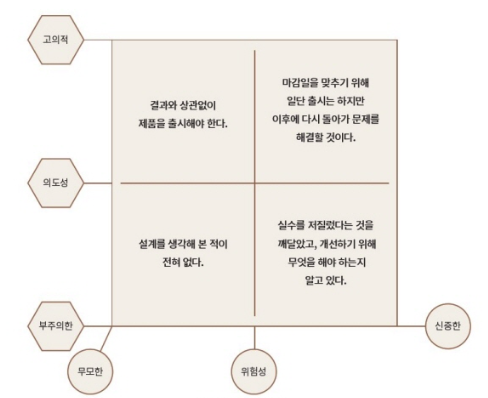

업무에 있어 기술부채라는 말만큼 마음이 무거운 건 없다. (내 기준이다.) 하지만 '부채'란 단어는 단순히 나쁘지만은 않다. 경제학적으로도 부채를 통해 레버리지 효과를 일으키고 더 많은 돈을 벌 수도 있다. 핵심은 부채를 인지하고 적절하게 활용하며, 상환을 어떻게 할지 계획적으로 행동하는 것이다. 기술부채도 물론 마찬가지다.

<description />

> "빚만큼 한 사람을 나락으로 떨어뜨리는 것도 없다"

기술부채는 처음엔 달콤하다. 개발 초기에는 이자가 적고 소프트웨어 변경은 쉽기 때문이다. 하지만 빚이 쌓여가고 소프트웨어가 커질 수록 기술 부채는 감당하기 어려워진다.

위 도표는 마틴 파울러의 기술부채 4분면이다. 마틴 파울러는 기술부채를 **위험성**과 **의도성**으로 구분했다. 당연히 신중하고 의도된 기술부채가 더 나을 것이다. 이러한 소프트웨어 개발의 부채는 관리할 수 있는 대상이며 반드시 측정에서 시작되어야 한다.

기술부채는 다음과 같은 종류가 있다.

- 요구사항 부채
- 설계 및 아키텍처 부채
- 구현 부채
- 테스트 부채
- 배포 부채
- 문서 부채
- 머신러닝 시스템의 기술 부채
- 팀 관리와 사회적 부채

# 기술부채의 중요성

기술부채가 무조건 나쁜 건 아니다. 고의로 만들어진 부채는 비즈니스 전략이기도 하다. 이런 부채를 잘 관리하면서 그 다음 버전에서 갚으면 된다. 핵심은 빚이 질 만한 가치가 있는 평가하는 것이다.

이런 빚을 해결할 때 가장 피해야하는 방식은 빅뱅 방식(문제해결을 위해 소프트웨어를 새로 만드는 일)이다. 그 대신 코드베이스가 가진 부채를 식별하고 부채를 지우기 위한 체계적 접근 방식, 즉 지불 계획을 세워야 한다.

# 요구사항 부채

요구사항 부채는 보통 요구사항 도출과 분석이 부적절하거나 제대로 수행되지 않을 때 발생한다. 만약 요구사항이 나중에 변경되면 그에 따라 설계를 업데이트해야 하는 불상사가 생긴다.

요구사항 부채는 두 가지 주요 유형이 있다.

1. 열악한 요구사항 엔지니어링 : 관련된 모든 이해 관계자와 대화하지 않은 채 요구사항을 도출해 질이 낮거나 잘못된 우선순위를 가짐
2. 요구사항에 대한 무지 : 고객의 필요에 대한 이해 부족으로 제품 기능구현을 잘못한 유형

## 요구사항 부채 관리

가치 흐름 접근 방식은 "왜 이 기능을 개발하고 있는가?" 라는 질문을 하는 것이다. 또한 대답뿐만 아니라 검증 가능한 증거(운영자 실수의 10% 가 줄어든다, 등)를 제시한다면 더욱 좋다. 요구사항은 고도로 훈련된 PM 이 도출하거나 고객과의 피드백에서 얻을 수 있다. 또한 요구사항은 정확하게, 충분히 기록되어야 한다.

# 설계 및 아키텍처 부채

*(이 챕터에서 설계의 부채는 의존성인 듯 하다)*

설계 부채를 일으키는 일반적인 원인은 다음과 같다.

- 잘못된 관심사의 분리 : 같은 클래스에 여러 책임이 구현
- 코드 복사와 재사용 : 코드 일부를 복사해서 가져와 사용
- 얽힌 의존성 : 아키텍처에 대해 딱히 생각하지 않은 상태에서 설계활동을 암묵적으로 진행
- 무계획적 발전 : 유지보수성이나 가독성, 변경 용이성을 생각하지 않은 채 즉각적이록 시급한 제품 기능 구현 및 버그 수정에 집중

## 설계 부채의 수치화

수치화를 위해 먼저 정적 의존성(파일 간 의존성), 파일 간 진화 의존성(두 개 파일이 함께 변경되어야 함)을 분석한다. 이를 통해 파일 간 연결성을 확인할 수 있다. 또한 이슈, 커밋 등으로 함께 변경된 파일을 알 수 있다.

## 수집된 정보 분석

분석을 통해, 예를 들어 파일 간 연결성을 통해 순환 의존을 발견하거나 ISP 원칙을 위반하는 구조를 찾아낼 수도 있다. 이러한 의존(부채)는 순환되는 기능을 다른 클래스로 옮김으로써 해결할 수도 있다.

# 구현 부채

> "코드는 유머와 같다. 굳이 설명할 필요없이 한 번에 이해돼야 한다."

## 기술부채 식별하기

- **코딩스타일**
  - 코딩스타일은 구문적 측면(탭, 포맷팅 등)과 의미론적 측면(코드가 일관성이 있어야 함)을 고려할 수 있다. 두 경우 모두 특정 코드 규칙을 따르는 것이다.
- **비효율적인 코드**
  - 예를 들어, 문자열을 for 문으로 1000번 더하는 것과 같은 매우 비효율적인 코드를 말한다.
- **오래됐거나 안전하지 않은 함수 또는 프레임워크 사용**
- **코드복사**
  - 개발자는 코드 복사로 문제를 빠르게 수정할 수 있지만 결국 스파게티 코드를 만들 뿐이다. 복사된 코드가 여러 곳에 산재해있으면 수정이 필요할 때 모든 파일을 조사하고 수정해야 한다.

## 구현 부채 관리하기

코드분석기를 활용하거나 취약점 스캐너를 활용한다. 또한 코딩 컨벤션을 정의하고 문서화하는 것으로 관리할 수 있다.

## 구현 부채 피하기

구현 부채를 피하는 방법은 아래와 같다.

- 효과적인 코드리뷰
  - 기본 검사 자동화 : 정적분석기 활용
  - 변경 하나를 두명에서 리뷰
  - 코드 변경 범위의 제한 (몇 분만에 리뷰가 가능하도록 100줄 미만 변경)
  - 커밋 메시지 형식 정리
    - 변경사항을 간결하게 담은 한줄짜리 설명
    - 변경된 사항, 이 변경사항이 도입된 이유, 수행된 접근 방식을 담은 자세한 설명
    - 이슈 트래커에서 참조할 수 있는 이슈
    - 이 변경사항이 어떻게 테스트되었는지
    - 어떤 문서가 추가되었는지
  - 자동화된 빌드와 병합 전 테스트
- 코드베이스에서 지표 수집, 분석 : 코드 인스터리, 코드 클라이메이트

# 테스트 부채

## 테스트는 어떻게 기술 부채와 연관되는가?

테스트에서 발생하는 기술 부채의 원인

- 불충분한 테스트 : 필요한 기능이나 모듈조차 충분한 테스트가 되지 않음
- 잘못된 것을 테스트 : 잠재적 영향이 거의 없는 것을 테스트
- 불필요한 테스트 : 이미 알고 있는 것을 테스트, 알려지지 않은 버그가 있을 수 있는 영역을 테스트해야 함
- 신뢰할 수 없고 불안정한 테스트
- happy case 만 테스트
- 사양이나 문서와 일치하지 않는 테스트

이러한 테스트가 부족하면 민첩성이 떨어질 수밖에 없다.

## 테스트 활동 관리하기

코드 커버리지 분석으로 테스트에서 어떤 코드가 실행됐는지 확인한다. 코드 커버리지는 테스트 중에 코드 경로가 실행되고 있음을 보고 잠재적인 데드코드와 테스트되지 않은 코드 빈틈을 감지한다. 보통 안전 필수 시스템을 제외하고는 75% 이상의 구문 커버리지를 목표로 한다.

## 테스트 부채 피하기

1. 테스트 주도 개발 채택
2. 테스트 실행의 유지와 분석
   - 테스트 지표를 구현하고 시간이 지남에 따라 개선되는지 확인한다. 테스트 수와 커버리지로 측정할 수 있다. 또한 해피케이스뿐만 아니라 엣지케이스, 실패 케이스도 측정해야 한다.
3. 테스트 자동화
   - 코드 리뷰를 위해 코드 변경을 제출할 때
   - 변경된 코드가 프로덕션 브랜치에 병합될 때
4. 수동테스트 피하기

# 문서 부채

> "문서는 미래의 자신에게 쓰는 러브레터다"

## 효과적인 문서화를 위한 원칙

1. 독자를 위해 써라
   - 문서의 독자가 누군지 파악하고 써야 한다. 문서화에는 분석, 구축, 교육의 목적이 있기 때문에 이 문서의 독자가 어떤 목적으로 읽는지 파악해야 한다.
2. 반복하지 말라
   - 문서 내용이 반복되면 피로가 증가하고 수정이 힘들어진다.
3. 모호함을 피해라
   - 문서를 쓸 때는 명확히 써서 모호함을 제거해야 한다.
4. 정리 형식을 사용하라
   - 문서를 작성할 때 표준 조직 구조를 사용해 필요한 정보를 쉽게 찾을 수 있어야 한다. 특정 알고리즘이 선택된 이유 등 코딩 결정은 소스코드에 넣고 설계 근거, 협업 프로세스, 코딩 가이드라인 등을 설명하는 문서는 텍스트 파일 세트에 넣을 수 있다.
5. 결정을 내린 근거를 기록하라
6. 문서를 최신 상태로, 하지만 너무 최신은 아니게 유지하라
7. 문서 적합성을 리뷰하라

## 문서 부채 식별하기

아래는 문서 부채가 발생하고 있다는 몇 개의 증상이다.

1. 질문에 리드 개발자가 대답
2. 스스로 자책하기 시작 : 몇 주전 코드임에도 무슨 생각을 하면서 쓴 코드인지 이해 못함
3. 불필요한 문서
4. 문서의 노후화

### 문서화해야 하는 내용

| 산출물 | 문서화 난이도 | 변화속도 | 문서화 중요성 |
| ------ | ------------- | -------- | ------------- |
| 코드   | 쉬움          | 일정함   | 중간          |
| 테스트 | 중간          | 빠름     | 낮음          |
| 설계   | 어려움        | 중간     | 높음          |
| UI     | 쉬움          | 빠름     | 낮음          |

물론 문서화가 예상한 이점을 제공하지 않는다면 애써서 하지 않아도 된다.

## 문서부채 관리하기

1. 코드를 작성하면서 문서화도 함께 진행해야 한다. 
   - 코드 안에 문서가 없다면 코드 리뷰 때 승인할 수 없고, 다시 말해 승인된 코드란 문서도 승인되었음을 의미한다. 문서는 코드와 함께 버전관리된다. 이런 문서는 /src 와 같은 레벨의 /doc 에 둘 수 있다.
2. 코드, 테스트, 문서를 함께 작성
   - 테스트 작성은 문서화에 도움이 되고 특히 BDD 개발은 테스트가 하나의 문서 역할을 한다.

## 문서 부채 피하기

문서화에 드는 비용보다 더 많은 이점이 있다고 생각되는 것만 문서화한다. 이런 문서가 무엇인지 확인하는 두 가지 접근 방식이 있다.

1. 추적성
   - 추적성은 요구사항에서 소스코드 커밋까지 일련의 흐름을 파악해 낼 수 있다는 개념이다. 문서를 통해서 제품의 기능과 코드 간의 연결을 확인할 수 있게 된다.
2. 출시 프로세스의 일부로서의 문서 품질 확인
   - 문서에게도 측정가능한 지표를 넣어야 한다. 문서 린터를 사용해 데드링크, 구문 요류를 확인하고 문제를 확인할 수 있다. 또한 문서의 수명, 문서화 커버리지를 확인해야 한다.

# 마무리

배포 부채, 머신러닝 시스템의 기술 부채, 팀 관리와 사회적 부채는 따로 정리하지는 않았다. 나는 "기술 부채"라고 했을 때 막연히 코드가 더럽거나 오래된 기술을 사용하는 것으로 이해하고 있었다. 하지만 기술 부채는 소프트웨어 개발과정의 다방면에서 사용되고 있었고, 반면에 단순히 "오래된"이라는 키워드로 부채를 판단할 수 없다고 생각했다.  부채란 비즈니스를 발전시키고 확장하는 데 걸림돌이 되는 모든 것을 말한다. 오래된 기술이라도 비즈니스 요구사항에 부합한다면 부채라고 할 수 없을 것이다.