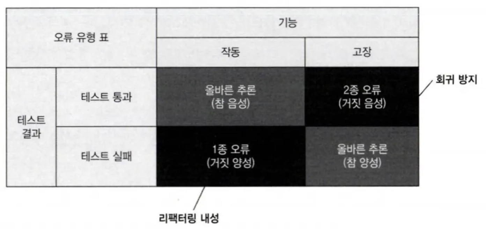
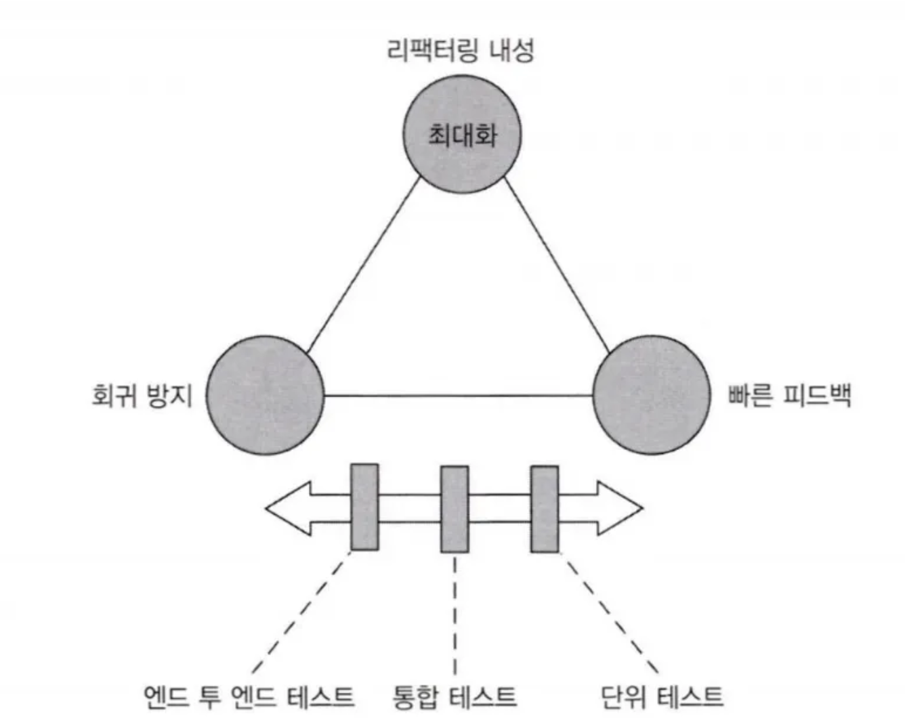
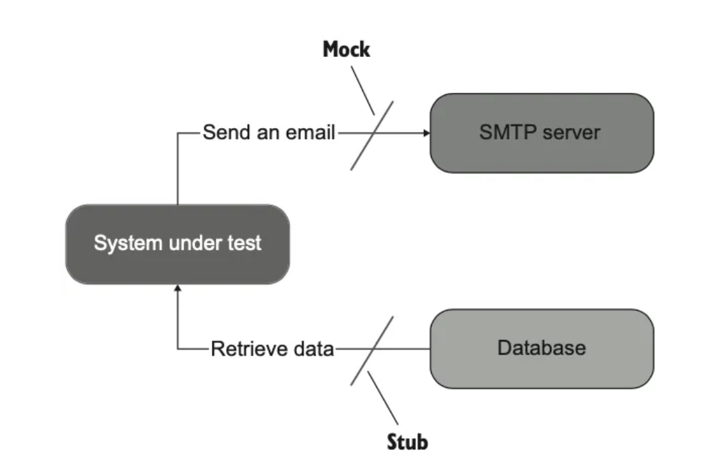
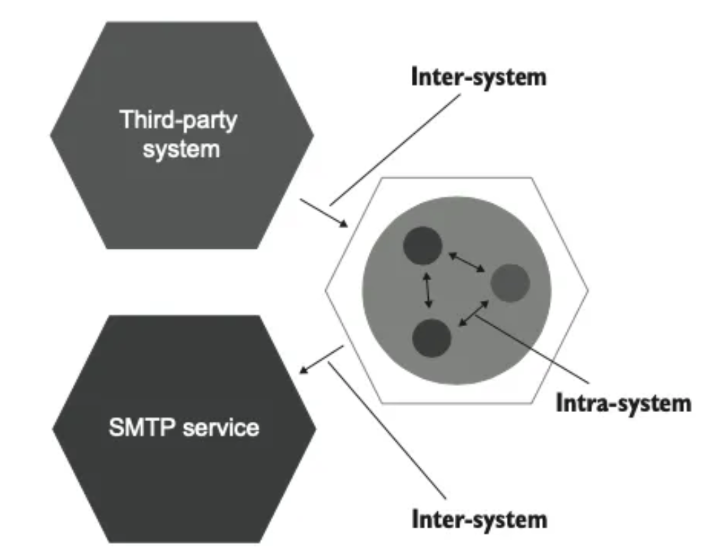
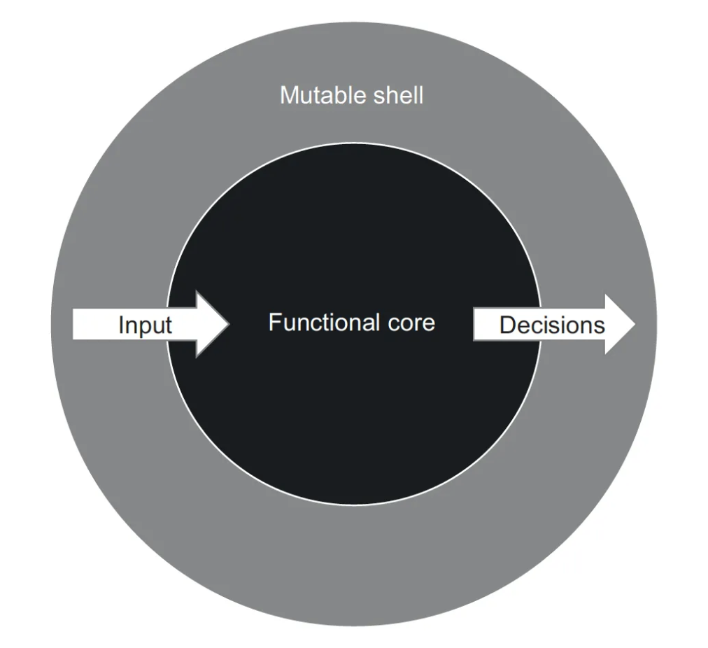
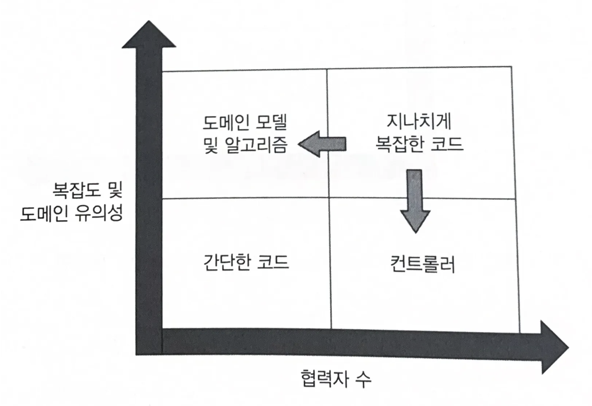
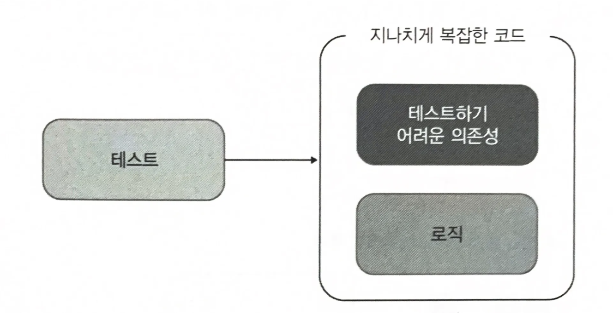
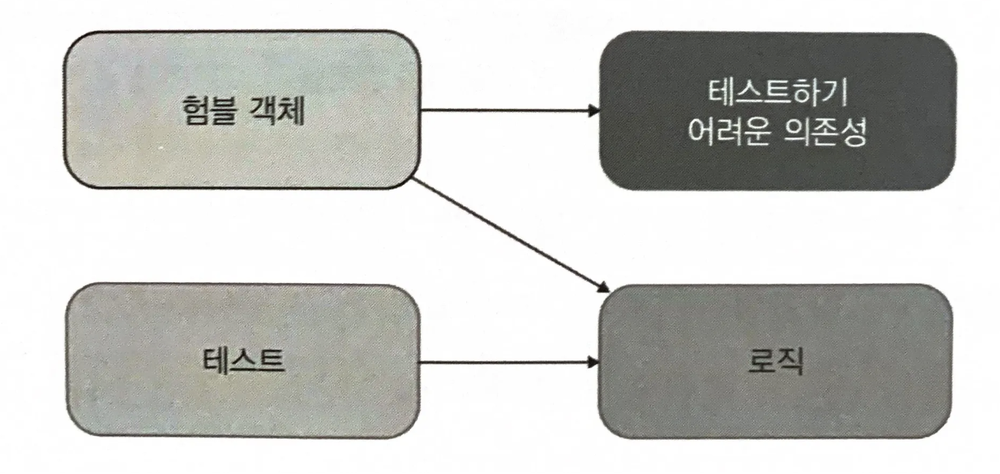
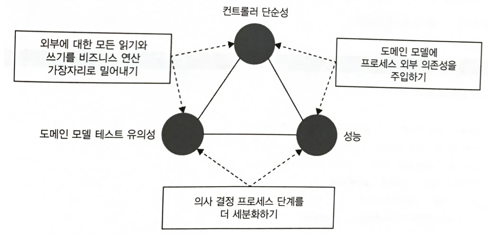

<Header/>

단위 테스트는 소프트웨어의 지속적인 성장을 위해 반드시 필요하다. 하지만 코드로 작성할 줄만 알지, 방법론은 많이 부족하다. 이 책은 테스트에 있어서 이론적인 측면과 실무적인 측면을 동시에 채워준다.

<description />

# 단위테스트

단위 테스트는 다음 세 가지 속성을 포함한다.

- 작은 코드 조각을 검증하고,
- 빠르게 수행하고,
- 격리된 방식으로 처리하는 자동화된 테스트

이 중 3번째의 속성을 다룰 때 테스트의 고전파와 런던파가 구분된다.

## 고전파와 런던파

고전파와 런던파는 주로 테스트 간 의존성 처리에 관한 두 분파다. 의존성의 종류는 아래와 같다.

| 의존성                              | 특성 | 종류 | 모킹 |
| ----------------------------------- | ---- | ---- | ---- |
| 공유 의존성                         | 테스트 간 공유되고 서로의 결과에 영향을 미칠 수 있는 수단을 제공하는 의존성 | 정적 가변 필드, 데이터베이스나 파일시스템 등 | 고전파, 런던파 |
| 비공개 의존성                       | 공유하지 않는 의존성. 변경 가능한 의존성과 값 객체가 있다. |      | - |
| 비공개 의존성 -> 변경 가능한 의존성 | 시간에 따라 변할 수 있는 내부 상태가 포함된 의존성 | 객체 | 런던파 |
| 비공개 의존성 -> 값 객체        | 불변 인스턴스 | enum 값, 값 객체 | - |


**고전파**

고전파는 테스트 대상 시스템(SUT)의 협력자를 운영용 인스턴스로 사용한다. 고전파는 테스트가 서로간 격리가 되어 있으면, 여러 클래스가 모두 메모리에 상주하고 공유 상태에 도달하지 않는 한 격리되었다고 본다. 고전파에서 모킹 대상은 공유 의존성(데이터베이스, 파일 시스템 등)일 뿐이다.

**런던파**

런던파는 SUT 의 협력자를 모킹하여 사용한다. 런던파는 작은 코드 조각을 단일 클래스 또는 해당 클래스 내의 메서드로 본다. 따라서 런던파에서는 공유 의존성뿐만 아니라, 상태 변경이 가능한 모든 의존성을 모킹한다.

### 고전파와 런던파 비교

고전파 스타일에서는 시스템에 버그가 생기면 SUT 에 버그가 포함된 테스트뿐만 아니라 오작동하는 클랫를 참조하는 클라이언트를 대상으로 하는 테스트도 실패할 수 있다. 이는 우려할 만한 일이지만 테스트를 정기적으로 실행하면 수정사항으로부터 버그의 원인을 알아낼 수 있다. 그리고 해당 수정사항에서 버그를 찾는 다면 모든 테스트를 볼 필요는 없고 다른 테스트는 자동으로 고쳐진다.

또한 런던파의 테스트 대상 클래스에 대한 초점이 잘못되었다. 테스트는 코드 단위가 아니라 동작 단위를 검증해야 한다. 그리고 런던파 테스트의 가정 큰 문제는 **SUT 세부 구현이 테스트에 결합되어 있다는 점**이다. 모킹을 하려면 SUT 의 세부 구현 사항을 모두 녹여내야 한다. 이때 세부 구현이 변경된다면 SUT 의 출력된 결과값이 달라지지 않더라도 테스트가 깨지는 거짓양성이 발생한다.

# 코드 커버리지 지표와 성공적인 테스트 스위트

코드 커버리지는 테스트로 실행된 코드 라인 수와 제품 코드베이스의 전체 라인 수의 비율을 나타낸다. 하지만 커버리지 지표에 의존한다면 몇가지 문제점이 있다.

- 테스트 대상 시스템의 모든 가능한 결과를 검증한다고 보장할 수 없다.
  - 메서드에는 명시적인 결과와 속성에 새로운 값을 쓰는 암묵적 결과가 있을 수 있다. 암묵적 결과는 검증하지 않더라도 커버리지 지표가 낮아지지 않는다.
  - 검증이 전혀 없는 테스트도 있다. 반환하는 값을 assert 문으로 확인하지 않는 경우에도 커버리지 지표는 동일하다.
- 외부 라이브러리 코드 경로를 고려할 수 있는 커버리지 지표는 없다.
  - int.Parse() 는 input 값이 null, 숫자, 문자열인지에 따라 다른 결과를 보이는 **"분기문"**이다. 하지만 코드 커버리지는 이를 다 보여주지 않는다.

따라서 커버리지 지표를 목표로 삼아서는 안되며 커버리지 지표는 지표 그 자체로 보아야 한다. 예를 들어서 병원에 있는 환자가 체온이 높아서 열이 난다고 해서 병원은 적절한 체온을 목표로 해서는 안된다.

## 성공적인 테스트 스위트

성공적인 테스트는 다음 특성을 가진다.

- 개발 주기에 통합
- 코드베이스에서 가장 중요한 부분만을 대상
- 최소한의 유지비로 최대의 가치

# 좋은 단위 테스트의 4대 요소

좋은 단위 테스트는 다음 네 가지 특성이 있다.

- 회귀 방지
- 리팩터링 내성
- 빠른 피드백
- 유지 보수성

## 회귀 방지

**"회귀"**는 소프트웨어 버귿. 코드를 수정한 후 기능이 의도한 대로 작동하지 않는 경우다. 회귀 방지 지표에 대한 테스트 점수가 잘 나오려면 다음 사항을 고려해야 한다.

- 테스트 중에 실행되는 코드 양
- 코드 복잡도
- 코드 도메인 유의성

특히 복잡한 비즈니스 로직을 나타내는 코드가 보일러플레이트 코드보다 훨씬 중요하다. 반면에 단순한 코드를 테스트하는 것은 가치가 거의 없다.

## 리팩터링 내성

리팩터링 내성은 **테스트를 "빨간색(실패)"으로 바꾸지 않고 코드를 리팩터링할 수 있는지에 대한 척도**이다. 리팩터링을 했을 때 기능이 수정되지 않았음에도 테스트가 실패한다면(거짓양성) 리팩터링 내성이 부족한 것이다. 거짓 양성이 계속 발생하면 실패에 대해 무관심해질 뿐만 아니라 테스트에 대한 신뢰도가 떨어진다.

거짓 양성은 테스트와 SUT 의 구현 세부 사항이 많이 결합할 수록 많이 발생한다. 따라서 거짓양성을 줄일 방법은 구현 세부 사항에서 테스트를 분리하는 것뿐이다. **테스트는 최종 사용자의 관점에서 SUT 를 검증해야 하고 최종 사용자에게 의미 있는 결과만 확인해야 한다.**

## 테스트 정확도



회귀 방지와 리팩터링 내성은 각각 요류 유형에서의 거짓 음성과 거짓 양성을 나타낸다. 회귀 방지가 훌륭한 테스트는 거짓 음성을 방지하고, 리팩토링 내성은 거짓 양성을 피하는 데 도움이 된다.

이러한 거짓 음성, 거짓 양성은 허위 경보라고 볼 수 있으며 테스트 정확도의 지표가 된다.

> 테스트 정확도 = 신호(발견된 버그 수) / 소음 (허위 경보 발생 수)

테스트 정확도에서 신호와 소음 모두 중요한데, 경보가 허위로 울리지 않더라도 버그를 찾을 수 없는 테스트는 소용이 없다. 마찬가지로 코드의 모든 버그를 찾을 수 있더라도 소음이 많이 발생하면 테스트 정확도는 0 에 가까워 진다.

프로젝트 초반에는 거짓 양성은 부정적인 영향을 미치지 않는다. 왜냐하면 초기에는 코드가 개발자의 기억 속에 생생하기 때문에 테스트에서 잘못된 경보가 발생하더라도 쉽게 리팩토링할 수 있다. 하지만 시간이 흐르면 리팩토링이 점점 더 필요해지므로 거짓 음성만큼이나 거짓 양성도 테스트 스위트에 많은 영향을 분다.

## 빠른 피드백과 유지 보수성

빠른 피드백은 단위 테스트의 필수 속성으로, 테스트 속도가 빠를 수록 테스트 스위트에서 더 많은 테스트를 수행할 수 있고 더 자주 실행할 수 있다.  유지 보수성은 유지비를 평가한다.  이 지표는 다음 두 주요 요소로 구성된다.

- 테스트가 얼마나 이해하기 어려운가
- 테스트가 얼마나 실행하기 어려운가

## 이상적인 테스트란?

이상적인 테스트는 앞선 4가지 특성의 곱으로 결정된다. **즉, 어떤 특성이라도 0 이 되면 전체가 0 이 된다.** 하지만 특정 특성을 극대화하면 다른 특성이 낮아지는 경향이 있다.

| 테스트             | 극대화되는 특성            | 낮아지는 특성 |
| ------------------ | -------------------------- | ------------- |
| E2E 테스트         | 회귀 방지, 리팩터링 내성   | 빠른 피드백   |
| 간단한 테스트      | 빠른 피드백, 리팩터링 내성 | 회귀 방지     |
| 깨지기 쉬운 테스트 | 빠른 피드랙, 회귀 방지     | 리팩터링 내성 |

하지만 이 특성간의 균형을 이뤄내는 것은 쉽지 않으므로 부분적으로 희생이 필요하다. 그러나 실제로 리팩터링 내성은 포기할 수 없다. 따라서 회귀 방지와 빠른 피드백 사이에서 선택해야 한다.

리팩터링 내성을 포기할 수 없는 이유는, 해당 특성이 이진 선택이기 때문이다. 즉, 테스트에 리팩터링 내성이 있거나 없거나 둘 중 하나다. 그 사이에 중간 단계가 거의 없다.



따라서 위 그림에서 목표로 하는 테스트에 따라 E2E 테스트부터 단위테스트까지 선택하게 된다.

# 목과 테스트 취약성



"**목**"은 외부로 나가는 상호 작용을 모방하고 검사하는 데 도움이 된다. "**스텁**"은 내부로 들어오는 상호 작용을 모방하는 데 도움이 된다. 필요하다면 목 호출에 대해서는 검증을 할 수 있다. "이메일 보내기"와 같은 동작은 테스트 목적일 수 있기 때문이다. 반대로 **스텁 호출에 대한 검증은 최종 결과가 아니므로 과잉 명세**이다.

## 식별할 수 있는 동작과 구현 세부 사항

테스트의 거짓양성은 대부분 코드의 구현 세부 사항과 테스트가 결합되어 있기 때문이다. 그렇다면 구현 세부 사항이란 뭘까? 모든 제품 코드는 **"공개 API/비공개 API" 또는 "식별할 수 있는 동작/구현 세부 사항"**으로 나뉜다.

코드는 캡슐화를 통해 구현 세부 사항을 숨긴다면 테스트가 식별할 수 있는 동작을 검증하는 것 외에는 다른 선택지가 없기 때문에 테스트 리팩터링 내성도 자동으로 좋아진다.

## 목과 테스트 취약성 간의 관계

육각형 아키텍처에서의 통신은 **시스템 간 통신**과 **시스템 내부 통신**으로 구분된다.



이중 연산을 수행하기 위한 도메인 클래스 간의 협력은 식별할 수 있는 동작이 아니므로 시스템 내부 통신은 구현 세부 사항에 해당한다. 이러한 내부의 협력은 클라이언트의 목표와 직접적인 관계가 없다. 반대로 시스템 외부 환경과 통신하는 방식은 전체적으로 해당 시스템의 식별할 수 있는 동작을 나타낸다.

> 하지만 모든 프로세스 의존성을 목으로 해야하는 건 아니다. 외부에서 관찰할 수 없는 프로세스 외부 의존성은 애플리케이셔느이 일부로 작동한다. 예를 들어 데이터베이스는 애플리케이션에서만 사용되므로 통제권을 완전히 가지고 있다.
>
> 이러한 완전히 통제권을 가진 프로세스 외부 의존성에 목을 사용하면 깨지기 쉬운 테스트로 만들어진다. 따라서 데이터베이스와 애플리케이션은 하나의 시스템으로 취급해야 한다.

# 단위 테스트 스타일

테스트 스타일에는 출력 기반, 상태 기반, 통신 기반 테스트가 있다.

**출력 기반 테스트**

출력 기반 스타일은 함수형이라고도 한다. 출력값으로만 테스트를 점검하는 방식으로 거짓 양성 방지가 가장 우수하다. 

**상태 기반 테스트**

상태 기반 테스트는 는 작업이 완료된 후 시스템 상태를 확인하는 것이다. "상태"란 협력자, 데이터베이스, 파일 시스템 등과 같은 의존성의 상태 등을 의미할 수 있다.  상태 기반 테스트는 큰 API 노출 영역(ex: 외부 데이터베이스)에 의존하므로, 구현 세부 사항과 결합할 가능성이 높으므로 거짓 양성이 되기 쉽다.

**통신 기반 테스트**

통신 기반 테스트는 목을 사용해 SUT 와 협력자 간의 통신을 검증한다. 리팩토링 내성이 가장 약하기 때문에 테스트가 깨지기 쉽다.

## 함수형 아키텍처

### 함수형 프로그래밍

함수형 프로그래밍은 수학적 함수를 사용한 프로그래밍이다. **수학적 함수는 숨은 입출력이 없는 함수**다. 수학적 함수는 호출 횟수에 상관없이 주어진 입력에 대해 동일한 출력을 생성한다.

입출력을 명시한 수학적 함수는 이에 따르는 테스트가 짧고 간결하며 이해하고 유지보수하기 쉬우므로 테스트하기가 매우 쉽다. **출력 기반 테스트를 적용할 수 있는 메서드 유형은 수학적 함수뿐이다.**

반면 숨은 입출력은 코드를 테스트하기 힘들게 한다.

- 부작용(side effect) :  메서드 시그니처에 표시되지 않은 출력, 즉 숨어있다. 연산은 클래스 인스턴스의 상태를 변경하고 파일을 업데이트 하는 등 부작용을 야기한다.
- 예외 : 호출된 예외는 호출 스택의 어느 곳에서도 발생할 수 있으므로, 메서드 시그니처가 전달하지 않는 출력을 추가한다.
- 내외부 상태에 대한 참조 : LocalDate.now() 와 같이 정적 속성을 사용해 값을 가져오는 메서드가 있다. DB에서 데이터를 질의하거나 비공개 변경 가능 필드를 참조할 수도 있다. 즉, 모두 메서드 시그니처에 없는 실행에 대한 입력이며, 숨어있다

메서드가 수학적 함수인지 판별하는 가장 좋은 방법은 **프로그램의 동작을 변경하지 않고 해당 메서드에 대한 호출을 반환 값으로 대체할 수 있는지** 확인하는 것이다. 이를 **참조 투명성**이라고 한다.

```kotlin
//수학적 함수를 사용한 예
fun increment(x: Int): Int {
	return x.plus(1)
}

fun main() {
	val y = increment(4)
	val y = 5
}
```

```kotlin
//수학적 함수가 아닌 예
var x = 0

fun increment(): Int {
	x++
	return x
}
```

### 함수형 아키텍처

함수형 프로그래밍의 목표는 부작용을 완전히 제거하는 것이 아니라 비즈니스 로직을 처리하는 코드와 부작용을 일으키는 코드를 분리하는 것이다. 함수형 아키텍처는 이를 위해 부작용을 비즈니스 연산 끝으로 몰아서 비즈니스 로직을 부작용과 분리한다. 다음 두 가지 코드 유형으로 비즈니스 로직과 부작용을 분리한다.

- 결정을 내리는 코드(함수형 코어) : 부작용이 필요없기 때문에 수학적 함수 사용
- 해당 결정에 따라 작용하는 코드(가변 셸) : 수학적 함수에 의해 이루어진 모든 결정을 데이터 베이스 변경이나 메시지 버스로 전송된 메시지와 같이 가시적인 부분으로 변환



함수형 코어와 가변 셸은 다음과 같이 협력한다. 

- 가변 셸은 모든 입력을 수집한다.
- 함수형 코어는 결정을 생성한다.
- 가변 셸은 결정을 부작용으로 변환한다.

가변 셸은 의사 결정을 추가하지 않게끔 결정을 나타내는 클래스에 정보가 충분히 있는지 확인해야 한다.  **함수형 아키텍처의 목표는 출력 기반 테스트로 함수형 코어를 다루고, 가변 셸을 훨씬 더 적은 수의 통합 테스트에 맡기는 것**이다.

# 가치있는 단위 테스트를 위한 리팩터링

코드는 아래 2차원으로 분류되어 총 네 가지 유형으로 나뉜다.

- **복잡도 또는 도메인 유의성** : 코드 내 분기 수, 도메인과의 연관성
- **협력자 수**



이 중 **"도메인 모델 및 알고리즘"**을 단위 테스트하면 노력 대비 가장 이롭다. 이러한 단위 테스트는 매우 가치 있고 저렴하다. **"컨트롤러"**의 경우 포괄적인 통합 테스트의 일부로서 간단히 테스트해야 한다. **"간단한 코드"**는 테스트할 필요가 전혀 없다.

문제가 되는 **"지나치게 복잡한 코드"**는 리팩터링하여 알고리즘과 컨트롤러로 나눠야 한다.



이러한 코드는 아래와 같이 험블 객체를 통해 **"테스트하기 어려운 의존성"**과 **"로직"**으로 구분하고 추출된 **로직**을 테스트해야 한다.



육각형 아키텍처와 함수형 아키텍쳐 모두 정확하게 이 패턴을 구현하고 있다. 육각형 아키텍처는 비즈니스 로직과 프로세스 외부 의존성과의 통신을 분리한다. 이는 도메인 계층과 애플리케이션 계층이 각각 담당하는 것이다. 함수형 아키텍쳐는 프로세스 외부 의존성 뿐만 아니라 모든 협력자와의 커뮤니케이션에서 비즈니스 로직을 분리한다. 즉, 함수형 코어에는 아무런 협력자도 없다.

## 컨트롤러에서 조건부 로직 처리

의사 결정 프로세스 중간 결과를 기반으로 외부 의존성에서 추가 데이터를 조회해야 할 수도 있다. 이런 경우 다음 세가지 방법이 있다.

- 외부에 대한 모든 읽기와 쓰기를 가장자리로 밀어낸다. 이 경우 '읽고 - 결정하고 - 실행하기' 구조를 유지하지만 성능이 저하된다.
- 도메인 모델에 프로세스 외부 의존성을 주입하고 비즈니스 로직이 해당 의존성을 호출할 시점을 직접 결정할 수 있게 한다.
- 의사 결정 프로세스 단계를 더 세분화하고, 각 단계별로 컨트롤러를 실행하도록 한다.

문제는 다음 세 가지 특성의 균형을 맞추는 것이다.

- **도메인 모델 테스트 유의성** : 도메인 클래스의 협력자 수와 유형에 따른 함수
- **컨트롤러 단순성** : 의사 결정(분기) 지점이 있는지에 따라 다름
- **성능** : 프로세스 외부 의존성에 대한 호출 수로 정의

위에서 언급한 방법은 세 가지 특성 중 두 가지 특성만 갖는다.

- 외부에 대한 모든 읽기와 쓰기를 가장자리로 밀어낸다. -> 성능이 저하됨
- 도메인 모델에 프로세스 외부 의존성을 주입 -> 도메인 모델의 테스트 유의성 저하
- 의사 결정 프로세스 단계를 더 세분화하기 -> 컨트롤러에 의사 결정 지점이 있어야 한다.



대부분의 프로세스는 성능이 중요하기 때문에 첫번 쨰 방법은 사용할 수 없다. 두번째 방법도 도메인을 지나치게 복잡한 사분면에 넣어버린다. 세번째 옵션을 사용하면서 문제를 완화하는 방법이 필요하다.

**CanExecute/Execute 패턴 사용**

도메인에 실행할 수 있는지 여부를 확인하는 패턴을 사용한다. 컨트롤러는 해당 프로세스를 알 필요는 없고 CanExecute 메서드를 호출해서 연산을 수행할 수 있는지 확인하기만 하면 된다.

**도메인 이벤트를 사용해 도메인 모델 변경 사항 추적**

도메인 모델을 현재 상태로 만든 단계를 빼기 어려울 때가 있다. 하지만 애플리케이션에서 무슨 일이 일어나는지 외부 시스템에 알려야 하기 때문에 이러한 단계들을 아는 것이 중요할지도 모른다. 하지만 컨트롤러에 이러한 책임이 있으면 복잡해지므로 도메인 모델에서 중요한 변경 사항을 추적하고 비즈니스 연산이 완료된 후 해당 변경 사항을 프로세스 외부 의존성 호출로 변환할 수 있다. **도메인 이벤트로 이러한 추적을 구현할 수 있다.**

# 통합테스트

단위 테스트는 아래 세 가지를 충족하는 테스트이다.

- 단일 동작 단위를 검증하고
- 빠르게 수행하고
- 다른 테스트와 별도로 처리한다.

반대로, 위 세 가지 요구 사항 중 하나라도 충족하지 못하는 테스트는 모두 **통합테스트**다. 통합 테스트는 **시스템이 프로세스 외부 의존성과 어떻게 통합하는지를 검증한다.**

프로세스 외부 의존성에는 두 가지 유형이 있다.

- **관리 의존성**(전체를 제어할 수 있는 프로세스 외부 의존성) : 이러한 의존성은 애플리케이션을 통해서만 접근할 수 있으며, 해당 의존성과의 상호 작용은 외부 환경에서 볼수 없다. 대표적인 예로 데이터베이스가 있다. **이러한 의존성은 실제 인스턴스를 사용한다.**
- **비관리 의존성**(전체를 제어할 수 없는 프로세스 외부 의존성) : 해당 의존성과의 상호 작용을 외부에서 볼 수 있다.  예를 들어 SMTP 서버와 메시지 버스 등이 있다. **이러한 의존성은 목을 사용해야 한다. **비관리 의존성에 대한 통신 패턴을 유지해야 하는 것은 하위 호환성을 지켜야 하기 때문이다.

> **인터페이스에 대해**
>
> 느슨한 결합과 OCP 원칙을 위하여 인터페이스를 많이 사용한다. 하지만 **단일 구현을 위한 인터페이스는 추상화가 아니며, 해당 인터페이스를 구현하는 구체 클래스보다 결합도가 낮지 않다.** 진정한 추상화는 발견하는 것이지, 발명하는 것이 아니다. 의미상 추상화가 이미 존재하지만 코드에서 아직 명확하게 정의되지 않았을 때 그 이후에 발견되는 것이다.
>
> 또한 과도한 인터페이스 추상화는 YAGNI 를 위반하게 된다. 향후에 기능이 어떤지 설명하려고 기능을 개발해서도, 기존 코드를 수정해서도 안 된다. 과도한 기회비용이며, 결국 코드는 개발 단계에서 또 다시 수정되기 때문이다.
>
> 프로세스 외부 의존성에 대해 인터페이스를 사용하는 이유는 좀 더 실용적인데, 이는 테스트 목을 사용하기 위함이다.

## 통합 테스트 지침

통합 테스트를 최대한 활용하는 데 도움이 되는 몇 가지 일반적인 지침이 있다.

- **도메인 모델 경계 명시하기**
  - 도메인 경계를 명시적으로 구분하여 도메인 모델을 더 잘 보여주고, 단위 테스트와 통합 테스트의 차이점을 쉽게 구별할 수 있다.
- **애플리케이션 내 계층 줄이기**
  - 문제를 해결하기 위해 간접 계층이 많아지면 코드가 복잡해지고 도메인과 컨트롤러의 명확한 경계가 사라진다. 그리고 각 계층을 따로 검증하려는 경향이 강해져서 통합 테스트의 가치가 떨어진다. 각 테스트에 목이 많아지며 리팩토링 내성과 회귀 방지가 떨어진다.
  - 대부분의 백엔드 시스템은 도메인 모델, 애플리케이션 서비스 계층(컨트롤러), 인프라 계층이면 충분하다. 인프라 계층에는 도메인 모델에 속하지 않는 알고리즘과 외부 의존성에 대한 접근이 포함된다.
- **순환 의존성 제거하기**
  - 순환 의존성이 있으면 해결책을 찾기 위한 출발점이 명확해지지 않는다. 하나의 클래스를 이해하려면 주변 클래스 그래프 전체를 한 번에 읽고 이해해야 하며, 심지어 소규모의 독립된 클래스조차도 파악하기 어려워질 수 있다. 따라서 순환 의존성은 테스트를 방해한다.
