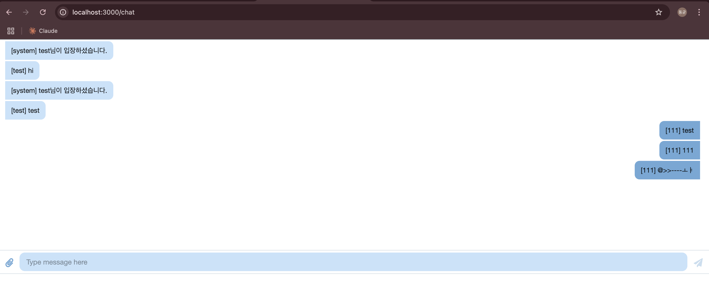

# 서버리스 기반 아키텍처

웹사이트는 s3 와 cloudfront로, 서버는 람다 + API gateway (채팅 조회/입력, 유저 목록 추가/삭제), 데이터베이스는 dynamoDB 를 사용한다. 특이한 점은 api gateway 로 웹소켓을 구현했다는 점이다. 나는 웹소켓이 있는 걸 알았지만 제대로 구현하는 방법을 몰라서 그 부분은 유익했다.

**API Gateway WebSocket**

API Gateway 타입에서 websocket 을 선택하면 된다. 웹소켓을 연결하면 각 주체에 대해 ConnectionID 를 부여해서 해당 아이디로 사용자를 구분을 한다.

만약 서버가 A 라는 ConnectionID 로 메시지를 pub 하고 싶으면 람다에서 해당 ConnectionID 를 DB 에서 불러와 값을 넣어줘야 한다. 전체에 보내는 기능은 없기 때문에 순회하면서 보내야 한다. 하지만 그럭저럭 빠르다.

**dynamoDB**

dynamoDB 는 connection limit 이 없다. 따라서 갑자기 사용자가 폭증해서 람다 동시성이 증가해도 dynamoDB 는 안정적으로 서빙할 수 있다.

# serverless framework

서버리스 아키텍처를 배포하는 IaC 이다. 발표자는 예전에 SAM 이 별로라서 serverless framework 를 쓴다고 한다(...!) 커스텀도 가능하다고 한다. 핸즈온 실습이라 딱히 적을 건 없는데 SAM 이랑 비슷한 느낌이다.

소스코드를 받아서 `yarn`, `yarn deploy` 명령어 2개로 서버 배포가 완료되었다. 30초 정도 걸렸던 것 같다.

` yarn deploy -f chat_put` 명령어로 특정 람다만 업데이트 가능하다. 그러면 서버 배포가 10초 이내로 끝난다.

**배포 테스트 화면**

# 기타

서버리스 모임은 밥을 안준다. 배고파서 더 이상 못갈 것 같다.

추가) 근데 스타벅스 기프티콘 받아서 가야할 것 같다.
