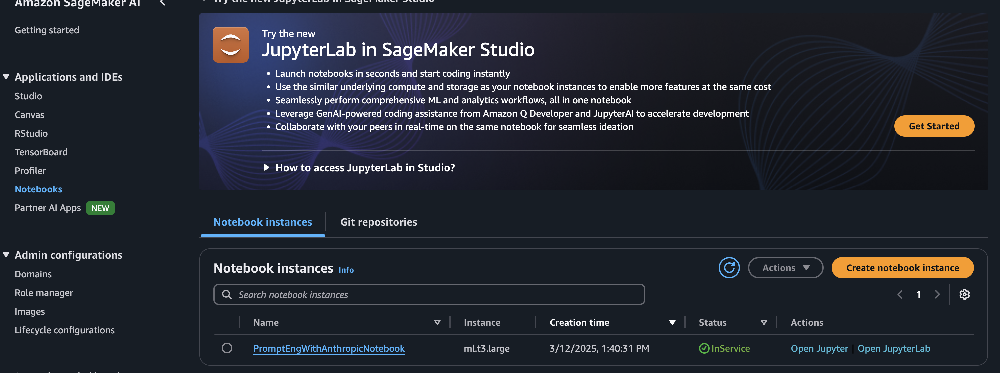
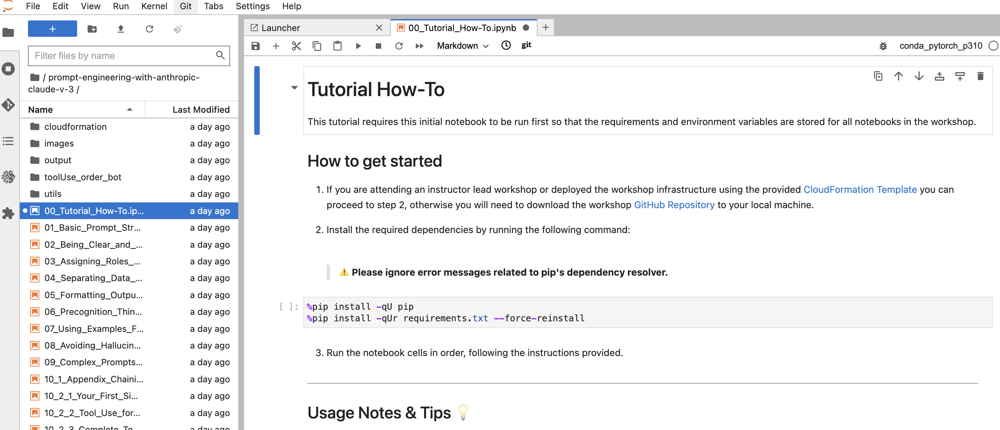

<Header />


[[toc]]

[anthropic claude 3 고급 프롬프트엔지니어링](https://catalog.workshops.aws/prompt-eng-claude3/ko-KR)에 대한 핸즈온 섹션이다. aws 에서 제공하는 임시 아이디로 진행되었다.

> 핸즈온 밋업 때는 일찍 가는게 좋을 것 같다. 미리 설정해야 할 게 있기 때문이다.

# Bedrock?

AWS Bedrock은 다양한 생성형 AI 모델을 손쉽게 활용할 수 있도록 지원하는 관리형 서비스다. 사용자는 API를 통해 여러 AI 모델을 선택하고 맞춤형 애플리케이션을 구축할 수 있으며, 인프라 관리 없이 AI 기능을 통합할 수 있다. 이를 통해 기업은 AI 기반 애플리케이션을 빠르게 개발하고 확장할 수 있다.

## Bedrock 사용

*(핸즈온에서)*

1. bedrock configuration 에서 model acess 선택 (여기서는 claude 3 sonnet, haiku) 선택

2. sagemaker AI 로 이동해서 notebooks instance, 그리고 Open JupyterLabs

   

3. 그러면 주피터 화면이 나온다.

   

# Hands-On 

[핸즈온 세션](https://catalog.workshops.aws/prompt-eng-claude3/ko-KR)에 있는 항목에 대해 주피터에서 예시와 함께 진행했다.

**Claude 성능을 향상시키기 위해 배우게 될 프롬프트 엔지니어링 기법** (핸즈온에 나온 내용)

- **명확하고 직접적인 지시:** Claude의 응답을 안내하기 위해 명확한 지침과 맥락을 제공합니다.
- **응답 예시 활용:** 원하는 출력 형식이나 스타일을 보여주기 위해 프롬프트에 예시를 포함시킵니다.
- **Claude에게 역할 부여:** 사용 사례에 따라 성능을 높이기 위해 Claude에게 특정 역할(전문가 역할 등)을 부여합니다.
- **XML 태그 사용:** 프롬프트와 응답의 구조를 명확히 하기 위해 XML 태그를 활용합니다.
- **프롬프트 체이닝:** 복잡한 작업을 더 나은 결과를 위해 작은 단계로 나눕니다.
- **Claude의 사고 유도:** 출력 품질 향상을 위해 단계별 사고를 장려합니다.
- **Claude의 응답 미리 채우기:** 원하는 방향으로 출력을 안내하기 위해 Claude의 응답을 몇 단어로 시작합니다.
- **출력 형식 제어:** 일관성과 가독성을 위해 원하는 출력 형식을 지정합니다.
- **Claude에게 개작 요청:** 루브릭에 따라 개작을 요청하여 Claude가 출력을 반복하고 개선하도록 합니다.
- **긴 컨텍스트 활용 팁:** Claude의 긴 컨텍스트를 활용하기 위한 프롬프트 최적화 방법을 배웁니다.

# 느낌

## 프롬프트가 엔지니어링일까

이전 회사에서 키워드 조합으로 추천문구를 생성하기 위해 **프롬프트 엔지니어링을 신물나게 했다**. 그 때 동료들과 한 말,

> 처음 "프롬프트 엔지니어링"이라는 말을 만든 사람은 언어적 천재다. 엔지니어링이 아닌 것 같은데 잘 포장했다.

사실, 까고 보면 프롬프트 엔지니어링이란 시키고 싶은 걸 일목요연하게 나열하는 것뿐이다. 순서를 알려준다든가 예시를 준다든가, 역할놀이를 한다든가 하는 것뿐이지 개발적인 엔지니어링은 아닌 것 같다...

> 그거 그냥 gpt 가스라이팅하는거잖아?

내가 프롬프트 엔지니어링하고 있다고 했을 때 보안쪽 친구한테 들었던 말이다. 반박할 수 없었다. 이번 세션은 **프롬프트 엔지니어링 (무려) 고급 기법**이라고 해서 기대했고 내가 모르는 무언가가 있을까 했는데 기대한만큼은 아니었다.

## 핸즈온 세션

핸즈온에서 프롬프트를 작성하고 답변이 제대로 나오는지 true, false 로 검증하는데, 아래와 같이 예상되는 특정 단어가 있는지 검증한다. 그래서 claude3 을 써서 핸즈온을 했나? 3.5 의 대답은 더 다채로울테니까

```
# Prompt - this is the only field you should change
PROMPT = "please pick any basketball player. simply answer with name except for any words"

# Get Claude's response
response = get_completion(PROMPT)

# Function to grade exercise correctness
def grade_exercise(text):
    return text == "Michael Jordan"
```

## prefill

prefill 은 좀 신기했다. 아래 기법이다.

> **Claude의 응답 미리 채우기:** 원하는 방향으로 출력을 안내하기 위해 Claude의 응답을 몇 단어로 시작합니다.

먼저 첫 몇 단어를 응답으로 강제하고 시작하는 것이다. 최고의 농구선수가 누구냐고 물어보고 첫 단어로 스테픈 커리로 하니까 당연히 스테픈 커리라고 이어서 대답한다.

주로 사용하는 것은 xml 태그나 json 으로 응답을 받기 위해 `<answer>`, `{` 등으로 시작할 수 있다.


## 기타

소고기 김밥을 줬는데 좀 쉰 것 같다.

<Footer />