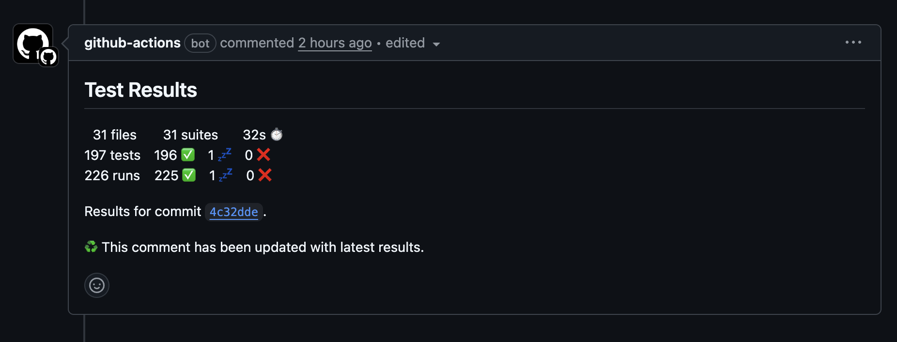
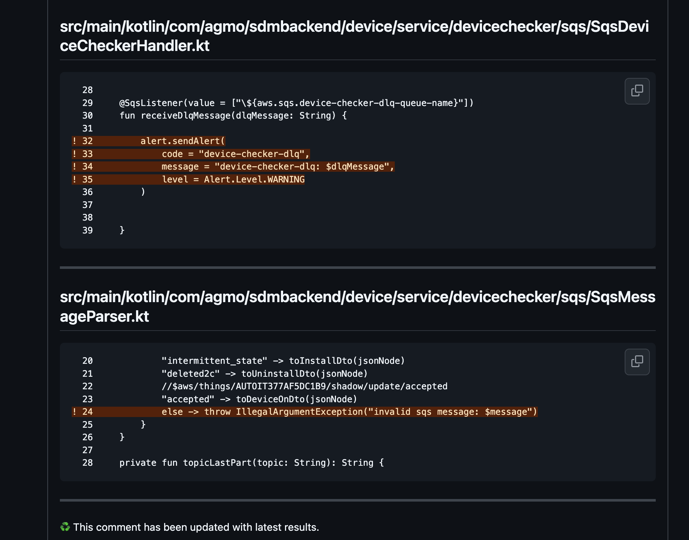

<Header />

[[toc]]

나는 개발에서 가장 중요한 활동이 "테스트"라고 생각한다. 개발의 주요한 비기능적 요구사항인 확장성, 안정성, 민첩성 등이 "테스트"를 통해 달성될 수 있기 때문이다.

# 문제 배경

현재 백엔드 개발의 80% 이상을 내가 하고 있기 때문에 유닛 테스트와 통합 테스트는 거의 다 내가 작성하고 있다. 그런데 개발이 빠르게 진행되고 있는 과정에서 테스트가 누락되곤 한다.

테스트가 누락되면 주요하지 않은 기능이라면 문제 없겠지만 코어 기능이라면 나중에 수정이 어려워져 민첩성과 안정성이 떨어진다.

특히 기능을 수정하면서 기존에는 잘 작동했던 동작이 에러나 나는 경우가 있었는데 이러한 문제를 해결하기 위해서 **테스트가 작성되었는지, 해당 테스트가 적절한지를 확인하는 체계**가 필요하다고 생각했다.  

# 개선 시도

## 개선 1: 코드리뷰

PR 리뷰 단계에서 "테스트가 작성되었는지"를 확인하는 방법이 있다. 하지만 코드리뷰만으로는 분명 한계가 있었다.

- 리뷰어가 테스트 작성 여부를 **놓칠 수 있다.**
- 테스트 코드가 있더라도, 해당 테스트가 모든 경우를 커버하는지 확인하지 못한다.
- 리뷰어의 주관에 따라 **기준이 달라지는 문제**가 발생한다.

즉, 코드리뷰는 필요하지만 추가적인 시스템이 필요하다고 생각했다.

## 개선 2: 테스트 커버리지 툴 도입

그래서 테스트 실행 여부를 자동으로 잡아줄 방법이 필요했고, **테스트 커버리지 툴**을 쓰기로 했다. kover 와 diff-cover 을 사용했고 해당 내용은 **[여기](https://hobeen-kim.github.io/posts/spring/2025-08-20-test2.html)**에 있다.
PR 을 생성하면 테스트 보고서와 테스트 커버리지 보고서가 생성된다.

### 테스트 보고서

테스트 보고서는 테스트의 성공/실패 여부를 보여준다. 실패하면 gitaction 의 Summary 에서 실패로그를 볼 수 있다.

### 테스트 커버리지 보고서

다음 내용이 포함된다.

- 전체 테스트 커버리지
- 수정된 파일의 테스트 커버리지

원래는 커버리지의 목표를 정하려고 했으나, 큰 의미가 없다고 생각하여 현재 단계에서는 테스트 작성여부에 대한 "인지" 차원에서만 사용하고 있다.

# 마무리

지금 회사에서 뭔가 개선해보기 위한 첫 시도다. 계속해서 새로운 개선을 하면서 "좋은 문화"를 가진 회사로 만들어나가고 싶다.

# Ref.

없음
<Footer />