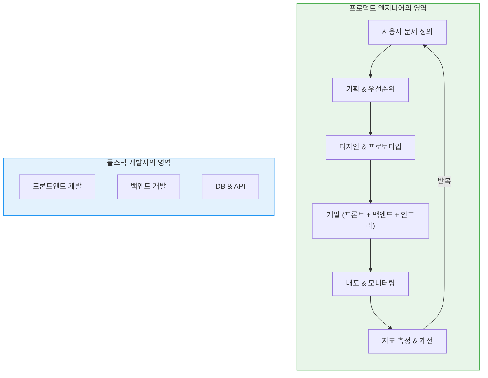
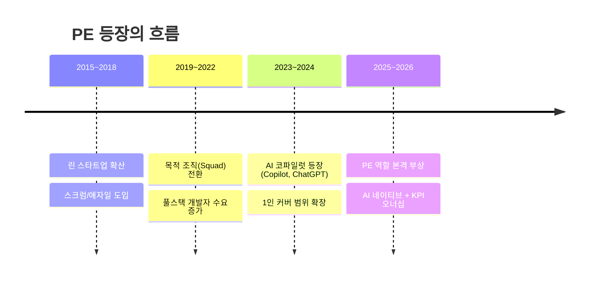
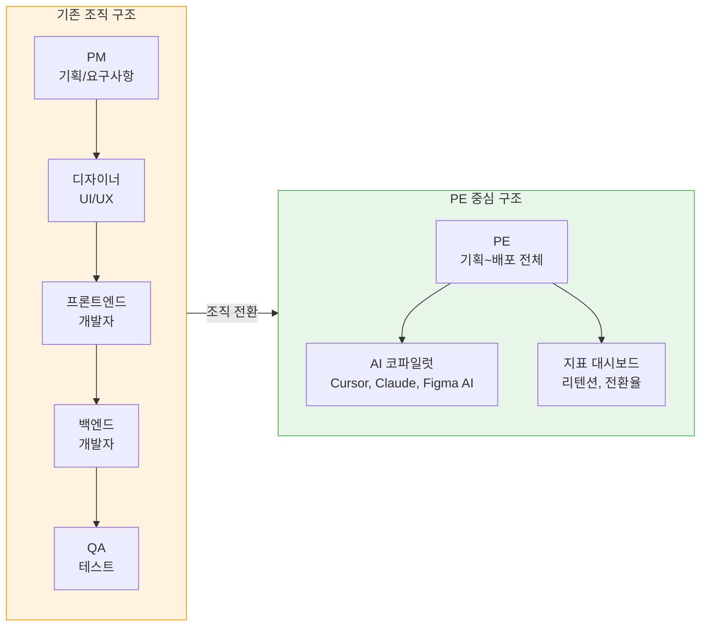
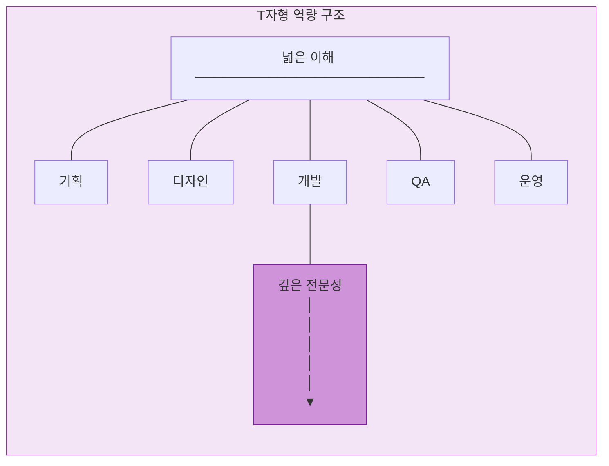

<Header />

[[toc]]

프로덕트 엔지니어(PE)라는 말이 유행하고 있다. 우리 팀은 개발자 3명이 프론트, 백엔드 구분 없이 각자 일하고 있다. 그런데 문득 이런 생각이 들었다. 구분 없이 다 한다고 프로덕트 엔지니어인 건 아니지 않나? 이 글에서는 프로덕트 엔지니어가 정확히 무엇인지, 기존 역할과 뭐가 다른지 정리하고, 내가 PE가 되려면 뭘 보충해야 하는지 짚어본다.

## 1. 풀스택 개발자 ≠ 프로덕트 엔지니어

풀스택 개발자는 프론트엔드와 백엔드를 모두 다룰 수 있는 개발자다. 기술적 범위가 넓다는 뜻이다. 하지만 프로덕트 엔지니어는 단순히 기술 범위의 문제가 아니다.

프론트엔드든 백엔드든, 제품을 만드는 사람이라는 본질을 잃어서는 안 된다.

핵심은 이거다. 풀스택은 **기술 스택의 폭**이고, PE는 **제품에 대한 오너십의 깊이**다.

| | 풀스택 개발자 | 프로덕트 엔지니어 |
|---|---|---|
| **관심사** | 기술 구현 | 제품 성과 |
| **범위** | 프론트엔드 + 백엔드 | 기획 ~ 배포 ~ 운영 전체 |
| **의사결정 기준** | 어떻게 만들까 | 무엇을 왜 만들까 |
| **성공 기준** | 동작하는 코드 | 사용자 문제 해결 |
| **KPI** | 코드 품질, 테스트 커버리지 | 리텐션, 전환율, 활성화율 |

프론트와 백엔드를 둘 다 할 줄 아는 것과, 이 기능이 정말 필요한가를 스스로 판단하고 만들고 측정하는 것은 완전히 다른 차원의 이야기다. 우리 팀이 프론트/백엔드 구분 없이 일한다고 해서 PE인 게 아니다. 우리는 그냥 인원이 부족해서 다 하는 것에 가깝다. (ㅎ)

## 2. 프로덕트 엔지니어란

### 2.1 정의

프로덕트 엔지니어는 PM(프로덕트 매니저)과 풀스택 엔지니어의 혼합체다. 기획자가 정해준 스펙을 구현하는 사람이 아니라, **사용자 문제를 직접 정의하고, 해결책을 설계하고, 만들고, 측정하고, 개선하는 사람**이다.

PE의 핵심 특징 4가지를 보면 이해가 빠르다.

1. **AI 네이티브**: LLM을 당연한 필수 도구로 활용한다
2. **T자형 역량**: 깊은 엔지니어링 기술 + 제품/데이터/디자인에 대한 폭넓은 이해
3. **성과 지향성**: 리텐션, 전환율, 활성화율 같은 KPI를 직접 책임진다
4. **자율적 실행력**: 최소한의 감독으로 아이디어부터 배포까지 추진한다

여기서 핵심은 3번이라고 생각한다. 코드를 얼마나 잘 짰는지가 아니라, 그 코드가 사용자에게 어떤 가치를 만들어냈는지를 본다는 것이다.

### 2.2 등장 배경

PE라는 개념이 갑자기 나온 건 아니다. 몇 가지 흐름이 겹치면서 자연스럽게 부상했다.

**1) 스타트업의 린 조직 확산**

소수 인원이 빠르게 움직여야 하는 환경에서, 기획 → 디자인 → 개발 → QA로 이어지는 워터폴식 핸드오프는 너무 느리다. 실제로 당근도 기능 조직에서 목적 조직으로 전환하면서 엔지니어들이 프로덕트 오너십을 갖게 되었다.

**2) AI 도구의 발전**

Figma, Cursor, Claude 같은 도구들이 한 사람이 커버할 수 있는 범위를 크게 넓혀주었다. 전통적인 PM-디자이너-엔지니어 삼각 구조는 점점 힘을 잃고, **PE + AI 코파일럿 중심의 피처 팀**이 새로운 표준으로 자리잡을 가능성이 높다.

**3) 코드의 커머디티화**

코드 작성 자체가 점점 상품화되고 있다. AI가 코드를 생성해주는 시대에, 개발자의 경쟁력은 코드를 잘 치는 능력이 아니라 **AI를 활용해 제품 성과를 직접 만들어내는 능력**으로 이동하고 있다.

### 2.3 기존 역할과의 비교

PE가 기존 역할을 대체하는 것은 아니다. 대규모 조직에서는 여전히 전문 기획자와 디자이너가 필요하다. 하지만 소규모 팀에서는 PE 한 명이 이 역할들을 넘나들 수 있어야 한다.

결국 PE의 핵심은 **문제 해결과 우선순위 설정** 능력이다. 눈앞의 기술적 문제가 아닌, 전체 제품 관점에서 지금 가장 중요한 게 뭔지를 판단하는 능력. 이건 코딩 실력과는 다른 근육이다.

## 3. PE의 역할과 역량

PE가 커버하는 영역을 구체적으로 살펴보자. 중요한 건, 모든 영역을 전문가 수준으로 하라는 게 아니라는 점이다. 모두가 풀스택이 되되 **한 분야에서 얼마나 깊이 있는 지식을 가지고 있는가**가 중요하다. 이것이 바로 T자형 역량이다.

### 3.1 기획

PE에게 기획은 PM이 써준 스펙을 받는 것이 아니다.

- **사용자 문제를 직접 정의한다**: 이거 만들어주세요가 아니라, 사용자가 여기서 이탈하는 이유가 뭘까를 먼저 묻는다
- **데이터 기반으로 우선순위를 판단한다**: 감이 아니라, 지표를 보고 이걸 먼저 해야 한다를 결정한다
- **PRD를 직접 작성하거나 주도적으로 참여한다**: Product Requirements Document. 뭘 만들지, 왜 만들지, 성공 기준이 뭔지를 정의하는 문서다
- **가설을 세우고 검증한다**: 이 기능을 넣으면 전환율이 오를 것이다 → 배포 → 측정 → 판단

:::tip 핵심
기획 역량의 본질은 무엇을 만들지 결정하는 능력이다. 만드는 능력은 이미 있다. 뭘 만들어야 하는지 판단하는 능력이 PE의 시작점이다.
:::

### 3.2 디자인

전문 디자이너 수준을 요구하는 것은 아니다. 하지만 아래 정도는 할 수 있어야 한다.

- **와이어프레임 작성**: 아이디어를 빠르게 시각화. Figma나 종이 스케치로
- **UI/UX 기본 원칙 이해**: 일관성, 피드백, 접근성 같은 기본적인 사용성 원칙
- **프로토타입 제작**: 디자이너 없이도 사용자가 혼란스럽지 않은 화면을 만들 수 있는 능력
- **디자인 시스템 활용**: 이미 있는 컴포넌트를 조합해서 빠르게 화면을 구성

요즘은 Figma AI, v0 같은 도구로 디자인 진입장벽이 크게 낮아졌다. 완벽한 디자인이 아니라 **빠르게 검증할 수 있는 수준의 디자인**이면 충분하다.

### 3.3 개발

개발은 PE의 기본 무기다. 프론트엔드와 백엔드를 모두 다루되, 한쪽에 깊은 전문성이 있어야 한다.

- **프론트엔드**: React/Vue 등 모던 프레임워크. 사용자 인터랙션, 상태 관리
- **백엔드**: API 설계, DB 모델링, 비즈니스 로직. Spring Boot, Node.js 등
- **인프라**: 배포 파이프라인(CI/CD), 클라우드(AWS/GCP), 컨테이너(Docker/K8s)
- **빠른 프로토타이핑 vs 프로덕션 코드**: 검증 단계에서는 빠르게, 확정 후에는 견고하게. 이 전환을 판단할 줄 아는 것도 PE의 역량이다

### 3.4 QA & 모니터링

PE에게 QA는 테스트 코드 작성에 그치지 않는다.

- **테스트 전략 수립**: 유닛, 통합, E2E 중 어디에 비용을 집중할지 판단
- **배포 후 모니터링**: APM, 에러 트래킹, 로그 분석으로 문제를 사전에 감지
- **A/B 테스트 설계**: 가설 검증을 위한 실험 설계
- **지표 해석**: 단순히 숫자를 보는 게 아니라, 그 숫자가 의미하는 바를 판단

### 3.5 운영 & 개선

PE의 일은 배포에서 끝나지 않는다. 오히려 **배포 후가 시작**이다.

- **사용자 피드백 수집**: CS, 앱 리뷰, 사용자 인터뷰 등
- **지표 기반 의사결정**: DAU, 리텐션, 전환율의 변화를 추적하고 다음 액션을 결정
- **지속적 개선**: 작은 개선을 빠르게 반복. 한 번에 완벽한 기능을 만드는 것보다, 작게 배포하고 피드백을 받아 개선하는 것이 더 효과적

:::info 당근의 사례
당근에서는 사용자 경험을 위해 기술적 완성도를 타협하지, 기술적 완성도를 위해 사용자 경험을 타협하지 않는다. PE의 마인드셋을 잘 보여주는 원칙이다.
:::

## 4. 나는 어디쯤인가

솔직하게 자기 진단을 해보저면,

| 영역 | 현재 수준 | 보충 필요 |
|------|----------|----------|
| **기획** | 개발 관점에서 의견 제시 가능 | 사용자 리서치, PRD 작성, 데이터 기반 의사결정 |
| **디자인** | 기본 UI 구현 가능 | Figma 활용, UX 원칙, 와이어프레임/프로토타입 |
| **프론트엔드** | React 기본 구현 가능 | 사용자 경험 중심 인터랙션, 성능 최적화 |
| **백엔드** | 주력 영역 (Spring Boot) | - |
| **인프라** | K8s, AWS 운영 가능 | 모니터링 고도화, 비용 최적화 |
| **QA** | 기본 테스트 작성 | 테스트 전략, A/B 테스트, 자동화 파이프라인 |
| **보안** | 기본 이해 | 체계적인 보안 점검 프로세스 |

백엔드와 인프라는 어느 정도 자신이 있다. 하지만 기획과 디자인 영역은 솔직히 부족하다. 만들어달라고 하면 만드는 수준이지, 이걸 만들어야 한다고 스스로 판단하고 주도하는 수준은 아니다.

**가장 큰 갭은 기획 역량이다.** 사용자 문제를 정의하고, 가설을 세우고, 검증하는 과정이 체계적이지 않다. 이거 하면 좋을 것 같은데라는 감으로 움직이는 경우가 많다.

**두 번째 갭은 디자인이다.** 개발자가 만든 UI는 대체로 동작은 하지만 불친절한 경우가 많다. Figma도 거의 써본 적이 없다.

**세 번째는 지표 기반 사고다.** 기능을 배포하고 나서 잘 되겠지로 끝나는 경우가 많다. 배포 후에 전환율이 어떻게 변했는지, 사용자가 어디서 이탈하는지를 체계적으로 추적하지 않는다.

## 5. 다음 글에서,

이번 글에서는 PE가 뭔지, 그리고 내가 어디가 부족한지를 정리했다. 다음 글에서는 이 부족한 부분을 **AI로 어떻게 메울 수 있는지** 구체적으로 다룬다.

- 기획은 어떤 AI 도구로 어떤 산출물을 만드는가
- 디자인은 Figma + AI로 어떻게 프로토타입을 뽑는가
- 개발부터 배포까지 나만의 PE 플로우를 어떻게 구축하는가
- Context Engineering — AI의 품질을 결정하는 규칙 설계

앞으로의 개발자 경쟁력은 코드를 잘 치는 능력이 아니라 AI를 관리해 제품 성과를 직접 만들어내는 능력이다. 2편에서 이걸 구체적으로 풀어보겠다.

## Ref.

- [프로덕트 엔지니어(The Product Engineer) — GeekNews](https://news.hada.io/topic?id=22833)
- [프로덕트에 진심인 엔지니어는 어떻게 일할까? — 당근 블로그](https://about.daangn.com/blog/archive/%EB%8B%B9%EA%B7%BC-%EA%B0%9C%EB%B0%9C%EC%9E%90-%EB%AA%A9%EC%A0%81%EC%A1%B0%EC%A7%81-%ED%94%84%EB%A1%9C%EB%8D%95%ED%8A%B8-%EC%97%94%EC%A7%80%EB%8B%88%EC%96%B4/)
- [AI 시대, 프로덕트 엔지니어가 개발자 역할을 바꾼다 — TILNOTE](https://tilnote.io/en/pages/68b53072823692c440bfdc8a)
- [프로덕트 엔지니어의 역할과 성장 전략 — F-Lab](https://f-lab.ai/en/insight/product-engineer-role-and-growth-strategy-20251024)
- [Product Engineer — John Cho (Medium)](https://john-cho.medium.com/product-engineer-71bc0e243044)

<Footer />
