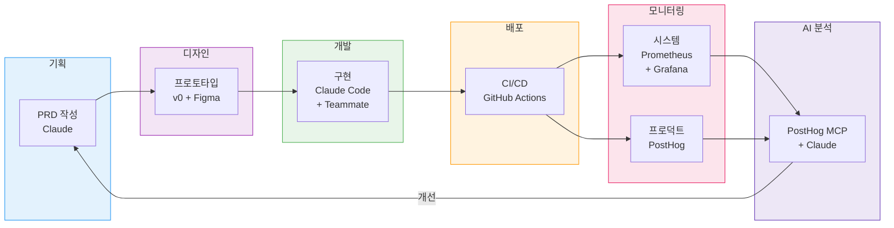
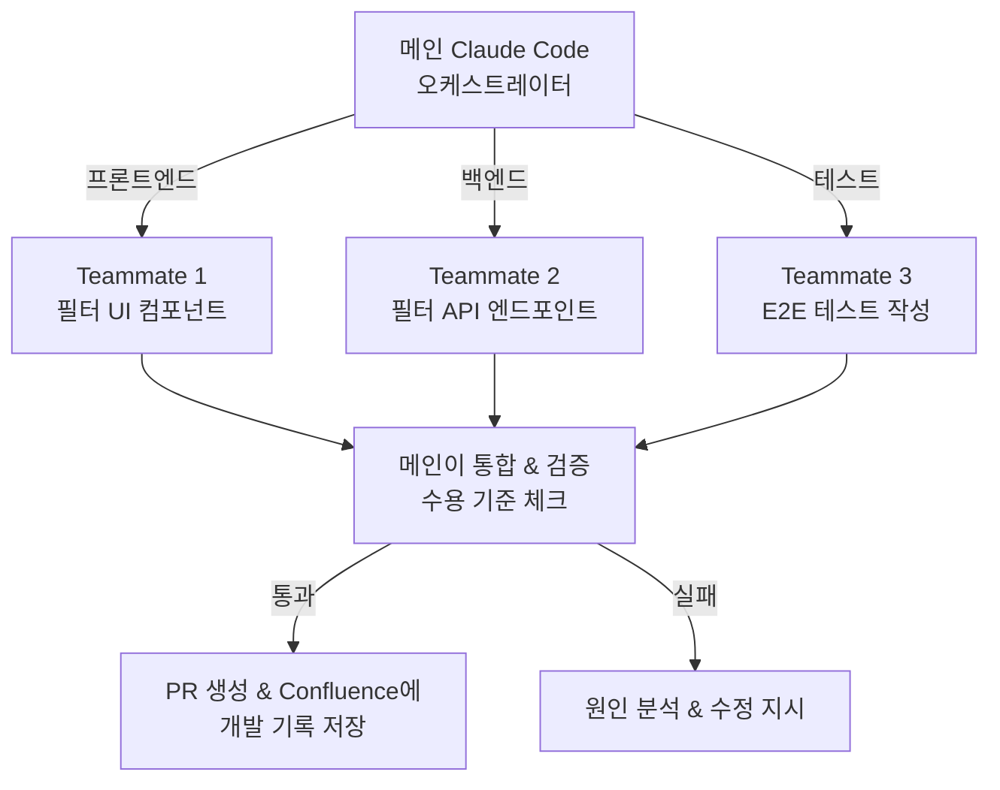
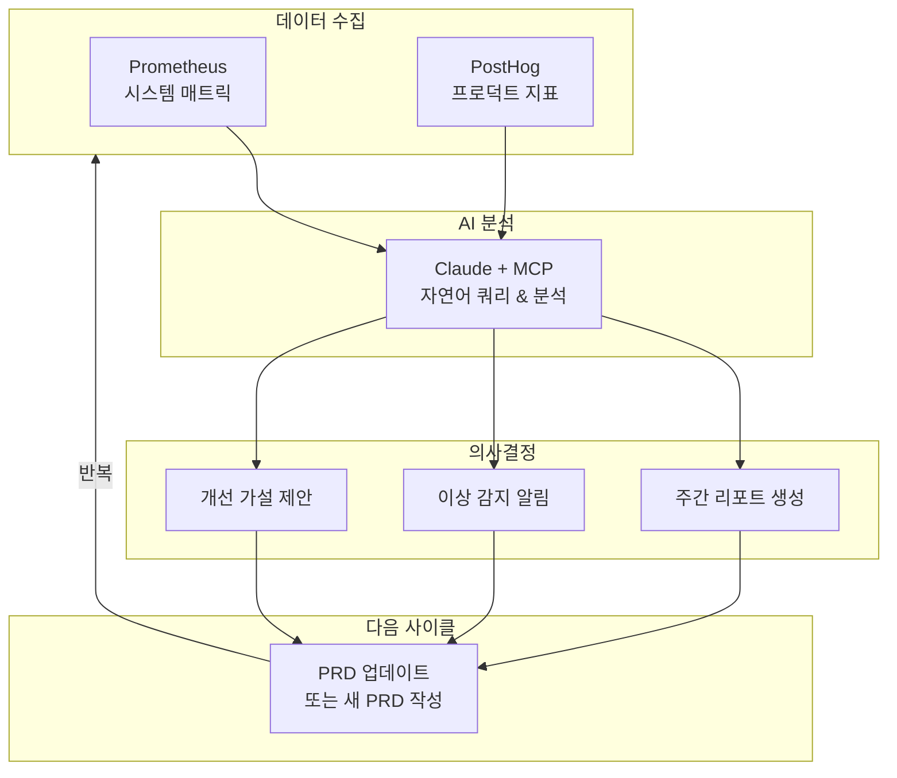

<Header />

[[toc]]

1편에서 PE가 뭔지, 내가 어디가 부족한지를 정리했다. 이번 글에서는 그 부족한 부분을 AI로 어떻게 메울 수 있는지 구체적으로 다룬다. 각 단계별로 어떤 도구를 쓰고, 어떤 포맷의 산출물을 만들고, 그걸 어디에 저장하는지까지 정리한다. 실제로 따라하면서 나만의 PE 플로우를 만들어보는 것이 목표다.

## 1. 전체 플로우

기획부터 모니터링까지, PE가 커버하는 전체 파이프라인과 각 단계에서 사용하는 도구다.



| 단계 | 도구 | 산출물 | 저장 위치 |
|------|------|--------|-----------|
| 기획 | Claude | PRD | Confluence |
| 디자인 | v0 + Figma | 프로토타입, 와이어프레임 | Figma + Confluence |
| 개발 | Claude Code + Teammate | 코드, 테스트 | GitHub Repository |
| 배포 | GitHub Actions | 파이프라인 설정 | `.github/workflows/` |
| 시스템 모니터링 | Prometheus + Grafana | 대시보드, 알림 규칙 | Grafana 인스턴스 |
| 프로덕트 지표 | PostHog | 이벤트, 퍼널, 리텐션 | PostHog 인스턴스 |
| AI 분석 | PostHog MCP + Claude | 분석 리포트 | Confluence |

## 2. 산출물 저장소

PE 플로우에서 만들어지는 문서들은 세 가지 조건을 만족해야 한다.

1. **팀 전체가 접근 가능**해야 한다 (비개발자 포함)
2. **AI가 API로 검색하고 읽을 수 있어야** 한다
3. **문서가 한 곳에 모여** 있어야 한다

이 세 조건을 만족하는 조합은 **Confluence + GitHub**다.

### 왜 Confluence인가

GitHub Repository에 마크다운으로 저장하면 AI가 바로 읽을 수 있어서 좋지만, 비개발자는 접근이 어렵다. 기획자, 디자이너, 운영팀도 PRD를 보고 피드백을 줘야 하는데, Git을 쓸 줄 모르면 막힌다.

Confluence는 이 문제를 해결한다.

- **비개발자도 쉽게** 문서를 읽고, 쓰고, 코멘트를 달 수 있다
- **CQL(Confluence Query Language)**로 REST API 검색이 가능하다
- **Atlassian 공식 MCP 서버**를 제공해서 Claude Code가 직접 Confluence를 검색/읽기/쓰기할 수 있다
- Jira와 연동하면 이슈-PRD-코드가 자연스럽게 연결된다

### 저장소 구조

문서는 **유형별로 분류**하고, **라벨로 프로젝트/기간을 태깅**하는 방식이 가장 실용적이다.

```
Confluence Space: [프로젝트명]
├── PRD/                     # 기능 요구사항 (뭘 만들지)
├── ADR/                     # 기술 설계 + 의사결정 (어떻게 만들지)
├── RFC/                     # 제안서 (피드백 요청)
├── 리서치/                   # 기술 비교 분석, 조사
├── 개발 기록/                # 구현 계획, 구현 완료, 트러블슈팅, 메모
├── 회의록/                   # 정기/비정기 회의
├── 회고/                     # 스프린트/주간 회고 + 학습 기록
├── 디자인/                   # Figma 링크 + 디자인 의사결정
├── 분석 리포트/              # 주간 지표 분석
├── 장애 보고서/              # 장애 원인, 해결, 재발 방지
└── 온보딩/                   # 신규 팀원 가이드

GitHub Repository (개발 컨텍스트)
├── .claude/CLAUDE.md         # AI 컨텍스트 (코드 컨벤션, 빌드 방법)
└── src/                      # 소스 코드
```

각 문서에 Confluence 라벨을 붙여서 프로젝트별, 기간별로 필터링한다.

| 라벨 유형 | 예시 | 용도 |
|-----------|------|------|
| 기능/프로젝트 | `feature-search-filter`, `feature-auth` | 기능 단위로 관련 문서 모아보기 |
| 분기/스프린트 | `2026-Q2`, `sprint-14` | 기간별 필터링 |
| 상태 | `draft`, `approved`, `deprecated` | 문서 생명주기 관리 |

이렇게 하면 CQL로 특정 기능의 모든 문서를 한 번에 조회할 수 있다.

```
# "검색 필터" 기능 관련 모든 문서
label = "feature-search-filter"

# 이번 분기 승인된 PRD만
label = "2026-Q2" AND label = "approved" AND ancestor = "PRD"
```

핵심은 **문서의 성격에 따라 저장 위치를 나누는 것**이다. 팀 전체가 봐야 하는 문서(PRD, 회의록, 회고, ADR)는 Confluence에, 코드와 밀접한 컨텍스트(CLAUDE.md)는 GitHub에 둔다.

### AI 연동 — Confluence MCP

Atlassian 공식 MCP 서버를 Claude Code에 연결하면, AI가 Confluence에서 직접 문서를 검색하고 읽을 수 있다.

```bash
# Claude Code에서 Confluence 검색
claude "Confluence에서 검색 필터 관련 PRD를 찾아서 요약해줘"

# CQL로 직접 검색
# GET /wiki/rest/api/content/search?cql=title~"검색 필터" AND space="PRD"
```

이렇게 하면 개발 중에 PRD를 확인하러 브라우저를 열 필요가 없다. Claude Code가 Confluence에서 PRD를 읽고, 그에 맞춰 코드를 작성한다.

:::tip 핵심
산출물 저장소의 핵심은 **AI가 읽을 수 있는가** + **비개발자가 쓸 수 있는가**이다. 이 두 조건을 동시에 만족해야 문서가 실제로 살아있는 문서가 된다.
:::

## 3. 기획 — AI로 PRD 만들기

### PRD란

Product Requirements Document. 뭘 만들지, 왜 만들지, 성공 기준이 뭔지를 정의하는 문서다. PE에게 PRD는 코드를 치기 전에 반드시 거치는 관문이다.

PRD는 **뭘 만들지**에 집중하는 문서다. 어떻게 만들지(기술 스펙)는 ADR에서 다룬다. 이렇게 분리하면 비개발자도 PRD를 읽고 피드백을 줄 수 있다.

### PRD 포맷

```markdown
# [기능명] PRD

## 1. 배경
- 왜 이 기능이 필요한가
- 현재 어떤 문제가 있는가
- 사용자가 겪는 구체적인 불편
- 관련 데이터가 있다면 수치로 (예: 검색 후 이탈율 34%)

## 2. 목표 & 성공 지표
- 이 기능으로 달성하려는 것
- 성공 지표는 반드시 정량적으로:
  - 검색 후 상세 페이지 전환율: 현재 12% → 목표 20%
  - 검색 이탈율: 현재 34% → 목표 20% 이하

## 3. 비목표 (Non-goals)
- 이번에 하지 않는 것을 명시적으로 기술
- 예: 추천 알고리즘은 이번 스코프에 포함하지 않는다
- 예: 관리자 페이지는 다음 Phase에서 다룬다

## 4. 사용자 스토리
- AS A [사용자 유형], I WANT TO [행동], SO THAT [목적]
- 예: AS A 구매자, I WANT TO 카테고리로 검색 결과를 필터링,
      SO THAT 원하는 상품을 빠르게 찾을 수 있다

## 5. 수용 기준 (Acceptance Criteria)
- [ ] 카테고리 필터 선택 시 결과가 즉시 갱신된다
- [ ] 복수 필터 동시 적용이 가능하다
- [ ] 필터 초기화 버튼이 동작한다
- [ ] 모바일에서 필터가 바텀시트로 열린다
- [ ] 기존 검색 기능이 정상 동작한다

## 6. 구현 페이즈
- Phase 1: 카테고리 필터 (1주)
- Phase 2: 가격 범위 + 정렬 (1주)
- Phase 3: 모바일 바텀시트 UI (3일)

## 7. 미결 사항
- 필터 조합의 최대 개수 제한이 필요한가?
- 필터 상태를 URL에 반영할 것인가?
```

기술적 구현 방법(API 스펙, 데이터 모델, 제약사항 등)은 PRD에 넣지 않는다. PRD가 확정되면 개발자가 ADR(기술 스펙)을 별도로 작성한다. 이 구조에 대해서는 8장 Context Engineering에서 다시 다룬다.

### AI Native한 PRD 작성 플로우

기존 방식은 사람이 PRD를 쓰고 리뷰를 받는 것이었다. AI Native 방식은 **AI가 데이터를 수집하고, 초안을 쓰고, 검증까지 돕는** 플로우다.

**1단계. 문제를 던진다.**

```bash
claude "PostHog에서 검색 관련 지표를 확인해줘.
       검색 후 이탈율, 검색 결과 클릭율, 검색 퍼널 전환율.
       문제가 있으면 가설을 세워줘."
```

AI가 PostHog MCP로 실제 데이터를 조회하고, 문제를 정의해준다. 감이 아니라 데이터에서 시작한다.

**2단계. AI가 PRD 초안을 작성한다.**

```bash
claude "방금 분석한 검색 이탈 문제를 해결하는 PRD를 작성해줘.
       Confluence에서 가장 최근 PRD를 참고해서 같은 포맷으로.
       성공 지표는 방금 조회한 현재 수치를 기준으로."
```

AI가 Confluence MCP로 기존 PRD 포맷을 참고하고, PostHog 데이터로 현재 수치를 채우고, 프로젝트 코드를 읽어서 기술적 맥락까지 반영한 초안을 만든다.

**3단계. 팀과 리뷰한다.** Confluence에 올리고 코멘트로 피드백. 비개발자도 배경, 목표, 사용자 스토리를 보고 의견을 줄 수 있다.

**4단계. 확정 후 라벨을 붙인다.** `approved`, `feature-search-filter`, `2026-Q2`

핵심은 **1단계에서 데이터 수집을 AI가 한다**는 것이다. 사람은 문제를 던지고, AI가 데이터를 모아서 구조화한다.

### PRD 작성 시 주의사항

- **모호한 표현 금지**: 많은 사용자 → 월 1만 명 이상, 빠른 응답 → 수용 기준에 구체적 조건으로
- **비목표를 반드시 쓴다**: 안 하는 것을 적극적으로 명시해야 범위가 통제된다
- **수용 기준은 체크리스트로**: 완료 여부를 누구나 명확히 판단할 수 있어야 한다
- **기술적 내용은 넣지 않는다**: API 스펙, 데이터 모델, 제약사항은 ADR에서 다룬다

## 4. 디자인 — v0 + Figma로 프로토타입

PE에게 디자인은 완벽한 시안이 아니라 **빠르게 검증 가능한 프로토타입**이다. AI Native 방식에서는 PRD를 쓰는 순간 이미 프로토타입이 시작된다.

### PRD → v0 → 프로토타입 (자동 연결)

v0는 자연어로 UI를 생성해주는 도구다. PRD의 사용자 스토리와 수용 기준을 그대로 넣으면 된다.

```bash
# PRD를 기반으로 v0에 프로토타입 요청
"검색 결과 페이지를 만들어줘. PRD:

사용자 스토리:
- 구매자가 카테고리로 검색 결과를 필터링한다
- 복수 필터를 동시에 적용할 수 있다

수용 기준:
- 상단 검색바
- 좌측 필터 패널 (카테고리, 가격 범위, 정렬)
- 우측 결과 카드 그리드
- 필터 변경 시 결과 실시간 갱신
- 모바일: 필터가 바텀시트로 열림"
```

v0는 2026년 기준으로 단순 UI 생성을 넘어 **풀스택 앱을 빌드하고 Vercel에 바로 배포**할 수 있다. GitHub 레포를 연결하면 PR까지 만들어준다. 즉, 프로토타입이 곧 동작하는 데모가 된다.

### 디자인 리뷰도 AI로

Figma에서 디테일을 다듬은 후, Claude Code의 Figma MCP를 활용하면 디자인과 구현의 차이를 AI가 자동으로 검증할 수 있다.

```bash
claude "Figma의 검색 필터 디자인과 현재 구현된 UI를 비교해줘.
       디자인과 다른 부분이 있으면 알려줘."
```

### 산출물

- v0 프로토타입 URL (동작하는 데모)
- Figma 프로젝트 링크 (팀 공유용)
- 디자인 스크린샷 → Confluence 디자인 카테고리에 기록

## 5. 개발 — Claude Code + Teammate

### PRD + ADR → 자동 구현

Claude Code는 Confluence MCP로 PRD를 읽고, GitHub의 ADR로 기술 스펙을 확인한 뒤, 코드를 작성한다. 사람이 할 일은 구현을 지시하고 결과를 검증하는 것이다.

```bash
claude "Confluence에서 '검색 필터' PRD를 읽고,
       docs/adr/002-search-filter.md의 기술 스펙을 참고해서
       검색 필터 기능을 구현해줘.
       Figma 디자인은 여기 참고: [Figma URL]"
```

Claude Code가 PRD의 수용 기준을 체크리스트로 인식하고, ADR의 변경 금지 영역을 지키면서 구현한다.

### Teammate로 병렬 작업

Claude Code의 Teammate 기능을 사용하면 여러 작업을 동시에 진행할 수 있다. PE 한 명이 여러 개발자를 동시에 운용하는 것과 같다.



실제로 이렇게 쓴다:

```bash
# ADR의 구현 계획에 따라 Teammate 위임
claude "ADR-002의 Phase 1을 시작해.
       프론트엔드는 Teammate에게 위임하고,
       백엔드는 직접 구현해줘.
       완료되면 수용 기준을 하나씩 검증해."
```

메인 Claude Code가 오케스트레이터 역할을 한다. Teammate에게 작업을 위임하고, 결과를 검증하고, PR을 만들고, Confluence에 개발 기록까지 남긴다.

### 구현 완료 후 자동 기록

```bash
claude "방금 구현한 검색 필터 기능의 개발 기록을 Confluence에 저장해줘.
       변경된 파일, 테스트 결과, 주의사항을 포함해서."
```

옵시디언에 수동으로 남기던 Implementation 기록을 AI가 자동으로 Confluence에 작성한다.

## 6. 배포 & 모니터링

### CI/CD — GitHub Actions + AI 코드 리뷰

PR이 머지되면 자동으로 빌드, 테스트, 배포가 진행된다. 여기에 AI를 추가하면 **PR 코드 리뷰까지 자동화**할 수 있다.

```yaml
# .github/workflows/deploy.yml
name: Deploy
on:
  push:
    branches: [main]

jobs:
  build-test-deploy:
    runs-on: ubuntu-latest
    steps:
      - uses: actions/checkout@v4
      - name: Build
        run: ./gradlew build
      - name: Test
        run: ./gradlew test
      - name: Deploy
        run: ./scripts/deploy.sh
```

PR이 올라오면 Claude Code가 자동으로 코드를 리뷰하고, ADR의 제약사항과 변경 금지 영역을 위반하지 않았는지 검증하도록 설정할 수 있다. 사람이 리뷰하기 전에 AI가 1차 필터를 해주는 구조다.

### 시스템 모니터링 — Prometheus + Grafana

시스템 레벨 지표를 수집하고 시각화한다.

| 지표 | 설명 | 알림 기준 |
|------|------|-----------|
| HTTP 응답 시간 (p95) | API 성능 | > 500ms |
| 에러율 (5xx) | 서버 에러 비율 | > 1% |
| CPU / 메모리 사용률 | 리소스 상태 | > 80% |
| Pod 재시작 횟수 | K8s 안정성 | > 0 in 1h |

Spring Boot 앱이라면 Micrometer + Prometheus 조합으로 쉽게 연동할 수 있다.

```yaml
# application.yml
management:
  endpoints:
    web:
      exposure:
        include: health, prometheus
  metrics:
    export:
      prometheus:
        enabled: true
```

Grafana에서 대시보드를 만들고, 임계치를 넘으면 Slack으로 알림이 오도록 설정한다.

### 프로덕트 지표 — PostHog

시스템이 잘 돌아가는 것과 사용자가 만족하는 것은 다르다. 프로덕트 지표는 PostHog로 수집한다.

| 지표 | 설명 | 측정 방법 |
|------|------|-----------|
| 전환율 | 검색 → 상세 → 구매 | PostHog Funnel |
| 리텐션 | 재방문율 | PostHog Retention |
| 기능 사용률 | 필터 사용 비율 | PostHog Event |
| 이탈 지점 | 어디서 떠나는가 | PostHog Path |

프론트엔드에서 이벤트를 심는다:

```typescript
// 검색 필터 사용 이벤트
posthog.capture('search_filter_applied', {
  filter_type: 'category',
  filter_value: 'electronics',
  result_count: 42
})

// 검색 결과 클릭 이벤트
posthog.capture('search_result_clicked', {
  result_position: 3,
  query: 'wireless earbuds'
})
```

## 7. 모니터링 x AI

이 섹션이 PE 플로우의 핵심이다. 수집된 데이터를 AI가 분석해서 다음 액션을 제안하는 것. 이것이 PE와 일반 개발자의 차이다.

### PostHog MCP — Claude가 직접 지표를 분석

PostHog는 공식 MCP 서버를 제공한다. Claude Code에 연결하면 자연어로 프로덕트 지표를 분석할 수 있다.

```bash
# PostHog MCP 설치
claude mcp add posthog
```

설치 후 Claude Code에서 바로 질문할 수 있다:

```bash
claude "지난 7일간 검색 필터 기능의 전환율이 어떻게 변했어?
       필터를 사용한 사용자와 안 한 사용자의 구매 전환율을 비교해줘."
```

Claude가 PostHog의 HogQL을 실행해서 결과를 돌려준다. 대시보드를 클릭할 필요 없이, 코드를 치는 맥락에서 바로 지표를 확인할 수 있다.

### Grafana 매트릭 + AI

Grafana 데이터도 AI와 연결할 수 있다. Grafana HTTP API로 매트릭을 쿼리하고 Claude에게 분석을 맡긴다.

```bash
claude "Grafana에서 지난 24시간 검색 API의 p95 응답시간을 확인하고,
       평소 대비 이상치가 있으면 원인을 분석해줘.
       관련 코드는 src/api/search/ 에 있어."
```

### 주간 분석 자동화 — AI가 회고를 준비한다

매주 월요일, Claude Code가 자동으로 지표를 수집하고 분석 리포트를 생성한다. PE는 출근해서 리포트를 읽고 판단만 하면 된다.

```bash
# Claude Code 스케줄 (매주 월요일 09:00)
claude "주간 분석을 시작해.

1. PostHog에서 지난 주 핵심 지표를 조회해:
   - DAU, WAU 변화
   - 주요 퍼널 전환율 (전주 대비)
   - 새로 배포한 기능의 사용률
   - 이탈 지점 Top 3

2. Grafana에서 시스템 지표를 확인해:
   - 에러율 추이
   - p95 응답시간 변화
   - 리소스 사용률 이상치

3. 지표 변화에 대한 가설을 세워.
4. 다음 주에 해야 할 액션을 우선순위로 제안해.
5. Confluence 분석 리포트 카테고리에 저장해."
```

이게 바로 **데이터 기반 의사결정**이다. 감이 아니라 지표를 보고 다음에 뭘 할지 결정하는 것. 기존에는 대시보드를 열어서 직접 수치를 확인하고 스프레드시트에 정리해야 했다. AI Native 방식에서는 AI가 데이터 수집, 분석, 리포트 작성을 하고, PE는 **판단과 실행**에 집중한다.

더 나아가면, 이 분석 결과를 기반으로 AI가 다음 PRD 초안까지 제안할 수 있다. 전환율이 떨어진 구간을 발견하면 그 문제를 해결하는 PRD를 자동으로 생성하는 것이다. 이렇게 되면 **기획 → 개발 → 모니터링 → 기획**의 전체 사이클이 AI로 연결된다.



## 8. Context Engineering

지금까지 소개한 도구들이 제대로 동작하려면 **AI에게 올바른 컨텍스트를 주는 것**이 핵심이다. 이것을 Context Engineering이라고 한다.

### CLAUDE.md — 프로젝트의 뇌

CLAUDE.md는 Claude Code가 매 세션마다 읽는 파일이다. 프로젝트의 구조, 컨벤션, 빌드 방법을 여기에 적는다. 5장에서 예시를 보여줬다.

잘 쓴 CLAUDE.md는 새로운 팀원에게 주는 온보딩 문서와 같다. AI든 사람이든, 프로젝트에 처음 들어왔을 때 필요한 정보를 담아야 한다.

### 스킬 — 반복 작업의 자동화

Claude Code의 스킬은 반복되는 워크플로우를 패키지화한 것이다.

```markdown
# /prd 스킬 예시
---
name: prd
description: PRD를 작성하는 스킬
---

1. docs/prd/template.md를 읽는다
2. 사용자에게 기능명, 배경, 목표를 확인한다
3. 기존 코드를 분석해서 기술 요구사항을 채운다
4. docs/prd/{date}-{slug}.md에 저장한다
```

이런 스킬을 만들어두면 매번 같은 프롬프트를 반복할 필요가 없다.

### ADR — 기술 의사결정 + 스펙

Architecture Decision Records. PRD가 **뭘 만들지**를 정의한다면, ADR은 **어떻게 만들지**를 정의한다. 왜 이 기술을 선택했는지, 기술적 제약은 뭔지, 변경하면 안 되는 코드는 어디인지를 기록한다.

PRD에서 기술적 내용을 분리했기 때문에, ADR이 AI 코딩 에이전트의 실질적인 구현 명세가 된다.

```markdown
# ADR-002: 검색 필터 기술 스펙

## 상태
승인됨 (2026-04-14)

## 관련 PRD
검색 필터 PRD (link)

## 기술 결정
- 백엔드: 기존 검색 API에 쿼리 파라미터 추가 방식
- 프론트: React Query + URL 쿼리스트링 동기화
- DB: 기존 스키마에 인덱스 추가, 테이블 변경 없음

## 이유
- 기존 API 인터페이스를 유지하면서 필터 기능 추가 가능
- URL 쿼리스트링 동기화로 필터 상태 공유/북마크 가능

## 기술 요구사항
- API: GET /api/search?category=X&price_min=Y&sort=Z
- 응답시간: < 200ms (p95)
- 데이터: products 테이블에 category, price 컬럼 인덱스 추가

## 제약사항
- 외부 검색 엔진(Elasticsearch 등) 도입 불가
- 현재 DB 스키마 기반으로 구현

## 변경 금지 영역
- src/api/search.ts의 기존 엔드포인트 시그니처
- 기존 테스트 코드

## 대안
- Elasticsearch 도입: 성능은 좋지만 인프라 비용과 복잡도 증가로 탈락
- 프론트 필터링만: 데이터가 많아지면 성능 이슈, 탈락
```

PRD와 ADR의 역할을 정리하면 이렇다.

| | PRD | ADR |
|---|---|---|
| **질문** | 뭘 만들지, 왜 만들지 | 어떻게 만들지, 왜 이 방식인지 |
| **독자** | 팀 전체 (비개발자 포함) | 개발자, AI |
| **내용** | 배경, 목표, 사용자 스토리, 수용 기준 | 기술 결정, API 스펙, 제약사항, 변경 금지 |
| **저장** | Confluence | Confluence (또는 GitHub) |

AI 에이전트가 구현할 때는 PRD + ADR을 함께 읽는다. PRD에서 뭘 만들어야 하는지, ADR에서 어떻게 만들어야 하는지를 파악한다. ADR에 변경 금지 영역이 명시되어 있으면, AI가 기존 코드를 건드리는 것도 방지할 수 있다.

:::info Context Engineering의 본질
Context Engineering은 AI를 위한 것이 아니다. 잘 정리된 PRD, ADR, CLAUDE.md는 팀원에게도 똑같이 유용하다. AI가 읽을 수 있는 문서는 사람도 읽기 쉬운 문서다.
:::

## 9. 정리

이번 글에서 다룬 PE 플로우를 요약하면 이렇다.

| 단계 | 도구 | 핵심 |
|------|------|------|
| 기획 | Claude | PRD(뭘 만들지)는 Confluence, ADR(어떻게 만들지)은 별도 |
| 디자인 | v0 + Figma | 빠른 프로토타입, 완벽보다 검증 가능한 수준 |
| 개발 | Claude Code + Teammate | 병렬 작업, CLAUDE.md로 일관성 |
| 배포 | GitHub Actions | 자동화된 빌드-테스트-배포 |
| 시스템 모니터링 | Prometheus + Grafana | 응답시간, 에러율, 리소스 |
| 프로덕트 지표 | PostHog | 전환율, 리텐션, 퍼널 |
| AI 분석 | PostHog MCP + Claude | 자연어로 지표 분석, 주간 리포트 |
| 컨텍스트 | CLAUDE.md, 스킬, ADR | AI와 팀 모두를 위한 프로젝트 지식 |

1편에서 느꼈던 세 가지 갭 — 기획, 디자인, 지표 기반 사고 — 을 AI로 메우는 구체적인 방법을 정리했다. 물론 도구만 있다고 PE가 되는 건 아니다. 결국 중요한 건 **무엇을 만들지 판단하는 능력**이고, AI는 그 판단을 빠르게 실행하고 검증하는 수단이다.

## Ref.

- [PRD Template: Complete Product Requirements Document for 2026 — ChatPRD](https://www.chatprd.ai/learn/prd-template)
- [PostHog MCP for Claude Code — PostHog Docs](https://posthog.com/docs/model-context-protocol/claude-code)
- [Context Engineering for Coding Agents — Martin Fowler](https://martinfowler.com/articles/exploring-gen-ai/context-engineering-coding-agents.html)
- [How to Configure AI Coding Assistants: CLAUDE.md, Cursor Rules and More — DeployHQ](https://www.deployhq.com/blog/ai-coding-config-files-guide)
- [Introducing the new v0 — Vercel](https://vercel.com/blog/introducing-the-new-v0)

<Footer />
