# 1. App 검색 부하테스트

## 1.1 테스트 조건

- Vuser 100개
- 초당 API 를 1개씩 호출 -> 100RPS

**테스트 API**

- /apps?searchTerm=app&page={page}
- /apps?searchTerm=app&categoryCode={categoryCode}&page={page}
- /apps/{appId}

**초기 CPU, Memory**

- 8 CPU, 20GiB memory
  - m6g.xlarge, c6g.xlarge
  - pod(container) 의 limit 는 1 cpu, 1GiB memory
  - 총 3개의 파드 -> 3 cpu, 1GiB 점유중

**데이터베이스**

- r6g.large 1대
  - 2 CPU, 16GiB

## 1.2 테스트 결과

### 1.2.1 Response Time

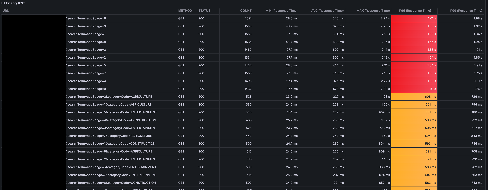

p95 기준으로 결과는 3개로 나눠진다.

- /apps?searchTerm=app&page={page} : 1.5 ~ 1.6s
- /apps?searchTerm=app&categoryCode={categoryCode}&page={page} : 500 ~ 600ms
- /apps/{appId} : 40ms ~ 200ms

### 1.2.2 CPU 및 메모리 사용률

**Total**

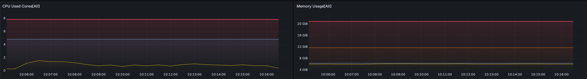

전체 CPU, Memory 는 늘어나지 않았다 -> 노드의 추가적인 증설은 없었다.

**사용률**

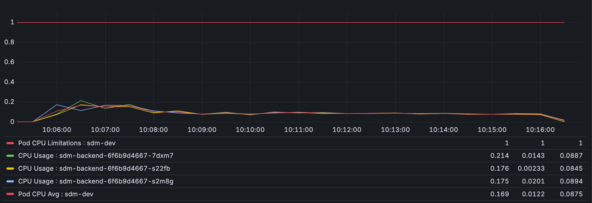

### 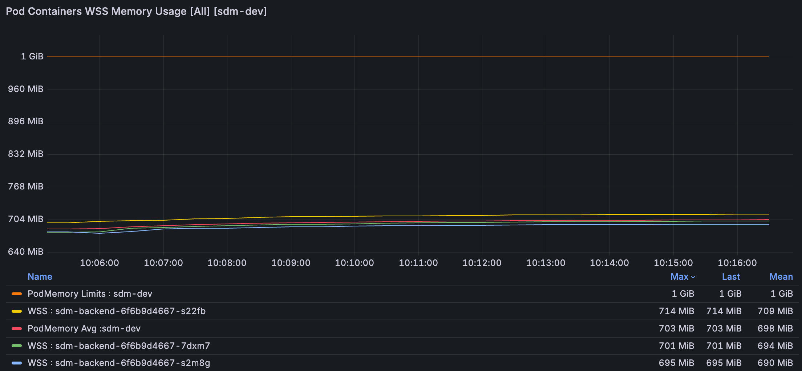

CPU, Memory 사용량도 안정적이다.

### 1.2.3 데이터베이스 지표

**커넥션**

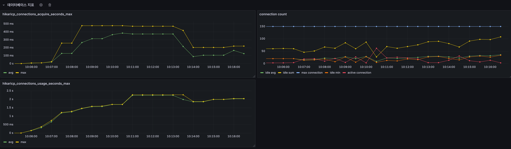

connections_acquire_seconds 가 최대 400 ~ 500ms 까지 늘어났다.

1. **idle 커넥션이 0이 된 적은 없음**
   - 즉, 항상 즉시 사용할 수 있는 커넥션이 남아 있었다는 뜻
   - 풀 사이즈(150)에 비해 idle이 수십 개 남아 있었음
   - 보통 `idle=0`일 때 acquire 대기시간이 급격히 늘어나는데, 지금은 그건 아닌 듯 하다.
2. 그런데도 **acquire 시간이 300~400ms**까지 치솟음
   - 풀 고갈 때문은 아니고,
   - 원인은 "풀에 커넥션이 없어서 대기"가 아니라, 풀에서 커넥션을 빌려오고 실제 DB 연결을 확인하는 과정에서 지연이 발생했을 가능성이 크다.
   - 예: DB 서버가 바빠서 `validationQuery` 응답이 느림, 네트워크 레이턴시 증가, 혹은 DB 자체 응답 지연

**DB CPU**

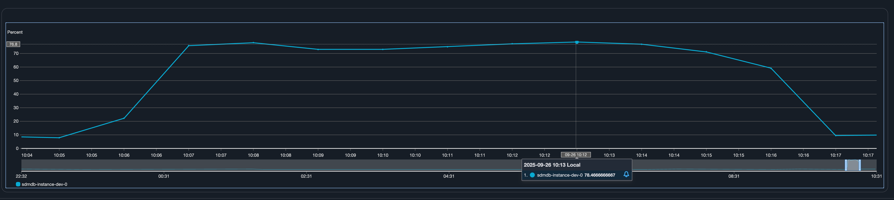

DB CPU 는 78% 까지 올라갔다.

**DB Waits**

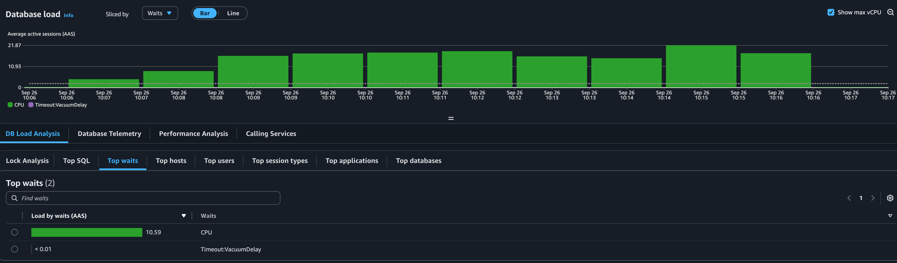

DB 자체의 부하때문에 쿼리 응답이 지연되었다고 판단

**Top SQL**

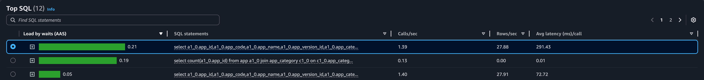

AAS 가 높은 SQL 은 역시 아래 순서대로의 SQL 문임

- /apps?searchTerm=app&page={page}
- /apps?searchTerm=app&categoryCode={categoryCode}&page={page}
- /apps/{appId}

## 3.1 해결

해결 방법은 쿼리 최적화밖에 없으나, 현재 쿼리가 복잡하지 않아 인스턴스 증설까지 염두에 둔다.

### 3.1.1 해결 1: 쿼리 수정 

앱 검색 시 불필요한 join 을 제거한다.

**수정 전 쿼리**

category_code 로 찾는 경우도 있어서 기본적으로 app_category 와 조인하였으나, 동적으로 join 하도록 변경했다.

```sql
select * 
from app 
join public.app_category ac on app.app_category_id = ac.app_category_id
where lower(app.app_name) like '%app%' and status = 'RELEASED'
order by app.released_at desc, app.created_at desc limit ? offset ?;
```

**수정 후 쿼리**

```sql
select * 
from app 
where lower(app.app_name) like '%app%' and status = 'RELEASED'
order by app.released_at desc, app.created_at desc limit ? offset ?;
```

#### 3.1.1.1 Response Time

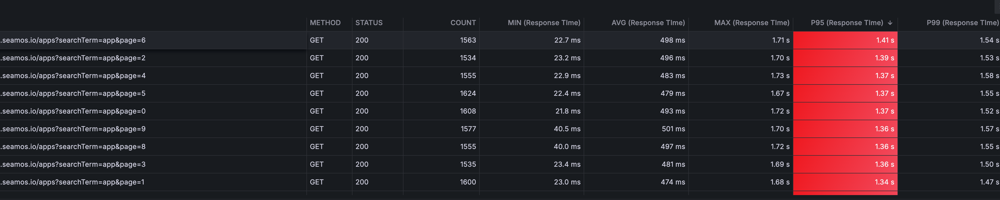

**p95 기준 1.3s ~ 1.4s 로 개선되었으나 아직 1s 이상이다.**

#### 3.1.1.2 데이터 베이스 지표

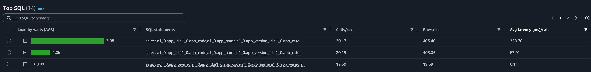

avg latency (ms) 가 291ms 에서 228ms 로 줄어들었음. CPU 사용률도 74% 정도로 개선되었으나 충분하지 않음

### 3.1.2 해결 2: Projection 사용과 Category Cache

app 전체만 가져오는 게 아니라 Response 에 필요한 데이터만 추출한다.

필요한 데이터를 AppSummaryData 로 가져온다.

```kotlin
class AppSummaryData @QueryProjection constructor(
    val appId: Long,
    val appName: String,
    val shortDescription: String,
    val mainImage: String,
    val appCategoryId: Long,
    val pricingType: PricingType,
    val price: Float?,
    val discount: Float?,
)
```

그러면 SQL 은 아래와 같이 나간다.

```sql
select app_id, app_name, short_description, main_image, app_category_id, pricing_type, price, discount 
from app
where status= ? 
order by app.released_at desc, app.created_at desc limit ? offset ?;
```


하지만 이렇게 하면 appCategory 정보를 lazy loading 으로 가져올 수 없다.

방법은 2가지인데 AppSummaryData 에 category 정보를 포함한 다음 마찬가지로 AppCategory 와 join 을 한다. 다른 방법은 AppCategory 정보를 메모리에 가지고 있는 것이다.

나는 AppCategory 정보를 메모리에 넣었는데, 그 이유는 AppCategory 테이블의 row 수가 3개에 불과하기 때문이다. 다만 데이터를 모델링할 때 AppCategory 에도 여러 정보가 포함될 수 있고, 동적으로 수정이 편하게 하려고 Enum 이 아닌 DB 테이블로 관리하고 있다.

따라서 아래와 같은 클래스를 만든다.

```kotlin
class AppCategoryService(
    private val appCategoryRepository: AppCategoryRepository,
) {

    private val appCategoryCache: HashMap<Long, AppCategory> = HashMap()

    init {
        appCategoryRepository.findAll().forEach { appCategoryCache[it.appCategoryId!!] = it }
    }

    fun getAppCategory(categoryId: Long): AppCategory {

				return appCategoryCache[categoryId] ?: throw AppCategoryNotFoundException()
    }
}
```

최초 로딩 시 appCategoryRepository 에서 모든 카테고리를 HashMap 에 넣는다. 그리고 DB 가 아니라 hashmap 에서 가져온다.

> 다음을 고려해야 한다.
>
> 1. n 분마다 DB 업데이트
> 2. 캐시에서 notFound 이면 에러를 반환하는 게 아니라 DB 조회 후 있으면 캐시에 저장하고 반환, 없으면 에러 반환

#### 3.1.2.1 Reponse Time

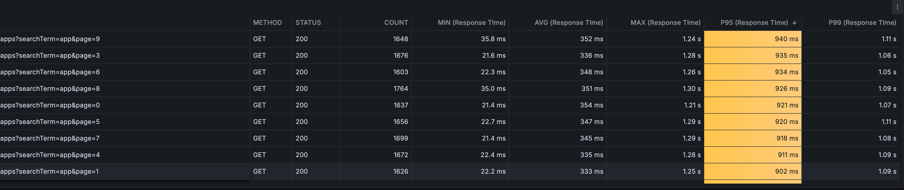

약 800 ~ 950ms 로 줄어들었다.

#### 3.1.2.2 데이터베이스 지표


DB 의 CPU 사용률은 약 65% 까지 줄어들었다.


