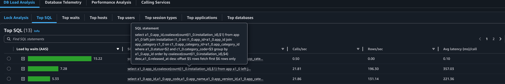
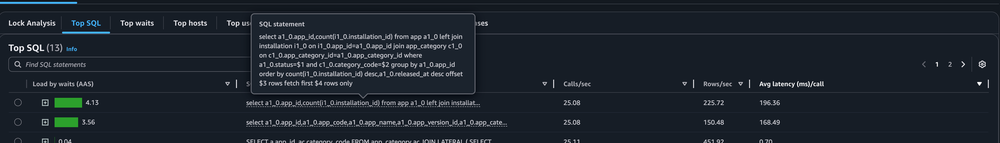

```sql
SELECT a.app_id, ac.category_code 
FROM app_category ac JOIN LATERAL 
( 
  SELECT app.app_id, app.released_at, app.created_at 
  FROM app 
  WHERE app.app_category_id = ac.app_category_id and app.status = 'RELEASED' 
  ORDER BY app.released_at DESC, app.created_at DESC LIMIT $1 
) a ON true 
ORDER BY ac.category_code, a.released_at DESC, a.created_at DESC
```

CREATE INDEX idx_app_category_status_released_created
ON app (app_category_id, status, released_at DESC, created_at DESC);


```sql
SELECT app_id, category_code
FROM (
  SELECT a.app_id,
         ac.category_code,
         ROW_NUMBER() OVER (
           PARTITION BY ac.app_category_id
           ORDER BY a.released_at DESC, a.created_at DESC, a.app_id desc
         ) AS rn
  FROM app_category ac
  JOIN app a
    ON a.app_category_id = ac.app_category_id
   AND a.status = 'RELEASED'
  order by released_at desc, a.created_at desc, app_id desc
) ranked
WHERE rn <= 9
ORDER BY category_code, app_id desc;
```

0.xx ms 로 떨어짐


# 그 다음꺼



```sql
SELECT a1_0.app_id,
       COALESCE(COUNT(i1_0.installation_id), $1)
FROM app a1_0
LEFT JOIN installation i1_0
       ON i1_0.app_id = a1_0.app_id
JOIN app_category c1_0
       ON c1_0.app_category_id = a1_0.app_category_id
WHERE a1_0.status = $2
  AND c1_0.category_code = $3
GROUP BY a1_0.app_id
ORDER BY COALESCE(COUNT(i1_0.installation_id), $4) DESC,
         a1_0.released_at DESC
OFFSET $5 ROWS FETCH FIRST $6 ROWS ONLY;
```

```kotlin
val pageOrder = pageable.sort.getOrderFor("downloads") ?: Sort.Order.desc("downloads")

        val downloadOrder = if(pageOrder.isAscending) {
            installation.count().coalesce(0L).asc()
        } else {
            installation.count().coalesce(0L).desc()
        }

        // 앱 조회 쿼리 실행
        val results = queryFactory
            .select(
                app.appId,
                installation.count().coalesce(0L).`as`("downloadCount")
            )
            .from(app)
            .leftJoin(installation).on(installation.app.appId.eq(app.appId))
            .where(builder)
            .groupBy(app.appId)
            .orderBy(downloadOrder, app.releasedAt.desc())
            .offset(pageable.offset)
            .limit(pageable.pageSize.toLong())
            .fetch()
```

수정

```kotlin
// 다운로드 수 정렬 방향 가져오기
  val pageOrder = pageable.sort.getOrderFor("downloads") ?: Sort.Order.desc("downloads")

  val installCount = installation.count().`as`("installCount")

  val downloadOrder = if(pageOrder.isAscending) {
      installCount.asc()
  } else {
      installCount.desc()
  }

  // 앱 조회 쿼리 실행
  val results = queryFactory
      .select(
          app.appId,
          installCount
      )
      .from(app)
      .leftJoin(installation).on(installation.app.appId.eq(app.appId))
      .where(builder)
      .groupBy(app.appId)
      .orderBy(downloadOrder, app.releasedAt.desc())
      .offset(pageable.offset)
      .limit(pageable.pageSize.toLong())
      .fetch().toList()
```

--> 추가적인 정렬이 필요한 "랭킹"은 redis 로 빼자 (실시간성이 필요없음)



# app 검색

```
CREATE INDEX idx_app_status_category ON app (status, app_category_id, released_at);
--
CREATE EXTENSION IF NOT EXISTS pg_trgm;
CREATE INDEX idx_app_name_trgm ON app USING gin (lower(app_name) gin_trgm_ops);
```


--왜 기본 인덱스가 안 쓰일까?

B-Tree 인덱스는 문자열 앞부분(prefix) 이 고정된 경우에만 효율적입니다.
→ %로 시작하면 인덱스를 못 씁니다.

게다가 lower() 함수가 걸려 있어서, 그냥 app_name 인덱스는 더더욱 못 씁니다.

- g_trgm 확장을 사용하는 Trigram GIN 인덱스가 `ILIKE` (대소문자 무시) 검색도 잘 지원합니다.


실행계획 (trgm 인덱스 추가전)

```
Sort  (cost=1985.73..1985.90 rows=67 width=799)
"  Sort Key: app.released_at DESC, app.created_at DESC"
  ->  Nested Loop  (cost=0.00..1983.70 rows=67 width=799)
        Join Filter: (ac.app_category_id = app.app_category_id)
        ->  Seq Scan on app_category ac  (cost=0.00..1.07 rows=1 width=120)
              Filter: ((category_code)::text = 'ENTERTAINMENT'::text)
        ->  Seq Scan on app  (cost=0.00..1977.60 rows=402 width=679)
              Filter: (lower((app_name)::text) ~~ '%app%'::text)

```

추가 후

```
Sort  (cost=483.36..483.52 rows=67 width=799)
"  Sort Key: app.released_at DESC, app.created_at DESC"
  ->  Nested Loop  (cost=60.60..481.32 rows=67 width=799)
        ->  Seq Scan on app_category ac  (cost=0.00..1.07 rows=1 width=120)
              Filter: ((category_code)::text = 'ENTERTAINMENT'::text)
        ->  Bitmap Heap Scan on app  (cost=60.60..478.91 rows=134 width=679)
              Recheck Cond: ((lower((app_name)::text) ~~ '%app%'::text) AND (ac.app_category_id = app_category_id))
              ->  BitmapAnd  (cost=60.60..60.60 rows=134 width=0)
                    ->  Bitmap Index Scan on idx_app_name_trgm  (cost=0.00..14.83 rows=402 width=0)
                          Index Cond: (lower((app_name)::text) ~~ '%app%'::text)
                    ->  Bitmap Index Scan on idx_app_category_status_released_created  (cost=0.00..45.39 rows=3347 width=0)
                          Index Cond: (app_category_id = ac.app_category_id)

```


방법 : 

1. 필요한 column 만 찾기
