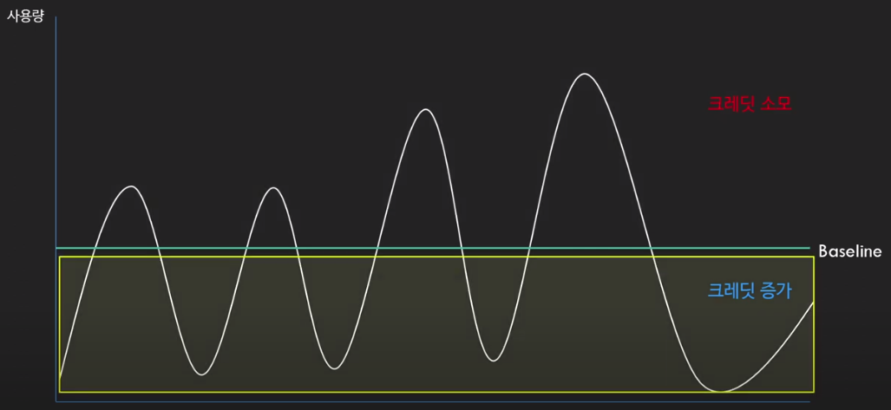

<Header/>

[[toc]]

# T 인스턴스와 크레딧

AWS 에서 인스턴스 유형은 범용, 컴퓨팅, 메모리, 스토리지 등등 그 목적에 맞춰 세분화되어있다. 그중에서 T 계열은 가변적인 CPU 작업 부하에 적하다. 그 이유는 "크레딧" 으로 CPU 를 사용하기 때문이다.

## T 타입 인스턴스의 특징

T 타입 인스턴스는 Burstable performance instance 로, CPU 를 사용하려면 **CPU 크레딧**이 필요하다. CPU 크레딧 하나로 vCPU 가 1분동안 100% 를 사용할 수 있다. 반대로 CPU 를 덜 사용하면 다시 크레딧이 충전된다.

만약 크레딧이 부족하다면 CPU 를 더 이상 쓸 수 없기 때문에 CPU 사용량에 제한을 받게 된다. 그러한 경우에서 많은 CPU 가 필요한 작업을 한다면 애플리케이션이 동작하지 않거나 서버가 다운되는 등의 상황이 발생한다.

## Baseline

CPU 를 얼마나 사용해도 되고, 기준이 얼마인지는 각 타입마다의 **Baseline** 에 따라 다르다. Baseline 은 T 유형에 정해진 사용량 기준이다. 아래는 T 타입의 Baseline 이다.

여기서 vCPU 당 기준 사용률이 Baseline 이다. 프리티어에서 자주 사용되는 `t2.micro` 는 10% 다.

위 그림과 같이 CPU 사용량이 **Baseline 보다 낮다면 크레딧이 증가**하고, CPU 사용량이 **높다면 크레딧이 소모**된다.

따라서 T 타입을 사용할 때는 평소에는 Baseline 밑으로 CPU 사용량을 유지하다가, 필요할 때 모아둔 크레딧으로 사용량을 증가시키는 것이 이상적인 사용방법이다.

## 크레딧의 사용과 회복

대부분의 블로그 글에서 사용과 회복을 분리하고 있는데, 사용과 회복은 사실 동시에 이루어진다. RPG 게임을 예로 들어서, 캐릭터의 HP 는 최대 100 이고 초당 10 씩 회복된다고 해보자. 여기서 초당 5 의 데미지를 입으면 캐릭터는 마치 초당 5 씩 회복하는 것처럼 보인다. 하지만 실질적으로는 회복과 데미지가 동시에 적용되고 있다. 이걸 염두에 두고 설명해보자.

먼저 **사용**부터 보면, 크레딧은 1개 당 vCPU 1개를 100% 수준으로 1분 동안 사용할 수 있게 해준다. 50% 수준이면 2분 동안 사용할 수 있다. 만약 크레딧이 10개 있다면 50% 수준으로 20분을 사용할 수 있는 것이다. 하지만 크레딧이 10개가 있다고 해서 50% 수준으로 20분만 사용하고 끝이 아니다. 그 20분 동안 회복되는 크레딧이 있을테니까 말이다.

T 타입의 크기마다 회복되는 CPU 크레딧이 다르다. t2.micro 기준으로 시간 당 6개가 회복되고 총 144개가 최대치이다. 아래 공식을 따른다.

> 시간 당 회복 크레딧 = vCPU 개수 x Baseline x 60minute 
>
> 최대 보유 크레딧 = 시간 당 회복 크레딧 x 24

예를 들어서, t2.micro 가 크레딧 100개가 있고 **20% CPU 수준**으로 사용한다고 해보자. t2.micro 는 시간 당 6개의 크레딧을 회복한다. 그리고 시간 당 12개의 크레딧을 소모한다. 결론적으로 시간 당 6개의 크레딧이 추가로 필요해지는 것이다. 따라서 크레딧 100개가 있을 때 총 16시간 가량을 20% 수준으로 유지할 수 있다.

좀 더 CPU 사용량을 낮춰서 **10% CPU 수준을 유지**한다고 하면 회복되는 크레딧 개수와 소모되는 크레딧 개수가 같아진다. 따라서 t2.micro 는 10% 수준에서는 계속 사용할 수 있다.

반대로 **CPU 수준이 5%** 라면 어떨까? 시간 당 회복되는 크레딧 개수는 6개로 동일한데, 소모되는 크레딧 개수는 3개이다. 따라서 <u>시간 당 3개의 크레딧이 적립되게 된다.</u>

## 크레딧이 다 사용된다면?

위에서 간략하게 크레딧이 다 소모되었을 때 CPU 사용에 제한을 받는다고 했는데, T 타입은 크게 2가지 모드가 있습니다. 바로 **일반모드(Standard Mode) 와 무제한 모드(Unlimited Mode)** 다.

**일반모드** 에서는 크레딧을 다 소모했을 때 Baseline 위로는 CPU 사용이 불가능하다. 즉, t2.micro 기준으로 10% 의 CPU 만 사용할 수 있다.

반면 **무제한 모드** 에서는 크레딧을 다 소모해도 제든지 원하는 기간 동안 높은 CPU 사용률을 유지할 수 있다. 대신 해당 CPU 사용량에 대해 시간당 CPU 인스턴스 요금이 적용된다.

# 프로젝트의 기준 사용률은?

그렇다면 이 크레딧 개념을 t2.micro 를 사용하는 프로젝트에 적용시켜보자. 조건은 아래와 같다.

- 트래픽이 10시부터 저녁 10시까지 12시간 동안 지속 발생
- 12시간 이후에는 baseline 을 넘길만큼의 트래픽이 없음
- 12시간 동안 트래픽을 감당하기 위해선 평균 90% 수준의 CPU 사용량이 필요
- 트래픽이 없을 때는 2% 의 CPU 사용량

## 기준 사용률 계산

트래픽이 거의 없는 12시간 동안 57.6개의 크레딧이 회복된다. ((6크레딧 - 2% * 60분) * 12) 그러면 57.6개의 크레딧을 720분 (12시간) 동안 나눠써야 하는데, 분당 0.08개의 추가 크레딧 소모가 가능하다. 그러면 <u>12시간 동안 평균 18% 의 CPU 사용량이 최대</u>이다. 90% 는 한참 미치지 못한다.

## 다른 방법 사용해보기

일단 t2.micro 인스턴스 1개로는 원하는 성능이 나오지 않기 때문에 다른 방법을 찾아봤다.

1. 무제한 모드 사용
2. 다른 T 타입 인스턴스 사용
3. 다른 인스턴스 타입 사용

### 무제한 모드(Unlimited Mode)

t2.micro 를 무제한 모드로 바꿨다고 가정하고 추가되는 요금을 계산해보자

> 시간 당 vCPU 가격 * vCPU 개수 * 초과된 CPU * 초과된 시간

시간 당 vCPU 의 가격은 5센트다. 공식에 대입해보면 (5센트 * 1 * 72% * 24) 로 하루에 0.864 달러다. 30일이면 26달러 정도된다. 26달러면 t2.micro 서버를 3개 더 증설할 수 있는데, 이 가격으로 무제한 모드로 사용하는 건 적절치 못한 선택인 듯 하다.

### 다른 최적의 t 타입 사용

위 무제한 모드를 적용했을 때 가격은 t2.micro 인스턴스 가격 포함 한달에 총 34달러다. 그렇다면 T 타입 제품군 중 한달에 34달러 미만인 제품부터 찾아야 한다.

medium 정도까지가 30달러 정도인데 그중에서는 가장 싼 t4g.midium 으로 계산해보자. 이 인스턴스 타입은 ARM 기반의 AWS Graviton2 프로세서를 사용하는데 AWS 에서는 t3 에서 사용하는 프로세서보다 더 좋다고 한다. 어쨋든 한 달 가격은 **24달러**가 된다. 자원은 아래와 같다.

- vCPU 2개, 메모리 4GiB
- Baseline 20%, 시간 당 획득 크레딧 24개

그리고 CPU 가 2개이므로 단순 계산으로 50% 의 성능이 필요하다고 가정해보자. 이 부분은 실제로 돌려봐야 알지만, 컨텍스트 스위칭, 병렬 작업이 얼마나 있는지 등등에 따라 매우 달라진다. 어쨋든 50% 성능이 필요하다고 생각하고 계산했다.

트래픽이 거의 없는 12시간 동안 259.2개의 크레딧이 회복된다. ((24크레딧 - 2% * 60분 * 2vCPU) * 12) 그러면 259.2개의 크레딧을 720분동안 2개의 CPU 가 나눠써야 한다. CPU 당 0.18개/m 의 추가 크레딧 소모가 가능해진다. 그러면 <u>12시간 동안 평균 38% 의 CPU 사용량이 최대</u>가 된다. 그렇다면 12% 는 다시 버스트 모드로 사용해야 한다.

(5센트 * 2 * 0.12 * 24) 를 하면 0.288달러로, 한 달에 8.64달러가 된다. 그러면 총 가격은 **32.64달러**로 t2.micro 보다 2달러 가량 싸다. 하지만 메모리도 t2.micro 에 비해 4배나 되는 점을 생각하면 2달러보다는 더 큰 값어치이기는 하다.

### 다른 인스턴스 타입 사용

이렇게 지속적으로 CPU 를 소모하는 인스턴스는 T 타입을 사용하는 건 사실 맞지 않다. T 타입은 CPU 사용량을 크레딧으로 모아놨다가 한번에 터트려서 사용하는(Burst) 타입이다. 12시간 동안 높은 CPU 사용량이 필요하면 다른 인스턴스 타입을 찾는 게 맞다.

AWS 에서 제공하는 인스턴스 타입은 여러가지가 있는데, 그중에서도 <u>범용 인스턴스인 m6g</u> 로 검색해봤다.

**m6g.medium 의 월 가격은 34달러이다.** 그것보다 한 단계 높여서 vCPU 를 2개 이상하려면 가격이 68달러로 올라간다. saving plan 이나 예약 인스턴스면 절반으로 싸지긴 하지만 그건 T 타입도 마찬가지라서 고려하진 않았다.

# 결론

뭘 하든 제가 원하는 성능을 가지려면 30달러는 지출해야 한다고 생각해야하고, 사실 CPU 성능도 더 필요하긴 해서 m6g.large 정도를 구매한다고 생각하면 한 달에 68달러는 지출해야 한다. 스케일 아웃 혹은 스케일 업이 필요하다는건데 그전에 CPU 를 최적화할 수 있는 방법이 없을까 고민해봐야겠다.

<Footer/>
