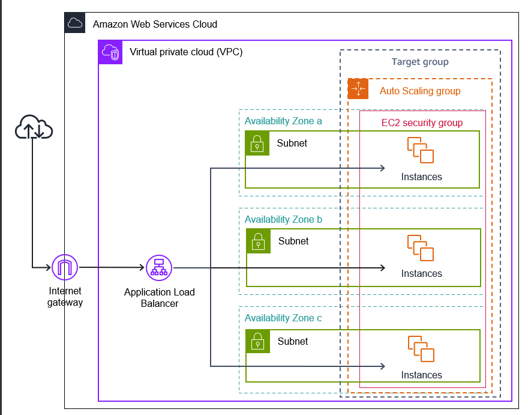

<Header/>

[[toc]]

## 보안그룹이란?

 보안그룹(Security Group) 은 일종의 가상 방화벽과 같은 형태이다. IP, Port 등 3, 4 계층에서 작동하며 특정 요청만 허용한다. AWS 의 비슷한 서비스인 NACL 과 다르게 허용 규칙만 있고 거부 규칙은 없다. 따라서 허용되지 않는 모든 ip 및 port 는 거부된다.

 보안그룹은 주로 EC2, RDS 등 엔드포인트로 통신하는 서비스에 붙지만, **정확히는 ENI 에 할당된다.** EC2 콘솔의 ENI 를 보면 어떤 ENI 에 어떤 보안그룹이 할당되어있는지 확인할 수 있다.

 ENI 는 NIC 과 같은 역할을 한다. ENI 는 EC2 에 여러 개가 붙을 수 있어서 관리 Network 대역을 나눠서 사용하며 ENI 마다 통신하는 네트워크를 관리할 수 있다.

## 보안그룹 참조

 보안그룹 참조는 특정 보안그룹에서 오는 모든 트래픽을 허용한다는 뜻이다. 예를 들어서 아래와 같이 로드밸런서와 EC2 가 연결될 때, 로드밸런서의 보안그룹을 EC2 의 보안그룹 인바운드로 넣을 수 있다.

 특히 ALB(application loadbalancer) 는 EIP 를 할당할 수 없고, IP 가 계속 변경되기 때문에, 보안그룹에 특정 IP 를 지정해 ALB 의 트래픽을 허용하기 힘들다. 따라서 ALB 의 ENI 에 있는 보안그룹을 전부 허용하는 형식으로 보안그룹 참조를 사용한다. 아래와 같이 Inbound Source 에 보안그룹을 넣을 수 있다.

## 보안그룹 참조 원리

 앞서 설명했듯이 ENI 마다 어떤 보안그룹이 할당되었는지 알 수 있고 반대도 마찬가지다. 따라서 **보안그룹을 참조한다는 것은 해당 보안그룹을 가지고 있는 ENI 의 private ip 를 허용**한다는 것이다. 여기서 중요한 것은 보안그룹 참조가 VPC 내에서만 동작한다는 것이다.

 예를 들어 ec2 A -> ec2 B 로 연결할 때, 보안그룹 참조로 연결되어 있다고 하더라도 ec2 A 가 ec2 B 의 public ip 로 통신을 시도한다면 연결이 되지 않는다. (private hosted zone 이 없다고 가정) 왜냐하면 ec2 A -> IGW(internet gateway) -> ec2 B 로 흐름이 생기기 때문에 VPC 내에서는 internet gateway -> ec2 B 로 통신을 하게 되고, ec2 B 의 보안그룹 입장에서는 IGW 의 트래픽을 허용하고 있지 않기 때문이다. 해당 트래픽이 ec2 A 의 보안그룹에서 시작되었다고 하더라도, ec2 B 의 입장에서는 IGW 의 보안그룹에서 온 트래픽이기 때문에 보안그룹 참조가 적용되지 않는다.

 따라서 보안그룹 참조 시에는 VPC 내에서 통신할 수 있도록 private ip 를 사용한다든지, private hosted zone 을 구성해야 한다.

>  참고
>  ENI 당 보안그룹은 최대 5개 지정 가능. 보안 그룹은 최대 60개의 규칙을 가질 수 있음. 따라서 ENI 당 설정되는 규칙은 최대 300개임. 이를 초과하여 설정하고 싶을 경우 AWS 에 문의해야 함

<Footer/>
