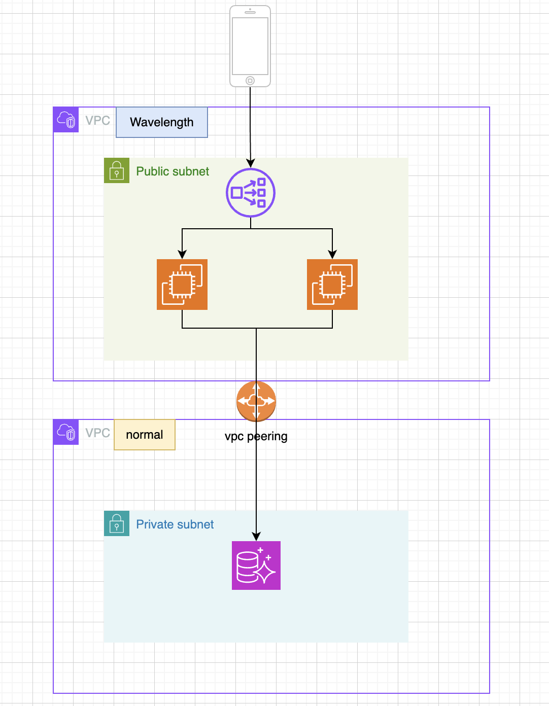

<Header />

[[toc]]

<Header/>

최근 Savings Plan 좀 구매하려고 요금표를 보다가 특이한 요금 항목 하나를 발견했다.
 `ap-northeast-2-wl1-sel-wlz-1(서울)`, `ap-northeast-2-wl1-cjj-wlz-1(대전)`이라는 이름의 리전인데 기존에 보던 일반 리전(ap-northeast-2)과는 다른 형태였기에 간단히 정리해보았다.

------

# 1. Wavelength Zone이란?

AWS Wavelength Zone은 특정 통신사의 **5G 네트워크 엣지**에 AWS 인프라를 직접 배치한 물리적 영역이다. 클라우드 리전은 대개 데이터센터에 위치하지만, Wavelength Zone은 **모바일 사용자와 가까운 곳, 즉 통신사 기지국 근처에 존재**한다.

이로 인해 모바일 기기에서 Wavelength Zone으로의 네트워크 지연(latency)이 극단적으로 낮아지며, **5G 사용자 기준 왕복 5~10ms 수준의 응답 시간**을 구현할 수 있다.

현재 한국에서는 **SKT와의 협업**을 통해 서울과 대전에 Wavelength Zone 이 개설되어 있다.

------

# 2. Wavelength를 사용하면 뭐가 좋은가?

### 초저지연 네트워크

  - 5G 기기에서 Wavelength EC2까지 직접 연결됨
  - 기존 AWS 리전 대비 **3~10배 낮은 지연 시간**

  ### 엣지 단의 컴퓨팅

  - 데이터를 중앙 리전까지 전송하지 않고, **사용자 가까운 곳에서 실시간 처리** 가능
  - 실시간 게임, 증강현실(AR), 자율주행, CCTV 영상 분석 등과 궁합이 좋음

  ### 기존 AWS 리소스와 연동

  - Wavelength Zone에 EC2 인스턴스를 배포하고,
  - VPC Peering 또는 Transit Gateway를 통해 일반 리전의 데이터베이스나 스토리지 서비스와 연동 가능

------

# 3. 사용 사례 및 아키텍처

### 예시: 5G 기반 실시간 게임 서버

- 모바일 게임 사용자는 SKT 5G망을 통해 플레이
- 게임 서버는 Wavelength Zone에 위치
- 사용자 → SKT망 → Wavelength EC2 → 게임 서버 응답 (지연 시간 최소화)

****

------

# 4. 한계점은?

### 통신사 의존성

  - 서울 및 대전 Wavelength Zone은 **SKT 전용**
  - KT나 LG U+ 이용자는 Wavelength의 초저지연 효과를 얻을 수 없음

  ### 제한된 서비스

  - EC2, EBS, NLB 등 일부 리소스만 지원
  - ALB, S3, RDS 등 고수준 서비스는 **일반 리전에서만 사용 가능**

  ### 단일 가용영역

  - Wavelength Zone은/ 현재 **각 지역에 1개 AZ만 존재**
  - 고가용성 및 다중 AZ 설계를 고려할 수 없음

### 비싼 데이터 전송 요금

- 기본 리전의 요금은 $0.126/GB (첫 10TB)
- wavelength 는 $0.1386/GB (첫 10TB)

# 결론

특정 통신사에서 제공하는 통신사 전용 서비스를 개발할 때 해당 리전을 사용하면 될 것 같다.

# Ref.

1. https://aws.amazon.com/ko/wavelength/features/#topic-0

  

<Footer />