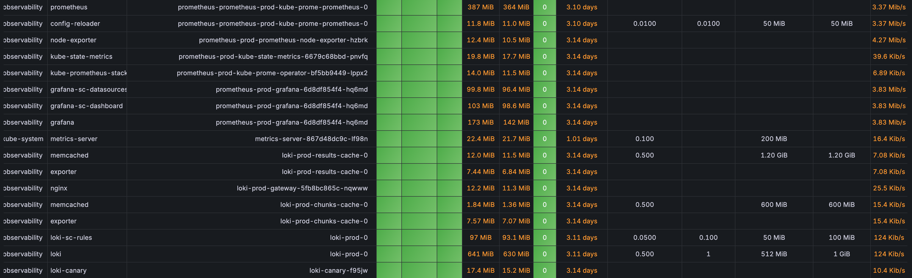
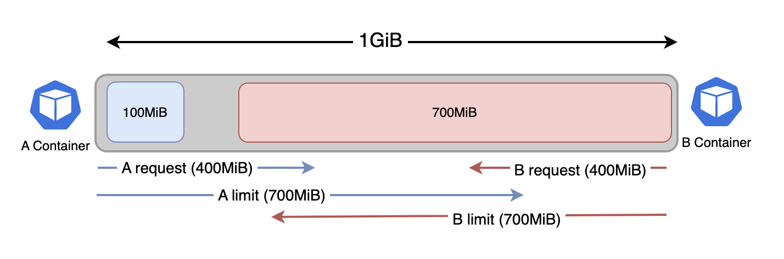

<Header />

[[toc]]

쿠버네티스로 배포된 서버를 운영하기 위한 마지막 단계 중 하나는 실제 부하를 테스트해보는 것이다. 그래서 테스트를 하기 전에 우선 파드별로 할당된 리소스가 적절한지 확인하려고 한다.

파드별로 cpu, memory 리소스가 필요한만큼 제대로 분배되지 못하면 노드의 리소스는 남음에도 파드의 리소스 제한으로 인해 남은 노드의 리소스를 모두 못쓰거나, 과도한 오버커밋때문에 중요한 파드가 꺼질 수도 있다.

# 모니터링 리소스

현재 모니터링 툴로 prometheus, grafana, Loki 를 사용하고 있다. 프로메테우스 스택은 오픈 소스라서 비용이 들지 않고 간단하게 배포할 수 있지만, 반대로 직접 서버를 관리해야 해서 리소스 관리에 신경써야 한다.



현재 프로젝트에서 c6g.xlarge 를 예산 상 3대 운용하려고 계획하고 있는데 그라파나를 확인해보면 모니터링 툴이 차지하는 메모리가 너무 크다(고 생각했다). 특히나 부하 상황에서 서버의 메모리가 많이 필요할 때 모니터링 툴에 의해 리소스가 제한되거나, 또는 메모리 경합으로 서버가 꺼지는 상황을 막아야겠다고 생각했다.

이 부분을 해결하기 위해 프로메테우스 스택의 리소스 requests, limits 를 설정해서 모니터링 리소스를 제한하려고 했으나 helm chart 에는 해당 설정이 없었다. 따라서 쿠버네티스의 Limits, Requests 를 다시 정리한 뒤에 **ResourceQuota** 와 **LimitRange** 를 사용해서 리소스를 제한하고자 했다.

# 컨테이너와 파드 사용량 제한: Limits, requests

간단하게 Limits 와 Requests 를 (아주 간단하게) 먼저 알아보자

## Limits 와 Requests

쿠버네티스는 limits 키워드를 통해 자원 사용량의 최대치를 제한시키고, requests 로 자원의 최소치를 보장한다.

```yaml
apiVerision: v1
kind: Pod
metadata:
	name: limited-pod
spec:
	containers:
	- name: nginx
	  image: nginx
	  resources:
	    limits:
	      cpu: 1000m
	      memory: 512MiB
      requests:
	      cpu: 100m
	      memory: 128MiB
```

쿠버네티스는 컨테이너의 자원활용률을 높이기 위해 **오버커밋**을 사용한다. 오버커밋이란 한정된 컴퓨팅 자원을 효율적으로 사용하기 위한 방법으로 사용할 수 있는 자원보다 더 많은 양을 VM 또는 컨테이너에게 할당하는 것이다.

예를 들어 아래처럼 메모리가 1GiB 인 노드에 각각 requests, limits 가 400MiB, 700MiB 인 컨테이너(파드)가 2개 있다고 가정하자.



물리적인 메모리는 1GiB 지만 A, B 각각에게 할당된 메모리의 합은 대략 **1.4GiB** 이다. 이처럼 유휴 자원이 남을 때 오버커밋을 통해 자원이 유동적으로 분배된다.

하지만 위와 같은 상황에서 A 컨테이너가 자신의 request 만큼 사용해야 한다면(자원의 경합) 어떤 일이 벌어질까?

# QoS 클래스

메모리는 압축불가능한(Incompressible) 자원으로 취급되기 때문에 메모리 사용량에 경합이 발생하면 우선순위가 낮은 파드를 강제 종료시킨다. 

여기서 중요한 부분은 **'메모리 자원 부족 시 어떤 파드가 먼저 종료돼야 하는가'**이다. 쿠버네티스는 PodSpec 에 정의된 **Requests** 와 **Limits** 값을 기반으로 파드별 QoS 클래스를 결정한다. QoS 클래스는 크게 3가지로 나뉜다.

> 쿠버네티스의 파드 Eviction 과 노드의 oom_killer 의 동작은 다르다. 파드 Eviction 시 QoS 는 고려되지 않는다. 이 부분은 다른 글에서 확인해보겠다.

## Guaranteed 클래스

**조건**

- 모든 컨테이너가 CPU/메모리 `requests` 와 `limits` 를 **동일한 값**으로 지정해야 한다.

**특징**

- 가장 높은 QoS 클래스.
- 노드 메모리 부족 상황에서 가장 마지막에 종료된다.
- SLA 수준이 높은 워크로드(예: DB, 핵심 API 서버)에 적합하다.

**예시**

```yaml
apiVersion: v1
kind: Pod
metadata:
  name: guaranteed-pod
spec:
  containers:
  - name: app
    image: nginx
    resources:
      requests:
        memory: "512Mi"
        cpu: "500m"
      limits:
        memory: "512Mi"
        cpu: "500m"
```

------

## BestEffort 클래스

**조건**

- 모든 컨테이너에 CPU/메모리 `requests` 와 `limits` 를 **아예 지정하지 않은 경우**

**특징**

- 가장 낮은 QoS 클래스
- 리소스 보장이 전혀 없으며, 메모리 부족 시 가장 먼저 종료된다.
- 배치 잡, 캐시, 테스트용 워크로드에 적합하다.

**예시**

```yaml
apiVersion: v1
kind: Pod
metadata:
  name: besteffort-pod
spec:
  containers:
  - name: app
    image: nginx
```

------

## Burstable 클래스

**조건**

- 컨테이너 중 하나라도 requests/limits 를 지정했지만, Guaranteed 조건을 만족하지 못할 때.
   (예: requests 와 limits 값이 다르거나, 일부 컨테이너만 지정된 경우)

**특징**

- BestEffort 보다는 높은 우선순위, Guaranteed 보다는 낮음.
- requests 만큼은 보장받고, limits 까지 사용할 수 있다.
- 대부분의 일반적인 워크로드가 여기에 해당한다.

**예시**

```yaml
apiVersion: v1
kind: Pod
metadata:
  name: burstable-pod
spec:
  containers:
  - name: app
    image: nginx
    resources:
      requests:
        memory: "256Mi"
        cpu: "250m"
      limits:
        memory: "512Mi"
        cpu: "500m"
```

------

## QoS 의 종료 순서

노드에서 메모리 부족이 발생하면, 쿠버네티스는 아래 순서로 파드를 종료시킨다.

1. **BestEffort** → 가장 먼저 종료
2. **Burstable** → requests 대비 초과 사용량이 큰 파드부터 종료
3. **Guaranteed** → 가장 마지막까지 유지

즉, 운영 환경에서 중요한 워크로드를 보호하려면 **Guaranteed** 로 설정하는 것이 바람직하다.

# ResourceQuota 와 LimitRange

QoS 설정은 결국 각 파드가 얼마만큼의 리소스를 **요청(requests)** 하고, 최대 얼마까지 사용할 수 있는지 **제한(limits)** 하는지에 달려 있다. 이를 클러스터 수준에서 강제하기 위한 도구가 바로 `ResourceQuota` 와 `LimitRange` 이다.

**helm chart 에서 limits, requests 를 정의하지 못하더라도 해당 리소스로 정의할 수 있다고 생각했다.**

### ResourceQuota

- 네임스페이스 단위로 총 리소스 사용량을 제한
- 특정 네임스페이스가 전체 클러스터 자원을 독점하지 못하도록 방지

**예시**

```yaml
apiVersion: v1
kind: ResourceQuota
metadata:
  name: compute-quota
  namespace: dev
spec:
  hard:
    requests.cpu: "2"
    requests.memory: "4GiB"
    limits.cpu: "4"
    limits.memory: "8GiB"
```

### LimitRange

- 네임스페이스 내 파드/컨테이너별 기본 requests/limits 값을 지정.
- 사용자가 명시하지 않아도 최소/최대 리소스를 강제할 수 있음.

**예시**

```yaml
apiVersion: v1
kind: LimitRange
metadata:
  name: limit-range
  namespace: dev
spec:
  limits:
  - default:
      cpu: "500m"
      memory: "512MiB"
    defaultRequest:
      cpu: "250m"
      memory: "256MiB"
    type: Container
```

# 내 선택은

나는 각 네임스페이스별로 현재 차지하고 있는 limits, requests 를 계산했다. 그리고 어떻게 ResourceQuota 와 LimitRange 를 설정할까 고민했다. 하지만 내 선택은 **"아무 것도 적용하지 않는다."** 였다 (!)

1. 프로메테우스가 부하를 많이 받고 메모리를 많이 사용할 일이 없다. 메모리를 많이 쓰는 loki 의 memcached 는 메모리 limit 가 설정되어있다.
   1. 따라서 서버 파드의 requests, limits 만 잘 설정하면 오버커밋에 의한 파드 축출이나 oom_kill 이 발생하지 않을거라 생각했다.
   2. 그리고 당연히 파드 축출 전에 오토스케일링이 되어야 한다.

2. 메모리 사용량은 그라파나에서 확인이 가능하다. 충분한 운영을 한 뒤 실제 사용량을 보고 결정해도 늦지 않다.

오히려 ResourceQuota 나 LimitRange 를 설정하면 복잡성만 늘어난다. LimitRange 는 namesapce 의 리소스인데, 모든 파드에 대해 일괄적으로 적용된다. 따라서 파드별 특성을 고려해 default 값을 적용할 수가 없다.

또한 ResourceQuota 는 환경이 커졌을 때 문제가 발생할 수 있다고 생각했다. 노드가 늘어날 수록 데몬셋이 사용하는 리소스(node exporter 등)가 커지는데, ResourceQuota 로 namespace 를 제한해버린다면, 노드가 100개로 늘어났을 때 데몬셋 리소스를 100개를 생성하는 데 필요한 리소스가 ResourceQuota 에 의해 제한되어 생성되지 않을 수도 있겠다고 생각했다. 요컨대, 현재 단계에서 굳이 **"복잡성을 늘리지 말자"** 라고 생각했다.

따라서 나는 주요 파드에 대한 적절한 requests 와 limits 를 설정하기 위해 바로 부하 테스트 단계로 돌입했다.

<Footer/>