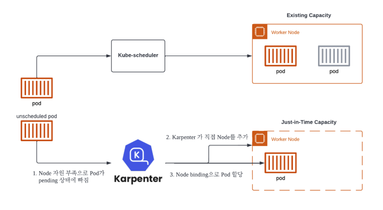

<Header />

[[toc]]

쿠버네티스 운영 환경의 두번째 단계는 오토스케일링 준비다. 이전에는 HPA + ASG 를 활용해서 오토스케일링을 구성했는데 이번에는 비용 효율적이고 속도가 빠른 Karpenter 를 활용해보려고 한다.

# Karpenter 란?

Karpenter는 대기(Pending) 파드를 감지해 요구사항에 꼭 맞는 노드를 수십 초–수분 내 신속히 띄우고, 유휴 노드는 합리적으로 줄여 비용과 가용성을 동시에 최적화하는 노드 오토스케일러이다. 기존 Cluster Autoscaler(CA)가 ASG(노드 그룹) 중심으로 스케일링하는 반면, Karpenter는 파드 요구사항을 직접 읽어 가장 알맞은 인스턴스(타입/크기/구역/구매옵션)를 고른 뒤 EC2 Fleet API로 곧장 노드를 띄운다. 이 구조 덕분에 더 빠른 확장과 세밀한 인스턴스 선택이 가능하게 된다.

## karpenter 동작원리

1. **Horizontal Pod AutoScaler(HPA)** 에 의한 Pod의 수평적 확장이 한계에 다다르면, Pod 는 적절한 Node 를 배정받지 못하고 pending 상태에 빠진다.
2. 이때 **Karpenter** 는 지속해서 unscheduled Pod 를 관찰하고 있다가, 새로운 Node 추가를 결정하고 직접 배포한다.
3. 추가된 Node가 Ready 상태가 되면 **Karpenter** 는 **kube-scheduler** 를 대신하여 pod 의 **Node binding** 요청도 수행한다.

## karpenter 특징

1. **간단한 구성**
- `NodePool`(스케일 정책) + `EC2NodeClass`(AWS 세부설정) 두 개의 CRD 로 구성됨
- ASG 중심의 복잡한 노드그룹 관리가 줄고, 선언형으로 일관되게 운용할 수 있음
- 서브넷/보안그룹은 태그 셀렉터로 자동 발견이 가능해 초기 세팅이 가벼움
2. **신속한 Node 추가/제거**
- Pending 파드를 즉시 감지해 EC2 Fleet로 곧바로 노드를 띄워 초 단위~수분 단위로 확장됨
- Spot 중단 신호(2분 전) 감지 시 자동 cordon/drain 후 보충까지 이어집니다.
3. **다양한 인스턴스 타입 적용**
- `requirements`로 인스턴스 카테고리/사이즈/아키텍처/가용영역/구매옵션(spot·on-demand)을 폭넓게 열어두면, Karpenter가 가격·용량 최적 조합을 찾는다.

## karpenter 를 선택한 이유

이전 회사에서 EKS 를 구성할 때 CPU 와 메모리가 특정 범위를 초과하면 ASG 가 노드를 추가하도록 구성했다. 하지만 노드가 추가되는 게 느렸고 적절한 트리거를 설정하는 것도 어려웠다. 또한 파드 하나를 띄우기 위해 큰 사이즈의 노드가 생성되는 것도 비용적으로 낭비라고 느껴졌다.

karpenter 는 이러한 점을 모두 커버할 수 있는 신속하고 비용 효율적인 선택이라고 생각되었다. 또한 여러 옵션의 조합을 manifest 파일로 관리할 수 있는 것도 좋았다. 반대로  ASG 는 인프라 레벨에서 조정해야 하는 부분이 번거로웠기도 했다.

# 설정 및 구성

## HPA 구성

HPA 란~

## karpenter 설정 및 구성

 

# Ref.

- [EKS User Guide](https://docs.aws.amazon.com/eks/latest/userguide/autoscaling.html)
- [Karpenter v1 문서](https://karpenter.sh/docs/concepts/nodepools/)
- [AWS 컨테이너 블로그](https://aws.amazon.com/blogs/containers/using-amazon-ec2-spot-instances-with-karpenter/)
- [Consolidation 효과 및 실무 주의점](https://aws.amazon.com/blogs/containers/optimizing-your-kubernetes-compute-costs-with-karpenter-consolidation/?utm_source=chatgpt.com)
- [EKS클러스터 Karpenter 적용기](https://devblog.kakaostyle.com/ko/2022-10-13-1-karpenter-on-eks/)
