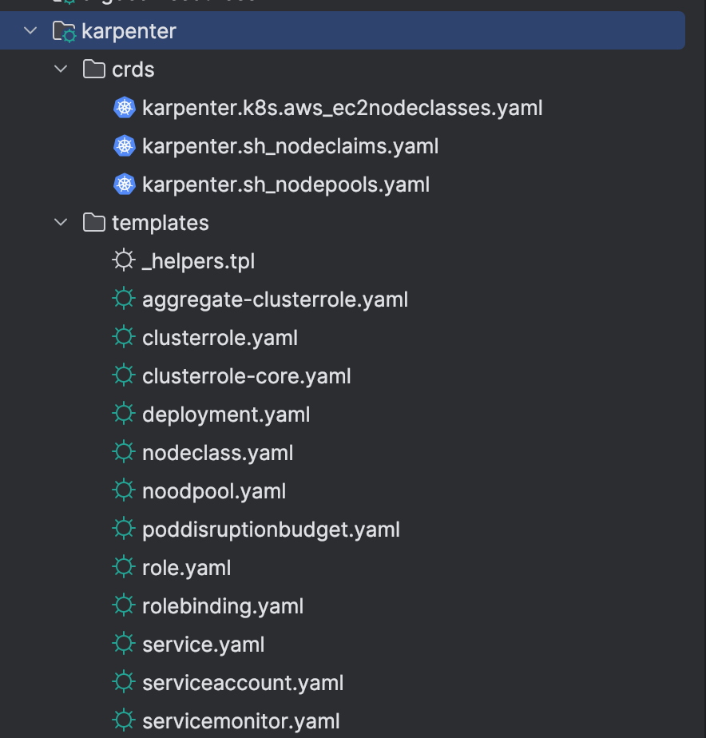

<Header />

[[toc]]

쿠버네티스 운영 환경의 두번째 단계는 오토스케일링 준비다. 이전에는 HPA + ASG 를 활용해서 오토스케일링을 구성했는데 이번에는 비용 효율적이고 속도가 빠른 Karpenter 를 활용해보려고 한다.

# Karpenter 란?

Karpenter는 대기(Pending) 파드를 감지해 요구사항에 꼭 맞는 노드를 수십 초–수분 내 신속히 띄우고, 유휴 노드는 합리적으로 줄여 비용과 가용성을 동시에 최적화하는 노드 오토스케일러이다. 기존 Cluster Autoscaler(CA)가 ASG(노드 그룹) 중심으로 스케일링하는 반면, Karpenter는 파드 요구사항을 직접 읽어 가장 알맞은 인스턴스(타입/크기/구역/구매옵션)를 고른 뒤 EC2 Fleet API로 곧장 노드를 띄운다. 이 구조 덕분에 더 빠른 확장과 세밀한 인스턴스 선택이 가능하게 된다.

## karpenter 동작원리


1. **Horizontal Pod AutoScaler(HPA)** 에 의한 Pod의 수평적 확장이 한계에 다다르면, Pod 는 적절한 Node 를 배정받지 못하고 pending 상태에 빠진다.
2. 이때 **Karpenter** 는 지속해서 unscheduled Pod 를 관찰하고 있다가, 새로운 Node 추가를 결정하고 직접 배포한다.
3. 추가된 Node가 Ready 상태가 되면 **Karpenter** 는 **kube-scheduler** 를 대신하여 pod 의 **Node binding** 요청도 수행한다.

## karpenter 특징

1. **간단한 구성**
- `NodePool`(스케일 정책) + `EC2NodeClass`(AWS 세부설정) 두 개의 CRD 로 구성됨
- ASG 중심의 복잡한 노드그룹 관리가 줄고, 선언형으로 일관되게 운용할 수 있음
- 서브넷/보안그룹은 태그 셀렉터로 자동 발견이 가능해 초기 세팅이 가벼움
2. **신속한 Node 추가/제거**
- Pending 파드를 즉시 감지해 EC2 Fleet로 곧바로 노드를 띄워 초 단위~수분 단위로 확장됨
- Spot 중단 신호(2분 전) 감지 시 자동 cordon/drain 후 보충까지 이어진다.
3. **다양한 인스턴스 타입 적용**
- `requirements`로 인스턴스 카테고리/사이즈/아키텍처/가용영역/구매옵션(spot·on-demand)을 폭넓게 열어두면, Karpenter가 가격·용량 최적 조합을 찾는다.

## karpenter 를 선택한 이유

이전 회사에서 EKS 를 구성할 때 CPU 와 메모리가 특정 범위를 초과하면 ASG 가 노드를 추가하도록 구성했다. 하지만 노드가 추가되는 게 느렸고 적절한 트리거를 설정하는 것도 어려웠다. 또한 파드 하나를 띄우기 위해 큰 사이즈의 노드가 생성되는 것도 비용적으로 낭비라고 느껴졌다.

karpenter 는 이러한 점을 모두 커버할 수 있는 신속하고 비용 효율적인 선택이라고 생각되었다. 또한 여러 옵션의 조합을 manifest 파일로 관리할 수 있는 것도 좋았다. 반대로  ASG 는 인프라 레벨에서 조정해야 하는 부분이 번거로웠기도 했다.

# 설정 및 구성

## HPA 구성

HPA(Horizontal Pod Autoscaler) 란 쿠버네티스의 오토스케일링 기능 중 하나로, 파드(Pod)의 개수를 자동으로 늘리거나 줄이는 컨트롤러다. 즉, 애플리케이션의 부하(예: CPU, 메모리 사용량)가 증가하면 파드를 더 띄워서 트래픽을 분산 처리하고, 부하가 줄어들면 파드 수를 줄여서 리소스를 절약한다.

HPA 는 파드만 늘려줄 뿐 노드까지 컨트롤하지는 못한다.

```yaml
apiVersion: autoscaling/v2
kind: HorizontalPodAutoscaler
metadata:
  name: backend-hpa
spec:
  scaleTargetRef:
    apiVersion: apps/v1
    kind: Deployment
    name: {{ .Values.backend.name }}
  minReplicas: {{ .Values.backend.replicaCount.min }}
  maxReplicas: {{ .Values.backend.replicaCount.max }}
  metrics:
    - type: Resource
      resource:
        name: cpu
        target:
          type: Utilization
          averageUtilization: 70   # CPU 70% 이상
    - type: Resource
      resource:
        name: memory
        target:
          type: Utilization
          averageUtilization: 90   # Memory 90% 이상
  behavior:
    scaleUp:
      policies:
        - periodSeconds: 120
          type: Pods
          value: 2 # 한번에 2개까지만 추가
      selectPolicy: Max
    scaleDown:
      policies:
        - periodSeconds: 120
          type: Pods
          value: 1 # 한번에 1개까지만 제거
      selectPolicy: Min

```

`{{ .Values.backend.name }}` 이름의 Deployment 에 대해 min, max 를 설정하고, target 을 넘게 되면 pod 에 대한 scale out 이 된다.

## karpenter 설정 및 구성

 karpenter 를 헬름 차트로 배포하는 방법은 두가지가 있다. 첫번째는 AWS ECR Public에 있는 Helm 차트 경로로 배포하는 방법이고 두번째는 차트를 직접 다운로드한 후 helm chart 로 구성하는 방법이다. 나는 이중 **차트를 직접 다운로드한 후 helm chart 로 구성**했다. 그 이유는 두 가지인데,

1. karpenter 을 구성하는 리소스가 비교적 간단함
   - templates/ 위치에 yaml 파일이 10개밖에 없다. 직접 구성해도 된다. 그래서 버전 관리도 간단할 것이라고 느껴졌다.
   - 마찬가지로 values.yaml 파일의 구성들도 간단하다.
2. Nodepool, EC2NodeClass 가 차트 경로에 없음
   -  오토스케일링을 구성하는 데 Nodepool, EC2NodeClass 두 리소스가 필요한데, 차트 경로에 없기 때문에 결국 직접 구성해줘야 한다. 따라서 처음부터 내가 직접 구성하는 게 낫겠다고 생각되었다.

### 리소스

다음 명령어로 리소스를 다운로드 받자

```
helm pull oci://public.ecr.aws/karpenter/karpenter \
  --version 1.6.3 \
  --untar
```

리소스 목록은 아래와 같다.



이 중 Nodepool(nodepool.yaml) 과 EC2NodeClass(nodeclass.yaml) 만 확인해서 추가해주면 된다.

**nodepool.yaml**

어떤 인스턴스타입을 사용할지, 어떤 존에 넣을지 등등을 선택할 수 있다. 그리고 limits 로 노드가 무한 확장되지 않도록 한다. 설정값은 [공식문서](https://karpenter.sh/docs/concepts/nodepools/) 참고

```yaml
apiVersion: karpenter.sh/v1
kind: NodePool
metadata:
  name: {{ .Values.custom.nodePool.name }}
spec:
  template:
    metadata:
      labels:
        Environment: {{ .Values.custom.environment }}
    spec:
      nodeClassRef:
        group: karpenter.k8s.aws
        kind: EC2NodeClass
        name: {{ .Values.custom.ec2NodeClass.name }}
      requirements:
        - key: "node.kubernetes.io/instance-type"
          operator: In
          values: [ "c6g.large", "c6g.xlarge", "c6g.medium", "m6g.xlarge", "m6g.medium", "m6g.large" ]
        - key: "topology.kubernetes.io/zone"
          operator: In
          values: [ "ap-northeast-2a", "ap-northeast-2b" ]
        - key: "kubernetes.io/arch"
          operator: In
          values: [ "arm64" ]
        - key: "karpenter.sh/capacity-type"
          operator: In
          values: [ "spot", "on-demand" ]
  disruption:
    consolidationPolicy: WhenEmptyOrUnderutilized
    consolidateAfter: 1m
  limits:
    cpu: "10"
    memory: 20Gi

```

**EC2NodeClass**

subnet 선택, ami 선택, 인스턴스 프로필 선택 등 EC2 설정을 넣을 수 있다. AMI 를 id 값으로 넣어야 해서 불편하다. (알아서 선택해줬으면 좋겠다.) 

```yaml
apiVersion: karpenter.k8s.aws/v1
kind: EC2NodeClass
metadata:
  name: {{ .Values.custom.ec2NodeClass.name }}
spec:
  amiFamily: AL2023
  subnetSelectorTerms:
{{ toYaml .Values.custom.ec2NodeClass.subnetSelectorTerms | indent 4 }}
  securityGroupSelectorTerms:
{{ toYaml .Values.custom.ec2NodeClass.securityGroupSelectorTerms | indent 4 }}
  amiSelectorTerms:
{{ toYaml .Values.custom.ec2NodeClass.amiSelectorTerms | indent 4 }}
  instanceProfile: {{ .Values.custom.ec2NodeClass.instanceProfile }}
  blockDeviceMappings:
  - deviceName: /dev/xvda
    ebs:
      volumeSize: 20Gi
      volumeType: gp3
      iops: 3000
      deleteOnTermination: true
      throughput: 125
  tags:
    Environment: {{ .Values.custom.environment }}
    Name: {{ .Values.custom.nodeName }}
```

# 사용

helm 으로 배포하면 karpenter controller 파드가 배포된다. 해당 파드가 리소스를 확인하면서 리소스가 부족하다면 (pending 상태의 파드가 있다면) 필요한 만큼의 노드를 늘리고(nodepool 생성), 그렇지 않다면 줄인다.

# Ref.

- [EKS User Guide](https://docs.aws.amazon.com/eks/latest/userguide/autoscaling.html)
- [Karpenter v1 문서](https://karpenter.sh/docs/concepts/nodepools/)
- [AWS 컨테이너 블로그](https://aws.amazon.com/blogs/containers/using-amazon-ec2-spot-instances-with-karpenter/)
- [Consolidation 효과 및 실무 주의점](https://aws.amazon.com/blogs/containers/optimizing-your-kubernetes-compute-costs-with-karpenter-consolidation/?utm_source=chatgpt.com)
- [EKS클러스터 Karpenter 적용기](https://devblog.kakaostyle.com/ko/2022-10-13-1-karpenter-on-eks/)

<Footer/>
