<Header />

[[toc]]

쿠버네티스 운영 환경의 마지막 단계는 부하테스트다. k6 test, grafana 를 활용해 부하테스트를 시각화하고 병목 구간을 식별해 RED 지표를 개선해보자.

# 1. 부하테스트 준비

## 1.1 부하테스트 툴

부하테스트 툴은 k6 를 선택했다. k6 는 스크립트 방식이라 가벼울 뿐더러 코드 기반이라 깃으로 관리도 쉽기 때문이다. 반면 비교 대상이었던 jmeter 는 1스레드 = 1Vuser 이고 코드로 관리하기가 쉽지 않다. 물론 k6 에 비해 jmeter 에서 추가적으로 지원하는 기능이 있지만 동기식 HTTP API 호출만 필요했기 때문에 간단한 k6 를 선택했다.

## 1.2 k6 와 influxDB, grafana

k6 에는 지표를 시각화하는 대시보드가 없기 때문에 (사실 있는데 쓸모없다.) 아래와 같이 grafana 와 연동해서 볼 수 있다.

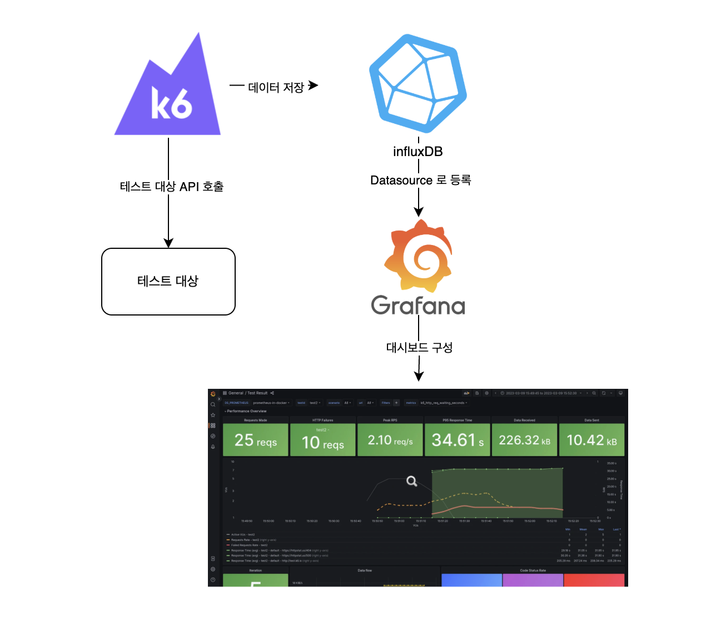

이를 위해서 아래와 같이 docker-compose.yaml 을 구성해볼 수 있다.

```yml
services:
  tempo:
    image: grafana/tempo:2.8.0
    container_name: tempo
    command: [ "-config.file=/etc/tempo.yaml" ]
    volumes:
      - ./tempo/tempo.yaml:/etc/tempo.yaml
      - ./data:/tmp/tempo
    ports:
      - "4317:4317"     # otlp grpc
      - "4318:4318"     # otlp http
      - "3200:3200"     # tempo query

  grafana:
    image: grafana/grafana:latest
    container_name: grafana
    ports:
      - "3000:3000"
    environment:
      - GF_AUTH_ANONYMOUS_ENABLED=true
      - GF_AUTH_ANONYMOUS_ORG_ROLE=Admin
      - GF_AUTH_BASIC_ENABLED=false
    volumes:
      - ./grafana/provisioning:/etc/grafana/provisioning
```

그리고  tempo 와 grafana 설정을 넣는다.

```yaml
# grafana/provisioning/datasources.datasource.yaml
apiVersion: 1

datasources:
  - name: Tempo
    type: tempo
    uid: tempo
    access: proxy
    url: http://tempo:3200       # Tempo 서버 주소
    isDefault: false
    jsonData:
      httpMethod: GET
      
# tempo/tempo.yaml
storage:
  trace:
    backend: s3                # trace 저장소를 s3로 변경
    s3:
      bucket: agmo-observability-backend   # S3 버킷 이름
      prefix: tempo/
      endpoint: s3.amazonaws.com
      region: ap-northeast-2    # AWS 리전
    wal:
      path: /tmp/tempo/wal      # Ingester의 write-ahead log (임시 저장 경로, 재시작시 안전하게 flush)


server:
  http_listen_port: 3200        # Tempo HTTP API 포트 (ex: /metrics, /ready 등)
  grpc_listen_port: 9095        # gRPC 포트 (querier, ingester 등 내부 컴포넌트 통신용)

distributor:                    # span을 수신해서 적절한 ingester로 전달
  receivers:
    otlp:                       # OpenTelemetry Protocol (OTLP) 수신 설정
      protocols:
        grpc:
          endpoint: 0.0.0.0:4317 # gRPC OTLP endpoint (Collector, SDK에서 push할 때 사용)
        http:
          endpoint: 0.0.0.0:4318 # HTTP OTLP endpoint

ingester:                       # trace 데이터를 메모리에 저장 후 backend(local/S3 등)로 flush
  lifecycler:                   # ingester의 등록/종료 및 ring 관리
    ring:                       # 멀티노드 시 데이터 분산/복제를 위한 구조 (단일노드면 의미 거의 없음)
      kvstore:
        store: memberlist       # ring metadata 저장소로 memberlist 사용 (별도 etcd/consul 불필요)
  flush_all_on_shutdown: true   # 종료 시 메모리에 남은 trace를 전부 backend로 flush

memberlist:
  join_members: []              # memberlist 클러스터에 참여할 peer 주소 (단일 노드라 비워둠)

compactor:                      # 오래된 trace block들을 compact하고 retention 관리
  compaction:
    block_retention: 48h        # trace block을 48시간 보관

querier:                        # trace 쿼리 실행 컴포넌트
  frontend_worker:
    frontend_address: 127.0.0.1:9095 # 쿼리 프론트엔드 주소 (여기서는 동일 노드 내 gRPC)

metrics_generator:              # span 데이터를 바탕으로 Prometheus metrics 생성
  processor:
    span_metrics:               # (오타: span_metrics) Span 단위로 metric 생성하는 processor 설정
      intrinsic_dimensions:     # 기본 dimension(라벨) 지정
        service: true           # 서비스 이름 라벨 추가
        span_name: true         # span 이름 라벨 추가
        span_kind: true         # client/server/producer/consumer 구분 라벨 추가
        status_code: true       # 성공/에러 상태 코드 라벨 추가
  registry:
    external_labels:
      source: tempo             # 생성된 metrics에 붙일 external label
  storage:
    path: /tmp/tempo/generator  # metrics generator가 임시 데이터 저장할 로컬 경로
  ring:
    kvstore:
      store: memberlist         # 멀티노드 시 metrics generator 간 작업 분산용 ring (단일노드면 의미 없음)

  traces_storage:
    path: "/tmp/tempo/generator/traces" # metrics generator가 처리 중인 trace 임시 저장 경로

overrides:
  metrics_generator_processors: [service-graphs, span-metrics, local-blocks]
  # metrics-generator에서 활성화할 processor 목록
  # service-graphs : 서비스 간 호출 관계 파악
  # span-metrics   : span 기반 메트릭 생성 (예: 요청 수, 지연시간)
  # local-blocks   : local block processor (단일노드에서 필요)


```


## 1.3 주의사항

- K6 테스트가 경량이지만 그럼에도 대량의 부하 테스트는 리소스가 많이 소모된다. 또한 influxDB 도 메모리와 디스크가 많이 필요하다. 따라서 회사 서버에 구성하는 것이 제일 좋고 여의치 않다면 로컬 머신(개인 노트북)에 구성하는 것이 리소스를 줄일 수 있다.
- k6 테스트에서 "같은 시간"에 "같은 API" 로 보내는 요청은 influxDB 에서 하나의 데이터로 취급된다. 따라서 동시에 같은 요청을 보내면 influxDB 는 1개로 취급된다. 이를 피하기 위해선 타임스탬프가 달라야 하는데 대량으로 테스트하다보면 초단위에서 소수점 6자리까지 같아지는 경우가 있다. 이러면 다른 요청이라도 influxDB 는 1개로 취급되는데, 이를 예방하기 위해 각 요청의 Tag 값으로 __VU (vuser 고유값)을 넣을 수 있다. 대신 이렇게 하면 카디널리티가 증가해 influxDB 의 크기가 커지거나 심지어 카디널리티 제한(백만개)에 걸릴 수 있다. 하지만 테스트 결과를 계속 저장할 것도 아니니 테스트 종료 후 적절히 삭제해주면 된다.

## 1.4 tempo 모니터링 툴 추가

현재 사용 중인 모니터링 툴은 Prometheus (노드 및 파드 매트릭), Actuator (JVM 및 커넥션 관리), Loki (로그 관리), Pyroscope (cpu 및 메모리 상세 분석), Grafana 를 사용하고 있다.

그리고 span 분석을 위해 grafana 의 Tempo 를 추가했다. response time 이 느릴 때 데이터베이스의 응답이 늦는건지, 외부 서버의 응답이 늦는건지 혹은 테스트 대상 자체가 늦는건지 쉽게 확인하기 위해서다. 아래와 같은 데이터를 보여준다.


> tempo 로 span 데이터를 보내기 위해 opentelemetry 를 설정하는 것도 CPU 와 memory 를 소모하기 때문에 무조건 붙이는 건 좋지 않다.

# 2. 부하테스트 결과 분석 및 개선

부하테스트가 원하는 RPS (또는 TPS)가 나오지 않는다면 병목을 찾고 개선해야 한다. 우선 현재 시스템 구성을 개략적으로 보면 다음과 같다.

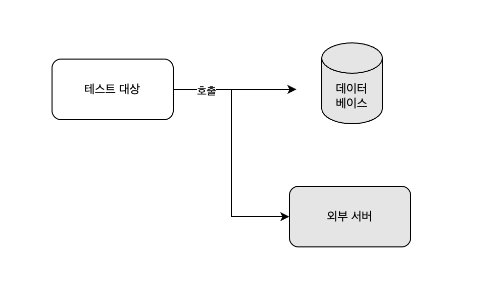

여기서 병목 현상이 일어날 부분은 크게 4가지이다.

1. 네트워크 레벨
   - 테스트 대상 서버에 대한 네트워크 대역폭 부족 (로드밸런서 리소스 포함)
2. 테스트 대상
3. 데이터 베이스
4. 외부 서버

미리 설명하자면, 비즈니스 로직이 복잡할 게 없기 때문에 주로 데이터베이스에서 병목 현상이 발생했다.

**테스트 환경**

현재 리소스는 다음과 같다.

- m6g.xlarge : 4 vCPU 16GiB memory
  - 리소스가 많지만 모니터링 파드가 많이 띄워져있어 실제로 사용할 수 있는 **cpu 는 2개, memory 는 9GiB** 다.
- db.r6g.large : **2 vCPU, 16GiB memory**

## 2.2 테스트 수행

테스트는 목적으로 분류하면 개별 테스트(개별 API 에 대한 호출)와 통합 테스트(유저 플로우 순서대로 API 호출)로 이루어졌다. 그리고 각각은 로드 테스트와 스트레스 테스트, 브레이크 포인트 테스트가 이루어졌다. 이중 **개별테스트에 대한 10분 간의 로드 테스트**를 예시로 분석해보겠다.

### 2.2.1 시나리오

- 호출 API
  - 앱 첫 페이지 조회 (`GET: /apps/first-page`)
  - 카테고리별 첫페이지 조회 (`GET: /apps/first-page/{category}`)
- 방법
  - RPS(초당 요청 수)를 점진적으로 증가 후 유지
  - 테스트 시간 : 10분
  - CPU / 메모리 / DB 부하 지표와 RED 기록
- 성공 기준
  - p95 응답속도 ≤ 800ms
  - 에러율 0%

### 2.2.2 첫번째 테스트

#### **조건**

- duration : 10분, **100 rps**

#### **결과**

**응답시간**

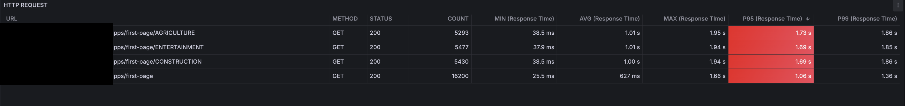

- p95 를 기준으로 응답 시간이 **1s ~ 1.7s** 로  많이 늦다는 걸 알 수 있다.

**CPU, Memory**

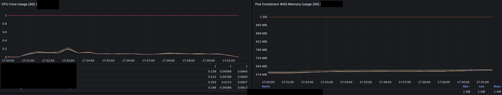

- CPU 는 평균적으로 0.2 ~ 0.25 코어정도 사용한다.(1코어 limit)
- 메모리도 500 ~ 600MiB 에서 큰 변화가 없다.

**Database**

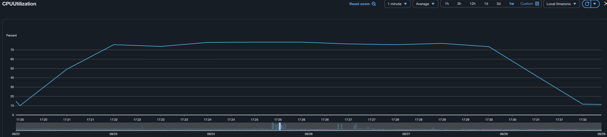

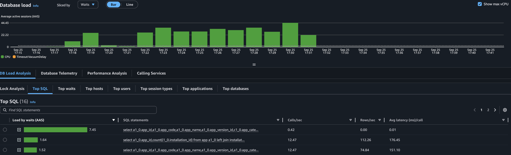

- 데이터베이스 지표는 많이 튀는데, CPU 의 78% 를 사용했다.
- 일부 쿼리가 Database 의 리소스를 많이 사용하고 있다. 해당 쿼리를 개선해야 한다.

### 2.2.3 첫번째 개선: Projection 활용

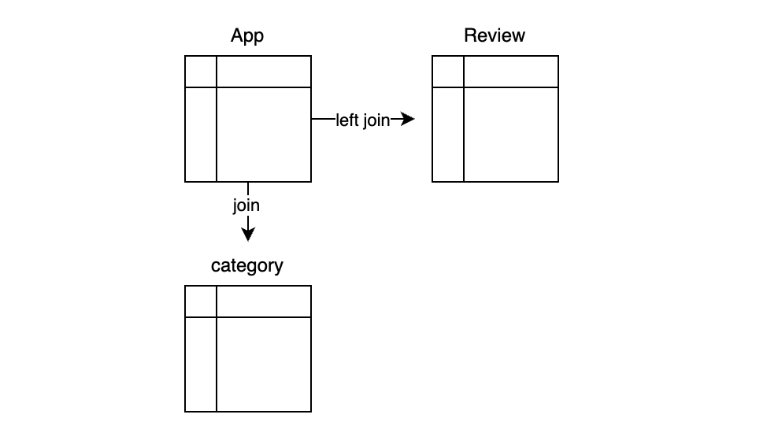

리소스를 많이 소모하는 쿼리 중 하나는 다음과 같은 테이블로 구성되고 join 된다. (이 쿼리 외에도 리소스 소모가 큰 쿼리가 1개 더 있다.)

- **App** : app 정보를 가지고 있다. 메인 테이블이다.
- **Review** : app 에 대한 별점 정보를 가지고 있다. 별점순으로 정렬할 때 필요하다. 리뷰가 없는 앱도 있기 때문에 left join 이 필요하다.
- **Category** : app 카테고리 정보를 가지고 있다. 카테고리별로 검색할 때 필요하다.

**카테고리별로 필터링된 앱의 별점순으로 조회**하는 쿼리는 <u>2번 호출</u>된다.

```sql
select app.app_id, avg(review.rating) as rating
from app
join category on app.category_id = category.category_id
left join review on app.app_id = review.app_id
where category.category_code = :category_code
  and app.status = 'RELEASED'
group by app.app_id
order by rating desc, app.released_at desc
limit ? offset ?;
```

**첫번째 호출에서는 rating 으로 정렬된 app_id 목록을 찾는다.**

```sql
select app.*
from app
where app_id in (?, ?, ...);
```

**두번째 호출에서는 첫번째 호출로 찾은 app_id 목록으로 where in 검색을 한다.** 이렇게 하는 이유는 <u>lazy loading 이나 매핑 등의 JPA 기능을 사용하기 위해 App 객체를 영속성 컨텍스트에 넣어서 관리하려고 했기 때문</u>이다. API 의 Response 객체에서 category 정보를 넣기 위해서도 lazy loading 이 필요했다.

하지만 위 쿼리문에서 필요없는 필드들도 있고, 불필요한 조인도 보였기 때문에 Projection 을 사용하면서 개선하고자 생각을 했다.

#### Projection 사용

해당 쿼리의 결과는 List 형태의 Reponse 로 반환되는데, app 의 모든 정보가 필요하지는 았않다. 따라서 Projection 으로 필요한 정보만 가져오려고 했고 자연스럽게 영속성으로 관리하는 걸 포기했다.

따라서 위 두 쿼리가 아래와 같이 하나의 쿼리로 변경되었다.

```sql
select app.app_id, app.app_name, app.app_description, app.main_image, app.category_id avg(review.rating) as rating
from app
join category on app.category_id = category.category_id
left join review on app.app_id = review.app_id
where category.category_code = :category_code
  and app.status = 'RELEASED'
group by app.app_id
order by rating desc, app.released_at desc
limit ? offset ?;
```

이 쿼리를 위해서 다음과 같은 Projection 을 정의하고 사용했다.

```kotlin
class AppData @QueryProjection constructor(
    val appId: Long,
    val appName: String,
    val description: String,
    val mainImage: String,
    val categoryId: Long,
)
```

하지만 이렇게 하면 <u>app 과 매핑된 category 가 response 로 변환될 때 자동으로 lazy loading 이 되지 않는다.</u> 내가 필요한 Reponse 는 아래와 같았다.

```kotlin
data class AppListResponse( //전체 리스트 및 페이지 정보
  val apps: List<AppResponse>
  val pageInfo: PageInfo
)

data class AppResponse( //리스트 내 개별적인 AppResponse
    val appId: Long,
    val appName: String,
    val description: String,
    val mainImage: String,
    val category: CategoryResponse, //이 정보를 원래는 app.category 의 lazy loading 으로 가져왔으나, AppData 를 사용하면서 불가능해졌다.
)

data class CategoryResponse(
    val categoryId: Long,
    val categoryCode: String,
    val categoryIcon: String,
)
```

따라서 AppResponse 를 반환하기 위해선 **app 의 categoryId 로 카테고리 전체 정보를 조회하는 동작이 추가로 필요**했다.

나는 이를 해결하기 위해 `CategoryService` 를 만들고 애플리케이션 생성 시 init 블럭을 통해 category 정보를 메모리(hash)에 넣었다. 그리고 필요 시 해당 메모리를 조회했다. 이렇게 판단한 이유는 category 테이블의 row 수가 3개에 불과하고 수정이 극히 적기 때문이다. 다만 데이터를 모델링할 때 category 에도 여러 정보가 포함될 수 있고, 동적으로 수정이 편하게 하려고 Enum 이 아닌 DB 테이블로 관리하고 있었다.

따라서 아래와 같은 클래스를 만들어서 활용한다.

```kotlin
class CategoryService(
    private val categoryRepository: CategoryRepository,
) {

    private val categoryCache: HashMap<Long, Category> = HashMap()

    init {
      //스프링 빈 init 시 DB 에 있는 정보를 categoryCache 에 넣기
        categoryRepository.findAll().forEach { categoryCache[it.categoryId!!] = it }
    }

    //카테고리 가져오기
    fun getCategory(categoryId: Long): Category {

				return CategoryCache[categoryId] ?: throw CategoryNotFoundException()
    }
}
```

최초 로딩 시 categoryRepository 에서 모든 카테고리를 HashMap 에 넣는다. 그리고 **category 정보가 필요하면 DB 가 아니라 hashmap 에서 가져온다.**

> 다음을 고려해야 한다.
>
> 1. n 분마다 DB 업데이트
> 2. 캐시에서 notFound 이면 에러를 반환하는 게 아니라 DB 조회 후 있으면 캐시에 저장하고 반환, 없으면 에러 반환

### 2.2.4 두번째 테스트

#### **조건**

- duration : 10분, **150 rps**

#### **결과**

**응답시간**

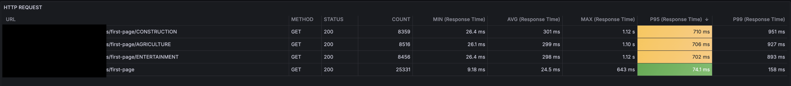

- p95 를 기준으로 응답 시간이 **700ms ~ 710ms** 로 <u>상당히 개선되었다</u>.

**CPU, Memory**

- CPU 는 평균적으로 0.3 코어정도 사용
- 메모리는 마찬가지로 500 ~ 600MiB 에서 큰 변화가 없다.

**Database**

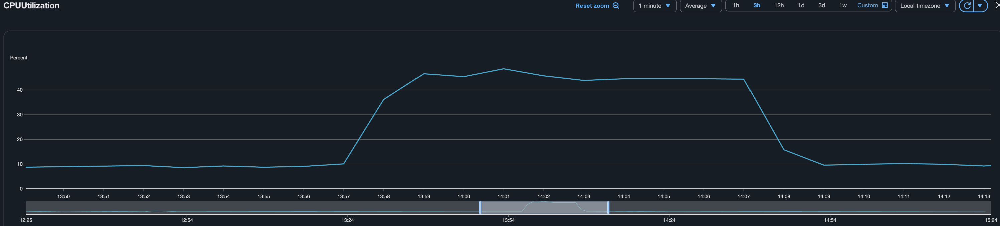

- 데이터베이스 지표가 개선되었다. **약 46% 를 사용한다.**

**Span**

이번엔 tempo 로 수집한 Span 데이터를 살펴보자

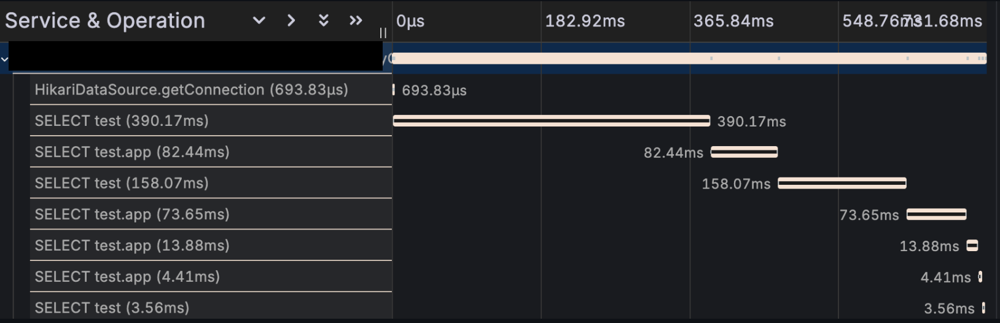

하나씩 설명하긴 힘들지만, 긴 쿼리가 2개정도 보인다. 해당 쿼리는 **"별점순"조회와 "다운로드순" 조회**다. 첫페이지 조회에서는 여러 순서(별점순, 다운로드순, 최신순, 최신 업데이트 순 등)으로 보여주기 때문에 하나의 요청에 여러 쿼리가 나갈 수밖에 없다. 그 중 별점순과 다운로드순은 각각 Review 와 Download 테이블과 조인해야 하기 때문에 더 오랜 시간이 걸린다.

따라서 해당 쿼리를 해결해야 한다.

### 2.2.5 두번째 개선: MATERIALIZED VIEW 테이블 활용

나는 **MATERIALIZED VIEW** 를 활용해 주기적으로 별점순, 다운로드순 결과를 캐싱했다.

> **MATERIALIZED VIEW** 는 쿼리 결과를 **실제 테이블처럼** 다룰 수 있게 해주는 객체다. 조회할 때는 원본 테이블을 보지 않고, materialized view 에서 저장된 데이터를 바로 읽는다. 다만  원본 데이터가 변경돼도 자동 갱신되지는 않기 때문에 cron job 이 필요하다.

예를 들어 App 의 review rating 을 1분마다 캐싱하려면 다음과 같이 사용한다.

```sql
CREATE MATERIALIZED VIEW app_avg_rating AS
SELECT app.app_id, AVG(rating) AS avg_rating, app.app_name, app.app_description, app.main_image, app.category_id 
FROM app_review
GROUP BY app_id;

-- pg_cron 확장 설치
CREATE EXTENSION IF NOT EXISTS pg_cron;

-- 1분마다 refresh
SELECT cron.schedule('refresh_app_avg_rating', '*/1 * * * *', $$
  REFRESH MATERIALIZED VIEW CONCURRENTLY app_avg_rating;
$$);
```

그리고 cron 으로 1분마다 뷰를 리프레시하도록 등록한다.

이렇게 하면 요청 시마다 app 과 review 를 조인해서 결과를 만드는 것이 아니라, app_avg_rating 테이블만 조회해서 정렬하면 되기 때문에 DB 부하가 줄어든다.

### 2.2.6 세번째 테스트

#### **조건**

RPS 를 늘려서 테스트한다.

- duration : 10분, **400 rps**

#### **결과**

**응답시간**

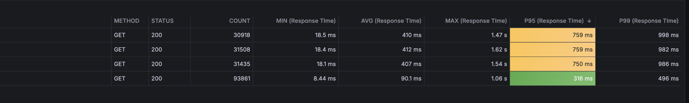

- (첫 테스트보다 4배많은) 400RPS 임에도 p95 를 기준으로 응답 시간이 **750ms ~ 760ms** 로 상당히 개선되었다.

**Database**

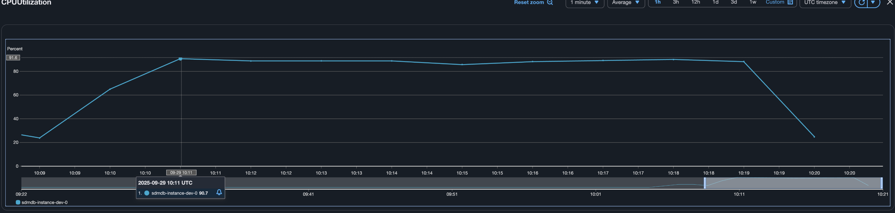

- 데이터베이스는 CPU 를 90% 이상 소모했다. **현재의 개선사항으로는 400 RPS 가 최선으로 보이며, 또 다시 데이터베이스가 다음 단계의 병목으로 보인다.**

# 마치며

- 리소스 추가 없이 100 RPS 에서 400 RPS 로 개선했다.
- 캐싱을 사용하지 않은 이유는 "추가적인 리소스없이" 개선하려고 했기 때문이다. 이번 테스트 간 나의 개선 순서는,
  - 비즈니스 로직 개선, 쿼리 개선 -> 캐시 사용 -> 리소스 추가 -> 아키텍처 변경이다.
- 리팩토링에서 테스트가 중요하다고 느꼈다. **쿼리를 개선하면서 테스트를 깨트린 적이 여러 번 있었는데 테스트가 없었다면 배포하고 나서야 알 오류들이었다.**

<Footer/>
