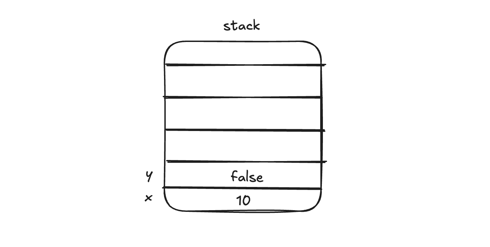
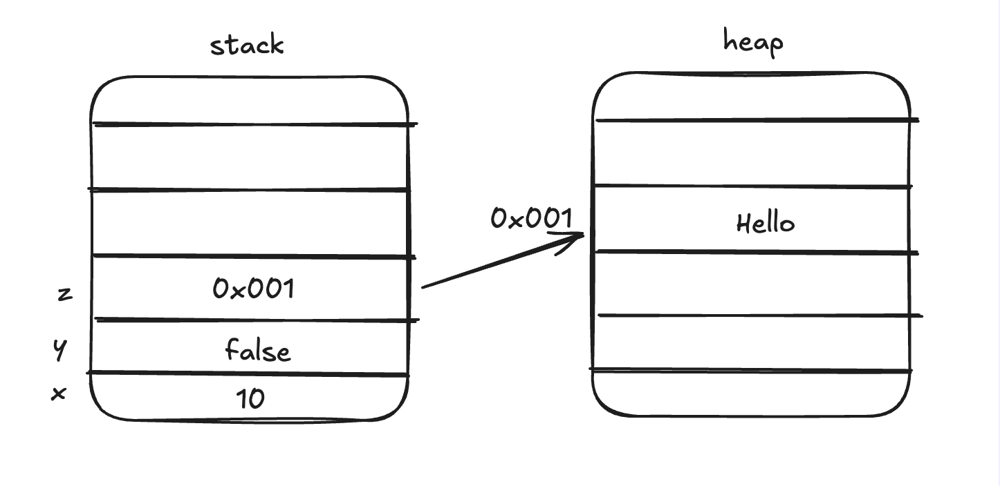
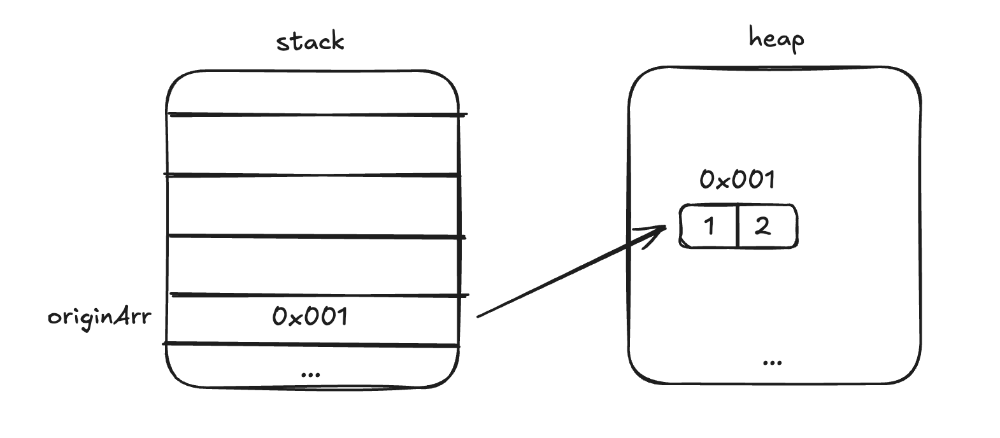
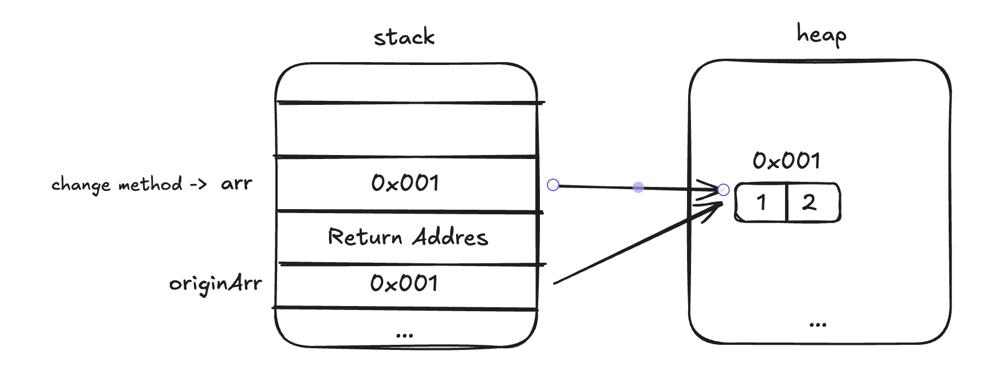
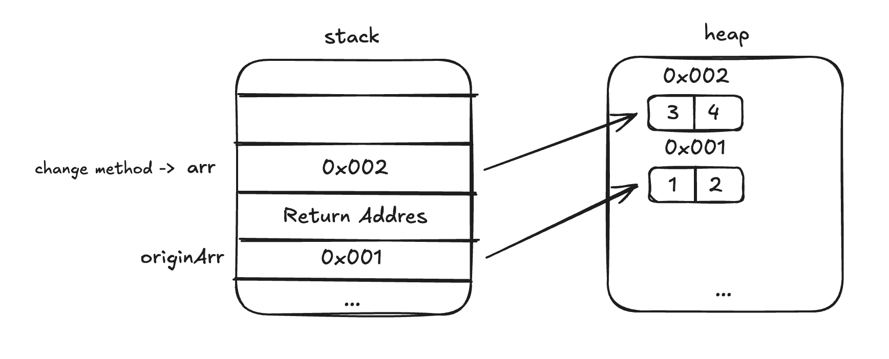
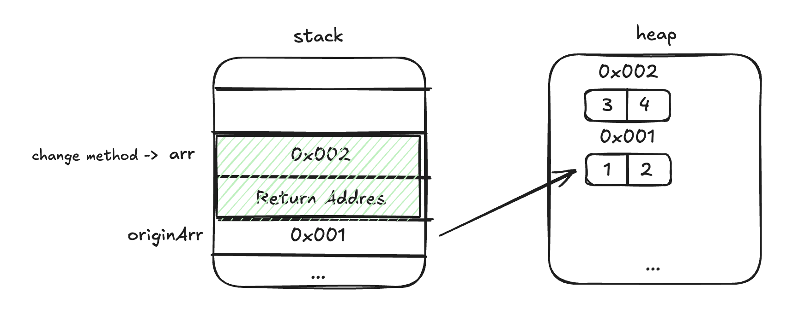
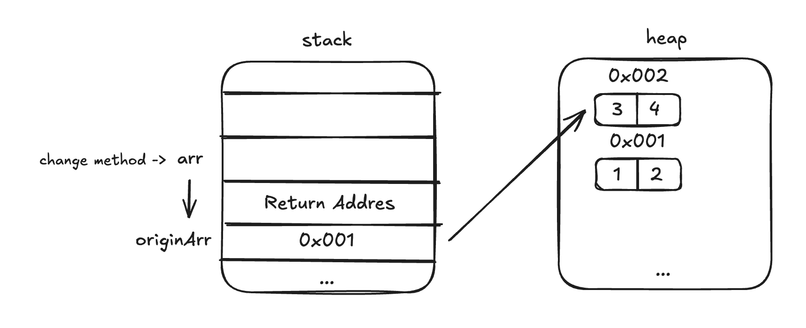

<Header />

아래 코드에 대한 출력값을 맞춰보자.

```java
class Tom {
    String name;

    Tom (String name) {
        this.name = name;
    }
}

public class Main {
    public static void main(String[] args) {

        String originStr = "originStr";
        change(originStr);
        System.out.println(originStr); //출력 1
      
        int[] originArr = {1, 2};
        change(originArr);
        System.out.println(originArr[0]); //출력 2

        List<Integer> originList = List.of(1, 2);
        change(originList);
        System.out.println(originList.get(0)); //출력 3

        Tom originTom = new Tom("origin Tom");
        change(originTom);
        System.out.println(originTom.name); //출력 4
    }

    public static String change(String str) {
        str = "changedStr";
        return str;
    }

    public static int[] change(int[] arr) {
        arr = new int[] {3, 4};
        return arr;
    }

    public static List<Integer> change(List<Integer> list) {
        list = List.of(5, 6);
        return list;
    }

    public static Tom change(Tom tom) {
        tom = new Tom("changed Tom");
        return tom;
    }
}
```

정답은 다음과 같다.

<details>
  <summary>정답</summary> 
origin Str /
1 /
1 / 
 origin Tom
</details>

만약 <u>(나와 같이) 정답을 맞추지 못했다면</u> 포스트를 읽어보도록 하자.

# 메모리 할당

자바에서 선언하는 변수는 메모리에 저장된다. 런타임에 동적으로 변하는 메모리는 힙 메모리와 스택 메모리가 있다. Java 에는 원시 타입(Primitive Type) 과 객체 타입 (Object Type) 이 있는데 두 타입 간 메모리 할당 차이가 있다.

## 원시 타입 (Primitive Type)

다음과 같이 원시 타입 x,y 가 있다고 하자.

```java
public void test() {
    // Primitive Value
    int x = 10;
    boolean y = false;
}
```

그러면 test 메서드가 호출될 때 해당 스레드의 스택 메모리에 다음과 같이 직접적으로 저장된다.



## 객체 타입 (Object Type)

하지만 원시 타입을 제외한 모든 타입은 실제 값이 Heap 메모리에 저장되고, 스택 메모리에는 주소값만 저장된다.

```java
public void test() {
    // Primitive Value
    int x = 10;
    boolean y = false;
  
  	String z = "hello";
}
```

그리고 그 주소값은 힙메모리의 실제 주소를 가리킨다.



# Pass by Value 와 Pass by Reference

Pass by Value (값에 의한 전달)과 Pass by Reference (참조에 의한 전달) 은 복사된 데이터를 전달하느냐 실제 값을 전달하느냐의 차이이다.

## Pass by Value

Pass By Value 는 값에 의한 전달 복사된 데이터를 전달하여 구성함으로써, 값을 수정하여도 원본의 데이터에는 영향을 주지 않도록 하는 방식이다. 맨 처음 나왔던 문제 중 배열만 보겠다.

```java
public class Main {
    public static void main(String[] args) {
      
        int[] originArr = {1, 2};
        change(originArr);
        System.out.println(originArr[0]); 
    }
  
    public static int[] change(int[] arr) {
        arr = new int[] {3, 4};
        return arr;
    }
}
```

먼저 change 를 호출하기 전 originArr 은 다음과 같이 보인다.



그리고 `change()` 메서드가 호출되면 호출한 코드의 "돌아갈 위치"인 Return Address 가 쌓이게 되고 그 위에 매개변수 등의 값이 쌓인다.



그리고 `arr = new int[] {3, 4};` 을 호출하게 되면 "**새로운** 객체를 생성한 후 arr 위치에 집어넣게 된다. 여전히 originArr 은 1, 2 이다. 만약 여기서 arr 을 수정한다고 해도 (`arr[0] = 5`와 같이) `0x002` 주소의 배열값만 바뀌는 것이지 `0x001` 배열 값은 아무런 영향을 받지 않는다.



그리고 `change()` 메서드가 끝나면 arr 지역 변수만 스택 메모리에서 pop 되어 사라지게 된다. (초록색 부분이 사라짐)



따라서 arr 을 재할당한다고 하더라도 orginArr 의 실제 값에는 **아무런 변화가 없다.**

자바는 모든 데이터를 Pass by Value 방식으로 전달한다. 그렇기 때문에 자바에서 어떤 객체가 파라미터로 전달되었을 때, 필드값에 접근하여 해당 값을 수정하는 것은 가능하지만 그 객체 자체는 변경 불가능하다.

위 예시처럼 change()` 메서드가 종료되면 복제본 (0x002)은 소멸되고, arr 객체 자체에 변경사항이 있었다면 해당 부분은 반영되지 않는다.

## Pass By Reference

Pass By Reference 는 주소 값을 전달하여 실제 값에 대한 Alias를 구성함으로써, 값을 수정하면 원본의 데이터가 수정되도록 하는 방식이다. C++에서는 해당 방식을 사용할 수 있다.

```c++
#include <iostream>
using namespace std;

void change(int*& arr) {
    // 새로운 배열을 할당해서 arr 자체를 바꿈
    arr = new int[2]{3, 4};
}

int main() {
    int* originArr = new int[2]{1, 2};

    change(originArr);

    cout << originArr[0] << endl; // 출력: 3

    // 동적 메모리 해제
    delete[] originArr;

    return 0;
}

```

위 코드에서 `originArr[0]` 의 출력은 3 이 나오게 된다.

`change()` 함수의 `int*& arr` (포인터 참조 전달)은 스택 메모리에 따로 저장 되지 않는다. `arr`는 별칭(alias)이기 때문에, 스택에 "arr=0x002" 같은 슬롯이 생기지 않고, 컴파일러가 originArr를 직접 가리키도록 번역한다.

따라서 `arr = new int[2]{3, 4}` 가 실행 될 때 다음과 같이 동작된다.



# Ref.

- https://medium.com/@samurai.stateless.coder/i-asked-50-java-developers-this-question-their-answers-will-shock-you-5964e9e5a2e3
- https://mangkyu.tistory.com/106

<Footer/>

