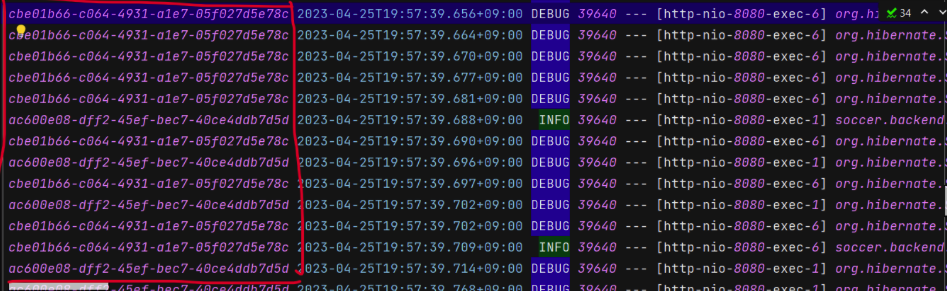

<Header/>

[[toc]]

원래는 오늘부터 추가적인 학습보다는 1~2주간 공부한 걸 스스로 정리해보는 시간을 가지려고 했는데요. MDC 를 듣는 순간, 이거를 오늘 적용하고 사용해보지 않으면 잠이 안올 거 같다라는 생각에 이거까지만 공부하고 포스팅 남기려고 합니다.

# MDC(Mapped Diagnostic Context) 란

MDC 는 현재 실행중인 쓰레드에 메타 정보를 넣고 관리하는 공간입니다. MDC는 내부적으로 Map을 관리하고 있어 (Key, Value) 형태로 값을 저장할 수 있습니다. 메타타 정보를 쓰레드 별로 관리하기 위해 내부적으로는 쓰레드 로컬을 사용하고 있습니다.

여기서는 특정 쓰레드의 로그 기록을 추적하기 위해 사용하는 Log 기능 중 하나로 사용됩니다. 예를 들어 아래와 같이 요청이 왔다고 생각해보겠습니다.

TestController 호출 시 -> TestFilter - TestController - TestService - TestRepository ... 역순으로  다시 호출하면서 빠져나옴

1. **A 사용자가 TestController 호출**
1. A 사용자의 요청이 처리되기 전 **B 사용자가 TestController 호출**

```java
called TestFilter //A의 요청 log
called TestController //A의 요청 log
called TestService //A의 요청 log
called TestFilter //B의 요청 log
called TestRepository //A의 요청 log
called Test Controller //B의 요청 log
...
```

이렇게 쓰레드가 동시에 실행됨녀서 위와 같이 A 의 log 와 B 의 log 가 뒤섞이게 되며 구분할 수 없게 됩니다. 

이런 문제를 해결하기 위해 **MDC 를 사용해서** 로그를 기록할 때 요청마다 고유 ID 를 부여해서 로그를 기록할 수 있습니다.

```
[ID A] called TestFilter //A의 요청 log
[ID A] called TestController //A의 요청 log
[ID A] called TestService //A의 요청 log
[ID B] called TestFilter //B의 요청 log
[ID A] called TestRepository //A의 요청 log
[ID B] called Test Controller //B의 요청 log
...
```

해당 쓰레드별 UUID 는 ThreadLocal 을 통해 수동으로 직접 출력할 수도 있지만, slf4j 의 Logback 에서 같은 기능을 제공하므로 그 기능을 사용해봅시다.

설명하기 전에 잠깐 결과물부터 보겠습니다.



빨간색 박스 안에 임의로 부여된 UUID 가 있습니다. UUID 를 통해 같은 쓰레드의 로그인지 구별할 수 있습니다.

# MDC  사용


### build.gradle

다음과 같이 slf4j, logback dependency 가 필요합니다.

```java
implementation 'org.slf4j:slf4j-api'
implementation 'ch.qos.logback:logback-classic'
```


**MDCLoggingFilter**

MDC 로 UUID 를 만든다면 가장 앞단인 필터에 적용하는 게 좋습니다. 

```java
package soccer.backend.filter;

import jakarta.servlet.*;
import org.slf4j.MDC;
import org.springframework.core.Ordered;
import org.springframework.core.annotation.Order;
import org.springframework.stereotype.Component;

import java.io.IOException;
import java.util.UUID;

@Component
@Order(Ordered.HIGHEST_PRECEDENCE)
public class MDCLoggingFilter implements Filter {


    @Override
    public void doFilter(ServletRequest request, ServletResponse response, FilterChain chain) throws IOException, ServletException {
        final UUID uuid = UUID.randomUUID();
        MDC.put("request_id", uuid.toString());
        chain.doFilter(request, response);
        MDC.clear();
    }
}
```

- `@Order(Ordered.HIGHEST_PRECEDENCE)` : filter 순서를 제일 앞으로 합니다.
- `MDC.put("request_id", uuid.toString());` : 쓰레드 로컬에 uuid 를 넣어줍니다.
- `MDC.clear();` : 요청이 끝나고 `clear()`를 해주지 않으면 다음 사용자가 다시 값에 접근할 수 있으므로 값을 모두 비워줍니다.


## logback-spring.xml

다음과 같은 custom pattern 으로 지정해줍니다.

```
%X{request_id} ${FILE_LOG_PATTERN}
```

전체적인 xml 코드는 다음과 같습니다.

```xml
<?xml version="1.0" encoding="UTF-8"?>
<configuration>
    <include resource="org/springframework/boot/logging/logback/base.xml"/>

    <property name="home" value="logs"/>

    <!--콘솔창에 찍히도록 하는 부분, 너무 번잡해서 뺐다.-->
    <!--<appender name="CUSTOM_CONSOLE" class="ch.qos.logback.core.ConsoleAppender">
        <encoder>
            <charset>utf8</charset>
            <pattern>%X{request_id} ${CONSOLE_LOG_PATTERN}</pattern>
        </encoder>
    </appender>-->

    <appender name="DEFAULT_FILE_APPENDER" class="ch.qos.logback.core.rolling.RollingFileAppender">
        <rollingPolicy class="ch.qos.logback.core.rolling.SizeAndTimeBasedRollingPolicy">
            <fileNamePattern>${home}/access-%d{yyyy-MM-dd}.%i.log</fileNamePattern>
            <maxFileSize>15mb</maxFileSize>
            <maxHistory>30</maxHistory>
        </rollingPolicy>
        <encoder>
            <charset>utf8</charset>
            <pattern>%X{request_id} ${FILE_LOG_PATTERN}</pattern>
        </encoder>
    </appender>

    <appender name="ERROR_FILE_APPENDER" class="ch.qos.logback.core.rolling.RollingFileAppender">
        <rollingPolicy class="ch.qos.logback.core.rolling.SizeAndTimeBasedRollingPolicy">
            <fileNamePattern>${home}/error-%d{yyyy-MM-dd}.%i.log</fileNamePattern>
            <maxFileSize>15mb</maxFileSize>
            <maxHistory>30</maxHistory>
        </rollingPolicy>
        <encoder>
            <charset>utf8</charset>
            <pattern>%X{request_id} ${FILE_LOG_PATTERN}</pattern>
        </encoder>
    </appender>

    <!-- profile 에 따라 slack 에 전송 -->
    <springProfile name="local, production">
        <property resource="slack-logback.yml" />
        <appender name="SLACK_ERROR" class="com.github.maricn.logback.SlackAppender">
            <webhookUri>${webhook-uri}</webhookUri>
            <channel>#${channel}</channel>
            <layout class="ch.qos.logback.classic.PatternLayout">
                <pattern>%X{request_id} ${FILE_LOG_PATTERN}</pattern>
            </layout>
            <username>${username}</username>
            <iconEmoji>:${emoji}:</iconEmoji>
            <colorCoding>true</colorCoding>
        </appender>
        <appender name="ASYNC_ERROR_APPENDER" class="ch.qos.logback.classic.AsyncAppender">
            <appender-ref ref="SLACK_ERROR"/>
            <appender-ref ref="ERROR_FILE_APPENDER"/>
            <filter class="ch.qos.logback.classic.filter.ThresholdFilter">
                <level>ERROR</level>
            </filter>
        </appender>
    </springProfile>

    <root level="DEBUG">
        <appender-ref ref="DEFAULT_FILE_APPENDER"/>
        <!--콘솔창에 찍히도록 하는 부분, 너무 번잡해서 뺐다.-->
        <!--<appender-ref ref="CUSTOM_CONSOLE"/>-->
    </root>

    <logger name="ERROR_FILE_LOGGER" level="ERROR" additivity="true">
        <appender-ref ref="ERROR_FILE_APPENDER"/>
        <appender-ref ref="SLACK_ERROR"/>
    </logger>
</configuration>
```

logfile 을 저장해주고, slack 알림까지 설정되어 있어서 알아보기 힘들 수 있습니다.

`<pattern>` 태그만 확인해서 변경해주면 됩니다. 주석처리한 부분은 콘솔에도 UUID 가 찍히도록 하는 코드로, 콘솔까지 찍히면 너무 알아보기 힘들어서 주석처리했습니다. 다음에 쓸 일 있으면 주석을 풀도록 하죠.


# 마치며

오늘은 비교적 짧게 끝났습니다. 보통 소프트웨어를 만들 때 주어진 일정 중 핵심로직 구성으로 20%, 디버깅, 에러처리로 나머지 80% 를 사용한다는데요. 필요한 Logging 을 통해 버그를 추적하는 것도 중요하다고 볼 수 있겠습니다.

아래 Ref. 에는 **Nginx 에 request_id 설정**, **분산 환경 로그 추적(spring-cloud-sleuth)** 와 같은 내용도 포함되어있습니다.

# Ref.

 [[Spring] 멀티쓰레드 환경에서 MDC를 사용해 요청 별로 식별가능한 로그 남기기](https://mangkyu.tistory.com/266)

[로깅 시스템 #4 - Correlation id & MDC](https://bcho.tistory.com/1316)
