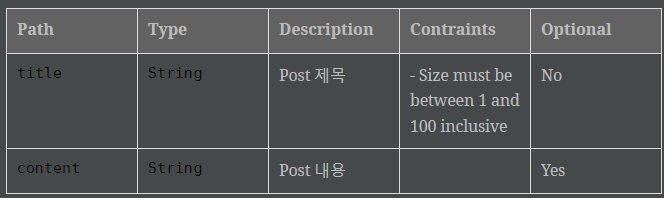
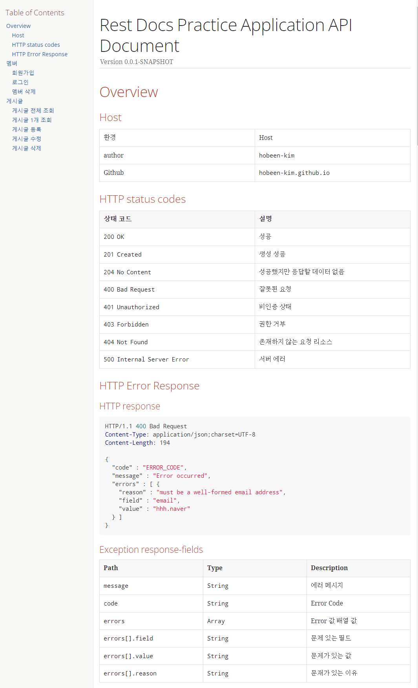
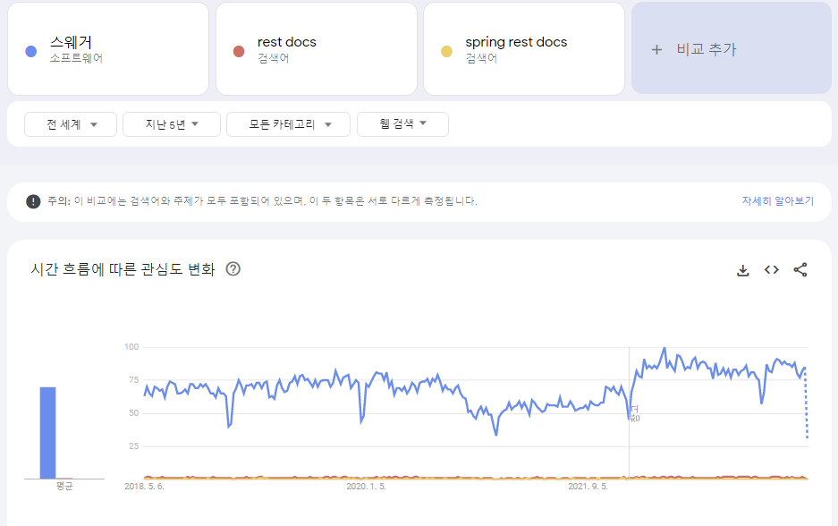

<Header/>

[[toc]]

# Refactoring - @BeforeEach

​	모든 Test 에 공통적으로 적용되는 게 있습니다. 바로 아래의 @BeforeEach 코드입니다.

```java
private MockMvc mockMvc;

@BeforeEach
public void setUp(WebApplicationContext webApplicationContext,
                  RestDocumentationContextProvider restDocumentation) {
    this.mockMvc = MockMvcBuilders.webAppContextSetup(webApplicationContext)
            .apply(documentationConfiguration(restDocumentation)
                    .operationPreprocessors()
                    .withResponseDefaults(prettyPrint())
                  	.withRequestDefaults(prettyPrint()))
            .build();
}
```

이 코드와 mockMvc, 그리고 각종 어노테이션까지 반복되는 설정이 중복되기 때문에 해당 설정들을 모두 RestDocsTestSupport 에 넣어주겠습니다.

## RestDocsTestSupport

```java
@Disabled
@AutoConfigureMockMvc
@ExtendWith({RestDocumentationExtension.class, SpringExtension.class})
@SpringBootTest
public class RestDocsTestSupport {

    @Autowired protected ObjectMapper objectMapper;

    @Autowired
    protected MockMvc mockMvc;

    @BeforeEach
    void setUp(final WebApplicationContext webApplicationContext,
               final RestDocumentationContextProvider restDocumentation) {
        this.mockMvc = MockMvcBuilders.webAppContextSetup(webApplicationContext)
               .apply(MockMvcRestDocumentation.documentationConfiguration(restDocumentation)
                        .operationPreprocessors()
                        .withResponseDefaults(prettyPrint())
                        .withRequestDefaults(prettyPrint()))
                .addFilters(new CharacterEncodingFilter("UTF-8", true))
                .build();
    }
}
```

- Test 를 직접할 코드가 아니기 때문에 @Disabled 를 넣었습니다. @AutoConfigureMockMVC 는 MockMvc 를 주입받기 위해 넣었습니다. 나머지 2개는 원래 Test 코드에 있던 걸 그대로 넣었습니다.
- ObjectMapper 와 MockMvc 를 주입받아서 사용합니다.
- @BeforeEach 에서는 원래 test 코드에 있던 설정을 그대로 넣었습니다. 그리고 한글깨짐을 방지하기 위해 UTF-8 설정도 추가로 넣었습니다.
  

## Test 코드 수정

이제 Test 코드를 수정해보겠습니다.

```java
/*@ExtendWith({RestDocumentationExtension.class, SpringExtension.class})
@SpringBootTest*/
class MemberControllerTest extends RestDocsTestSupport {

    /*private MockMvc mockMvc;

    @BeforeEach
    public void setUp(WebApplicationContext webApplicationContext,
                      RestDocumentationContextProvider restDocumentation) {
        this.mockMvc = MockMvcBuilders.webAppContextSetup(webApplicationContext)
                .apply(documentationConfiguration(restDocumentation)
                        .operationPreprocessors()
                        .withResponseDefaults(prettyPrint())
                        .withRequestDefaults(prettyPrint()))
                .build();
    }*/

    @MockBean
    private MemberService memberService;
    
    ...
```

RestDocsTestSupport 에서 설정한 내용은 모두 상속받는다고 생각하면 되기 때문에, 모두 삭제해줍니다. 다른 Test 들도 똑같이 삭제해줍시다.


# Refactoring - @Test

​	이제 @Test 코드 안에 어떤 코드가 중복되는지 확인해보겠습니다.

```java
@Test
void create() throws Exception {

    final PostResponse postResponse = new PostResponse(1L, "title", "content");
    when(postService.create(any())).thenReturn(postResponse);

    this.mockMvc.perform(post("/posts")
                    .content("{\"title\": \"title\", \n\"content\": \"content\"}")
                    .contentType(MediaType.APPLICATION_JSON))
            .andExpect(status().isCreated())
            .andDo(document("post-create",
                    requestFields(
                            fieldWithPath("title").description("Post 제목").attributes(new Attributes.Attribute("constraints","길이 100 이하")),
                            fieldWithPath("content").description("Post 내용").optional()
                    )
            ));
}
```

1.  document 제목이 반복됩니다. [문서 내용]-[행위] 로 반복되는 패턴입니다.
2. **제약조건** 또한 반복됩니다. 제약 조건은 field 마다 다르지만, Entity 에서 어노테이션으로 선언된 제약조건을 그대로 가져와서 사용할 수 있을 것 같습니다.

## document 공통 제목 설정

​	먼저 document 제목부터 설정하겠습니다. RestDocsTestSupport 의 @BeforeEach 설정에 아래와 같이 추가하고, 설정을 사용할 수 있도록 `RestDocumentationResultHandler` 을 주입해줍니다.

```java
public class RestDocsTestSupport {

    protected RestDocumentationResultHandler documentHandler;//RestDocumentationResultHandler 선언
    
    @Autowired protected ObjectMapper objectMapper;

    @Autowired
    protected MockMvc mockMvc;
        
    @BeforeEach
    void setUp(final WebApplicationContext webApplicationContext,
               final RestDocumentationContextProvider restDocumentation,
               TestInfo testInfo) {

        String className = testInfo.getTestClass().orElseThrow().getSimpleName().replace("ControllerTest", "");
        String methodName = testInfo.getTestMethod().orElseThrow().getName();

        documentHandler = document(
                className + "/" + methodName
        );

        this.mockMvc = MockMvcBuilders.webAppContextSetup(webApplicationContext)
                .apply(MockMvcRestDocumentation
                        .documentationConfiguration(restDocumentation)
                        .operationPreprocessors()
                        .withResponseDefaults(prettyPrint())
                        .withRequestDefaults(prettyPrint())
                )
                .alwaysDo(documentHandler)
                .addFilters(new CharacterEncodingFilter("UTF-8", true))
                .build();
    }
```

- 먼저 test 클래스에서 정보를 받아와야 하기 때문에 파라미터값으로 testInfo 를 받습니다.
- 'post-create' 에서 post 는 class 이름인 PostControllerTest 에서 ControllerTest 를 뺀 것입니다. 따라서 replace 를 이용하여 className 을 위와 같이 설정해줍니다.
- 리팩토링 후 directory 구조는 'post/{test method name}' 과 같이 만들 겁니다. 따라서 methodName 은 그대로 받습니다.
- `RestDocumentationResultHandler` 로 document 이름을 `className / methodName` 으로 설정합니다. 이렇게 설정하면 className/methodName 디렉토리 구조가 형성됩니다.
- `.alwaysDo(documentHandler)` 를 통해 만들어둔 `RestDocumentationResultHandler` 를 적용시킵니다.

​	이제 test 코드안에서 불필요한 부분을 삭제하겠습니다.

```java
@Test
    void create() throws Exception {
        final PostResponse postResponse = new PostResponse(1L, "title", "content");
        when(postService.create(any())).thenReturn(postResponse);

        this.mockMvc.perform(post("/posts")
                        .content("{\"title\": \"title\", \n\"content\": \"content\"}")
                        .contentType(MediaType.APPLICATION_JSON))
                .andExpect(status().isCreated())
                .andDo(documentHandler.document(
                        requestFields(
                                fieldWithPath("title").description("Post 제목").attributes(new Attributes.Attribute("constraints","길이 100 이하")),
                                fieldWithPath("content").description("Post 내용").optional()
                        )
                ));
    }
```

.andDo 에서 부모클래스에서 주입받은 documentHandler 를 사용합니다. 


## 제약조건 설정

​	이제 제약조건 코드를 줄여보겠습니다. 지금은 이렇게 되어있습니다.

```java
@Test
void create() throws Exception {
    final PostResponse postResponse = new PostResponse(1L, "title", "content");
    when(postService.create(any())).thenReturn(postResponse);

    this.mockMvc.perform(post("/posts")
                    .content("{\"title\": \"title\", \n\"content\": \"content\"}")
                    .contentType(MediaType.APPLICATION_JSON))
            .andExpect(status().isCreated())
            .andDo(documentHandler.document(
                    requestFields(
                            fieldWithPath("title").description("Post 제목").attributes(new Attributes.Attribute("constraints","길이 100 이하")),
                            fieldWithPath("content").description("Post 내용").optional()
                    )
            ));
}
```

이 코드에서 `.attributes(new Attributes.Attribute("constraints","길이 100 이하"))` 부분은 Dto 의 제약조건으로, 해당 클래스에서 가져올 수 있습니다. (entity 에 제약조건을 설정해도 됩니다.)

먼저 제약조건을 설정하는 ConstraintFields<T> 를 선언해줍니다.

```java
public class ConstraintFields<T> {

    //사용할 ConstraintDescriptions 선언
    private final ConstraintDescriptions constraintDescriptions;

    //dto 클래스 주입
    public ConstraintFields(Class<T> clazz) {
        this.constraintDescriptions = new ConstraintDescriptions(clazz);
    }

    //fieldWithPath(path) 에 attributes 를 붙임
    public FieldDescriptor withPath(String path) {
        return fieldWithPath(path).attributes(
                Attributes.key("constraints").value(
                        this.constraintDescriptions.descriptionsForProperty(path).stream()
                                .map(description -> "- " + description)
                                .collect(Collectors.joining("\n"))
                )
        );
    }
}
```

- `ConstraintDescriptions.descriptionsForProperty(field 명).joining("\n")` 을 통해 제약 조건을 가져올 수 있습니다. 제약조건은 필드마다 1개 이상이 될 수 있으니 모두 가져와야 합니다.

이제 MemberControllerTest 을 다음과 같이 변경합니다.

```java
class PostControllerTest extends RestDocsTestSupport {

    @MockBean
    private PostService postService;

    ConstraintFields<PostRequest> fields = new ConstraintFields<>(PostRequest.class);

    @Test
    void create() throws Exception {
        final PostResponse postResponse = new PostResponse(1L, "title", "content");
        when(postService.create(any())).thenReturn(postResponse);

        this.mockMvc.perform(post("/posts")
                        .content("{\"title\": \"title\", \n\"content\": \"content\"}")
                        .contentType(MediaType.APPLICATION_JSON))
                .andExpect(status().isCreated())
                .andDo(documentHandler.document(
                        requestFields(
                            //해당 부분 변경
                                fields.withPath("title").description("Post 제목"),
                                fieldWithPath("content").description("Post 내용").optional()
                        )
                ));
    }
    
    ...
}
```

- `ConstraintFields<PostRequest> fields` 를 선언하고, 제약조건이 필요한 곳에 사용해줍니다. 따지기 귀찮으면 다 붙여줘도 됩니다.

제약조건이 아래와 같이 변경되었습니다.



# popup 링크 동적으로 만들기

​	먼저 signUp 테스트 메서드를 보겠습니다.

```java
@Test
    void login() throws Exception {
        final MemberResponse memberResponse = new MemberResponse("memberName", "title", "content", Authority.USER);
        when(memberService.login(any())).thenReturn(memberResponse);

        this.mockMvc.perform(post("/members/login")
                        .content("{\"memberName\": \"memberName\", \"password\": \"password\"}") 
                        .contentType(MediaType.APPLICATION_JSON))
                .andExpect(status().isOk())
                .andDo(documentHandler.document(
                        requestFields(
                                fieldWithPath("memberName").description("Member memberName"),
                                fieldWithPath("password").description("Member password")
                        ),
                        responseFields(
                                fieldWithPath("memberName").description("Member memberName"),
                                fieldWithPath("password").description("Member password"),
                                fieldWithPath("email").description("Member email"),
                                fieldWithPath("authority").description("link:common/authority.html[Enum,role=\"popup\"]")
                        )
                ));
    }
```

여기서 `.description("link:common/authority.html[Enum,role=\"popup\"]")` 부분은 링크가 틀리거나 popup 이 오타가 나면 제대로 작동하지 않게 됩니다. 따라서 `""` 와 같이 문자로 처리하기보다는 메서드를 만들어서 관리하겠습니다.


**RestDocsTestSupport**

```java
public class RestDocsTestSupport {

   ...

    protected static String generateLinkCode(Class<?> clazz) {
        return String.format("link:common/%s.html[Enum,role=\"popup\"]", clazz.getSimpleName().toLowerCase());
    }
}
```

Test 가 모두 상속받는 `RestDocsTestSupport` 클래에서 메서드를 만들어주도록 하겠습니다.  `generateLinkCode` 는 링크를 작성하는 코드입니다. class 를 받으면 해당 클래스의 이름대로 링크를 만듭니다.

**login()**

```java
responseFields(
    fieldWithPath("memberName").description("Member memberName"),
    fieldWithPath("password").description("Member password"),
    fieldWithPath("email").description("Member email"),
    fieldWithPath("authority").description(generateLinkCode(Authority.class))
)
```

로그인 메서드는 다음과 같이 바뀌면 됩니다. 

# 공통 코드 문서화

**CommonDocController**

​	HTTP Error Response, HTTP status codes, Host 환경 등을 문서화해보겠습니다. 에러 관련 문서화를 위해 테스트 컨트롤러에 다음과 같이 추가합니다.

```java
@RestController
@RequestMapping("/test")
public class CommonDocController {

    @PostMapping("/error")
    public void errorSample(@RequestBody @Valid SampleRequest dto) {
    }

    @Getter
    @Setter
    @AllArgsConstructor
    @NoArgsConstructor
    public static class SampleRequest {

        @NotEmpty
        private String name;

        @Email
        private String email;
    }
    ...
        
}
```


**GlobalExceptionHandler**

그리고 ExceptionHandler 를 위해 **Main** 위치에 `GlobalExceptionHandler` 를 만듭니다.

```java
@ControllerAdvice
public class GlobalExceptionHandler {
    
@ExceptionHandler(MethodArgumentNotValidException.class)
public ResponseEntity<?> handleMethodArgumentNotValidException(MethodArgumentNotValidException ex) {

    Map<String, Object> errorResponse = new HashMap<>();
    errorResponse.put("message", "Error occurred");
    errorResponse.put("code", "ERROR_CODE");
    errorResponse.put("errors", ex.getFieldErrors().stream().map(fieldError -> {
        Map<String, String> errorDetail = new HashMap<>();
        errorDetail.put("field", fieldError.getField());
        errorDetail.put("value", fieldError.getRejectedValue().toString());
        errorDetail.put("reason", fieldError.getDefaultMessage());
        return errorDetail;
    }).collect(Collectors.toList()));

    return ResponseEntity.badRequest().body(errorResponse);
}
}
```

- MethodArgumentNotValidException을 받으면 message, code, errors[], error.field, error.value, error.reason 을 리턴합니다.


**exception-response-fields.snippet**

Exception 에는 제약 조건, optional 이 필요없으므로 `exception-response-fields.snippet` 을 새로 만듭니다. 위치는 test.resources.org.springframework.restdocs.templates 입니다.

```
|===
|Path|Type|Description

{{#fields}}
|{{#tableCellContent}}`+{{path}}+`{{/tableCellContent}}
|{{#tableCellContent}}`+{{type}}+`{{/tableCellContent}}
|{{#tableCellContent}}{{description}}{{/tableCellContent}}
{{/fields}}
|===
```


**CustomResponseFieldsSnippet**

​	해당 클래스의 생성자도 추가해주겠습니다. `subsectionExtractor` 파라미터는 api 를 호출했을 때의 결과값에서 필드를 뽑아내는건데, errorResponse 는 그럴 필요가 없기 때문입니다.

```java
public class CustomResponseFieldsSnippet extends AbstractFieldsSnippet {

    public CustomResponseFieldsSnippet(String type, PayloadSubsectionExtractor<?> subsectionExtractor,
                                       List<FieldDescriptor> descriptors, Map<String, Object> attributes,
                                       boolean ignoreUndocumentedFields) {
        super(type, descriptors, attributes, ignoreUndocumentedFields, subsectionExtractor);
    }

    //추가된 생성자
    public CustomResponseFieldsSnippet(String type, List<FieldDescriptor> descriptors, Map<String, Object> attributes,
                                       boolean ignoreUndocumentedFields) {

        super(type, descriptors, attributes, ignoreUndocumentedFields);
    }
    @Override
    protected MediaType getContentType(Operation operation) {
        return operation.getResponse().getHeaders().getContentType();
    }

    @Override
    protected byte[] getContent(Operation operation) throws IOException {
        return operation.getResponse().getContent();
    }
}
```


**CommonDocControllerTest**

이제 최종적으로 Test 에서 코드를 수정해주도록 하겠습니다.

```java
class CommonDocControllerTest extends RestDocsTestSupport{


    @Test
    public void errorSample() throws Exception {
        CommonDocController.SampleRequest sampleRequest = new CommonDocController.SampleRequest("name","hhh.naver");

        ResultActions result =
                mockMvc.perform(
                    post("/test/error")
                        .contentType(MediaType.APPLICATION_JSON)
                        .content(objectMapper.writeValueAsString(sampleRequest))
                )
                .andExpect(status().isBadRequest());

        //FieldDescriptor 선언
        FieldDescriptor[] fields = new FieldDescriptor[]{
                fieldWithPath("message").description("에러 메시지"),
                fieldWithPath("code").description("Error Code"),
                fieldWithPath("errors").description("Error 값 배열 값"),
                fieldWithPath("errors[].field").description("문제 있는 필드"),
                fieldWithPath("errors[].value").description("문제가 있는 값"),
                fieldWithPath("errors[].reason").description("문재가 있는 이유")
        };

        result.andDo(documentHandler.document(
                    customResponseFields("exception-response",
                            attributes(field("title", "Exception")), fields)
                    )
                );
    }
    
    
   ...
       
    public static CustomResponseFieldsSnippet customResponseFields(
            String type,
            Map<String, Object> attributes, FieldDescriptor... descriptors) {
        return new CustomResponseFieldsSnippet(type, Arrays.asList(descriptors), attributes, true);
    }
    
}
```

- `customResponseFields` 에서 인자가 3개인 것을 볼 수 있습니다. 원래 있던 `customResponseFields` 에서 메서드 오버로딩한 것입니다.
- exception-response-fields.snippet 을 만들었으니 첫번째 인자로 "exception-response" 를 줘야 합니다. 나머지는 enum 이랑 비슷하게 생각하면 됩니다.


# HTTP status code, host 환경 문서화

​	마지막으로 제일 첫 페이지에 나올 host 환경, http satus code 설명을 넣어줍니다. src 디렉토리의 docs.asciidoc 에 overview.adoc 으로 만들어주면 됩니다.

```
[[overview]]
== Overview

[[overview-host]]
=== Host

|===
| 환경 | Host
| author
| `hobeen-kim`

| Github
| `hobeen-kim.github.io`
|===

[[overview-http-status-codes]]
=== HTTP status codes

|===
| 상태 코드 | 설명

| `200 OK`
| 성공

| `201 Created`
| 생성 성공

| `204 No Content`
| 성공했지만 응답할 데이터 없음

| `400 Bad Request`
| 잘못된 요청

| `401 Unauthorized`
| 비인증 상태

| `403 Forbidden`
| 권한 거부

| `404 Not Found`
| 존재하지 않는 요청 리소스

| `500 Internal Server Error`
| 서버 에러
|===

[[overview-error-response]]
=== HTTP Error Response
operation::CommonDoc/errorSample[snippets='http-response,exception-response-fields']
```

마지막으로 index.adoc 파일과 member.adoc, post.adoc 파일을 변경된 adoc 파일명에 맞게 수정해줍니다. 아래는 index.adoc 입니다.

```
= Rest Docs Practice Application API Document
:doctype: book
:source-highlighter: highlightjs
:toc: left
:toclevels: 2
:sectlinks:
:docinfo: shared-head

include::overview.adoc[]
include::member.adoc[]
include::post.adoc[]
```

> 참고로 모든 테스트를 한번에 돌리려면 `./gradlew test` 로 돌리면 됩니다.


# 마치며

최종적으로 아래와 같이 잘 나왔습니다.



잘 따라오시면 어렵지 않게 간단한 restDocs 를 구현하실 수 있을 것 같습니다. 물론 저도 test 에서나 .adoc 에서 완벽하게 만들었다고 할 수 없지만요. 새로운 툴을 사용하는 건 두려우면서도 재밌습니다.

다음에는 Swagger 를 포스팅해봐야겠습니다. 아무래도 사람들이 많이 사용하는 건 Swagger 인거같거든요. 



<center><i>swagger vs restDocs 사용량 비교</i></center>


또한 Rest Docs 를 openAPI Spec 으로 변환 후 swagger UI 를 사용할 수도 있다고 합니다. [github](https://github.com/ePages-de/restdocs-api-spec) 에서 확인할 수 있습니다.


# Ref.

[[10분 테코톡] 승팡, 케이의 REST Docs](https://youtu.be/BoVpTSsTuVQ)

[SpringRestDocs를 SpringBoot에 적용하기](https://taetaetae.github.io/2020/03/08/spring-rest-docs-in-spring-boot/)

[Spring Rest Docs 적용](https://techblog.woowahan.com/2597/)

[API 문서 자동화 - Spring REST Docs 팔아보겠습니다](https://tecoble.techcourse.co.kr/post/2020-08-18-spring-rest-docs/)

[공식 문서](https://docs.spring.io/spring-restdocs/docs/2.0.4.RELEASE/reference/html5/#getting-started-documentation-snippets-invoking-the-service)

\+ 추가 : [Spring REST Docs 적용 및 최적화 하기](https://backtony.github.io/spring/2021-10-15-spring-test-3/) <- 포스팅 시에는 참고하지 않았지만 이후에도 계속 rest docs 를 공부하면서 찾다보니 제일 도움되는 포스팅입니다.