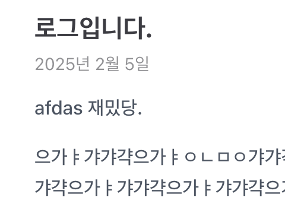

<Header />

[[toc]]

# 1

```vue{3}
test
test
test
test
```



여기에 내용을 `작성`합니다.

여기에 내용을 작성합니다.여기에 내용을 작성합니다.여기에 내용을 작성합니다.여기에 내용을 작성합니다.여기에 내용을 작성합니다.여기에 내용을 작성합니다.여기에 내용을 작성합니다.여기에 내용을 작성합니다.여기에 내용을 작성합니다.여기에 내용을 작성합니다.여기에 내용을 작성합니다.여기에 내용을 작성합니다.여기에 내용을 작성합니다.여기에 내용을 작성합니다.
여기에 내용을 작성합니다.여기에 내용을 작성합니다.여기에 내용을 작성합니다.여기에 내용을 작성합니다.여기에 내용을 작성합니다.여기에 내용을 작성합니다.여기에 내용을 작성합니다.여기에 내용을 작성합니다.여기에 내용을 작성합니다.여기에 내용을 작성합니다.여기에 내용을 작성합니다.여기에 내용을 작성합니다.여기에 내용을 작성합니다.여기에 내용을 작성합니다.
여기에 내용을 작성합니다.여기에 내용을 작성합니다.여기에 내용을 작성합니다.여기에 내용을 작성합니다.여기에 내용을 작성합니다.여기에 내용을 작성합니다.여기에 내용을 작성합니다.여기에 내용을 작성합니다.여기에 내용을 작성합니다.여기에 내용을 작성합니다.여기에 내용을 작성합니다.여기에 내용을 작성합니다.여기에 내용을 작성합니다.여기에 내용을 작성합니다.
여기에 내용을 작성합니다.여기에 내용을 작성합니다.여기에 내용을 작성합니다.여기에 내용을 작성합니다.여기에 내용을 작성합니다.여기에 내용을 작성합니다.여기에 내용을 작성합니다.여기에 내용을 작성합니다.여기에 내용을 작성합니다.여기에 내용을 작성합니다.여기에 내용을 작성합니다.여기에 내용을 작성합니다.여기에 내용을 작성합니다.여기에 내용을 작성합니다.
여기에 내용을 작성합니다.여기에 내용을 작성합니다.여기에 내용을 작성합니다.여기에 내용을 작성합니다.여기에 내용을 작성합니다.여기에 내용을 작성합니다.여기에 내용을 작성합니다.여기에 내용을 작성합니다.여기에 내용을 작성합니다.여기에 내용을 작성합니다.여기에 내용을 작성합니다.여기에 내용을 작성합니다.여기에 내용을 작성합니다.여기에 내용을 작성합니다.
여기에 내용을 작성합니다.여기에 내용을 작성합니다.여기에 내용을 작성합니다.여기에 내용을 작성합니다.여기에 내용을 작성합니다.여기에 내용을 작성합니다.여기에 내용을 작성합니다.여기에 내용을 작성합니다.여기에 내용을 작성합니다.여기에 내용을 작성합니다.여기에 내용을 작성합니다.여기에 내용을 작성합니다.여기에 내용을 작성합니다.여기에 내용을 작성합니다.

# 2

여기에 내용을 작성합니다.여기에 내용을 작성합니다.여기에 내용을 작성합니다.여기에 내용을 작성합니다.여기에 내용을 작성합니다.여기에 내용을 작성합니다.여기에 내용을 작성합니다.여기에 내용을 작성합니다.여기에 내용을 작성합니다.여기에 내용을 작성합니다.여기에 내용을 작성합니다.여기에 내용을 작성합니다.여기에 내용을 작성합니다.여기에 내용을 작성합니다.
여기에 내용을 작성합니다.여기에 내용을 작성합니다.여기에 내용을 작성합니다.여기에 내용을 작성합니다.여기에 내용을 작성합니다.여기에 내용을 작성합니다.여기에 내용을 작성합니다.여기에 내용을 작성합니다.여기에 내용을 작성합니다.여기에 내용을 작성합니다.여기에 내용을 작성합니다.여기에 내용을 작성합니다.여기에 내용을 작성합니다.여기에 내용을 작성합니다.
여기에 내용을 작성합니다.여기에 내용을 작성합니다.여기에 내용을 작성합니다.여기에 내용을 작성합니다.여기에 내용을 작성합니다.여기에 내용을 작성합니다.여기에 내용을 작성합니다.여기에 내용을 작성합니다.여기에 내용을 작성합니다.여기에 내용을 작성합니다.여기에 내용을 작성합니다.여기에 내용을 작성합니다.여기에 내용을 작성합니다.여기에 내용을 작성합니다.
여기에 내용을 작성합니다.여기에 내용을 작성합니다.여기에 내용을 작성합니다.여기에 내용을 작성합니다.여기에 내용을 작성합니다.여기에 내용을 작성합니다.여기에 내용을 작성합니다.여기에 내용을 작성합니다.여기에 내용을 작성합니다.여기에 내용을 작성합니다.여기에 내용을 작성합니다.여기에 내용을 작성합니다.여기에 내용을 작성합니다.여기에 내용을 작성합니다.
여기에 내용을 작성합니다.여기에 내용을 작성합니다.여기에 내용을 작성합니다.여기에 내용을 작성합니다.여기에 내용을 작성합니다.여기에 내용을 작성합니다.여기에 내용을 작성합니다.여기에 내용을 작성합니다.여기에 내용을 작성합니다.여기에 내용을 작성합니다.여기에 내용을 작성합니다.여기에 내용을 작성합니다.여기에 내용을 작성합니다.여기에 내용을 작성합니다.
여기에 내용을 작성합니다.여기에 내용을 작성합니다.여기에 내용을 작성합니다.여기에 내용을 작성합니다.여기에 내용을 작성합니다.여기에 내용을 작성합니다.여기에 내용을 작성합니다.여기에 내용을 작성합니다.여기에 내용을 작성합니다.여기에 내용을 작성합니다.여기에 내용을 작성합니다.여기에 내용을 작성합니다.여기에 내용을 작성합니다.여기에 내용을 작성합니다.여기에 내용을 작성합니다.여기에 내용을 작성합니다.여기에 내용을 작성합니다.여기에 내용을 작성합니다.여기에 내용을 작성합니다.여기에 내용을 작성합니다.여기에 내용을 작성합니다.여기에 내용을 작성합니다.여기에 내용을 작성합니다.여기에 내용을 작성합니다.여기에 내용을 작성합니다.여기에 내용을 작성합니다.여기에 내용을 작성합니다.여기에 내용을 작성합니다.
여기에 내용을 작성합니다.여기에 내용을 작성합니다.여기에 내용을 작성합니다.여기에 내용을 작성합니다.여기에 내용을 작성합니다.여기에 내용을 작성합니다.여기에 내용을 작성합니다.여기에 내용을 작성합니다.여기에 내용을 작성합니다.여기에 내용을 작성합니다.여기에 내용을 작성합니다.여기에 내용을 작성합니다.여기에 내용을 작성합니다.여기에 내용을 작성합니다.
여기에 내용을 작성합니다.여기에 내용을 작성합니다.여기에 내용을 작성합니다.여기에 내용을 작성합니다.여기에 내용을 작성합니다.여기에 내용을 작성합니다.여기에 내용을 작성합니다.여기에 내용을 작성합니다.여기에 내용을 작성합니다.여기에 내용을 작성합니다.여기에 내용을 작성합니다.여기에 내용을 작성합니다.여기에 내용을 작성합니다.여기에 내용을 작성합니다.
여기에 내용을 작성합니다.여기에 내용을 작성합니다.여기에 내용을 작성합니다.여기에 내용을 작성합니다.여기에 내용을 작성합니다.여기에 내용을 작성합니다.여기에 내용을 작성합니다.여기에 내용을 작성합니다.여기에 내용을 작성합니다.여기에 내용을 작성합니다.여기에 내용을 작성합니다.여기에 내용을 작성합니다.여기에 내용을 작성합니다.여기에 내용을 작성합니다.
여기에 내용을 작성합니다.여기에 내용을 작성합니다.여기에 내용을 작성합니다.여기에 내용을 작성합니다.여기에 내용을 작성합니다.여기에 내용을 작성합니다.여기에 내용을 작성합니다.여기에 내용을 작성합니다.여기에 내용을 작성합니다.여기에 내용을 작성합니다.여기에 내용을 작성합니다.여기에 내용을 작성합니다.여기에 내용을 작성합니다.여기에 내용을 작성합니다.
여기에 내용을 작성합니다.여기에 내용을 작성합니다.여기에 내용을 작성합니다.여기에 내용을 작성합니다.여기에 내용을 작성합니다.여기에 내용을 작성합니다.여기에 내용을 작성합니다.여기에 내용을 작성합니다.여기에 내용을 작성합니다.여기에 내용을 작성합니다.여기에 내용을 작성합니다.여기에 내용을 작성합니다.여기에 내용을 작성합니다.여기에 내용을 작성합니다.

## 2.1

여기에 내용을 작성합니다.여기에 내용을 작성합니다.여기에 내용을 작성합니다.여기에 내용을 작성합니다.여기에 내용을 작성합니다.여기에 내용을 작성합니다.여기에 내용을 작성합니다.여기에 내용을 작성합니다.여기에 내용을 작성합니다.여기에 내용을 작성합니다.여기에 내용을 작성합니다.여기에 내용을 작성합니다.여기에 내용을 작성합니다.여기에 내용을 작성합니다.
여기에 내용을 작성합니다.여기에 내용을 작성합니다.여기에 내용을 작성합니다.여기에 내용을 작성합니다.여기에 내용을 작성합니다.여기에 내용을 작성합니다.여기에 내용을 작성합니다.여기에 내용을 작성합니다.여기에 내용을 작성합니다.여기에 내용을 작성합니다.여기에 내용을 작성합니다.여기에 내용을 작성합니다.여기에 내용을 작성합니다.여기에 내용을 작성합니다.
여기에 내용을 작성합니다.여기에 내용을 작성합니다.여기에 내용을 작성합니다.여기에 내용을 작성합니다.여기에 내용을 작성합니다.여기에 내용을 작성합니다.여기에 내용을 작성합니다.여기에 내용을 작성합니다.여기에 내용을 작성합니다.여기에 내용을 작성합니다.여기에 내용을 작성합니다.여기에 내용을 작성합니다.여기에 내용을 작성합니다.여기에 내용을 작성합니다.
여기에 내용을 작성합니다.여기에 내용을 작성합니다.여기에 내용을 작성합니다.여기에 내용을 작성합니다.여기에 내용을 작성합니다.여기에 내용을 작성합니다.여기에 내용을 작성합니다.여기에 내용을 작성합니다.여기에 내용을 작성합니다.여기에 내용을 작성합니다.여기에 내용을 작성합니다.여기에 내용을 작성합니다.여기에 내용을 작성합니다.여기에 내용을 작성합니다.
여기에 내용을 작성합니다.여기에 내용을 작성합니다.여기에 내용을 작성합니다.여기에 내용을 작성합니다.여기에 내용을 작성합니다.여기에 내용을 작성합니다.여기에 내용을 작성합니다.여기에 내용을 작성합니다.여기에 내용을 작성합니다.여기에 내용을 작성합니다.여기에 내용을 작성합니다.여기에 내용을 작성합니다.여기에 내용을 작성합니다.여기에 내용을 작성합니다.
여기에 내용을 작성합니다.여기에 내용을 작성합니다.여기에 내용을 작성합니다.여기에 내용을 작성합니다.여기에 내용을 작성합니다.여기에 내용을 작성합니다.여기에 내용을 작성합니다.여기에 내용을 작성합니다.여기에 내용을 작성합니다.여기에 내용을 작성합니다.여기에 내용을 작성합니다.여기에 내용을 작성합니다.여기에 내용을 작성합니다.여기에 내용을 작성합니다.여기에 내용을 작성합니다.여기에 내용을 작성합니다.여기에 내용을 작성합니다.여기에 내용을 작성합니다.여기에 내용을 작성합니다.여기에 내용을 작성합니다.여기에 내용을 작성합니다.여기에 내용을 작성합니다.여기에 내용을 작성합니다.여기에 내용을 작성합니다.여기에 내용을 작성합니다.여기에 내용을 작성합니다.여기에 내용을 작성합니다.여기에 내용을 작성합니다.
여기에 내용을 작성합니다.여기에 내용을 작성합니다.여기에 내용을 작성합니다.여기에 내용을 작성합니다.여기에 내용을 작성합니다.여기에 내용을 작성합니다.여기에 내용을 작성합니다.여기에 내용을 작성합니다.여기에 내용을 작성합니다.여기에 내용을 작성합니다.여기에 내용을 작성합니다.여기에 내용을 작성합니다.여기에 내용을 작성합니다.여기에 내용을 작성합니다.
여기에 내용을 작성합니다.여기에 내용을 작성합니다.여기에 내용을 작성합니다.여기에 내용을 작성합니다.여기에 내용을 작성합니다.여기에 내용을 작성합니다.여기에 내용을 작성합니다.여기에 내용을 작성합니다.여기에 내용을 작성합니다.여기에 내용을 작성합니다.여기에 내용을 작성합니다.여기에 내용을 작성합니다.여기에 내용을 작성합니다.여기에 내용을 작성합니다.
여기에 내용을 작성합니다.여기에 내용을 작성합니다.여기에 내용을 작성합니다.여기에 내용을 작성합니다.여기에 내용을 작성합니다.여기에 내용을 작성합니다.여기에 내용을 작성합니다.여기에 내용을 작성합니다.여기에 내용을 작성합니다.여기에 내용을 작성합니다.여기에 내용을 작성합니다.여기에 내용을 작성합니다.여기에 내용을 작성합니다.여기에 내용을 작성합니다.
여기에 내용을 작성합니다.여기에 내용을 작성합니다.여기에 내용을 작성합니다.여기에 내용을 작성합니다.여기에 내용을 작성합니다.여기에 내용을 작성합니다.여기에 내용을 작성합니다.여기에 내용을 작성합니다.여기에 내용을 작성합니다.여기에 내용을 작성합니다.여기에 내용을 작성합니다.여기에 내용을 작성합니다.여기에 내용을 작성합니다.여기에 내용을 작성합니다.
여기에 내용을 작성합니다.여기에 내용을 작성합니다.여기에 내용을 작성합니다.여기에 내용을 작성합니다.여기에 내용을 작성합니다.여기에 내용을 작성합니다.여기에 내용을 작성합니다.여기에 내용을 작성합니다.여기에 내용을 작성합니다.여기에 내용을 작성합니다.여기에 내용을 작성합니다.여기에 내용을 작성합니다.여기에 내용을 작성합니다.여기에 내용을 작성합니다.
여기에 내용을 작성합니다.여기에 내용을 작성합니다.여기에 내용을 작성합니다.여기에 내용을 작성합니다.여기에 내용을 작성합니다.여기에 내용을 작성합니다.여기에 내용을 작성합니다.여기에 내용을 작성합니다.여기에 내용을 작성합니다.여기에 내용을 작성합니다.여기에 내용을 작성합니다.여기에 내용을 작성합니다.여기에 내용을 작성합니다.여기에 내용을 작성합니다.
여기에 내용을 작성합니다.여기에 내용을 작성합니다.여기에 내용을 작성합니다.여기에 내용을 작성합니다.여기에 내용을 작성합니다.여기에 내용을 작성합니다.여기에 내용을 작성합니다.여기에 내용을 작성합니다.여기에 내용을 작성합니다.여기에 내용을 작성합니다.여기에 내용을 작성합니다.여기에 내용을 작성합니다.여기에 내용을 작성합니다.여기에 내용을 작성합니다.
여기에 내용을 작성합니다.여기에 내용을 작성합니다.여기에 내용을 작성합니다.여기에 내용을 작성합니다.여기에 내용을 작성합니다.여기에 내용을 작성합니다.여기에 내용을 작성합니다.여기에 내용을 작성합니다.여기에 내용을 작성합니다.여기에 내용을 작성합니다.여기에 내용을 작성합니다.여기에 내용을 작성합니다.여기에 내용을 작성합니다.여기에 내용을 작성합니다.
여기에 내용을 작성합니다.여기에 내용을 작성합니다.여기에 내용을 작성합니다.여기에 내용을 작성합니다.여기에 내용을 작성합니다.여기에 내용을 작성합니다.여기에 내용을 작성합니다.여기에 내용을 작성합니다.여기에 내용을 작성합니다.여기에 내용을 작성합니다.여기에 내용을 작성합니다.여기에 내용을 작성합니다.여기에 내용을 작성합니다.여기에 내용을 작성합니다.
여기에 내용을 작성합니다.여기에 내용을 작성합니다.여기에 내용을 작성합니다.여기에 내용을 작성합니다.여기에 내용을 작성합니다.여기에 내용을 작성합니다.여기에 내용을 작성합니다.여기에 내용을 작성합니다.여기에 내용을 작성합니다.여기에 내용을 작성합니다.여기에 내용을 작성합니다.여기에 내용을 작성합니다.여기에 내용을 작성합니다.여기에 내용을 작성합니다.
여기에 내용을 작성합니다.여기에 내용을 작성합니다.여기에 내용을 작성합니다.여기에 내용을 작성합니다.여기에 내용을 작성합니다.여기에 내용을 작성합니다.여기에 내용을 작성합니다.여기에 내용을 작성합니다.여기에 내용을 작성합니다.여기에 내용을 작성합니다.여기에 내용을 작성합니다.여기에 내용을 작성합니다.여기에 내용을 작성합니다.여기에 내용을 작성합니다.여기에 내용을 작성합니다.여기에 내용을 작성합니다.여기에 내용을 작성합니다.여기에 내용을 작성합니다.여기에 내용을 작성합니다.여기에 내용을 작성합니다.여기에 내용을 작성합니다.여기에 내용을 작성합니다.여기에 내용을 작성합니다.여기에 내용을 작성합니다.여기에 내용을 작성합니다.여기에 내용을 작성합니다.여기에 내용을 작성합니다.여기에 내용을 작성합니다.
여기에 내용을 작성합니다.여기에 내용을 작성합니다.여기에 내용을 작성합니다.여기에 내용을 작성합니다.여기에 내용을 작성합니다.여기에 내용을 작성합니다.여기에 내용을 작성합니다.여기에 내용을 작성합니다.여기에 내용을 작성합니다.여기에 내용을 작성합니다.여기에 내용을 작성합니다.여기에 내용을 작성합니다.여기에 내용을 작성합니다.여기에 내용을 작성합니다.
여기에 내용을 작성합니다.여기에 내용을 작성합니다.여기에 내용을 작성합니다.여기에 내용을 작성합니다.여기에 내용을 작성합니다.여기에 내용을 작성합니다.여기에 내용을 작성합니다.여기에 내용을 작성합니다.여기에 내용을 작성합니다.여기에 내용을 작성합니다.여기에 내용을 작성합니다.여기에 내용을 작성합니다.여기에 내용을 작성합니다.여기에 내용을 작성합니다.
여기에 내용을 작성합니다.여기에 내용을 작성합니다.여기에 내용을 작성합니다.여기에 내용을 작성합니다.여기에 내용을 작성합니다.여기에 내용을 작성합니다.여기에 내용을 작성합니다.여기에 내용을 작성합니다.여기에 내용을 작성합니다.여기에 내용을 작성합니다.여기에 내용을 작성합니다.여기에 내용을 작성합니다.여기에 내용을 작성합니다.여기에 내용을 작성합니다.
여기에 내용을 작성합니다.여기에 내용을 작성합니다.여기에 내용을 작성합니다.여기에 내용을 작성합니다.여기에 내용을 작성합니다.여기에 내용을 작성합니다.여기에 내용을 작성합니다.여기에 내용을 작성합니다.여기에 내용을 작성합니다.여기에 내용을 작성합니다.여기에 내용을 작성합니다.여기에 내용을 작성합니다.여기에 내용을 작성합니다.여기에 내용을 작성합니다.
여기에 내용을 작성합니다.여기에 내용을 작성합니다.여기에 내용을 작성합니다.여기에 내용을 작성합니다.여기에 내용을 작성합니다.여기에 내용을 작성합니다.여기에 내용을 작성합니다.여기에 내용을 작성합니다.여기에 내용을 작성합니다.여기에 내용을 작성합니다.여기에 내용을 작성합니다.여기에 내용을 작성합니다.여기에 내용을 작성합니다.여기에 내용을 작성합니다.
여기에 내용을 작성합니다.여기에 내용을 작성합니다.여기에 내용을 작성합니다.여기에 내용을 작성합니다.여기에 내용을 작성합니다.여기에 내용을 작성합니다.여기에 내용을 작성합니다.여기에 내용을 작성합니다.여기에 내용을 작성합니다.여기에 내용을 작성합니다.여기에 내용을 작성합니다.여기에 내용을 작성합니다.여기에 내용을 작성합니다.여기에 내용을 작성합니다.
여기에 내용을 작성합니다.여기에 내용을 작성합니다.여기에 내용을 작성합니다.여기에 내용을 작성합니다.여기에 내용을 작성합니다.여기에 내용을 작성합니다.여기에 내용을 작성합니다.여기에 내용을 작성합니다.여기에 내용을 작성합니다.여기에 내용을 작성합니다.여기에 내용을 작성합니다.여기에 내용을 작성합니다.여기에 내용을 작성합니다.여기에 내용을 작성합니다.
여기에 내용을 작성합니다.여기에 내용을 작성합니다.여기에 내용을 작성합니다.여기에 내용을 작성합니다.여기에 내용을 작성합니다.여기에 내용을 작성합니다.여기에 내용을 작성합니다.여기에 내용을 작성합니다.여기에 내용을 작성합니다.여기에 내용을 작성합니다.여기에 내용을 작성합니다.여기에 내용을 작성합니다.여기에 내용을 작성합니다.여기에 내용을 작성합니다.
여기에 내용을 작성합니다.여기에 내용을 작성합니다.여기에 내용을 작성합니다.여기에 내용을 작성합니다.여기에 내용을 작성합니다.여기에 내용을 작성합니다.여기에 내용을 작성합니다.여기에 내용을 작성합니다.여기에 내용을 작성합니다.여기에 내용을 작성합니다.여기에 내용을 작성합니다.여기에 내용을 작성합니다.여기에 내용을 작성합니다.여기에 내용을 작성합니다.
여기에 내용을 작성합니다.여기에 내용을 작성합니다.여기에 내용을 작성합니다.여기에 내용을 작성합니다.여기에 내용을 작성합니다.여기에 내용을 작성합니다.여기에 내용을 작성합니다.여기에 내용을 작성합니다.여기에 내용을 작성합니다.여기에 내용을 작성합니다.여기에 내용을 작성합니다.여기에 내용을 작성합니다.여기에 내용을 작성합니다.여기에 내용을 작성합니다.
여기에 내용을 작성합니다.여기에 내용을 작성합니다.여기에 내용을 작성합니다.여기에 내용을 작성합니다.여기에 내용을 작성합니다.여기에 내용을 작성합니다.여기에 내용을 작성합니다.여기에 내용을 작성합니다.여기에 내용을 작성합니다.여기에 내용을 작성합니다.여기에 내용을 작성합니다.여기에 내용을 작성합니다.여기에 내용을 작성합니다.여기에 내용을 작성합니다.여기에 내용을 작성합니다.여기에 내용을 작성합니다.여기에 내용을 작성합니다.여기에 내용을 작성합니다.여기에 내용을 작성합니다.여기에 내용을 작성합니다.여기에 내용을 작성합니다.여기에 내용을 작성합니다.여기에 내용을 작성합니다.여기에 내용을 작성합니다.여기에 내용을 작성합니다.여기에 내용을 작성합니다.여기에 내용을 작성합니다.여기에 내용을 작성합니다.
여기에 내용을 작성합니다.여기에 내용을 작성합니다.여기에 내용을 작성합니다.여기에 내용을 작성합니다.여기에 내용을 작성합니다.여기에 내용을 작성합니다.여기에 내용을 작성합니다.여기에 내용을 작성합니다.여기에 내용을 작성합니다.여기에 내용을 작성합니다.여기에 내용을 작성합니다.여기에 내용을 작성합니다.여기에 내용을 작성합니다.여기에 내용을 작성합니다.
여기에 내용을 작성합니다.여기에 내용을 작성합니다.여기에 내용을 작성합니다.여기에 내용을 작성합니다.여기에 내용을 작성합니다.여기에 내용을 작성합니다.여기에 내용을 작성합니다.여기에 내용을 작성합니다.여기에 내용을 작성합니다.여기에 내용을 작성합니다.여기에 내용을 작성합니다.여기에 내용을 작성합니다.여기에 내용을 작성합니다.여기에 내용을 작성합니다.
여기에 내용을 작성합니다.여기에 내용을 작성합니다.여기에 내용을 작성합니다.여기에 내용을 작성합니다.여기에 내용을 작성합니다.여기에 내용을 작성합니다.여기에 내용을 작성합니다.여기에 내용을 작성합니다.여기에 내용을 작성합니다.여기에 내용을 작성합니다.여기에 내용을 작성합니다.여기에 내용을 작성합니다.여기에 내용을 작성합니다.여기에 내용을 작성합니다.
여기에 내용을 작성합니다.여기에 내용을 작성합니다.여기에 내용을 작성합니다.여기에 내용을 작성합니다.여기에 내용을 작성합니다.여기에 내용을 작성합니다.여기에 내용을 작성합니다.여기에 내용을 작성합니다.여기에 내용을 작성합니다.여기에 내용을 작성합니다.여기에 내용을 작성합니다.여기에 내용을 작성합니다.여기에 내용을 작성합니다.여기에 내용을 작성합니다.
여기에 내용을 작성합니다.여기에 내용을 작성합니다.여기에 내용을 작성합니다.여기에 내용을 작성합니다.여기에 내용을 작성합니다.여기에 내용을 작성합니다.여기에 내용을 작성합니다.여기에 내용을 작성합니다.여기에 내용을 작성합니다.여기에 내용을 작성합니다.여기에 내용을 작성합니다.여기에 내용을 작성합니다.여기에 내용을 작성합니다.여기에 내용을 작성합니다.

### 2.1.1

여기에 내용을 작성합니다.여기에 내용을 작성합니다.여기에 내용을 작성합니다.여기에 내용을 작성합니다.여기에 내용을 작성합니다.여기에 내용을 작성합니다.여기에 내용을 작성합니다.여기에 내용을 작성합니다.여기에 내용을 작성합니다.여기에 내용을 작성합니다.여기에 내용을 작성합니다.여기에 내용을 작성합니다.여기에 내용을 작성합니다.여기에 내용을 작성합니다.
여기에 내용을 작성합니다.여기에 내용을 작성합니다.여기에 내용을 작성합니다.여기에 내용을 작성합니다.여기에 내용을 작성합니다.여기에 내용을 작성합니다.여기에 내용을 작성합니다.여기에 내용을 작성합니다.여기에 내용을 작성합니다.여기에 내용을 작성합니다.여기에 내용을 작성합니다.여기에 내용을 작성합니다.여기에 내용을 작성합니다.여기에 내용을 작성합니다.
여기에 내용을 작성합니다.여기에 내용을 작성합니다.여기에 내용을 작성합니다.여기에 내용을 작성합니다.여기에 내용을 작성합니다.여기에 내용을 작성합니다.여기에 내용을 작성합니다.여기에 내용을 작성합니다.여기에 내용을 작성합니다.여기에 내용을 작성합니다.여기에 내용을 작성합니다.여기에 내용을 작성합니다.여기에 내용을 작성합니다.여기에 내용을 작성합니다.
여기에 내용을 작성합니다.여기에 내용을 작성합니다.여기에 내용을 작성합니다.여기에 내용을 작성합니다.여기에 내용을 작성합니다.여기에 내용을 작성합니다.여기에 내용을 작성합니다.여기에 내용을 작성합니다.여기에 내용을 작성합니다.여기에 내용을 작성합니다.여기에 내용을 작성합니다.여기에 내용을 작성합니다.여기에 내용을 작성합니다.여기에 내용을 작성합니다.
여기에 내용을 작성합니다.여기에 내용을 작성합니다.여기에 내용을 작성합니다.여기에 내용을 작성합니다.여기에 내용을 작성합니다.여기에 내용을 작성합니다.여기에 내용을 작성합니다.여기에 내용을 작성합니다.여기에 내용을 작성합니다.여기에 내용을 작성합니다.여기에 내용을 작성합니다.여기에 내용을 작성합니다.여기에 내용을 작성합니다.여기에 내용을 작성합니다.
여기에 내용을 작성합니다.여기에 내용을 작성합니다.여기에 내용을 작성합니다.여기에 내용을 작성합니다.여기에 내용을 작성합니다.여기에 내용을 작성합니다.여기에 내용을 작성합니다.여기에 내용을 작성합니다.여기에 내용을 작성합니다.여기에 내용을 작성합니다.여기에 내용을 작성합니다.여기에 내용을 작성합니다.여기에 내용을 작성합니다.여기에 내용을 작성합니다.여기에 내용을 작성합니다.여기에 내용을 작성합니다.여기에 내용을 작성합니다.여기에 내용을 작성합니다.여기에 내용을 작성합니다.여기에 내용을 작성합니다.여기에 내용을 작성합니다.여기에 내용을 작성합니다.여기에 내용을 작성합니다.여기에 내용을 작성합니다.여기에 내용을 작성합니다.여기에 내용을 작성합니다.여기에 내용을 작성합니다.여기에 내용을 작성합니다.
여기에 내용을 작성합니다.여기에 내용을 작성합니다.여기에 내용을 작성합니다.여기에 내용을 작성합니다.여기에 내용을 작성합니다.여기에 내용을 작성합니다.여기에 내용을 작성합니다.여기에 내용을 작성합니다.여기에 내용을 작성합니다.여기에 내용을 작성합니다.여기에 내용을 작성합니다.여기에 내용을 작성합니다.여기에 내용을 작성합니다.여기에 내용을 작성합니다.
여기에 내용을 작성합니다.여기에 내용을 작성합니다.여기에 내용을 작성합니다.여기에 내용을 작성합니다.여기에 내용을 작성합니다.여기에 내용을 작성합니다.여기에 내용을 작성합니다.여기에 내용을 작성합니다.여기에 내용을 작성합니다.여기에 내용을 작성합니다.여기에 내용을 작성합니다.여기에 내용을 작성합니다.여기에 내용을 작성합니다.여기에 내용을 작성합니다.
여기에 내용을 작성합니다.여기에 내용을 작성합니다.여기에 내용을 작성합니다.여기에 내용을 작성합니다.여기에 내용을 작성합니다.여기에 내용을 작성합니다.여기에 내용을 작성합니다.여기에 내용을 작성합니다.여기에 내용을 작성합니다.여기에 내용을 작성합니다.여기에 내용을 작성합니다.여기에 내용을 작성합니다.여기에 내용을 작성합니다.여기에 내용을 작성합니다.
여기에 내용을 작성합니다.여기에 내용을 작성합니다.여기에 내용을 작성합니다.여기에 내용을 작성합니다.여기에 내용을 작성합니다.여기에 내용을 작성합니다.여기에 내용을 작성합니다.여기에 내용을 작성합니다.여기에 내용을 작성합니다.여기에 내용을 작성합니다.여기에 내용을 작성합니다.여기에 내용을 작성합니다.여기에 내용을 작성합니다.여기에 내용을 작성합니다.
여기에 내용을 작성합니다.여기에 내용을 작성합니다.여기에 내용을 작성합니다.여기에 내용을 작성합니다.여기에 내용을 작성합니다.여기에 내용을 작성합니다.여기에 내용을 작성합니다.여기에 내용을 작성합니다.여기에 내용을 작성합니다.여기에 내용을 작성합니다.여기에 내용을 작성합니다.여기에 내용을 작성합니다.여기에 내용을 작성합니다.여기에 내용을 작성합니다.

# 3

여기에 내용을 작성합니다.여기에 내용을 작성합니다.여기에 내용을 작성합니다.여기에 내용을 작성합니다.여기에 내용을 작성합니다.여기에 내용을 작성합니다.여기에 내용을 작성합니다.여기에 내용을 작성합니다.여기에 내용을 작성합니다.여기에 내용을 작성합니다.여기에 내용을 작성합니다.여기에 내용을 작성합니다.여기에 내용을 작성합니다.여기에 내용을 작성합니다.
여기에 내용을 작성합니다.여기에 내용을 작성합니다.여기에 내용을 작성합니다.여기에 내용을 작성합니다.여기에 내용을 작성합니다.여기에 내용을 작성합니다.여기에 내용을 작성합니다.여기에 내용을 작성합니다.여기에 내용을 작성합니다.여기에 내용을 작성합니다.여기에 내용을 작성합니다.여기에 내용을 작성합니다.여기에 내용을 작성합니다.여기에 내용을 작성합니다.
여기에 내용을 작성합니다.여기에 내용을 작성합니다.여기에 내용을 작성합니다.여기에 내용을 작성합니다.여기에 내용을 작성합니다.여기에 내용을 작성합니다.여기에 내용을 작성합니다.여기에 내용을 작성합니다.여기에 내용을 작성합니다.여기에 내용을 작성합니다.여기에 내용을 작성합니다.여기에 내용을 작성합니다.여기에 내용을 작성합니다.여기에 내용을 작성합니다.
여기에 내용을 작성합니다.여기에 내용을 작성합니다.여기에 내용을 작성합니다.여기에 내용을 작성합니다.여기에 내용을 작성합니다.여기에 내용을 작성합니다.여기에 내용을 작성합니다.여기에 내용을 작성합니다.여기에 내용을 작성합니다.여기에 내용을 작성합니다.여기에 내용을 작성합니다.여기에 내용을 작성합니다.여기에 내용을 작성합니다.여기에 내용을 작성합니다.
여기에 내용을 작성합니다.여기에 내용을 작성합니다.여기에 내용을 작성합니다.여기에 내용을 작성합니다.여기에 내용을 작성합니다.여기에 내용을 작성합니다.여기에 내용을 작성합니다.여기에 내용을 작성합니다.여기에 내용을 작성합니다.여기에 내용을 작성합니다.여기에 내용을 작성합니다.여기에 내용을 작성합니다.여기에 내용을 작성합니다.여기에 내용을 작성합니다.
여기에 내용을 작성합니다.여기에 내용을 작성합니다.여기에 내용을 작성합니다.여기에 내용을 작성합니다.여기에 내용을 작성합니다.여기에 내용을 작성합니다.여기에 내용을 작성합니다.여기에 내용을 작성합니다.여기에 내용을 작성합니다.여기에 내용을 작성합니다.여기에 내용을 작성합니다.여기에 내용을 작성합니다.여기에 내용을 작성합니다.여기에 내용을 작성합니다.여기에 내용을 작성합니다.여기에 내용을 작성합니다.여기에 내용을 작성합니다.여기에 내용을 작성합니다.여기에 내용을 작성합니다.여기에 내용을 작성합니다.여기에 내용을 작성합니다.여기에 내용을 작성합니다.여기에 내용을 작성합니다.여기에 내용을 작성합니다.여기에 내용을 작성합니다.여기에 내용을 작성합니다.여기에 내용을 작성합니다.여기에 내용을 작성합니다.
여기에 내용을 작성합니다.여기에 내용을 작성합니다.여기에 내용을 작성합니다.여기에 내용을 작성합니다.여기에 내용을 작성합니다.여기에 내용을 작성합니다.여기에 내용을 작성합니다.여기에 내용을 작성합니다.여기에 내용을 작성합니다.여기에 내용을 작성합니다.여기에 내용을 작성합니다.여기에 내용을 작성합니다.여기에 내용을 작성합니다.여기에 내용을 작성합니다.
여기에 내용을 작성합니다.여기에 내용을 작성합니다.여기에 내용을 작성합니다.여기에 내용을 작성합니다.여기에 내용을 작성합니다.여기에 내용을 작성합니다.여기에 내용을 작성합니다.여기에 내용을 작성합니다.여기에 내용을 작성합니다.여기에 내용을 작성합니다.여기에 내용을 작성합니다.여기에 내용을 작성합니다.여기에 내용을 작성합니다.여기에 내용을 작성합니다.
여기에 내용을 작성합니다.여기에 내용을 작성합니다.여기에 내용을 작성합니다.여기에 내용을 작성합니다.여기에 내용을 작성합니다.여기에 내용을 작성합니다.여기에 내용을 작성합니다.여기에 내용을 작성합니다.여기에 내용을 작성합니다.여기에 내용을 작성합니다.여기에 내용을 작성합니다.여기에 내용을 작성합니다.여기에 내용을 작성합니다.여기에 내용을 작성합니다.
여기에 내용을 작성합니다.여기에 내용을 작성합니다.여기에 내용을 작성합니다.여기에 내용을 작성합니다.여기에 내용을 작성합니다.여기에 내용을 작성합니다.여기에 내용을 작성합니다.여기에 내용을 작성합니다.여기에 내용을 작성합니다.여기에 내용을 작성합니다.여기에 내용을 작성합니다.여기에 내용을 작성합니다.여기에 내용을 작성합니다.여기에 내용을 작성합니다.
여기에 내용을 작성합니다.여기에 내용을 작성합니다.여기에 내용을 작성합니다.여기에 내용을 작성합니다.여기에 내용을 작성합니다.여기에 내용을 작성합니다.여기에 내용을 작성합니다.여기에 내용을 작성합니다.여기에 내용을 작성합니다.여기에 내용을 작성합니다.여기에 내용을 작성합니다.여기에 내용을 작성합니다.여기에 내용을 작성합니다.여기에 내용을 작성합니다.

### 3.0.1

여기에 내용을 작성합니다.여기에 내용을 작성합니다.여기에 내용을 작성합니다.여기에 내용을 작성합니다.여기에 내용을 작성합니다.여기에 내용을 작성합니다.여기에 내용을 작성합니다.여기에 내용을 작성합니다.여기에 내용을 작성합니다.여기에 내용을 작성합니다.여기에 내용을 작성합니다.여기에 내용을 작성합니다.여기에 내용을 작성합니다.여기에 내용을 작성합니다.
여기에 내용을 작성합니다.여기에 내용을 작성합니다.여기에 내용을 작성합니다.여기에 내용을 작성합니다.여기에 내용을 작성합니다.여기에 내용을 작성합니다.여기에 내용을 작성합니다.여기에 내용을 작성합니다.여기에 내용을 작성합니다.여기에 내용을 작성합니다.여기에 내용을 작성합니다.여기에 내용을 작성합니다.여기에 내용을 작성합니다.여기에 내용을 작성합니다.
여기에 내용을 작성합니다.여기에 내용을 작성합니다.여기에 내용을 작성합니다.여기에 내용을 작성합니다.여기에 내용을 작성합니다.여기에 내용을 작성합니다.여기에 내용을 작성합니다.여기에 내용을 작성합니다.여기에 내용을 작성합니다.여기에 내용을 작성합니다.여기에 내용을 작성합니다.여기에 내용을 작성합니다.여기에 내용을 작성합니다.여기에 내용을 작성합니다.
여기에 내용을 작성합니다.여기에 내용을 작성합니다.여기에 내용을 작성합니다.여기에 내용을 작성합니다.여기에 내용을 작성합니다.여기에 내용을 작성합니다.여기에 내용을 작성합니다.여기에 내용을 작성합니다.여기에 내용을 작성합니다.여기에 내용을 작성합니다.여기에 내용을 작성합니다.여기에 내용을 작성합니다.여기에 내용을 작성합니다.여기에 내용을 작성합니다.
여기에 내용을 작성합니다.여기에 내용을 작성합니다.여기에 내용을 작성합니다.여기에 내용을 작성합니다.여기에 내용을 작성합니다.여기에 내용을 작성합니다.여기에 내용을 작성합니다.여기에 내용을 작성합니다.여기에 내용을 작성합니다.여기에 내용을 작성합니다.여기에 내용을 작성합니다.여기에 내용을 작성합니다.여기에 내용을 작성합니다.여기에 내용을 작성합니다.
여기에 내용을 작성합니다.여기에 내용을 작성합니다.여기에 내용을 작성합니다.여기에 내용을 작성합니다.여기에 내용을 작성합니다.여기에 내용을 작성합니다.여기에 내용을 작성합니다.여기에 내용을 작성합니다.여기에 내용을 작성합니다.여기에 내용을 작성합니다.여기에 내용을 작성합니다.여기에 내용을 작성합니다.여기에 내용을 작성합니다.여기에 내용을 작성합니다.여기에 내용을 작성합니다.여기에 내용을 작성합니다.여기에 내용을 작성합니다.여기에 내용을 작성합니다.여기에 내용을 작성합니다.여기에 내용을 작성합니다.여기에 내용을 작성합니다.여기에 내용을 작성합니다.여기에 내용을 작성합니다.여기에 내용을 작성합니다.여기에 내용을 작성합니다.여기에 내용을 작성합니다.여기에 내용을 작성합니다.여기에 내용을 작성합니다.
여기에 내용을 작성합니다.여기에 내용을 작성합니다.여기에 내용을 작성합니다.여기에 내용을 작성합니다.여기에 내용을 작성합니다.여기에 내용을 작성합니다.여기에 내용을 작성합니다.여기에 내용을 작성합니다.여기에 내용을 작성합니다.여기에 내용을 작성합니다.여기에 내용을 작성합니다.여기에 내용을 작성합니다.여기에 내용을 작성합니다.여기에 내용을 작성합니다.
여기에 내용을 작성합니다.여기에 내용을 작성합니다.여기에 내용을 작성합니다.여기에 내용을 작성합니다.여기에 내용을 작성합니다.여기에 내용을 작성합니다.여기에 내용을 작성합니다.여기에 내용을 작성합니다.여기에 내용을 작성합니다.여기에 내용을 작성합니다.여기에 내용을 작성합니다.여기에 내용을 작성합니다.여기에 내용을 작성합니다.여기에 내용을 작성합니다.
여기에 내용을 작성합니다.여기에 내용을 작성합니다.여기에 내용을 작성합니다.여기에 내용을 작성합니다.여기에 내용을 작성합니다.여기에 내용을 작성합니다.여기에 내용을 작성합니다.여기에 내용을 작성합니다.여기에 내용을 작성합니다.여기에 내용을 작성합니다.여기에 내용을 작성합니다.여기에 내용을 작성합니다.여기에 내용을 작성합니다.여기에 내용을 작성합니다.
여기에 내용을 작성합니다.여기에 내용을 작성합니다.여기에 내용을 작성합니다.여기에 내용을 작성합니다.여기에 내용을 작성합니다.여기에 내용을 작성합니다.여기에 내용을 작성합니다.여기에 내용을 작성합니다.여기에 내용을 작성합니다.여기에 내용을 작성합니다.여기에 내용을 작성합니다.여기에 내용을 작성합니다.여기에 내용을 작성합니다.여기에 내용을 작성합니다.
여기에 내용을 작성합니다.여기에 내용을 작성합니다.여기에 내용을 작성합니다.여기에 내용을 작성합니다.여기에 내용을 작성합니다.여기에 내용을 작성합니다.여기에 내용을 작성합니다.여기에 내용을 작성합니다.여기에 내용을 작성합니다.여기에 내용을 작성합니다.여기에 내용을 작성합니다.여기에 내용을 작성합니다.여기에 내용을 작성합니다.여기에 내용을 작성합니다.
여기에 내용을 작성합니다.여기에 내용을 작성합니다.여기에 내용을 작성합니다.여기에 내용을 작성합니다.여기에 내용을 작성합니다.여기에 내용을 작성합니다.여기에 내용을 작성합니다.여기에 내용을 작성합니다.여기에 내용을 작성합니다.여기에 내용을 작성합니다.여기에 내용을 작성합니다.여기에 내용을 작성합니다.여기에 내용을 작성합니다.여기에 내용을 작성합니다.
여기에 내용을 작성합니다.여기에 내용을 작성합니다.여기에 내용을 작성합니다.여기에 내용을 작성합니다.여기에 내용을 작성합니다.여기에 내용을 작성합니다.여기에 내용을 작성합니다.여기에 내용을 작성합니다.여기에 내용을 작성합니다.여기에 내용을 작성합니다.여기에 내용을 작성합니다.여기에 내용을 작성합니다.여기에 내용을 작성합니다.여기에 내용을 작성합니다.
여기에 내용을 작성합니다.여기에 내용을 작성합니다.여기에 내용을 작성합니다.여기에 내용을 작성합니다.여기에 내용을 작성합니다.여기에 내용을 작성합니다.여기에 내용을 작성합니다.여기에 내용을 작성합니다.여기에 내용을 작성합니다.여기에 내용을 작성합니다.여기에 내용을 작성합니다.여기에 내용을 작성합니다.여기에 내용을 작성합니다.여기에 내용을 작성합니다.
여기에 내용을 작성합니다.여기에 내용을 작성합니다.여기에 내용을 작성합니다.여기에 내용을 작성합니다.여기에 내용을 작성합니다.여기에 내용을 작성합니다.여기에 내용을 작성합니다.여기에 내용을 작성합니다.여기에 내용을 작성합니다.여기에 내용을 작성합니다.여기에 내용을 작성합니다.여기에 내용을 작성합니다.여기에 내용을 작성합니다.여기에 내용을 작성합니다.
여기에 내용을 작성합니다.여기에 내용을 작성합니다.여기에 내용을 작성합니다.여기에 내용을 작성합니다.여기에 내용을 작성합니다.여기에 내용을 작성합니다.여기에 내용을 작성합니다.여기에 내용을 작성합니다.여기에 내용을 작성합니다.여기에 내용을 작성합니다.여기에 내용을 작성합니다.여기에 내용을 작성합니다.여기에 내용을 작성합니다.여기에 내용을 작성합니다.
여기에 내용을 작성합니다.여기에 내용을 작성합니다.여기에 내용을 작성합니다.여기에 내용을 작성합니다.여기에 내용을 작성합니다.여기에 내용을 작성합니다.여기에 내용을 작성합니다.여기에 내용을 작성합니다.여기에 내용을 작성합니다.여기에 내용을 작성합니다.여기에 내용을 작성합니다.여기에 내용을 작성합니다.여기에 내용을 작성합니다.여기에 내용을 작성합니다.여기에 내용을 작성합니다.여기에 내용을 작성합니다.여기에 내용을 작성합니다.여기에 내용을 작성합니다.여기에 내용을 작성합니다.여기에 내용을 작성합니다.여기에 내용을 작성합니다.여기에 내용을 작성합니다.여기에 내용을 작성합니다.여기에 내용을 작성합니다.여기에 내용을 작성합니다.여기에 내용을 작성합니다.여기에 내용을 작성합니다.여기에 내용을 작성합니다.
여기에 내용을 작성합니다.여기에 내용을 작성합니다.여기에 내용을 작성합니다.여기에 내용을 작성합니다.여기에 내용을 작성합니다.여기에 내용을 작성합니다.여기에 내용을 작성합니다.여기에 내용을 작성합니다.여기에 내용을 작성합니다.여기에 내용을 작성합니다.여기에 내용을 작성합니다.여기에 내용을 작성합니다.여기에 내용을 작성합니다.여기에 내용을 작성합니다.
여기에 내용을 작성합니다.여기에 내용을 작성합니다.여기에 내용을 작성합니다.여기에 내용을 작성합니다.여기에 내용을 작성합니다.여기에 내용을 작성합니다.여기에 내용을 작성합니다.여기에 내용을 작성합니다.여기에 내용을 작성합니다.여기에 내용을 작성합니다.여기에 내용을 작성합니다.여기에 내용을 작성합니다.여기에 내용을 작성합니다.여기에 내용을 작성합니다.
여기에 내용을 작성합니다.여기에 내용을 작성합니다.여기에 내용을 작성합니다.여기에 내용을 작성합니다.여기에 내용을 작성합니다.여기에 내용을 작성합니다.여기에 내용을 작성합니다.여기에 내용을 작성합니다.여기에 내용을 작성합니다.여기에 내용을 작성합니다.여기에 내용을 작성합니다.여기에 내용을 작성합니다.여기에 내용을 작성합니다.여기에 내용을 작성합니다.
여기에 내용을 작성합니다.여기에 내용을 작성합니다.여기에 내용을 작성합니다.여기에 내용을 작성합니다.여기에 내용을 작성합니다.여기에 내용을 작성합니다.여기에 내용을 작성합니다.여기에 내용을 작성합니다.여기에 내용을 작성합니다.여기에 내용을 작성합니다.여기에 내용을 작성합니다.여기에 내용을 작성합니다.여기에 내용을 작성합니다.여기에 내용을 작성합니다.
여기에 내용을 작성합니다.여기에 내용을 작성합니다.여기에 내용을 작성합니다.여기에 내용을 작성합니다.여기에 내용을 작성합니다.여기에 내용을 작성합니다.여기에 내용을 작성합니다.여기에 내용을 작성합니다.여기에 내용을 작성합니다.여기에 내용을 작성합니다.여기에 내용을 작성합니다.여기에 내용을 작성합니다.여기에 내용을 작성합니다.여기에 내용을 작성합니다.
여기에 내용을 작성합니다.여기에 내용을 작성합니다.여기에 내용을 작성합니다.여기에 내용을 작성합니다.여기에 내용을 작성합니다.여기에 내용을 작성합니다.여기에 내용을 작성합니다.여기에 내용을 작성합니다.여기에 내용을 작성합니다.여기에 내용을 작성합니다.여기에 내용을 작성합니다.여기에 내용을 작성합니다.여기에 내용을 작성합니다.여기에 내용을 작성합니다.
여기에 내용을 작성합니다.여기에 내용을 작성합니다.여기에 내용을 작성합니다.여기에 내용을 작성합니다.여기에 내용을 작성합니다.여기에 내용을 작성합니다.여기에 내용을 작성합니다.여기에 내용을 작성합니다.여기에 내용을 작성합니다.여기에 내용을 작성합니다.여기에 내용을 작성합니다.여기에 내용을 작성합니다.여기에 내용을 작성합니다.여기에 내용을 작성합니다.
여기에 내용을 작성합니다.여기에 내용을 작성합니다.여기에 내용을 작성합니다.여기에 내용을 작성합니다.여기에 내용을 작성합니다.여기에 내용을 작성합니다.여기에 내용을 작성합니다.여기에 내용을 작성합니다.여기에 내용을 작성합니다.여기에 내용을 작성합니다.여기에 내용을 작성합니다.여기에 내용을 작성합니다.여기에 내용을 작성합니다.여기에 내용을 작성합니다.
여기에 내용을 작성합니다.여기에 내용을 작성합니다.여기에 내용을 작성합니다.여기에 내용을 작성합니다.여기에 내용을 작성합니다.여기에 내용을 작성합니다.여기에 내용을 작성합니다.여기에 내용을 작성합니다.여기에 내용을 작성합니다.여기에 내용을 작성합니다.여기에 내용을 작성합니다.여기에 내용을 작성합니다.여기에 내용을 작성합니다.여기에 내용을 작성합니다.
여기에 내용을 작성합니다.여기에 내용을 작성합니다.여기에 내용을 작성합니다.여기에 내용을 작성합니다.여기에 내용을 작성합니다.여기에 내용을 작성합니다.여기에 내용을 작성합니다.여기에 내용을 작성합니다.여기에 내용을 작성합니다.여기에 내용을 작성합니다.여기에 내용을 작성합니다.여기에 내용을 작성합니다.여기에 내용을 작성합니다.여기에 내용을 작성합니다.
여기에 내용을 작성합니다.여기에 내용을 작성합니다.여기에 내용을 작성합니다.여기에 내용을 작성합니다.여기에 내용을 작성합니다.여기에 내용을 작성합니다.여기에 내용을 작성합니다.여기에 내용을 작성합니다.여기에 내용을 작성합니다.여기에 내용을 작성합니다.여기에 내용을 작성합니다.여기에 내용을 작성합니다.여기에 내용을 작성합니다.여기에 내용을 작성합니다.여기에 내용을 작성합니다.여기에 내용을 작성합니다.여기에 내용을 작성합니다.여기에 내용을 작성합니다.여기에 내용을 작성합니다.여기에 내용을 작성합니다.여기에 내용을 작성합니다.여기에 내용을 작성합니다.여기에 내용을 작성합니다.여기에 내용을 작성합니다.여기에 내용을 작성합니다.여기에 내용을 작성합니다.여기에 내용을 작성합니다.여기에 내용을 작성합니다.
여기에 내용을 작성합니다.여기에 내용을 작성합니다.여기에 내용을 작성합니다.여기에 내용을 작성합니다.여기에 내용을 작성합니다.여기에 내용을 작성합니다.여기에 내용을 작성합니다.여기에 내용을 작성합니다.여기에 내용을 작성합니다.여기에 내용을 작성합니다.여기에 내용을 작성합니다.여기에 내용을 작성합니다.여기에 내용을 작성합니다.여기에 내용을 작성합니다.
여기에 내용을 작성합니다.여기에 내용을 작성합니다.여기에 내용을 작성합니다.여기에 내용을 작성합니다.여기에 내용을 작성합니다.여기에 내용을 작성합니다.여기에 내용을 작성합니다.여기에 내용을 작성합니다.여기에 내용을 작성합니다.여기에 내용을 작성합니다.여기에 내용을 작성합니다.여기에 내용을 작성합니다.여기에 내용을 작성합니다.여기에 내용을 작성합니다.
여기에 내용을 작성합니다.여기에 내용을 작성합니다.여기에 내용을 작성합니다.여기에 내용을 작성합니다.여기에 내용을 작성합니다.여기에 내용을 작성합니다.여기에 내용을 작성합니다.여기에 내용을 작성합니다.여기에 내용을 작성합니다.여기에 내용을 작성합니다.여기에 내용을 작성합니다.여기에 내용을 작성합니다.여기에 내용을 작성합니다.여기에 내용을 작성합니다.
여기에 내용을 작성합니다.여기에 내용을 작성합니다.여기에 내용을 작성합니다.여기에 내용을 작성합니다.여기에 내용을 작성합니다.여기에 내용을 작성합니다.여기에 내용을 작성합니다.여기에 내용을 작성합니다.여기에 내용을 작성합니다.여기에 내용을 작성합니다.여기에 내용을 작성합니다.여기에 내용을 작성합니다.여기에 내용을 작성합니다.여기에 내용을 작성합니다.
여기에 내용을 작성합니다.여기에 내용을 작성합니다.여기에 내용을 작성합니다.여기에 내용을 작성합니다.여기에 내용을 작성합니다.여기에 내용을 작성합니다.여기에 내용을 작성합니다.여기에 내용을 작성합니다.여기에 내용을 작성합니다.여기에 내용을 작성합니다.여기에 내용을 작성합니다.여기에 내용을 작성합니다.여기에 내용을 작성합니다.여기에 내용을 작성합니다.

## 3.1

여기에 내용을 작성합니다.여기에 내용을 작성합니다.여기에 내용을 작성합니다.여기에 내용을 작성합니다.여기에 내용을 작성합니다.여기에 내용을 작성합니다.여기에 내용을 작성합니다.여기에 내용을 작성합니다.여기에 내용을 작성합니다.여기에 내용을 작성합니다.여기에 내용을 작성합니다.여기에 내용을 작성합니다.여기에 내용을 작성합니다.여기에 내용을 작성합니다.
여기에 내용을 작성합니다.여기에 내용을 작성합니다.여기에 내용을 작성합니다.여기에 내용을 작성합니다.여기에 내용을 작성합니다.여기에 내용을 작성합니다.여기에 내용을 작성합니다.여기에 내용을 작성합니다.여기에 내용을 작성합니다.여기에 내용을 작성합니다.여기에 내용을 작성합니다.여기에 내용을 작성합니다.여기에 내용을 작성합니다.여기에 내용을 작성합니다.
여기에 내용을 작성합니다.여기에 내용을 작성합니다.여기에 내용을 작성합니다.여기에 내용을 작성합니다.여기에 내용을 작성합니다.여기에 내용을 작성합니다.여기에 내용을 작성합니다.여기에 내용을 작성합니다.여기에 내용을 작성합니다.여기에 내용을 작성합니다.여기에 내용을 작성합니다.여기에 내용을 작성합니다.여기에 내용을 작성합니다.여기에 내용을 작성합니다.
여기에 내용을 작성합니다.여기에 내용을 작성합니다.여기에 내용을 작성합니다.여기에 내용을 작성합니다.여기에 내용을 작성합니다.여기에 내용을 작성합니다.여기에 내용을 작성합니다.여기에 내용을 작성합니다.여기에 내용을 작성합니다.여기에 내용을 작성합니다.여기에 내용을 작성합니다.여기에 내용을 작성합니다.여기에 내용을 작성합니다.여기에 내용을 작성합니다.
여기에 내용을 작성합니다.여기에 내용을 작성합니다.여기에 내용을 작성합니다.여기에 내용을 작성합니다.여기에 내용을 작성합니다.여기에 내용을 작성합니다.여기에 내용을 작성합니다.여기에 내용을 작성합니다.여기에 내용을 작성합니다.여기에 내용을 작성합니다.여기에 내용을 작성합니다.여기에 내용을 작성합니다.여기에 내용을 작성합니다.여기에 내용을 작성합니다.
여기에 내용을 작성합니다.여기에 내용을 작성합니다.여기에 내용을 작성합니다.여기에 내용을 작성합니다.여기에 내용을 작성합니다.여기에 내용을 작성합니다.여기에 내용을 작성합니다.여기에 내용을 작성합니다.여기에 내용을 작성합니다.여기에 내용을 작성합니다.여기에 내용을 작성합니다.여기에 내용을 작성합니다.여기에 내용을 작성합니다.여기에 내용을 작성합니다.여기에 내용을 작성합니다.여기에 내용을 작성합니다.여기에 내용을 작성합니다.여기에 내용을 작성합니다.여기에 내용을 작성합니다.여기에 내용을 작성합니다.여기에 내용을 작성합니다.여기에 내용을 작성합니다.여기에 내용을 작성합니다.여기에 내용을 작성합니다.여기에 내용을 작성합니다.여기에 내용을 작성합니다.여기에 내용을 작성합니다.여기에 내용을 작성합니다.
여기에 내용을 작성합니다.여기에 내용을 작성합니다.여기에 내용을 작성합니다.여기에 내용을 작성합니다.여기에 내용을 작성합니다.여기에 내용을 작성합니다.여기에 내용을 작성합니다.여기에 내용을 작성합니다.여기에 내용을 작성합니다.여기에 내용을 작성합니다.여기에 내용을 작성합니다.여기에 내용을 작성합니다.여기에 내용을 작성합니다.여기에 내용을 작성합니다.
여기에 내용을 작성합니다.여기에 내용을 작성합니다.여기에 내용을 작성합니다.여기에 내용을 작성합니다.여기에 내용을 작성합니다.여기에 내용을 작성합니다.여기에 내용을 작성합니다.여기에 내용을 작성합니다.여기에 내용을 작성합니다.여기에 내용을 작성합니다.여기에 내용을 작성합니다.여기에 내용을 작성합니다.여기에 내용을 작성합니다.여기에 내용을 작성합니다.
여기에 내용을 작성합니다.여기에 내용을 작성합니다.여기에 내용을 작성합니다.여기에 내용을 작성합니다.여기에 내용을 작성합니다.여기에 내용을 작성합니다.여기에 내용을 작성합니다.여기에 내용을 작성합니다.여기에 내용을 작성합니다.여기에 내용을 작성합니다.여기에 내용을 작성합니다.여기에 내용을 작성합니다.여기에 내용을 작성합니다.여기에 내용을 작성합니다.
여기에 내용을 작성합니다.여기에 내용을 작성합니다.여기에 내용을 작성합니다.여기에 내용을 작성합니다.여기에 내용을 작성합니다.여기에 내용을 작성합니다.여기에 내용을 작성합니다.여기에 내용을 작성합니다.여기에 내용을 작성합니다.여기에 내용을 작성합니다.여기에 내용을 작성합니다.여기에 내용을 작성합니다.여기에 내용을 작성합니다.여기에 내용을 작성합니다.
여기에 내용을 작성합니다.여기에 내용을 작성합니다.여기에 내용을 작성합니다.여기에 내용을 작성합니다.여기에 내용을 작성합니다.여기에 내용을 작성합니다.여기에 내용을 작성합니다.여기에 내용을 작성합니다.여기에 내용을 작성합니다.여기에 내용을 작성합니다.여기에 내용을 작성합니다.여기에 내용을 작성합니다.여기에 내용을 작성합니다.여기에 내용을 작성합니다.

## 3.2

여기에 내용을 작성합니다.여기에 내용을 작성합니다.여기에 내용을 작성합니다.여기에 내용을 작성합니다.여기에 내용을 작성합니다.여기에 내용을 작성합니다.여기에 내용을 작성합니다.여기에 내용을 작성합니다.여기에 내용을 작성합니다.여기에 내용을 작성합니다.여기에 내용을 작성합니다.여기에 내용을 작성합니다.여기에 내용을 작성합니다.여기에 내용을 작성합니다.
여기에 내용을 작성합니다.여기에 내용을 작성합니다.여기에 내용을 작성합니다.여기에 내용을 작성합니다.여기에 내용을 작성합니다.여기에 내용을 작성합니다.여기에 내용을 작성합니다.여기에 내용을 작성합니다.여기에 내용을 작성합니다.여기에 내용을 작성합니다.여기에 내용을 작성합니다.여기에 내용을 작성합니다.여기에 내용을 작성합니다.여기에 내용을 작성합니다.
여기에 내용을 작성합니다.여기에 내용을 작성합니다.여기에 내용을 작성합니다.여기에 내용을 작성합니다.여기에 내용을 작성합니다.여기에 내용을 작성합니다.여기에 내용을 작성합니다.여기에 내용을 작성합니다.여기에 내용을 작성합니다.여기에 내용을 작성합니다.여기에 내용을 작성합니다.여기에 내용을 작성합니다.여기에 내용을 작성합니다.여기에 내용을 작성합니다.
여기에 내용을 작성합니다.여기에 내용을 작성합니다.여기에 내용을 작성합니다.여기에 내용을 작성합니다.여기에 내용을 작성합니다.여기에 내용을 작성합니다.여기에 내용을 작성합니다.여기에 내용을 작성합니다.여기에 내용을 작성합니다.여기에 내용을 작성합니다.여기에 내용을 작성합니다.여기에 내용을 작성합니다.여기에 내용을 작성합니다.여기에 내용을 작성합니다.
여기에 내용을 작성합니다.여기에 내용을 작성합니다.여기에 내용을 작성합니다.여기에 내용을 작성합니다.여기에 내용을 작성합니다.여기에 내용을 작성합니다.여기에 내용을 작성합니다.여기에 내용을 작성합니다.여기에 내용을 작성합니다.여기에 내용을 작성합니다.여기에 내용을 작성합니다.여기에 내용을 작성합니다.여기에 내용을 작성합니다.여기에 내용을 작성합니다.
여기에 내용을 작성합니다.여기에 내용을 작성합니다.여기에 내용을 작성합니다.여기에 내용을 작성합니다.여기에 내용을 작성합니다.여기에 내용을 작성합니다.여기에 내용을 작성합니다.여기에 내용을 작성합니다.여기에 내용을 작성합니다.여기에 내용을 작성합니다.여기에 내용을 작성합니다.여기에 내용을 작성합니다.여기에 내용을 작성합니다.여기에 내용을 작성합니다.여기에 내용을 작성합니다.여기에 내용을 작성합니다.여기에 내용을 작성합니다.여기에 내용을 작성합니다.여기에 내용을 작성합니다.여기에 내용을 작성합니다.여기에 내용을 작성합니다.여기에 내용을 작성합니다.여기에 내용을 작성합니다.여기에 내용을 작성합니다.여기에 내용을 작성합니다.여기에 내용을 작성합니다.여기에 내용을 작성합니다.여기에 내용을 작성합니다.
여기에 내용을 작성합니다.여기에 내용을 작성합니다.여기에 내용을 작성합니다.여기에 내용을 작성합니다.여기에 내용을 작성합니다.여기에 내용을 작성합니다.여기에 내용을 작성합니다.여기에 내용을 작성합니다.여기에 내용을 작성합니다.여기에 내용을 작성합니다.여기에 내용을 작성합니다.여기에 내용을 작성합니다.여기에 내용을 작성합니다.여기에 내용을 작성합니다.
여기에 내용을 작성합니다.여기에 내용을 작성합니다.여기에 내용을 작성합니다.여기에 내용을 작성합니다.여기에 내용을 작성합니다.여기에 내용을 작성합니다.여기에 내용을 작성합니다.여기에 내용을 작성합니다.여기에 내용을 작성합니다.여기에 내용을 작성합니다.여기에 내용을 작성합니다.여기에 내용을 작성합니다.여기에 내용을 작성합니다.여기에 내용을 작성합니다.
여기에 내용을 작성합니다.여기에 내용을 작성합니다.여기에 내용을 작성합니다.여기에 내용을 작성합니다.여기에 내용을 작성합니다.여기에 내용을 작성합니다.여기에 내용을 작성합니다.여기에 내용을 작성합니다.여기에 내용을 작성합니다.여기에 내용을 작성합니다.여기에 내용을 작성합니다.여기에 내용을 작성합니다.여기에 내용을 작성합니다.여기에 내용을 작성합니다.
여기에 내용을 작성합니다.여기에 내용을 작성합니다.여기에 내용을 작성합니다.여기에 내용을 작성합니다.여기에 내용을 작성합니다.여기에 내용을 작성합니다.여기에 내용을 작성합니다.여기에 내용을 작성합니다.여기에 내용을 작성합니다.여기에 내용을 작성합니다.여기에 내용을 작성합니다.여기에 내용을 작성합니다.여기에 내용을 작성합니다.여기에 내용을 작성합니다.
여기에 내용을 작성합니다.여기에 내용을 작성합니다.여기에 내용을 작성합니다.여기에 내용을 작성합니다.여기에 내용을 작성합니다.여기에 내용을 작성합니다.여기에 내용을 작성합니다.여기에 내용을 작성합니다.여기에 내용을 작성합니다.여기에 내용을 작성합니다.여기에 내용을 작성합니다.여기에 내용을 작성합니다.여기에 내용을 작성합니다.여기에 내용을 작성합니다.


<Footer />