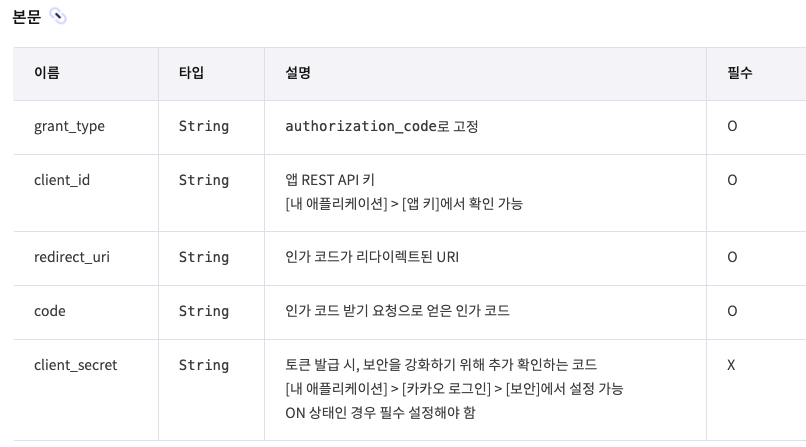

# 1. 문제상황

SpringSecurity 로 세션 로그인, Jwt 로그인, OAuth2 등등 많은 방법으로 로그인을 구현해봤지만 제일 귀찮은 건 OAuth2 이다. 외부 API 와 연동해야 해서 테스트도 어려운 데다가 처음엔 플로우도 잘 이해가 안되기 때문이다.

이제는 어느정도 익숙해져서 간단히 설정파일과 커스텀 핸들러로 OAuth 로그인을 구현할 수 있다. 하지만 이번에 카카오 로그인을 구현하면서 카카오는 별도의 추가적인 설정이 필요하다는걸 발견했다. 

## 1.1 문제 발견

naver 와 kakao 를 구현하면서 naver 는 별도 설정없이 인증토큰 발급이 잘 되는데 kakao 는 에러 메시지도 없이 진행이 되지 않았다. 그래서 RestTemplate 의 로깅 레벨을 DEBUG 로 설정하고 API 를 확인했다.

> `logging.level.org.springframework.web.client.RestTemplate=DEBUG` 추가

확인해보니 `https://kauth.kakao.com/oauth/token` 을 요청하는 과정에서 401 에러가 발생했다. DEBUG 로 설정하면 Request 의 Body 값도 볼 수 있는데 grant_type, code, redirect_uri 가 들어가있다. 이게 구글이든 네이버든 기본적으로 인증토큰을 발급받을 때의 필수 요소이다. **하지만 카카오는 달랐다.**



위에서 보듯이 'client_id'도 포함사항이다. 그래서 계속 401 에러가 난 것이다.

# 2. 해결 방법

문제를 찾았으니 해결하기는 쉽다. token-uri 을 호출하는 클래스를 찾은 뒤 커스텀으로 변경해주면 된다.

## 2.1 OAuth2AccessTokenResponseClient

인증 토큰은 `OAuth2AccessTokenResponseClient` 에서 API 를 요청해 발급받는다. 좀 더 자세히 말하자면, 해당 클래스에서 인증정보(authorizationCodeGrantRequest)를 조합해서 HTTP 요청으로 만드는데 이는 requestEntityConverter 로 이루어진다. 그리고 restTemplate 으로 요청이 이루어진다. 

*대략적인 pseudo code 로 확인해보면,*

```kotlin {7}
class OAuth2AccessTokenResponseClient {

  //토큰을 가져오는 메서드
	fun getTokenResponse(인증정보) {
		val httpRequest = converter.toHttpRequest(인증정보)
    
    httpRequest.addBody("client_id", "abfup72345by8gfs") //client_id 추가
		
		val response = restTemplate.exchange(httpRequest)
	}
}
```

인증정보를 받으면 해당 정보 내에 grant_type, redirect_uri, code 등이 있으니 http body 로 만들 수 있다. **나는 이렇게 중간에 client_id 를 추가하는 방식으로 구현했다.**

> **참고**
>
> 해당 과정은 OAuth2LoginAuthenticationFilter 의 attemptAuthentication() 에서 진행된다. 필터 내에서 토큰 인증, 유저 정보 가져오기가 모두 진행된 후  SuccessHandler 로 이동한다. 실패하면 당연히 FailureHandler 로 이동한다.

## 2.2 SecurityConfig

아래와 같이 tokenEndpoint 로 accessTokenResponseClient 을 커스텀으로 넣을 수 있다.

```java
http.oauth2Login(oauth2 -> oauth2
                .authorizationEndpoint(...)
                .tokenEndpoint(token -> token.accessTokenResponseClient(customTokenResponseClient()))
                .successHandler(...)
                .failureHandler(...)
        );
```

이제 카카오로 요청하면 client_id 가 잘 들어간다!

# 3. 구체적인 코드

`OAuth2AccessTokenResponseClient` 만 자세히 살펴보자. `OAuth2AccessTokenResponseClient` 의 기본 구현체는 `DefaultAuthorizationCodeTokenResponseClient` 이다.

```java
public OAuth2AccessTokenResponse getTokenResponse(OAuth2AuthorizationCodeGrantRequest authorizationCodeGrantRequest) {
        Assert.notNull(authorizationCodeGrantRequest, "authorizationCodeGrantRequest cannot be null");
        RequestEntity<?> request = (RequestEntity) this.requestEntityConverter.convert(authorizationCodeGrantRequest);
        ResponseEntity<OAuth2AccessTokenResponse> response = this.getResponse(request);
        OAuth2AccessTokenResponse tokenResponse = (OAuth2AccessTokenResponse)response.getBody();
        Assert.notNull(tokenResponse, "The authorization server responded to this Authorization Code grant request with an empty body; as such, it cannot be materialized into an OAuth2AccessTokenResponse instance. Please check the HTTP response code in your server logs for more details.");
        return tokenResponse;
    }
```

getTokenResponse() 메서드만 보면, this.requestEntityConverter.convert(authorizationCodeGrantRequest) 를 통해 RequestEntity 를 만든다. 그렇다면 requestEntityConverter 를 커스텀으로 넣어줘도 된다는 얘기이다. 

converter 의 구현체는 `OAuth2AuthorizationCodeGrantRequestEntityConverter` 가 들어간다.

## 3.1 OAuth2AuthorizationCodeGrantRequestEntityConverter

```java
protected MultiValueMap<String, String> createParameters(OAuth2AuthorizationCodeGrantRequest authorizationCodeGrantRequest) {
        ClientRegistration clientRegistration = authorizationCodeGrantRequest.getClientRegistration();
        OAuth2AuthorizationExchange authorizationExchange = authorizationCodeGrantRequest.getAuthorizationExchange();
        MultiValueMap<String, String> parameters = new LinkedMultiValueMap();
        parameters.add("grant_type", authorizationCodeGrantRequest.getGrantType().getValue());
        parameters.add("code", authorizationExchange.getAuthorizationResponse().getCode());
        String redirectUri = authorizationExchange.getAuthorizationRequest().getRedirectUri();
        String codeVerifier = (String)authorizationExchange.getAuthorizationRequest().getAttribute("code_verifier");
        if (redirectUri != null) {
            parameters.add("redirect_uri", redirectUri);
        }

        if (!ClientAuthenticationMethod.CLIENT_SECRET_BASIC.equals(clientRegistration.getClientAuthenticationMethod())) {
            parameters.add("client_id", clientRegistration.getClientId());
        }

        if (ClientAuthenticationMethod.CLIENT_SECRET_POST.equals(clientRegistration.getClientAuthenticationMethod())) {
            parameters.add("client_secret", clientRegistration.getClientSecret());
        }

        if (codeVerifier != null) {
            parameters.add("code_verifier", codeVerifier);
        }

        return parameters	;
    }
```

해당 클래스의 createParameters() 를 보면 기본적으로 grant_type, code, redirect_uri 는 들어간다. **하지만 client_id 는 ClientAuthenticationMethod 가 CLIENT_SECRET_BASIC 가 아닐 때만 들어간다.** 확인 결과 kakao 는 CLIENT_SECRET_BASIC 였다.

그렇다면 ClientAuthenticationMethod 를 다른 걸로 (NONE 등) 바꿔주면 될까 생각했지만 그러지 않기로 했다. ClientAuthenticationMethod 의 쓰임새가 다른 필터에도 있다면 의도치 않은 문제를 일으킬 수도 있기 때문이다.

## 3.2 CustomTokenResponseClient

그래서 만든게 CustomTokenResponseClient 이다. **DefaultAuthorizationCodeTokenResponseClient 를 복사하고 필요한 부분만 변경하였다.**

```java
public class CustomTokenResponseClient implements OAuth2AccessTokenResponseClient<OAuth2AuthorizationCodeGrantRequest> {

    private static final String INVALID_TOKEN_RESPONSE_ERROR_CODE = "invalid_token_response";
    private final Converter<OAuth2AuthorizationCodeGrantRequest, RequestEntity<?>> requestEntityConverter = new OAuth2AuthorizationCodeGrantRequestEntityConverter();
    private final RestOperations restOperations;

    public CustomTokenResponseClient() {
        RestTemplate restTemplate = new RestTemplate(Arrays.asList(new FormHttpMessageConverter(), new OAuth2AccessTokenResponseHttpMessageConverter()));
        restTemplate.setErrorHandler(new OAuth2ErrorResponseErrorHandler());
        this.restOperations = restTemplate;
    }

    public OAuth2AccessTokenResponse getTokenResponse(OAuth2AuthorizationCodeGrantRequest authorizationCodeGrantRequest) {
        Assert.notNull(authorizationCodeGrantRequest, "authorizationCodeGrantRequest cannot be null");
        RequestEntity<?> request = convert(authorizationCodeGrantRequest);

        if(authorizationCodeGrantRequest.getClientRegistration().getRegistrationId().equals("kakao")) {
            addClientId(request, authorizationCodeGrantRequest.getClientRegistration().getClientId());
        }

        ResponseEntity<OAuth2AccessTokenResponse> response = this.getResponse(request);
        OAuth2AccessTokenResponse tokenResponse = response.getBody();
        Assert.notNull(tokenResponse, "The authorization server responded to this Authorization Code grant request with an empty body; as such, it cannot be materialized into an OAuth2AccessTokenResponse instance. Please check the HTTP response code in your server logs for more details.");
        return tokenResponse;
    }

    private ResponseEntity<OAuth2AccessTokenResponse> getResponse(RequestEntity<?> request) {
        try {
            return this.restOperations.exchange(request, OAuth2AccessTokenResponse.class);
        } catch (RestClientException ex) {
            OAuth2Error oauth2Error = new OAuth2Error("invalid_token_response", "An error occurred while attempting to retrieve the OAuth 2.0 Access Token Response: " + ex.getMessage(), (String)null);
            throw new OAuth2AuthorizationException(oauth2Error, ex);
        }
    }


    /**
     * ClientAuthenticationMethodValidatingRequestEntityConverter 내용
     */
    public RequestEntity<?> convert(OAuth2AuthorizationCodeGrantRequest grantRequest) {
        ClientRegistration clientRegistration = grantRequest.getClientRegistration();
        ClientAuthenticationMethod clientAuthenticationMethod = clientRegistration.getClientAuthenticationMethod();
        String registrationId = clientRegistration.getRegistrationId();
        boolean supportedClientAuthenticationMethod = clientAuthenticationMethod.equals(ClientAuthenticationMethod.NONE) || clientAuthenticationMethod.equals(ClientAuthenticationMethod.CLIENT_SECRET_BASIC) || clientAuthenticationMethod.equals(ClientAuthenticationMethod.CLIENT_SECRET_POST);
        Assert.isTrue(supportedClientAuthenticationMethod, () -> String.format("This class supports `client_secret_basic`, `client_secret_post`, and `none` by default. Client [%s] is using [%s] instead. Please use a supported client authentication method, or use `setRequestEntityConverter` to supply an instance that supports [%s].", registrationId, clientAuthenticationMethod, clientAuthenticationMethod));
        return this.requestEntityConverter.convert(grantRequest);
    }

    private void addClientId(RequestEntity<?> request, String clientId) {
        // request 에 client_id 추가
        if(request.getBody() instanceof Map) {
            Map<String, List<String>> additionalParameters = (Map<String, List<String>>) request.getBody();

            additionalParameters.put("client_id", Collections.singletonList(clientId));
        }
    }
}
```

코드가 길긴 한데 제일 밑의 `addClientId()` 메서드만 보면 된다. body 를 가져와서 client_id 를 넣는다.

# 4. 결론

최근 vue 공부를 하면서 코딩애플의 vue 강의를 들었다. 코딩애플은 vue 가 쉬운 이유가 코드를 짜는 방법이 정형화되어있기 때문이라고 했다. 예를 들어 특정 로직을 반복 하려면 react 에서는 map, for(), forEach 등등 많은 선택지가 있지만 vue 에서는 v-for 로 퉁친다고 했다.

springSecurity 도 비슷한 맥락인데, 기본설정으로 쓰기는 좋지만 커스텀이 필요하면 어디서부터 손을 대야하는지 막막하기는 하다. 이번 문제도 몇가지 해결방법이 있는데, 

1. Filter 를 구현한다.
2. AuthenticationProvider 를 구현한다.
3. **OAuth2AccessTokenResponseClient 을 구현한다.** (선택한 방식)
4. Converter 를 구현한다. (가능한지는 확인안했음)
5. 엔드포인트를 직접 Controller로 구현하고 필터를 무시한다.

등등 셀 수 없는 방법으로 해결할 수 있다. 안타깝게도 방법이 많으면 생각을 많이 하게 되고, 장고 끝에 악수를 두게 된다. 그래서 길게 생각안하고 필요한 부분만 들어내서 고쳤다.


