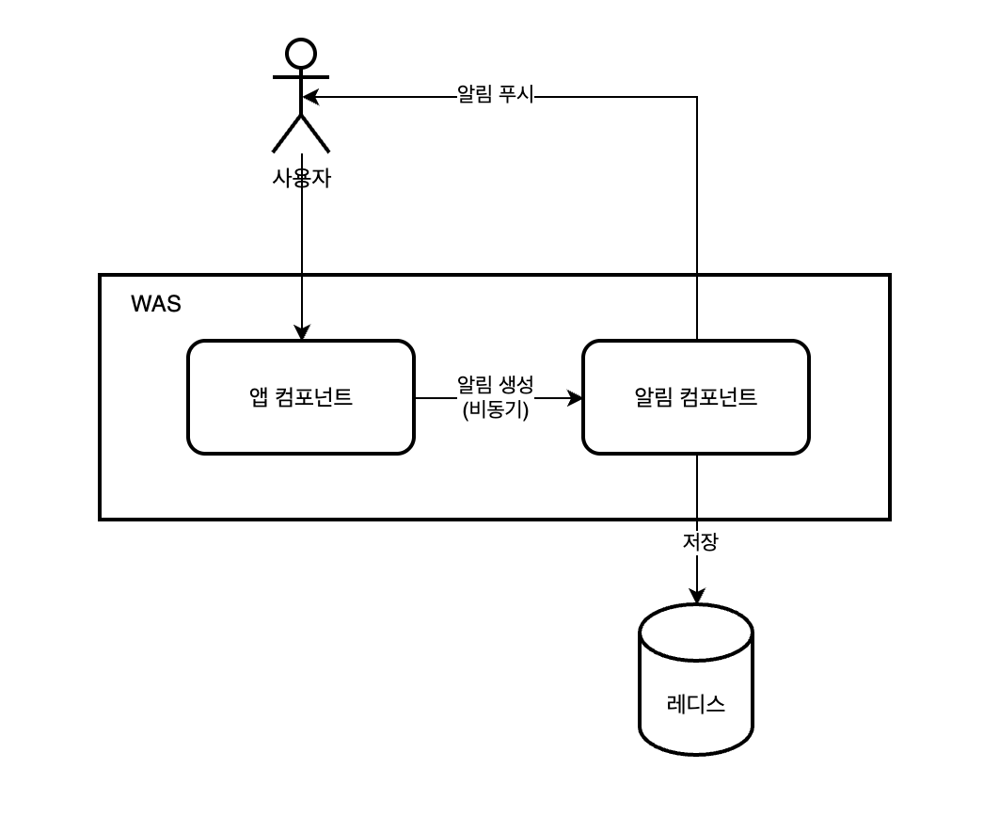
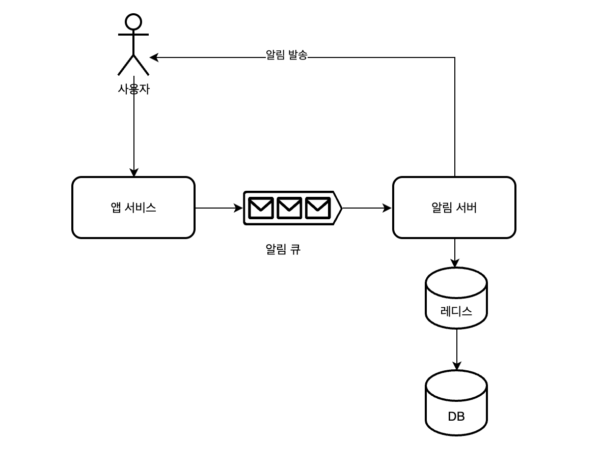
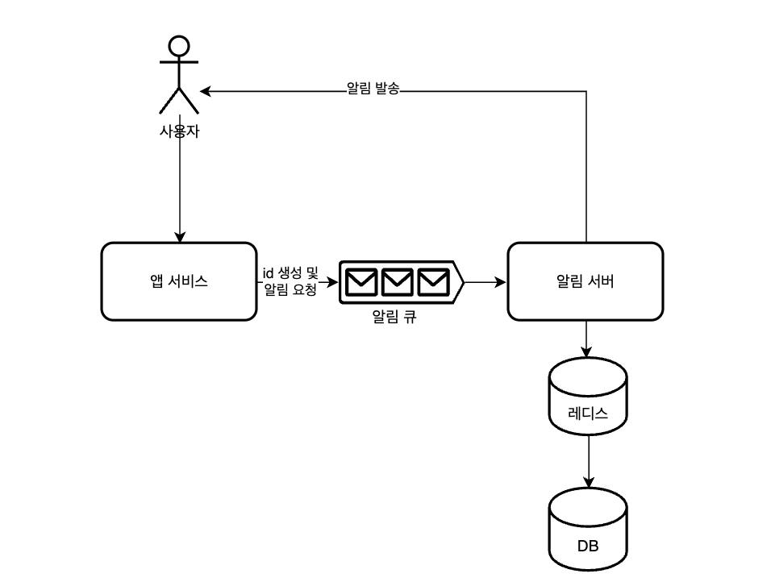
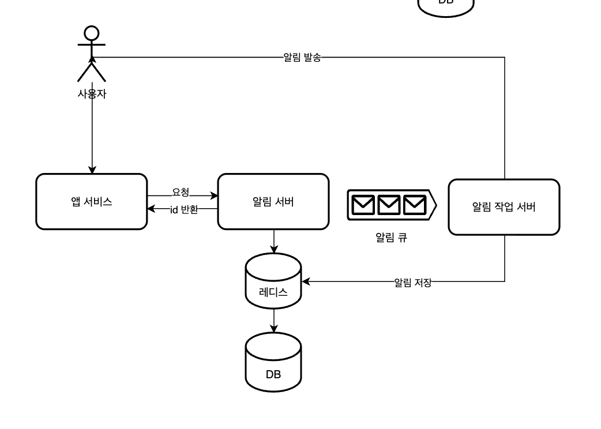
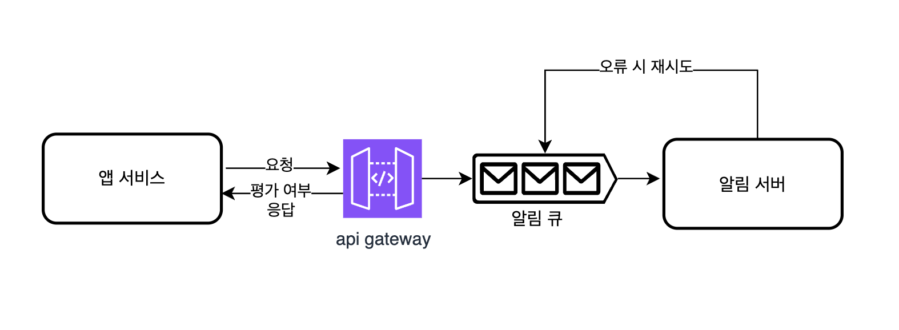
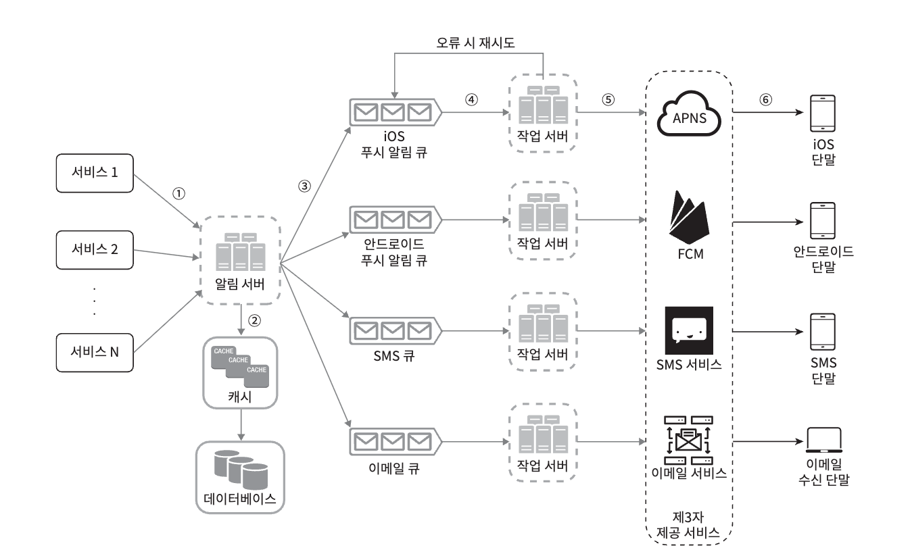
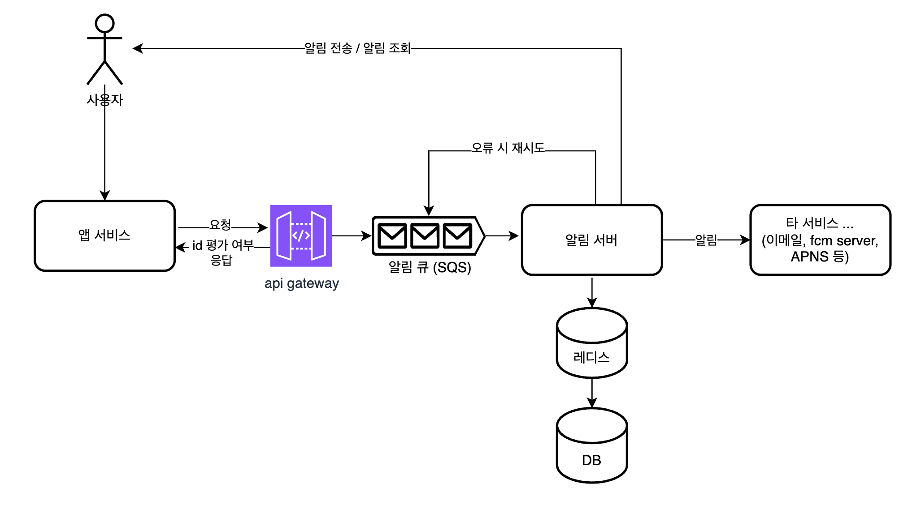

<Header />

[[toc]]

# 1. 요구사항

지금 개발하고 있는 서버에서 알림과 비슷한, 다음과 같은 요구사항이 필요했다.

1. 애플리케이션 설치 시 "설치 중" 표시 (알림으로 지칭)
2. 설치가 완료되면 "완료" 또는 "실패" 표시
3. 알림 목록을 조회

우선적으로 빠르게 개발을 완료했고 (시간이 가장 중요했기 때문에) 이후에 예전에 읽었던 `가상 면접 사례로 배우는 대규모 시스템 설계 기초` 에서 알림 서비스 챕터가 생각나서 추가로 개선을 해보았다.

# 2. 해결 과정

## 방법1. 레디스를 활용한 간단한 알림

우선 빠르게 개발하기 위해 (또한 예상되는 트래픽이 적어서) 레디스로 알림을 생성, 수정하고 조회하도록 만들었다.

하나의 WAS 에서 앱과 알림 컴포넌트가 동작한다.

- 앱 설치 등의 이벤트가 발생했을 떄 알림 컴포넌트로 메시지를 보낸다.
- 알림 컴포넌트는 레디스에 알림을 저장하고 사용자에게 알림을 푸시한다. (pub/sub 방식 또는 polling 방식)

알림을 생성할 때는 Threadpool 을 만들어서 비동기로 동작하게 했다.

### 해당 구조의 문제점

1. 알림의 종류가 많아지면 변경해야 할 포인트가 많아진다.
2. 레디스에 정보를 저장하면서 장애 시 알림 유실 위험이 있다. 
3. 다수 사용자에게 동시에 푸시가 발생하면 thread pool 포화, CPU 사용률 증가로 서비스 전체에 영향을 줄 수 있다.

## 방법2. SQS 로 알림 컴포넌트를 서버로 분리

디커플링 도구로 카프카 대신 SQS 를 선택한 이유는 다음과 같다.

- Kafka (MSK) 와 대비해서 SQS는 AWS에서 완전관리형으로 제공되며, 별도 인프라 운영 없이 빠른 개발이 가능하다.
- 고성능 스트리밍 보다는 비교적 단순한 이벤트 전달만 필요하다.
- SQS 도 retry 와 DLQ 로 예외 처리가 가능하다.
- 초기 비용이 적다.

### 초기 구상

초기에는 이런 식으로 구상했는데 다음과 같은 문제점이 있었다.

1. 같은 알림을 추적해서 수정해야 한다. 설치가 완료되면 해당 알림을 "완료" 또는 "실패" 로 표시해야 하기 때문이다.
2. 따라서 앱 서비스는 알림 id 를 응답값으로 받아야 한다.
3. 그런데 큐로 분리하면 앱 서비스에서는 알림  id 를 받을 수 없다.

### 추가 방안

따라서 아래와 같은 두 가지 방안을 생각해보았다.

**앱 서비스 쪽에서 알림 id 를 생성 (선택)**

- 장점 : 알림 서버와 디커플링 가능
- 단점 : 알림 서버에서 알림 id 생성에 관한 정책을 결정할 수 없음

**알림 서버와 알림 작업 서버를 구분**

알림 서버에서는 알림 id 생성 및 반환 후 알림 작업 서버 큐로 작업을 던진다.

*(두 개의 서버가 하나의 저장소를 공유하는 구조떄문에 해당 설계를 선택하지 않았다.)*

- 장점 : 알림 서버에서 메타 데이터를 관리하고 알림 id 생성 가능
- 단점 : 단일 장애점이 될 수 있다. 현재 구조에서, 알림 작업 서버는 다시 레디스로 저장해야 하기 때문에 두 개의 서버가 하나의 저장소를 공유한다.

### 아이디 생성 방법

앱 서비스쪽에서 알림 id 를 생성한다면 다음같은 문제가 있을 것이라고 생각했다.

1. 알림 서버에서 id 정책을 정할 수 없음
   - 해결 : 공유 라이브러리를 사용하거나, 아이디 정책을 설정하고 각 서버에 전파해야 한다. 그리고 맞지 않는 형식이면 거부해야 한다.
2. id 가 겹치는 문제
   - UUID 로 사용하면 개별적으로 생성한 id 가 겹칠 일은 없다. 하지만 생성된 id 가 연속해서 쓰이거나, 테스트용으로 넣은 정적 String 값이 id 로 보내질 수 있다.
   - 해결 : 이 부분은 알림 서버에서는 해결할 수 없고 각 서비스별로 잘 관리해야 한다.

우선 id 생성 정책은 다음과 같다.

-  서비스#uuid (ex. app#abacabcsefasdfad)

그리고 아래와 같이 sqs 전 api gateway 에서 id 를 정책에 맞는지 평가하고 평가 여부를 응답한다. (200, 400 응답)

## 방법3. 작업 서버 분리 (추가사항)

`대규모 시스템 설계 기초` 에서는 알림 서버와 작업 서버를 분리하고 있다.

하지만 서비스 규모가 크지 않을 때 작업 서버와 큐를 여러 개 둔다는 건 운영적인 측면에서 필요하지 않다고 생각했다. 그리고 이미 **서비스들과 알림 서버는 디커플링되어 있기 때문에** 알림 서버가 단일 장애점이라고도 생각하지 않았다.

## 최종 구조

- 알림 서버는 다음 기능을 제공한다.
  - 알림 전송 API (SQS 만 구독, 같은 VPC 에서만 api gateway 호출 가능)
    - 여러 유저에게 동시에 보낼 수 있도록 다중 전송 기능도 포함
  - 알림 검증 : 이메일 주소, 전화 번호 등에 대한 기본적인 검증
  - 알림 전송
  - 알림 조회

# 추가 사항들

## 1. 데이터베이스에 포함될 내용

데이터베이스에는 다음과 같은 두 가지 정보를 포함한다.

1. 알림

   - 기존에 보낸 알림을 조회한다. 

   - 처리 결과, 읽음(필요 시) 등의 정보도 함께 포함한다.

2. 유저 메타 데이터

   1. 유저가 가진 이메일, 휴대폰 번호, 디바이스 (디바이스 정보는 유저와 다대일 관계이다.)
   2. 각 채널 별 알림 on/off 상태

<Footer />