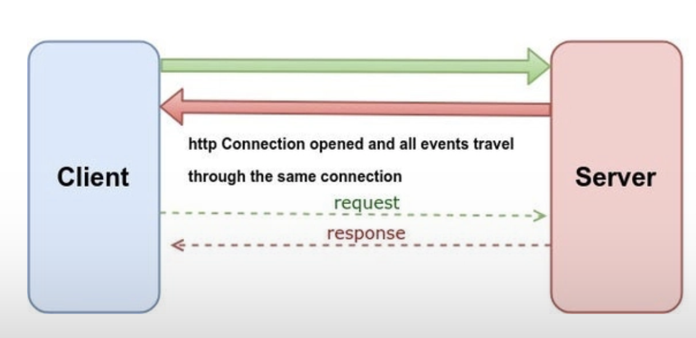
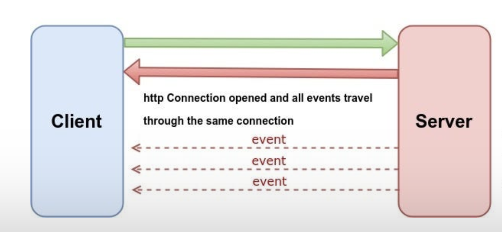

토이 프로젝트를 하면서 서버로부터 데이터를 받아와야하는 구간이 있었다. 그 부분을 해결하기 위해 서칭하면서 '실시간'하면 무조건 떠올리던 WebSocket 이 항상 최선은 아닐 수 있다는 교훈을 얻었다.

## 1. 문제 상황: 실시간 색상 전파가 필요하다

내가 만들던 애플리케이션은 레딧의 만우절 이벤트 r/place 에서 착안한 간단한 협업 도구였다. 


수많은 점(dot)으로 이루어진 거대한 그리드가 있고, 사용자들은 각 점의 색을 바꿔 하나의 그림을 완성해나가는 서비스였다. 핵심 기능은 명확했다.

> 한 유저가 특정 점의 색깔을 바꾸면, 그 정보가 다른 모든 접속자에게 실시간으로 전파되어야 한다.

이 요구사항을 듣자마자 머릿속에 떠오른 단어는 단연 '웹소켓(WebSocket)'이었다. 실시간, 양방향 통신이라는 키워드에 이보다 더 적합한 기술은 없어 보였기 때문이다. 당연하게도 나는 WebSocket을 적용하는 방향으로 초기 설계를 시작했다.

## 2. WebSocket vs SSE

설계를 구체화하던 중, 문득 한 가지 의문이 들었다. "과연 우리에게 양방향 통신이 꼭 필요한가?" 사용자가 색을 바꾸는 행위(클라이언트 → 서버)는 단발적인 HTTP POST 요청으로도 충분히 처리할 수 있다. 정작 실시간성이 필요한 부분은 서버가 "색이 바뀌었어!"라고 모든 클라이언트에게 알려주는, 즉 서버 → 클라이언트 방향의 통신이었다. 이 고민은 나를 Server-Sent Events(SSE)라는 또 다른 선택지로 이끌었다.

### WebSocket: 강력한 양방향 소통

웹소켓은 클라이언트와 서버 간에 하나의 TCP 연결을 통해 전이중(full-duplex) 통신 채널을 제공하는 프로토콜이다. [2014년 HTML5 표준의 일부로 채택](https://yuricoding.tistory.com/134)된 이후, 실시간 채팅, 멀티플레이어 게임, 협업 편집 툴 등 즉각적인 상호작용이 필수적인 서비스의 기반 기술로 자리 잡았다. 한번 연결이 수립되면 클라이언트든 서버든 언제든지 데이터를 보낼 수 있는 강력한 양방향성이 가장 큰 특징이다.



- **프로토콜:** `ws://` 또는 `wss://` 라는 별도의 프로토콜을 사용한다.
- **통신 방식:** 양방향(Bi-directional). 서버와 클라이언트가 동등하게 데이터를 주고받을 수 있다.
- **주요 특징:** 낮은 지연 시간, 높은 성능. 텍스트뿐만 아니라 바이너리 데이터 전송도 가능하다.

### SSE: 효율적인 단방향 알림

Server-Sent Events(SSE)는 이름 그대로 서버가 클라이언트에게 이벤트를 보내는 기술이다. 일반적인 HTTP 프로토콜을 기반으로 동작하며, 서버에서 클라이언트로의 단방향 데이터 스트리밍을 위해 설계되었다. 클라이언트는 `EventSource` 인터페이스를 통해 서버의 특정 엔드포인트를 '구독'하고, 서버는 이 연결을 유지하며 필요할 때마다 데이터를 '푸시'한다.



- **프로토콜:** 표준 HTTP/HTTPS를 사용한다.
- **통신 방식:** 단방향(Uni-directional). 서버에서 클라이언트로만 데이터를 보낼 수 있다.
- **주요 특징:** 구현이 비교적 간단하고, 기존 인프라와 호환성이 좋다. 연결이 끊겼을 때 [브라우저가 자동으로 재연결을 시도](https://surviveasdev.tistory.com/entry/웹소켓-과-SSEServer-Sent-Event-차이점-알아보고-사용해보기)하는 편리한 기능이 내장되어 있다.

### 한눈에 보는 비교와 선택의 기로

두 기술의 차이점을 명확히 인지하자, 프로젝트에 대한 해답이 보이기 시작했다.

| 구분           | WebSocket                           | SSE (Server-Sent Events)          |
| :------------- | :---------------------------------- | :-------------------------------- |
| 통신 방향      | 양방향 (Full-duplex)                | 단방향 (Server → Client)          |
| 프로토콜       | WebSocket (ws/wss)                  | HTTP/HTTPS                        |
| 자동 재연결    | 기본적으로 미지원 (라이브러리 필요) | 브라우저가 자동 지원              |
| 데이터 형식    | UTF-8, 바이너리                     | UTF-8 텍스트만 가능               |
| 주요 사용 사례 | 채팅, 온라인 게임, 협업 툴          | 알림, 실시간 뉴스 피드, 주식 시세 |

프로젝트에서는 서버가 클라이언트에게 일방적으로 업데이트를 알리기만 하면 충분했다. 클라이언트가 서버로 무언가를 계속 보낼 필요가 없었다. 이 경우, 양방향 통신을 위한 웹소켓은 다소 과한 스펙(Over-spec)이었다. 반면 SSE는 가볍고, 구현이 간단하며, 우리의 요구사항에 정확히 부합했다. 따라서 나는 초기 계획을 수정하여 SSE를 도입하기로 결정했다.

## 3. 코드로 확인하기

이번에는 Spring WebFlux 기반의 SSE가 실제로 어떻게 구현되는지 코드를 통해 확인해보자. 나는 이 문제를 해결하기 위해 Notification 이라는 별도의 도메인으로 분리하여 설계하였으며, 이를 통해 **관심사의 분리**와 **확장성**을 확보했다.

### Notification 도메인 구성

알림(Notification)은 특정 방(room)에 속한 클라이언트에게 이벤트를 전달하는 역할을 담당한다. SSE를 통해 서버에서 클라이언트로 푸시되는 이벤트의 공통 추상화를 위해 `NotificationMessage`라는 추상 클래스를 기반으로 설계되었다.

**NotificationMessage.kt**

알림 메시지의 공통적인 형태를 정의하는 추상 클래스다. 모든 알림은 특정 room(방)으로 전송되므로 `room` 필드를 공통 인터페이스로 정의했다.

```kotlin
abstract class NotificationMessage {

    abstract val room: String
}
```

**SolveNotificationMessage.kt**

점의 색을 바꾸기 위한 이벤트다. 사용자가 특정 좌표의 점(dot)을 특정 색으로 바꾸는 행위에 대한 알림을 전송할 때 사용된다.

```kotlin
data class SolveNotificationMessage(
    val col: Int,
    val row: Int,
    override val room: String,
    val color: String
): NotificationMessage()
```

**NotificationEventListener.kt**

Spring의 `@EventListener`를 활용하여 애플리케이션 이벤트를 수신하는 컴포넌트다. 도메인 내에서 `NotificationMessage`가 발행되면, 이를 받아 `NotificationSink`에 전달하여 구독자에게 전송되도록 한다.

```kotlin
@Component
class NotificationEventListener(
    private val notificationSink: NotificationSink
) {
    @EventListener
    fun handle(event: SolveNotificationMessage) {
        notificationSink.emit(event)
    }
}
```

**NotificationSink.kt**

실제 메시지를 전송하는 핵심 컴포넌트이다. 각 room마다 고유한 `Sink`를 생성하여, 해당 방의 구독자들에게만 메시지를 전파한다.

```kotlin
@Component
class NotificationSink {
    private val sinkMap: MutableMap<String, Sinks.Many<NotificationMessage>> = ConcurrentHashMap()

    fun emit(message: NotificationMessage) {
        val sink = sinkMap.computeIfAbsent(message.room) {
            Sinks.many().multicast().onBackpressureBuffer()
        }
        sink.tryEmitNext(message)
    }

    fun asFlux(room: String): Flux<NotificationMessage> {
        val sink = sinkMap.computeIfAbsent(room) {
            Sinks.many().multicast().onBackpressureBuffer()
        }
        return sink.asFlux()
    }
}
```

**주요 동작**

- `computeIfAbsent`: 방이 존재하지 않으면 새로운 `Sink`를 생성
- `Sinks.many().multicast()`: 여러 구독자가 동일한 메시지를 받을 수 있도록 설정
- `onBackpressureBuffer()`: 수신자가 느릴 경우 버퍼링 처리

> `roomId` 기준으로 메시지 흐름을 분리함으로써, 구독자는 본인이 속한 방의 이벤트만 수신하게 됨

**SseController.kt**

클라이언트가 `/api/notifications/subscribe/{room}` 엔드포인트를 통해 SSE 구독을 시작하는 진입점이다.

```kotlin
@RestController
@RequestMapping("/api/notifications")
class SseController(
    private val notificationSink: NotificationSink
) {
    @GetMapping("/subscribe/{room}", produces = [MediaType.TEXT_EVENT_STREAM_VALUE])
    fun subscribe(@PathVariable room: String): Flux<ServerSentEvent<NotificationMessage>> {
        return notificationSink.asFlux(room)
            .map { message ->
                ServerSentEvent.builder(message).build()
            }
    }
}
```

**주요 특징**

- `Flux<ServerSentEvent<...>>`를 리턴함으로써 스트리밍 형태의 응답을 구성
- `TEXT_EVENT_STREAM_VALUE`는 SSE 전용 Media Type
- 구독한 클라이언트는 서버로부터 지속적으로 이벤트를 수신

SSE 예시 코드에서 볼 수 있듯, 클라이언트의 색상 변경 요청은 일반적인 `POST` 요청으로 처리하고, 서버는 이 요청을 받은 뒤 연결된 모든 SSE 클라이언트에게 `gridUpdate` 이벤트를 전송한다. 이는 우리 프로젝트의 요구사항과 정확히 일치하는 흐름이다.

## 4. 최종 선택과 결론

결론적으로, 프로젝트에서는 SSE를 채택했다. 이 선택의 핵심 이유는 '**필요한 만큼의 기술**'을 사용하는 것이 가장 효율적이라는 판단 때문이었다. WebSocket의 강력한 양방향성은 매력적이지만, 우리에게는 서버에서 클라이언트로의 단방향 푸시만으로 충분했다. SSE는 더 가볍고, 구현이 간단하며, 자동 재연결과 같은 편의 기능까지 제공한다.
