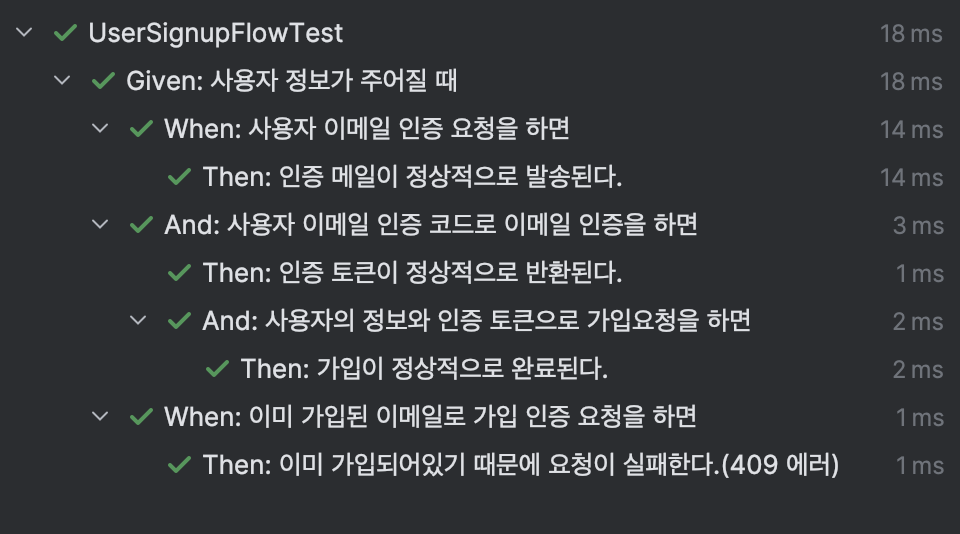

<Header />

[[toc]]

**테스트가 업무가 되었다.**

코드를 작성하면서 테스트를 작성하는 것은 당연한 일이지만, 작은 개발 조직에서만 일하다 보니 테스트에 대한 가이드라인이 없었고, 전적으로 개인의 재량에 의존하는 경우가 많았다. 이번에도 새로운 프로젝트를 진행하면서 중구난방으로 유닛 테스트만 작성하고 있었는데, 선임 개발자께서 **“코어 기능에 대한 테스트를 집중적으로 하자”**고 제안했다.

예를 들어, 회원 가입 기능이라면

> `이메일 인증 요청 → 이메일 인증 확인 → 회원 가입`

 까지의  **전체 플로우를 통합 테스트**하는 식이다.  이 제안 이후 약 2주 동안 테스트 코드 작성, 도구 적용, CI/CD 연동 등의 업무를 진행했다.

# 문제 해결 순서

내가 생각한(쥐어짜낸) 문제 해결 순서는 아래와 같다.

## 1. 목표설정

- 코어 기능 목록 정의 및 문서화
- 코어 기능 테스트 커버리지 100% 달성 목표 수립

테스트를 하려면 우선 기능 명세가 필요하다. 하지만 빠른 개발을 위해 달려오면서 **요구사항 명세서나 테스트 계획서가 충분히 작성되지 않은 상태**였다. 그래서 **모든 기능이 아니라 테스트가 반드시 필요한 기능**부터 식별하기로 했다.

 이를 위해 기능을 **A/B/C 등급**으로 분류하고, 로그인·회원가입·앱 다운로드/업로드처럼 서비스 핵심에 해당하는 **A 등급 기능**부터 통합 테스트를 진행했고 B, C 등급은 단위테스트만 진행했다.

## 2. 테스트 대상 기능 명세화

- 코어 기능별 시나리오 도출
- 유저 플로우와 예외 상황 포함

우선 테스트 시나리오를 작성한다. 예를 들어 회원가입과 앱 설치를 보면,

> 회원가입 : "이메일 인증 요청" -> "이메일 인증 확인" -> "회원 가입" 
>
> 앱 설치 : "앱 설치 요청" -> "알림" -> "running 상태 확인" -> "앱 설치 완료" -> "installation 저장" -> "알림"

이처럼 **유저 플로우 단위로 시나리오**를 만들고, 그 안에 예외 케이스를 함께 포함했다.

## 3. 테스트 전략 및 방법 설정

- 테스트 종류 결정
- 적용 프레임워크 및 라이브러리 확정

이번 프로젝트에서는 **Kotest**와 **MockMvc**를 사용하기로 했다.

**왜 Kotest인가?**

- **BDD 스타일**로 테스트를 작성할 수 있어 가독성이 뛰어나다.
- 시나리오 기반 테스트 구조를 깔끔하게 표현 가능하다.
- Kotlin 프로젝트와의 궁합이 좋다.

**왜 MockMvc인가?**

- **컨트롤러부터 필터까지** 실제 요청 흐름을 그대로 테스트 가능하다.
- API 호출 프로세스를 그대로 시뮬레이션할 수 있어 **E2E에 가까운 통합 테스트** 구현이 가능하다.
- RestDocs와도 쉽게 연동되어 문서화 작업에도 유리하다. (필요 시)

## 4. 테스트 케이스 작성 및 구현

- 시나리오 기반 케이스 설계
- 경계값, 예외 케이스 포함

예를 들어, 회원가입 기능의 경우



이렇게 **플로우와 예외 상황을 코드로 표현**해, 실제 서비스 동작을 재현하도록 했다. 아래와 같이 표현된다.

## 5. CI/CD 파이프라인과 테스트 툴 연동

- **Kover**: 전체 및 특정 클래스의 커버리지 측정
- **diff-cover**: 변경된 코드에 대한 커버리지 검증

먼저 Kover를 통해 코어 기능이 포함된 클래스들의 커버리지를 측정하고, 이를 CI/CD에서 테스트 성공/실패 판단 기준으로 삼았다. 다음 단계로는 커버리지 리포트를 diff-cover와 연동해, **커밋 변경사항이 반드시 테스트로 커버되었는지** 자동으로 확인할 계획이다.

# 코드 작성

## 1. 유닛 테스트

유닛 테스트는 **특정 기능이 외부 의존성 없이 정상 동작하는지** 확인하는 테스트다.
 주로 메서드 단위로 작성하며, 데이터베이스·네트워크 등 외부 리소스는 **모킹(Mock)** 하여 테스트 속도를 높이고 테스트 환경을 안정적으로 유지한다.

### 예시 코드 – 회원가입 유닛 테스트

아래 예시는 **회원가입 성공 시나리오**와 **중복 가입 예외 시나리오**를 각각 테스트하는 코드다. `every`로 **행동을 모킹**하고, `verify`로 **호출 여부와 횟수**를 검증한다. 특히 시나리오 간 호출 내역이 섞이지 않도록 `clearInvocations()`를 넣어야 한다.

```kotlin
Given("유저의 회원가입 입력 정보가 주어졌을 때") {
    val email = "testUser@gmail.com"
    val password = "saf!@#1ASDA"
    val name = "testUser"
    val address = "address"
    val phoneNumber = "01011111234"
    val country = createCountry()

    // 모킹 설정
    every { userRepository.existsUserByEmailAndDeletedAtIsNull(email) } returns false
    every { countryReader.getCountry(country.countryId) } returns country
    every {
        userRepository.save(any(User::class))
    } returns mockUser(
        email = email,
        password = password,
        name = name,
        address = address,
        phoneNumber = phoneNumber,
        role = Role.USER,
        country = country
    )

    When("해당 정보로 회원가입을 하면") {
        val request = SignupServiceRequest(
            email = email,
            password = password,
            name = name,
            address = address,
            phoneNumber = phoneNumber,
            countryId = country.countryId!!
        )

        val user = userService.signup(request)

        Then("정상적으로 회원가입 후 정보가 반환된다") {
            user.email shouldBe email
            user.name shouldBe name
            user.address shouldBe address
            user.phoneNumber shouldBe phoneNumber
            user.role shouldBe Role.USER

            // 호출 검증
            verify(exactly = 1) { userRepository.existsUserByEmailAndDeletedAtIsNull(email) }
            verify(exactly = 1) { countryReader.getCountry(country.countryId) }
            verify(exactly = 1) { userRepository.save(any()) }
          
          	// 호출 초기화
          	clearInvocations(userRepository)
        }
    }

    When("같은 이메일로 다시 가입하려고 하면") {
        every { userRepository.existsUserByEmailAndDeletedAtIsNull(email) } returns true

        val duplicateRequest = SignupServiceRequest(
            email = email,
            password = password,
            name = name,
            countryId = 1L
        )

        Then("DuplicateUserException 예외가 발생한다") {
            assertThrows<DuplicateUserException> {
                userService.signup(duplicateRequest)
            }

            // 호출 검증 (save는 호출되지 않아야 함)
            verify(exactly = 1) { userRepository.existsUserByEmailAndDeletedAtIsNull(email) }
            verify(exactly = 0) { userRepository.save(any()) }
        }
    }
}
```

## 2. 통합 테스트

통합 테스트는 **MockMvc**를 활용해 실제 API 요청 흐름을 시뮬레이션하며, **유저 플로우를 처음부터 끝까지** 검증하는 방식으로 작성했다.
 회원가입 기능의 경우 다음 순서로 동작한다.

> 이메일 인증 요청 → 이메일 인증 확인 → 회원 가입

따라서 해당 API들을 순차적으로 호출하는 시나리오를 그대로 테스트 코드로 옮겼다.

```kotlin
class UserSignupFlowTest: FlowIntegrationHelper() {

    private lateinit var country: Country

    init {
        Given("사용자 정보가 주어질 때") {

            setTestData()

            val email = "testUser@gmail.com"
            val password = "saf!@#1ASDA"
            val name = "testUser"
            val address = "address"
            val phoneNumber = "01011111234"

            When("사용자 이메일 인증 요청을 하면") {

                val emailResponse = request(
                    url = "/auth/email-verification/request",
                    method = HttpMethod.POST,
                    headers = HttpHeaders(),
                    body = emailVerificationApiRequest(email),
                    returnTypeRef = object : TypeReference<ApiResponseFormat<String>>() {}
                )

                Then("인증 메일이 정상적으로 발송된다.") {
                    emailResponse.status shouldBe 200
                    emailResponse.data shouldBe "Email sent"

                    verify(exactly = 1) { emailService.sendTemplateEmail(any(TemplatedRequest::class)) }
                }
            }

            And("사용자 이메일 인증 코드로 이메일 인증을 하면") {

                val code = getCode(email)

                val emailVerificationResponse = request(
                    url = "/auth/email-verification/verify",
                    method = HttpMethod.POST,
                    headers = HttpHeaders(),
                    body = emailVerificationConfirmApiRequest(email, code),
                    returnTypeRef = object : TypeReference<ApiResponseFormat<String>>() {}
                )

                val token = emailVerificationResponse.data

                Then("인증 토큰이 정상적으로 반환된다.") {
                    emailVerificationResponse.status shouldBe 200
                    token shouldNotBe null
                }

                And("사용자의 정보와 인증 토큰으로 가입요청을 하면") {

                    val signupRequest = SignupApiRequest(
                        email = email,
                        password = password,
                        name = name,
                        address = address,
                        phoneNumber = phoneNumber,
                        countryId = country.countryId!!,
                        verificationToken = token
                    )

                    val signupResponse = request(
                        url = "/users/signup",
                        method = HttpMethod.POST,
                        headers = HttpHeaders(),
                        body = signupRequest,
                        returnTypeRef = object : TypeReference<ApiResponseFormat<UserResponse>>() {}
                    )

                    Then("가입이 정상적으로 완료된다.") {
                        signupResponse.status shouldBe 200

                        val savedUser = getUserInDatabase(signupResponse.data.userId!!)

                        savedUser.email shouldBe email
                        savedUser.password shouldNotBe null
                        savedUser.name shouldBe name
                        savedUser.address shouldBe address
                        savedUser.phoneNumber shouldBe phoneNumber
                        savedUser.role shouldBe Role.USER
                        savedUser.country.countryId shouldBe country.countryId
                    }
                }
            }

            When("이미 가입된 이메일로 가입 인증 요청을 하면") {

                val emailRequest = emailVerificationApiRequest(email)

                val emailResponse = request(
                    url = "/auth/email-verification/request",
                    method = HttpMethod.POST,
                    headers = HttpHeaders(),
                    body = emailRequest,
                    returnTypeRef = object : TypeReference<ApiResponseFormat<Unit>>() {},
                    expectedStatus = 409
                )

                Then("이미 가입되어있기 때문에 요청이 실패한다.(409 에러)") {
                    emailResponse.status shouldBe 409
                }
            }
        }
    }

    override fun setTestData() {
        country = createCountry(code = "KOR")

        every { emailService.sendTemplateEmail(any(TemplatedRequest::class)) } returns Unit
    }

    private fun getCode(email: String): String {
        return verificationRepository.findByTargetAndType(email, VerificationType.SIGN_UP)!!.verificationCode
    }

    private fun getUserInDatabase(userId: Long): User {
        return userRepository.findById(userId)
            .orElseThrow { UserNotFoundException() }
    }

    private fun emailVerificationApiRequest(email: String) = EmailVerificationApiRequest(
        email = email,
        type = VerificationType.SIGN_UP
    )

    private fun emailVerificationConfirmApiRequest(
        email: String,
        code: String
    ) = EmailVerificationConfirmApiRequest(
        email = email,
        type = VerificationType.SIGN_UP,
        code = code
    )
}
```

이렇게 하면 글을 읽는 개발자가  “회원가입 플로우를 어떻게 API 순서대로 테스트하는지”를 한 번에 이해할 수 있고,  각 단계에서 무엇을 검증해야 하는지도 명확하게 알 수 있다.

# 마무리

이번 글에서는 **회원가입 기능**을 예시로

- 코어 기능 테스트 전략을 어떻게 세웠는지
- 시나리오 기반 유닛 테스트를 어떻게 작성했는지
- MockMvc로 통합 테스트를 어떻게 구현했는지

를 확인했다.
