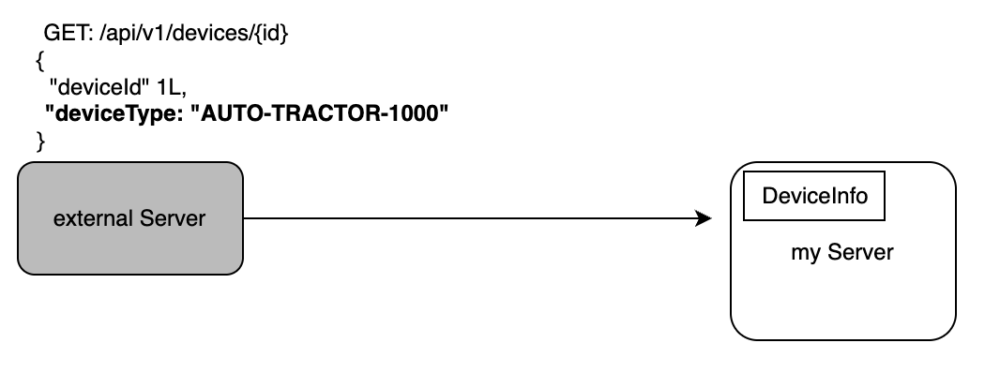

<Header />


[[toc]]


# 문제 상황

고정된 타입을 정의할 때 주로 enum 을 사용한다. 예를 들어 디바이스의 타입이 AUTO-TRACTOR-1000, AUTO-COMBINE-2000 이 있다고 하자. 그러면 사용하는 enum 값을 다음과 같이 정의할 수 있다.

```kotlin
enum class DeviceType {
	AUTO_TRACTOR_1000, AUTO_COMBINE_2000;
}
```

이 때 **"-"(hyphen) 은 변수명으로 사용할 수 없으므로 "_"(underbar) 로 변경**한다. 하지만 통용적으로 도메인에서, 그리고 다른 서버의 응답값으로 "-"(hyphen) 을 사용하고 있다고 가정하면 "-"(hyphen) 정보도 뺄 수 없으므로 **typename** 으로 두었다.

```kotlin
enum class DeviceType(
  val typeName: String
) {
	AUTO_TRACTOR_1000("AUTO-TRACTOR-1000"), 
  AUTO_COMBINE_2000("AUTO-COMBINE-2000");
}
```

이때 아래와 같이 다른 서버의 json 값이 해당 Enum 값인데 반환값에 "-"(hyphen) 을 사용하고 있다고 가정하자.



나는 아래와 같이 응답값을 받기 위해 DeviceInfo 를 만든 상황이다.

```kotlin
data class DeviceInfo(
  val deviceId: Long,
  val deviceType: DeviceType
)
```

그리고 아래와 같이 GET 요청을 restTemplate 으로 날리면 어떻게 될까?

```kotlin
restTemplate.exchange(
  "$externalServer/api/v1/devies/1",
  HttpMethod.GET,
  requestEntity,
  DeviceInfo::class.java
)
```

당연히 "AUTO_TRACTOR-1000" 은 enum 값에 포함되어있지 않으므로 아래와 같은  deserialize 에러가 발생한다.

> cannot deserialize value of type `com.hobeen.myserver.service.dto.DeviceType` from String \"AUTO-TRACTOR-1000\": not one of the values accepted for Enum class: [AUTO_TRACTOR_1000, AUTO_COMBINE_2000]

## 문제 원인

기본적으로 Jackson 은 클래스의 필드 타입에 맞게 자동으로 매핑을 수행한다. 하지만 경우에 따라 JSON 값과 객체 타입이 직접적으로 매칭되지 않는 경우가 있다.

Json 내 string 을 enum 값으로 변경할 떄 `com.fasterxml.jackson.databind.deser.std.EnumDeserializer` 가 동작한다. 이때 enum 의 name 값으로 찾게 된다. `AUTO-TRACTOR-1000` 는 당연히 enum 값이 아니므로 에러를 반환한다.

# 해결 방법

크게 두 가지 방법을 생각했다. 하나는 String 으로 받아서 직접 typeName 을 찾는 것, 두번째는 @JsonCreator 어노테이션 사용이다.

## 해결 방법 1: String 으로 받아서 변환

우선 Enum 클래스에서 typeName 을 enum 값으로 변경할 수 있도록 하는 메서드를 하나 선언한다.

```kotlin
enum class DeviceType(
  val typeName: String
) {
	AUTO_TRACTOR_1000("AUTO-TRACTOR-1000"), 
  AUTO_COMBINE_2000("AUTO-COMBINE-2000");
  
  fun getDeviceTypeByTypeName(typeName: String): FEUType {
            return entries.find { it.typeName == typeName } ?: throw IllegalArgumentException("DeviceType not found")
        }
}
```

이제 typeName string 값으로 DeviceType 을 찾을 수 있게 되었다.

그리고 restTemplate 통신으로 응답을 받을 때 devieType 을 String 으로 받을 클래스를 만든다.

```kotlin
data class DeviceInfoInternal(
  val deviceId: Long,
  val deviceType: String
)
```

그리고 해당 클래스로 응답값을 받고 변환한다.

```kotlin
val response: DeviceInfoInternal = restTemplate.exchange(
  "$externalServer/api/v1/devies/1",
  HttpMethod.GET,
  requestEntity,
  DeviceInfoInternal::class.java
)

val deviceInfo: DeviceInfo = DeviceInfo(
  deviceId = response.deviceId, 
  deviceType = DeviceType.getDeviceTypeByTypeName(response.deviceType)
)
```

하지만 이는 다음과 같은 문제점이 있다.

1. 변환 과정이 추가적으로 필요
2. external 서버에 대한 요청을 하는 코드마다 변환 과정이 필요해서 수정의 어려움

## 해결 방법 2: @JsonDeserialize

### @JsonDeserialize

`@JsonDeserialize`는 **Jackson 라이브러리**에서 제공하는 어노테이션으로, JSON 문자열을 자바/Kotlin 객체로 역직렬화(deserialization)할 때 **커스텀 로직을 지정**할 수 있게 해준다.

### 동작 방식

1. **JSON 문자열 수신** → Jackson ObjectMapper가 객체로 변환 시도
2. **`@JsonDeserialize(using = ...)` 발견** → 지정된 `JsonDeserializer` 구현체가 호출됨
3. **커스텀 로직 실행** → JSON 값 → 원하는 객체 타입으로 변환
4. **객체 필드에 주입**

즉, 단순히 매핑이 불가능한 경우에도 원하는 규칙을 직접 정의하여 매끄럽게 변환할 수 있다.

### 적용

아래와 같이 DeviceTypeDeserializer 클래스를 생성한다.

```kotlin
class DeviceTypeDeserializer: JsonDeserializer<DeviceType>() {
    override fun deserialize(p: JsonParser, ctxt: DeserializationContext): DeviceType {
        val codec = p.codec
        val node = codec.readTree<TextNode>(p)

        return DeviceType.getDeviceTypeByTypeName(node.asText())
    }
}
```

그리고 다음과 같이 json 의 deserialize 로 해당 Deserializer 를 사용한다고 선언하면(어노테이션을 븥이면) 정상적으로 동작한다.

```kotlin
@JsonDeserialize(using = DeviceTypeDeserializer::class)
enum class DeviceType(
  val typeName: String
) {
	AUTO_TRACTOR_1000("AUTO-TRACTOR-1000"), 
  AUTO_COMBINE_2000("AUTO-COMBINE-2000");
  
  fun getDeviceTypeByTypeName(typeName: String): FEUType {
            return entries.find { it.typeName == typeName } ?: throw IllegalArgumentException("DeviceType not found")
        }
}
```

## 해결 방법 3: @JsonCreator

### @JsonCreator

`@JsonCreator`는 **Jackson**에서 제공하는 애너테이션으로, JSON 문자열을 객체로 **역직렬화(deserialization)** 할 때 어떤 생성자나 팩토리 메서드를 사용할지 지정할 수 있다.
 기본적으로 Jackson은 매개변수 없는 생성자(no-args constructor)나 기본 생성 로직을 사용하지만, 경우에 따라 특정 생성자나 정적 메서드(팩토리 메서드)를 통해 객체를 생성하도록 강제할 수 있다.

Kotlin의 `enum`에서 JSON 문자열이 단순히 `enum.name`과 일치하지 않는 경우, `@JsonCreator`를 통해 커스텀 매핑 로직을 지정하면 편리하다.

**@JvmStatic 을 사용하는 이유**

- Jackson은 **Java 기반** 라이브러리이므로, 정적 메서드를 찾을 때 **JVM static 메서드**를 기대한다.
- Kotlin의 `companion object` 안에 정의된 함수는 기본적으로 인스턴스 메서드처럼 보이므로, `@JvmStatic`을 붙여줘야 Java의 정적 메서드처럼 인식된다.
- 따라서 `@JsonCreator`를 companion object 안에서 사용할 때는 `@JvmStatic`을 반드시 붙여야 Jackson이 해당 메서드를 팩토리 메서드로 호출할 수 있다.

#### mode

`@JsonCreator`는 `mode` 옵션을 통해 JSON → 객체 변환 방식을 세밀하게 제어할 수 있다.

- **DEFAULT**
  - Jackson이 매개변수의 개수나 이름을 보고 자동으로 매핑 방식을 선택한다.
  - 일반적으로 대부분의 경우 이 모드로 충분하다.
- **DELEGATING**
  - JSON 전체 값을 **하나의 인자**로 넘겨서 생성자를 호출한다.
  - 예: `"{ "typeName": "AUTO-TRACTOR-1000" }"` → 문자열 `"AUTO-TRACTOR-1000"` 하나만 받아 enum 매핑
- **PROPERTIES**
  - JSON 객체의 각 프로퍼티를 **생성자의 파라미터**와 일대일로 매핑한다.
  - 예: `"{ "typeName": "AUTO-TRACTOR-1000", "other": 123 }"` → 생성자의 `(typeName, other)` 파라미터에 각각 매핑
- **DISABLED**
  - `@JsonCreator`를 완전히 비활성화한다.
  - 문서상 존재하는 값이더라도 매핑되지 않도록 할 때 사용한다.

### 적용

```kotlin
enum class DeviceType(
  val typeName: String
) {
	AUTO_TRACTOR_1000("AUTO-TRACTOR-1000"), 
  AUTO_COMBINE_2000("AUTO-COMBINE-2000");
  
  @JvmStatic
  @JsonCreator(mode = JsonCreator.Mode.DELEGATING)
  fun getDeviceTypeByTypeName(typeName: String): FEUType {
            return entries.find { it.typeName == typeName } ?: throw IllegalArgumentException("DeviceType not found")
        }
}
```

# 해결

## 해결 방법 선택

해결 방법은 1번을 제외하고, 2, 3번을 비교했고 최종적으로 3번을 선택했다. 그 이유는 JsonDeserialize 를 사용할만큼 복잡한 변환이 필요없기 때문이다.

- **복잡한 JSON 변환 로직**이 필요한 경우 → `@JsonDeserialize`
- **간단한 enum/string 매핑**처럼 직관적인 경우 → `@JsonCreator`

## `@JsonDeserialize` vs `@JsonCreator` 비교

| 구분                 | @JsonDeserialize                                             | @JsonCreator                                                 |
| -------------------- | ------------------------------------------------------------ | ------------------------------------------------------------ |
| **개념**             | Jackson이 역직렬화 시 사용할 **커스텀 Deserializer 클래스**를 지정 | 역직렬화 시 사용할 **생성자/정적 팩토리 메서드**를 지정      |
| **사용 방식**        | `@JsonDeserialize(using = CustomDeserializer::class)`        | `@JsonCreator`를 생성자/companion object 메서드에 붙여 사용  |
| **적용 범위**        | 특정 클래스/필드 단위로 지정 가능 (세밀한 제어 가능)         | 클래스 레벨에서 객체 생성 로직 자체를 정의                   |
| **구현 난이도**      | 별도의 `JsonDeserializer<T>` 클래스 구현 필요 → 코드 길어짐  | 간단히 정적 메서드로 처리 가능 → 코드 간결                   |
| **유연성**           | 복잡한 파싱 로직 (JSON 구조 변환, 값 후처리 등) 처리 가능    | 주로 **단일 값 → 객체** 매핑에 적합                          |
| **Kotlin enum 처리** | enum 매핑 시에도 커스텀 로직 가능 (복잡한 변환 지원)         | enum 매핑에서 단순 문자열 ↔ enum 변환에 가장 적합            |
| **장점**             | - 복잡한 JSON 구조 변환 가능 - 여러 필드 기반의 변환 지원 - 재사용성 높음 | - 코드가 간결 - 별도 클래스 필요 없음 - enum 매핑에 직관적   |
| **단점**             | - 별도 클래스 파일 필요 → 유지보수 번거로움 - 간단한 매핑에는 오버킬 | - 복잡한 JSON 구조 변환에는 부적합 - 주로 단순 매핑에만 유용 |

# Ref.

없음��
<Footer />