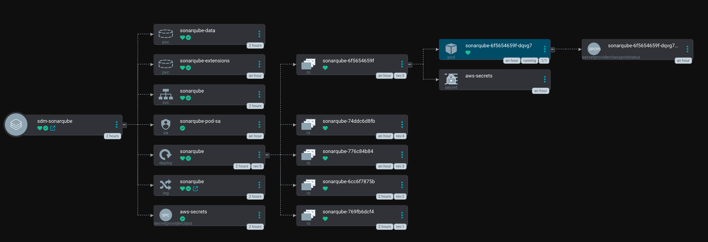
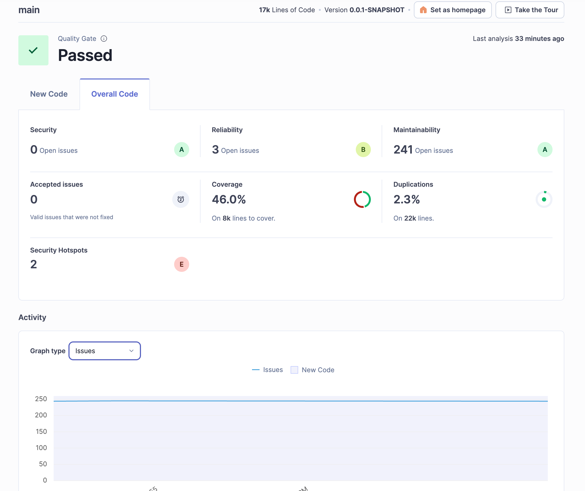

<Header />

[[toc]]

현재 회사에서 신규 프로젝트에 대한 백엔드 개발을 거의 혼자하고 있어서 PR 리뷰가 제대로 되고 있지 않은 상황이다. 따라서 여러 분석 툴을 고민해봤는데, 내가 원하는 기능(자동으로 분석 후 PR 메시지에 리뷰 달아주기)은 모두 유료였다. 따라서 우선적으로 할 수 있는 sonarqube 커뮤니티 버전을 도입해서 정적 분석이라도 하자는 생각으로 소나큐브를 도입하게 되었다. **소나큐브를 확인하면서 조금씩 이슈를 해결해나갈 생각이다.**

# 소나큐브란?

**소나큐브(SonarQube)**는 오픈소스 기반의 **정적 코드 분석(Static Code Analysis)** 플랫폼이다. 정적 분석이란 프로그램을 실제로 실행하지 않고 소스 코드만을 읽어 잠재적인 문제를 찾아내는 방식인데, 소나큐브는 이를 자동화하여 코드 품질과 보안 취약점을 지속적으로 점검한다.

### 기본 동작 방식

1. **소스 코드 수집**: 개발자가 작성한 코드를 스캐너(SonarScanner)를 통해 수집
2. **정적 분석**: 코드 품질, 버그, 보안 취약점, 중복 코드 등을 규칙(rule set)에 따라 분석
3. **분석 결과 저장**: 소나큐브 서버의 데이터베이스에 결과를 저장
4. **대시보드 시각화**: 웹 UI를 통해 프로젝트별 품질 상태를 한눈에 확인 가능
5. **품질 게이트(Quality Gate) 적용**: 특정 기준(버그 0, 취약점 0, 커버리지 80% 이상 등)을 만족하지 않으면 “실패” 처리

## 소나큐브의 특징

### 1. 코드 품질 지표 제공

소나큐브는 코드에 대한 다양한 품질 지표를 제공한다.

- **Bug**: 실행 시 오류를 일으킬 수 있는 문제 (NullPointerException 가능성 등)
- **Vulnerability**: 보안상 취약점 (SQL Injection, XSS 등)
- **Code Smell**: 즉시 오류는 아니지만 장기적으로 유지보수성을 해치는 패턴
- **Coverage**: 단위 테스트가 얼마나 코드를 덮고 있는지(테스트 커버리지 %)
- **Duplications**: 중복된 코드 비율
- **Complexity**: 메서드, 클래스의 복잡도 (예: Cyclomatic Complexity)

이러한 지표는 **A~E 등급** 또는 **수치(%)**로 제공된다.

### 2. 품질 게이트(Quality Gate)

품질 게이트는 말 그대로 “통과/실패”를 판단하는 기준선이다.
 예를 들어, 팀에서 아래와 같은 기준을 정할 수 있다.

- 버그(Bugs) = 0
- 보안 취약점(Vulnerabilities) = 0
- 코드 스멜(Code Smells) ≤ 10
- 테스트 커버리지 ≥ 80%

이 기준을 통과하지 못하면 **PR 머지 차단** 같은 조치를 자동화할 수 있어, 팀 전체의 코드 품질을 균일하게 유지할 수 있다.

### 3. CI/CD 및 협업 도구와의 연동

- **Jenkins, GitLab CI, GitHub Actions**와 같은 파이프라인에 쉽게 통합 가능
- Pull Request 단위로 품질 분석 결과를 코멘트 형태로 확인 가능
- JIRA, Slack 같은 협업 툴과도 연동해 알림 제공

### 4. 대시보드와 시각화

소나큐브는 단순한 리포팅 툴이 아니라, **웹 UI 기반 대시보드**를 제공한다.

- 프로젝트별 품질 현황
- 모듈/패키지/파일 단위의 상세 리포트
- 시간에 따른 품질 변화 추세 그래프
- 팀/조직 단위의 품질 비교

### 5. 보안 및 규정 준수 지원

소나큐브는 **OWASP Top 10**, **CWE**, **SANS Top 25** 등 국제적으로 인정받는 보안 표준에 따라 취약점을 검출한다.

# 도입방법

나는 커뮤니티 버전을 헬름 차트로 작성해서 쿠버네티스에 설치하고, 깃허브와 연결했다.

## 소나큐브 헬름 차트 구조

argocd 에서 본 구조다.



**필요 리소스**

- deployment : sonarqube:community 버전
- service : 로드밸런서 연결용
- ingress : ALB 연결용
- secrets : 데이터베이스 정보
- serviceaccount : aws 리소스(secretsmanager) 에 접근할 수 있는 RBAC
- secretproviderclass : secretsmanager 값을 읽어서 aws-secrets 로 저장
- pvc(+ EBS 볼륨) : sonarqube-data (검색 인덱스, 메타데이터 등), sonarqube-extensions (마켓플레이스, 플러그인)

## 소나큐브 project 생성

1. 소나큐브에 로그인을 한다.
2. 'Create a local project' 로 새로운 프로젝트를 생성한다.
3. token 을 발급받는다.

## pr 시 정적분석 시행

pr 메시지 생성을 하고 싶었는데  developer 를 결제하거나, 아니면 플러그인 설치 후 젠킨스까지 필요했다. 젠킨스를 사용할 리소스도 부족했기 때문에 커뮤니티 기능만 사용하는 것으로 결정했다.

gitactions 에 다음을 추가한다.

```yaml
      - name: sonarqube
        run: |
          ./gradlew sonar \
            -Dsonar.projectKey=projectKey \
            -Dsonar.projectName='projectName' \
            -Dsonar.host.url=https://sonarqube.example.com \
            -Dsonar.token=${{ secrets.SONARQUBE_TOKEN }}
```

SONARQUBE_TOKEN 은 깃 레포 secret 에 넣어주면 된다.

# 결과



이제 결과를 보고 이슈를 해결해보자. 현재는 이슈가 많아서 한번에는 힘들고, 코드를 리팩토링하면서 조금씩 해봐야겠다.

# Ref.

1. [SnoarQube 8.9 연동가이드](https://snoop-study.tistory.com/138) : *jenkins 로 pr 메시지 만들기*

<Footer/>
