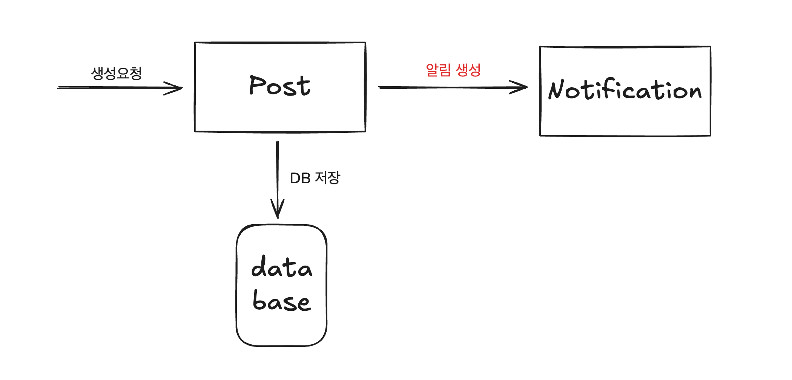
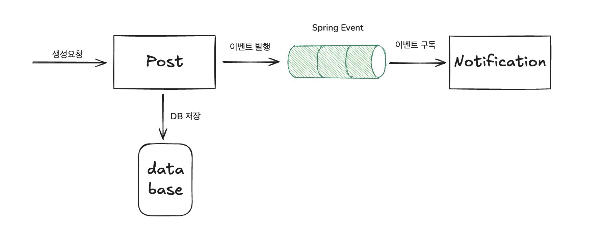
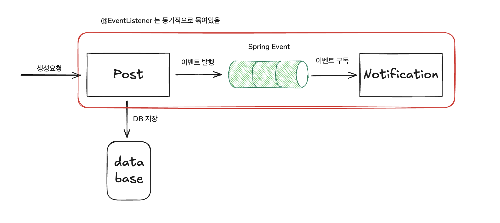
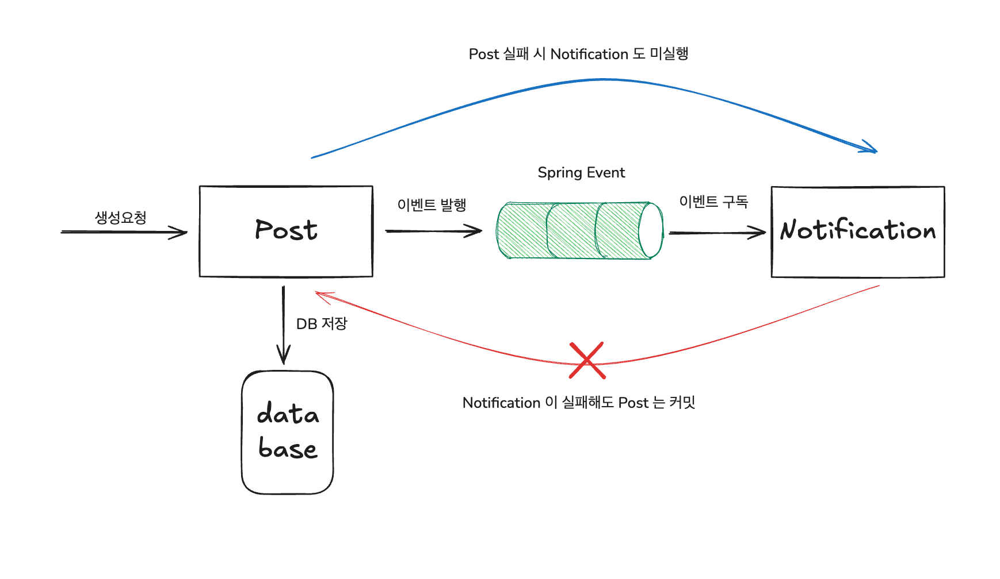

<Header/>

[[toc]]

중심적인 도메인과 관련없는 도메인을 ApplicationEventPublisher 을 이용하여 이벤트를 발행해 분리시켜보자.

# 1. 문제 상황

다음과 같이 Post 를 생성하면 **<u>알림 서비스로 알림을 생성하는 코드</u>**가 있다.



그럼 다음과 같이 코드를 짤 수 있다.

**NotificationService**

알림을 보내는 역할을 한다.

```kotlin
@Service
class NotificationService(
    private val notificationRepository: NotificationRepository,
) {

    //알림발송 대신 알림저장으로 일단 구현했다.
  	@Transactional
    fun notifyPostCreate(event: PostCreateEvent) {
        val content = "${event.postId} notified: ${event.title} ${event.content}"
        
        notificationRepository.save(
            Notification.createNotification(content = content)
        )
    }
}
```

**PostService**

포스트를 생성하고 알림을 요청한다.

```kotlin
@Service
class PostService(
    private val postRepository: PostRepository,
    private val notificationService: NotificationService,
) {

    @Transactional
    fun createPost(dto: PostCreateApiDto): String {
        val post = Post.createPost(
            title = dto.title,
            content = dto.content,
        )

        val savedPost = postRepository.save(post)

        notificationService.notifyPostCreate(PostCreateEvent.of(savedPost))

        return savedPost.postId
    }
}
```

## 문제점

  여기엔 다음과 같은 문제점이 있다.

1. notification 요청 코드가 실패하면 post 생성도 실패한다.
2. Post 입장에서 notification 전송과 강력하게 결합된다.

1번 문제는 비동기로 호출하면 해결할 수 있다. 하지만 2번 문제는 **비동기 호출만으로는 결합 문제가 해소되지 않는다.** 비동기 호출을 `createPost()` 내부에서 트랜잭션 커밋 전에 실행하면, 알림에서 조회 시점/격리 문제도 생길 수 있다. **결합 해소는 이벤트 발행으로, 롤백 경계 분리는 트랜잭션 전파로** 설계해야 한다.

# 2. 해결

아래와 같이 **Spring Application Event** 를 활용해서 Post 와 Notification 을 구분해보자.



Post 에서는 아래 방법으로 **"post 가 생성되었다"**는 이벤트만 발행한다.

```kotlin
@Transactional
fun createPost(dto: PostCreateApiDto): String {
    val saved = postRepository.save(Post.createPost(dto.title, dto.content))
    applicationEventPublisher.publishEvent(PostCreatedEvent.of(saved))
    return saved.postId
}
```

그리고 Notification 에서는 `@EventListener` 로 이벤트를 구독한다.

> **발행 이벤트는 ""무엇이 일어났다(사실)"를 표현**해야 한다. 예) `PostCreatedEvent(postId, title, ...)`
>  “알림을 발송하라” 같은 **행동 지시**는 Post 와 Notification 의 논리적인 의존성을 남긴다.

하지만 이 경우에도 Notification 이 실패할 경우 Post 의 트랜잭션 또한 롤백될 수 있는데, 이는 @EventListener는 동기 실행이라, 리스너 예외가 퍼블리셔 트랜잭션을 롤백시키기 때문이다. 따라서 Post와 Notification 을 논리적으로 분리하더라도 물리(트랜잭션)적으로 결합된다. (~~논리적으로 분리되면서 물리적으로 묶이는 아이러니~~)



## @TransactionalEventListener 사용

`@TransactionalEventListener` 는 이벤트가 트랜잭션 안에서 발행된 경우에만 동작한다(기본 fallbackExecution=false). 기본 값은 AFTER_COMMIT 이며, 이 경우 퍼블리셔 트랜잭션이 커밋된 뒤 리스너가 호출된다. 트랜잭션 밖에서 발행되면 리스너는 호출되지 않는다. 필요 시 @TransactionalEventListener(fallbackExecution = true) 로 비트랜잭션 상황도 처리할 수 있다(즉시 실행).

`NotificationService` 에서 다음과 같이 사용할 수 있다.

```kotlin
@Service
class NotificationService(
    private val notificationRepository: NotificationRepository,
) {

		@TransactionalEventListener(phase = TransactionPhase.AFTER_COMMIT)
    fun notifyPostCreate(event: PostCreateEvent) {
        val content = "${event.postId} notified: ${event.title} ${event.content}"

        notificationRepository.save(
            Notification.createNotification(content = content)
        )
    }
}
```

이제 "**이벤트 발행자의 트랜잭션이 커밋된 이후에만 notifyPostCreate 이 호출**"된다. 따라서 Post 의 저장은 알림 서비스의 실패와 관계없이 보장된다고 할 수 있다.

참고로 TransactionalEventListener 의 phase 값은 다음과 같다.

- **TransactionPhase.BEFORE_COMMIT** : 트랜잭션 commit 직전에 수행
- **TransactionPhase.AFTER_COMMIT**(기본값) : 트랜잭션  commit 직후에 수행
- **TransactionPhase.AFTER_ROLLBACK** : 트랜잭션 rollback 직후 수행
- **TransactionPhase.AFTER_COMPLETION** : 트랜잭션이 완료된 후 수행 (commit 또는 rollback)

여기서 주의할 건 트랜잭션 컨텍스트 내에서 수행되므로 **트랜잭션이 없다면 리스너가 동작하지 않는다.**

## Propagation.REQUIRES_NEW 사용

 하지만 여기서 또 문제가 생긴다. post 에서 트랜잭션이 커밋되었으므로 notification 에서는 트랜잭션이 퍼블리셔와 동일하지 않다. 따라서 notifyPostCreate() 내에서 원하는 서비스 단위의 커밋 및 롤백이 보장되지 않게 된다. 이를 해결하기 위해 `Propagation` 옵션을 줄 수 있다.

 ```kotlin
 @TransactionalEventListener(phase = TransactionPhase.AFTER_COMMIT)
 @Transactional(propagation = Propagation.REQUIRES_NEW)
 fun notifyPostCreate(event: PostCreateEvent) {
     val content = "${event.postId} notified: ${event.title} ${event.content}"
 
     notificationRepository.save(
         Notification.createNotification(content = content)
     )
 }
 ```

# 결론

  최종적으로 아래와 같이 만들어진다.



- Post 가 이벤트를 발행하고 Notification 이 수신하여 처리한다.
- **Post 트랜잭션(작성)과 Notification 트랜잭션(알림 저장)은 `AFTER_COMMIT + REQUIRES_NEW`로 분리**된다.
  - Post 실패 → 이벤트 미발행(알림 시도 없음)
  - Notification 실패 → Post 커밋 유지, 알림만 롤백 및 재처리 전략으로 보완
- Post 가 실패하면 이벤트가 발행되지 않는다.

# Ref.

- [회원시스템 이벤트기반 아키텍처 구축하기](https://techblog.woowahan.com/7835/)

<Footer/>
