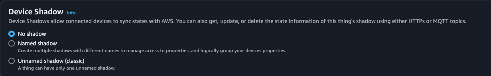
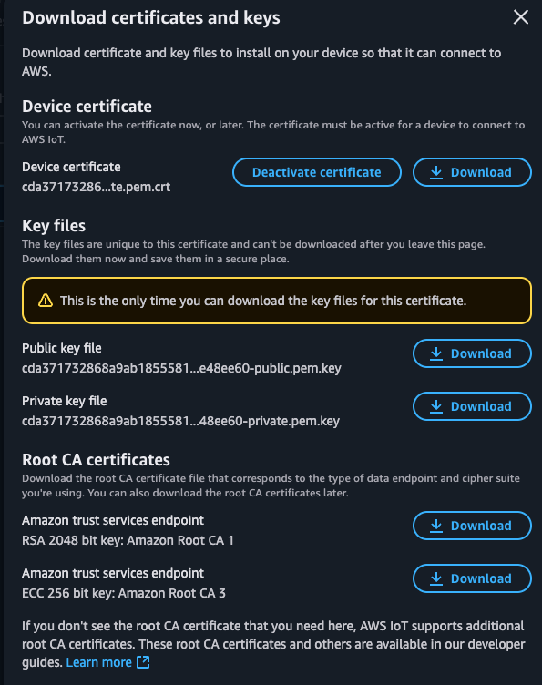

<Header/>

최근 IoT 프로젝트를 진행하면서 AWS IoT Core를 깊이 사용하게 되었다. 처음엔 단순히 디바이스를 클라우드에 연결하는 정도로 생각했는데, 막상 써보니 Shadow, 인증서, Job 등 알아야 할 개념들이 생각보다 많았다. 특히 Shadow의 경우 처음엔 "왜 굳이?"라는 생각이 들었지만, 실제 디바이스가 오프라인 상황을 겪어보니 그 필요성을 절실히 느꼈다.

이번 글에서는 AWS IoT Core의 핵심 개념들을 실무에서 겪은 경험을 바탕으로 정리해보려고 한다.

------

# 1. Shadow: 디바이스 상태를 안전하게 관리하는 핵심 기능

## Shadow가 뭔가요?

AWS IoT Core의 Shadow는 **디바이스의 상태를 클라우드에 저장해 놓은 JSON 문서**다. 간단히 말해, 우리집 IoT 전구의 현재 상태(켜짐/꺼짐, 밝기 등)를 AWS 클라우드에 복사본으로 저장해두는 것이다.



```json
{
  "state": {
    "desired": {
      "power": "on",
      "brightness": 70
    },
    "reported": {
      "power": "on", 
      "brightness": 70
    }
  },
  "metadata": {...},
  "timestamp": 1629393746
}
```

## 왜 필요한가?

처음엔 "디바이스에 직접 명령 보내면 되는데 왜 굳이?"라고 생각했다. 하지만 실제 IoT 환경에서는 다음과 같은 상황들이 빈번히 발생한다:

### 디바이스가 오프라인일 때
- 사용자가 앱에서 "전구 켜줘"라고 명령
- 하지만 전구가 인터넷 연결이 끊어진 상태
- Shadow에 `"desired": {"power": "on"}`을 저장
- 전구가 다시 온라인 되면 Shadow를 확인하고 상태를 동기화

### 여러 앱에서 동시에 접근할 때
- 가족 구성원들이 각자의 스마트폰으로 같은 IoT 기기 제어
- Shadow가 중앙 상태 저장소 역할
- 누가 어디서 바꿔도 모든 앱이 동일한 상태 확인 가능

## Shadow의 구조

Shadow는 크게 3가지 상태로 구성된다:

| 필드 | 설명 | 예시 |
|------|------|------|
| `desired` | 사용자가 원하는 상태 | 앱에서 "밝기를 70%로" 설정 |
| `reported` | 디바이스가 실제 보고한 상태 | 전구에서 "현재 밝기 70%" 보고 |
| `delta` | 차이값 (AWS가 자동 생성) | desired ≠ reported일 때만 존재 |

### 동기화 과정
1. 사용자 앱이 `"power": "on"` → Shadow의 `desired` 업데이트
2. Shadow는 `delta` 자동 생성 (`"power": "on"`)
3. 디바이스가 `delta` MQTT 메시지를 구독하고 상태 변경
4. 디바이스가 실제로 켜지면 `reported`에 `"power": "on"` 업데이트
5. `desired`와 `reported`가 같아지면 `delta` 자동 제거

## Named Shadow vs Unnamed Shadow

처음 AWS IoT를 사용할 때는 기본 Shadow(Unnamed)만 사용했는데, 복잡한 디바이스를 다루다 보니 Named Shadow의 필요성을 느꼈다.

| 구분 | Unnamed Shadow | Named Shadow |
|------|----------------|--------------|
| 개수 | 디바이스당 1개 | 디바이스당 여러 개 가능 |
| 용도 | 간단한 상태 관리 | 복합적인 상태 분리 관리 |
| 예시 | 전체 전원 상태 | `temp-sensor`, `fan-config`, `security-mode` 등 |

예를 들어, 스마트 에어컨의 경우:
- `temp-control`: 온도 관련 설정
- `fan-speed`: 풍속 관련 설정  
- `timer-config`: 타이머 관련 설정

이렇게 기능별로 Shadow를 분리하면 각 기능의 상태를 독립적으로 관리할 수 있어 훨씬 깔끔하다.

------

# 2. 인증서와 보안: IoT 디바이스의 신원 증명

## 필수 인증서 파일들

AWS IoT에 디바이스를 연결하려면 3개의 파일이 반드시 필요하다:



### 1. `certificate.pem.crt` (클라이언트 인증서)
- 디바이스의 신원을 증명하는 X.509 인증서
- "이 디바이스가 정말 우리가 등록한 디바이스가 맞나요?"를 확인

### 2. `private-key.pem` (개인 키)
- 인증서와 쌍을 이루는 비밀키
- **절대 유출되면 안 되는 파일** (이 키가 탈취되면 디바이스 권한 탈취됨)

### 3. `rootCA1.pem` (루트 인증서)
- AWS IoT Core 서버의 신원을 검증하는 용도
- "내가 연결하려는 서버가 정말 AWS 서버가 맞나요?"를 확인

## TLS Mutual Authentication 과정

디바이스와 AWS IoT Core 간의 연결은 양방향 인증으로 이루어진다:

### 1단계: 서버 인증 (디바이스 → AWS 검증)
- AWS가 자신의 서버 인증서를 디바이스에 전송
- 디바이스가 `rootCA1.pem`으로 AWS 서버 신원 검증
- "연결하려는 서버가 진짜 AWS가 맞나?" 확인

### 2단계: 클라이언트 인증 (AWS → 디바이스 검증)  
- 디바이스가 `certificate.pem.crt`를 AWS에 전송
- AWS가 등록된 인증서인지 확인하고 연결된 정책 검사
- "이 디바이스가 연결할 권한이 있나?" 확인

### 3단계: TLS 세션 성립
- 양방향 인증 완료 후 암호화된 MQTT 통신 시작

실제 Python 코드에서는 이렇게 설정한다:

```python
shadow_client.configureCredentials(
    root_ca_path,      # AWS 서버 검증용
    private_key_path,  # 디바이스 서명용
    cert_path         # 디바이스 신원 증명용
)
```

------

# 3. 실제 Python 코드로 보는 Shadow 활용

실무에서 사용한 코드를 기반으로 Shadow 활용법을 살펴보자.

## 기본 연결 설정

```python
import json
import time
from AWSIoTPythonSDK.MQTTLib import AWSIoTMQTTShadowClient

# AWS IoT 설정
ENDPOINT = "your-endpoint.iot.ap-northeast-2.amazonaws.com"
CLIENT_ID = "my_device"
THING_NAME = "my_device"

# 인증서 파일 경로
CERT_PATH = "certificate.pem.crt"
PRIVATE_KEY_PATH = "private.pem.key"
ROOT_CA_PATH = "AmazonRootCA1.pem"
```

## Shadow 콜백 함수들

### Delta 콜백: 원격 제어 받기
```python
def shadow_callback_delta(payload, responseStatus, token):
    """desired 상태가 변경될 때 호출"""
    payload_dict = json.loads(payload)
    
    if "state" in payload_dict and "power" in payload_dict["state"]:
        desired_power = payload_dict["state"]["power"]
        print(f"원격 명령 수신: power = {desired_power}")
        
        # 실제 디바이스 상태 변경
        DEVICE_STATE["power"] = desired_power
        
        # 특별한 동작 수행
        if desired_power == "꺼짐":
            shutdown_device()
```

### Update 콜백: 상태 업데이트 결과 확인
```python
def shadow_callback_update(payload, responseStatus, token):
    """Shadow 업데이트 결과 처리"""
    if responseStatus == "accepted":
        print("Shadow 업데이트 성공")
    else:
        print(f"Shadow 업데이트 실패: {responseStatus}")
```

## 실무 팁

### 연결 안정성 향상
```python
# 타임아웃 값을 여유있게 설정
shadow_client.configureConnectDisconnectTimeout(20)  # 기본 10초 → 20초
shadow_client.configureMQTTOperationTimeout(10)      # 기본 5초 → 10초

# 자동 재연결 설정
shadow_client.configureAutoReconnectBackoffTime(1, 32, 20)
```

### 에러 처리
실제 운영에서는 네트워크 문제로 인한 연결 실패가 빈번하다. 반드시 예외 처리를 해주자:

```python
try:
    shadow_client.connect()
    print("AWS IoT 연결 성공")
except Exception as e:
    print(f"연결 실패: {e}")
    # 재시도 로직 또는 로그 기록
```

------

# 4. Job: 대규모 디바이스 관리의 핵심

## Job이 필요한 이유

Shadow는 상태 관리에 특화되어 있지만, 다음과 같은 상황에서는 한계가 있다:

- **펌웨어 업데이트**: 수백 대의 디바이스에 동시에 새 펌웨어 배포
- **설정 변경**: 특정 그룹의 디바이스들에게 일괄 설정 변경 명령
- **진행 상황 추적**: 작업이 성공했는지, 실패했는지, 어디서 멈췄는지 관리

이런 **명령 중심의 작업**에는 Job을 사용한다.

## Shadow vs Job 비교

| 구분 | Shadow | Job |
|------|--------|-----|
| 목적 | 상태 동기화 | 명령 실행 |
| 방식 | "이 상태가 되어야 해" | "이 작업을 해줘" |
| 대상 | 개별 디바이스 | 개별 또는 그룹 |
| 예시 | "전원을 켜진 상태로 유지" | "펌웨어를 v2.0으로 업데이트" |
| 상태 추적 | desired/reported | IN_PROGRESS/SUCCEEDED/FAILED |

## Job Document 구조

Job Document는 자유로운 JSON 형식이다. 실무에서는 다음과 같은 구조를 많이 사용한다:

### 예시 1: 펌웨어 업데이트
```json
{
  "operation": "update-firmware",
  "url": "https://my-bucket.s3.amazonaws.com/firmware-v2.0.bin",
  "version": "2.0",
  "checksum": "sha256:abc123..."
}
```

### 예시 2: 설정 변경
```json
{
  "operation": "update-config",
  "config": {
    "logLevel": "DEBUG",
    "reportInterval": 30,
    "sensors": ["temperature", "humidity"]
  }
}
```

### 예시 3: 단순 명령
```json
{
  "operation": "reboot",
  "delay": 60
}
```

## Job 생성 및 관리

### CLI로 Job 생성
```bash
aws iot create-job \
  --job-id firmware-update-2024 \
  --targets "arn:aws:iot:ap-northeast-2:123456789012:thinggroup/ProductionDevices" \
  --document file://firmware-job.json \
  --timeout-config inProgressTimeoutInMinutes=30
```

### 디바이스에서 Job 처리
```python
def process_job(job_document):
    """Job 문서를 파싱하고 작업 수행"""
    operation = job_document.get("operation")
    
    if operation == "update-firmware":
        url = job_document.get("url")
        version = job_document.get("version")
        return download_and_install_firmware(url, version)
    
    elif operation == "update-config":
        config = job_document.get("config")
        return update_device_config(config)
    
    elif operation == "reboot":
        delay = job_document.get("delay", 0)
        return schedule_reboot(delay)
    
    else:
        return {"status": "FAILED", "reason": "Unknown operation"}
```

------

# 5. 실무에서 배운 교훈들

## 디바이스 오프라인 대응

실제 IoT 환경에서는 디바이스가 예상보다 자주 오프라인이 된다. 특히 모바일 환경이나 Wi-Fi가 불안정한 곳에서는 더욱 그렇다. Shadow의 진가는 이런 상황에서 발휘된다.

- **Before Shadow**: 명령이 실패하면 사용자가 다시 시도해야 함
- **After Shadow**: 디바이스가 다시 온라인 되면 자동으로 상태 동기화

## 대규모 배포시 주의사항

수백 대의 디바이스에 동시에 Job을 배포할 때는 반드시 **점진적 배포(Rollout)**를 사용하자:

```json
{
  "jobExecutionsRolloutConfig": {
    "maximumPerMinute": 50,
    "exponentialRate": {
      "baseRatePerMinute": 10,
      "incrementFactor": 2,
      "rateIncreaseCriteria": {
        "numberOfSucceededThings": 10
      }
    }
  }
}
```

처음에 이걸 안 하고 전체 디바이스에 동시 배포했다가 AWS IoT Core 할당량에 걸려서 곤란했던 경험이 있다.

## 보안 관련 팁

### 1. 인증서 로테이션
- 프로덕션 환경에서는 주기적으로 인증서를 갱신하자
- AWS IoT Core에서 인증서 만료일 알림 설정 가능

### 2. 정책 최소권한 원칙
```json
{
  "Version": "2012-10-17",
  "Statement": [
    {
      "Effect": "Allow",
      "Action": [
        "iot:Connect"
      ],
      "Resource": "arn:aws:iot:region:account:client/${iot:Connection.Thing.ThingName}"
    },
    {
      "Effect": "Allow", 
      "Action": [
        "iot:GetThingShadow",
        "iot:UpdateThingShadow"
      ],
      "Resource": "arn:aws:iot:region:account:thing/${iot:Connection.Thing.ThingName}/shadow"
    }
  ]
}
```

필요한 권한만 최소한으로 부여하는 것이 중요하다.

------

# 6. 메시지 크기 최적화: 비용 절약의 핵심

## AWS IoT Core 실제 과금 방식

처음 AWS IoT Core를 사용할 때 메시지 크기에 대해 잘못 이해하고 있었다. 공식 문서에는 "최대 128KB 메시지 지원"이라고 나와 있지만, 실제 과금은 **5KB 단위**로 이루어진다.

### 실제 과금 구조
```
- 0~5KB: 1 메시지 요금
- 5KB~10KB: 2 메시지 요금  
- 10KB~15KB: 3 메시지 요금
- ...
- 125KB~128KB: 26 메시지 요금 (최대)
```

이때문에 5.1KB 메시지 하나는 4.9KB 메시지보다 **2배**의 비용이 든다.

## 실제 비용 영향 사례

아례는 예시이다.

### Before 최적화 (8KB 센서 데이터)
```python
# 최적화 전: 8KB 메시지
message = {
    "deviceIdentifier": "sensor-temperature-basement-001",
    "measurementTimestamp": "2025-06-27T10:30:00.000Z",
    "temperatureReadings": [23.1, 23.2, 23.1, 23.0, 23.2, ...],  # 1000개 데이터
    "humidityReadings": [65.2, 65.1, 65.3, 65.0, 65.4, ...],     # 1000개 데이터
    "deviceMetadata": {
        "firmwareVersion": "v2.1.0",
        "batteryLevel": 85,
        "signalStrength": -45
    }
}
# 크기: 8KB → 2 메시지 요금 부과
```

### After 최적화 (4.2KB 압축 데이터)
```python
# 최적화 후: 4.2KB 메시지
message = {
    "id": "st_b001",  # deviceIdentifier 축약
    "ts": 1719485400,  # unix timestamp 사용
    "temp": "23.1,23.2,23.1,23.0,23.2,...",  # 배열을 문자열로 압축
    "hum": "65.2,65.1,65.3,65.0,65.4,...",   # 배열을 문자열로 압축
    "meta": {
        "fw": "v2.1.0",  # 키 이름 축약
        "bat": 85,
        "sig": -45
    }
}
# 크기: 4.2KB → 1 메시지 요금만 부과
```

**결과: 메시지당 비용이 50% 절약!**

## 월별 비용 차이 계산

월 100만 메시지를 전송하는 디바이스 100대 기준,

### 8KB 메시지 (최적화 전)
```
- 월 메시지: 100만 × 100대 = 1억 메시지
- 과금 메시지: 2억 메시지 (5KB 초과로 2배 계산)
- 월 비용: 2억 × $1.20/1백만 = $240
- 연간 비용: $240 × 12 = $2,880
```

### 4.2KB 메시지 (최적화 후)
```
- 월 메시지: 100만 × 100대 = 1억 메시지  
- 과금 메시지: 1억 메시지 (5KB 이하로 1배 계산)
- 월 비용: 1억 × $1.20/1백만 = $120
- 연간 비용: $120 × 12 = $1,440
```

**연간 절약액: $1,440 (50% 절약)**

## 실무 최적화 기법들

### 1. JSON 키 이름 축약
```python
# Before: 장황한 키 이름 (가독성 좋지만 비효율)
{
    "deviceIdentifier": "sensor-001",
    "measurementTimestamp": "2025-06-27T10:30:00Z",
    "temperatureReading": 23.45,
    "humidityPercentage": 65.2,
    "batteryVoltageLevel": 3.7
}

# After: 축약된 키 이름 (크기 약 40% 절약)
{
    "id": "s001",
    "ts": 1719485400,
    "temp": 23.45,
    "hum": 65.2,
    "bat": 3.7
}
```

### 2. 데이터 타입 최적화
```python
# Before: 문자열 타임스탬프 (29 bytes)
"timestamp": "2025-06-27T10:30:00.000Z"

# After: Unix 타임스탬프 (10 bytes)
"ts": 1719485400
```

### 3. 배열 데이터 압축
```python
# Before: JSON 배열 (크기 큼)
"readings": [23.1, 23.2, 23.0, 23.1, 23.2]

# After: 문자열 압축 (크기 작음)
"readings": "23.1,23.2,23.0,23.1,23.2"
```

### 4. GZIP 압축 활용
```python
import json
import gzip
import base64

def compress_message(data):
    """메시지를 GZIP으로 압축"""
    json_str = json.dumps(data)
    compressed = gzip.compress(json_str.encode())
    encoded = base64.b64encode(compressed).decode()
    
    return {
        "compressed": True,
        "data": encoded
    }

# 실제 측정 결과:
# Original: 8192 bytes (8KB)
# Compressed: 2048 bytes (2KB) → 75% 절약!
```

## 메시지 크기 모니터링 도구

실무에서 사용하는 메시지 크기 체크 함수

```python
import json

def check_message_size(message, warn_threshold=4.5):
    """메시지 크기를 체크하고 경고"""
    json_str = json.dumps(message)
    size_kb = len(json_str.encode()) / 1024
    
    if size_kb > 5.0:
        print(f"🚨 CRITICAL: {size_kb:.2f}KB - 2배 요금 부과!")
        return False
    elif size_kb > warn_threshold:
        print(f"⚠️ WARNING: {size_kb:.2f}KB - 최적화 권장")
        return True
    else:
        print(f"✅ GOOD: {size_kb:.2f}KB - 최적화됨")
        return True

# 사용 예시
message = {"id": "sensor001", "data": "..."}
if not check_message_size(message):
    message = optimize_message(message)
```

## 배치 전송으로 효율성 극대화

개별 메시지 대신 배치로 전송하면 더욱 효율적이다.

```python
def batch_messages(sensor_readings, max_size_kb=4.5):
    """메시지들을 4.5KB 이하 배치로 묶어서 전송"""
    batch = []
    current_size = 0
    
    for reading in sensor_readings:
        # 메시지 크기 계산
        test_batch = batch + [reading]
        test_size = len(json.dumps(test_batch).encode()) / 1024
        
        if test_size > max_size_kb and batch:
            # 현재 배치 전송
            publish_message(batch)
            batch = [reading]
        else:
            batch.append(reading)
    
    # 마지막 배치 전송
    if batch:
        publish_message(batch)

# Before: 100개 메시지 개별 전송 (1KB씩) = 100 메시지 요금
# After: 4개 배치로 묶어서 전송 (4KB씩) = 25 메시지 요금 (75% 절약!)
```

## 다른 AWS IoT 서비스들도 마찬가지

이 5KB 규칙은 다른 AWS IoT 서비스에도 적용된다.

### Device Shadow
```python
# Shadow 업데이트도 5KB 초과시 2배 요금
shadow_update = {
    "state": {
        "desired": {
            "config": very_large_config_data  # 5KB 초과 주의!
        }
    }
}
```

### Rules Engine
```python
# Rule이 처리하는 메시지도 5KB 기준으로 계산
# 8KB 메시지 → 2개 Rule 실행 요금 부과
```

## 핵심 권장사항

1. **4.8KB 이하 목표**: 여유분을 고려해 4.8KB 이하로 메시지 크기 설정
2. **실시간 모니터링**: 프로덕션에서 메시지 크기 모니터링 도구 사용
3. **압축 활용**: GZIP, 키 축약, 타입 최적화 등 적극 활용
4. **배치 전송**: 가능한 경우 여러 데이터를 배치로 묶어서 전송
5. **정기적 리뷰**: 메시지 구조를 정기적으로 리뷰하고 최적화
