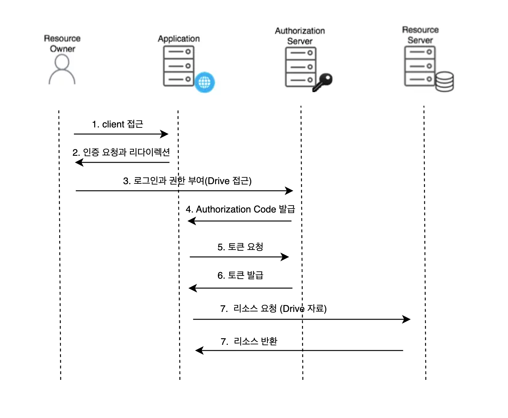

<Header />

[[toc]]

# OAuth 2.0 이란?

OAuth 란 타 서비스의 자원(Resource) 에 접근 권한을, 비밀번호 공유 없이 제3의 애플리케이션(클라이언트)에게 위임하는 표준이다.
애플리케이션이 사용자 프로필이나 데이터와 같은 다른 애플리케이션의 보호된 리소스에 대해 비밀번호와 같은 자격 증명을 노출하지 않고도 안전하게 제한된 접근 권한을 얻을 수 있도록 한다.

## OAuth 2.0 의 구성 요소

- **Resource Owner**: 사용자(권한의 소유자).
- **Client**: 사용자의 허락을 받아 자원에 접근하려는 앱(웹/모바일/서버).
- **Authorization Server (AS)**: 권한을 승인하고 **Access Token/Refresh Token** 발급(Keycloak, Google 등).
- **Resource Server (RS)**: 보호 자원을 가진 API 서버(예: Google Drive API). 접근 토큰을 검증하고 클라이언트에게 보호된 리소스를 제공


## OAuth 2.0 인증(Grant) (플로우)
기본 OAuth 2.0 명세는 네 가지 인증을 정의합니다:

- 권한 코드 인증 (Authorization Code)
- 암묵적 인증 (Implicit Flow)
- 리소스 소유자 비밀번호 자격 증명 (ROPC) 인증
- 클라이언트 자격 증명 인증 (Client Credentials)

이중 암묵적 인증, ROPC 는 사용을 지양한다.

- 암묵적 인증 : 브라우저로 **토큰을 바로 전달**하던 옛 방식. URL에 토큰이 노출되고, 토큰 탈취 위험이 커서 현대 권고안에선 사용하지 않음.
- ROPC : 클라이언트가 **사용자 ID/비밀번호를 직접 받는** 방식. 보안·거버넌스 측면에서 최악의 선택지

### 권한 코드 인증 (Authorization Code, **PKCE 권장**)

가장 표준적이고 안전해서 현재 기본값처럼 쓰는 흐름이다.



1. 리소스 소유자의 접근
2. 클라이언트는 리소스 소유자에게 인증을 요청하고 해당 인증서버로 리다이렉션한다. (요청 : `response_type=code`, `state`, **`code_challenge`**)
3. 리소스 소유자는 자신을 인증하고 권한을 부여한다.
4.  클라이언트의 Redirect URI로 authorization code 를 전달한다.
5. 클라이언트가 백채널로 authorization code + `code_verifier`를  인증 서버로 보내면 Access Token(+Refresh Token) 이 발급된다.
6. Access Token 을 사용하여 리소스를 요청한다..

> **PKCE(Proof Key for Code Exchange)** 란?
>
> OAuth 2.0 **Authorization Code Flow를 더 안전하게 만드는 보안 메커니즘**이다.
>
> 1. 사용자가 로그인 → Authorization Server가 Authorization Code를 발급해서 브라우저(redirect URI)로 보냄.
> 2. 앱(클라이언트)이 이 코드를 Authorization Server에 다시 보내면서 Access Token을 받음.
>
>  만약 공격자가 여기서 중간에서 이 Authorization Code를 탈취당해면 원래 앱이 아니라 공격자가 Authorization Server에 code를 제출해서 Access Token을 뺏을 수 있다. 이걸 Authorization Code Interception Attack이라고 한다.
>
> PKCE의 아이디어는 코드 교환 시 비밀값을 추가로 검증**하는 것이다.
>
> 1. 클라이언트가 로그인 요청을 보낼 때, 임의의 난수 문자열을 하나 만든다. → **code_verifier**
>
> 2. 이 값을 해시(SHA-256) 해서 → **code_challenge**를 만든다.
>
> 3. 로그인 요청 시 Authorization Server에 **code_challenge**를 같이 보낸다.
>
>    ```
>    GET /authorize?
>    response_type=code
>    &client_id=client123
>    &redirect_uri=https://app.com/callback
>    &code_challenge=E9Melhoa2OwvFrEMTJguCHaoeK1t8URWbuGJSstw-cM
>    &code_challenge_method=S256
>    ```
>
> 4. Authorization Server는 이 challenge를 기억해둔다.
>
> 5. 클라이언트가 Authorization Code를 Access Token으로 교환할 때, 원래 난수(**code_verifier**)를 같이 보낸다.
>
>    ```
>    POST /token
>    code=abc123
>    code_verifier=dBjftJeZ4CVP-mB92K27uhbUJU1p1r_wW1gFWFOEjXk
>    ```
>
> 6. Authorization Server는 이걸 해시해서 기존의 `code_challenge`와 비교 → 일치하면 토큰 발급.
>
> 따라서, 공격자가 Authorization Code를 가로채도 **code_verifier**가 없으면 Access Token으로 교환할 수 없다.

### 클라이언트 자격 증명 인증

클라이언트 자격 증명은 기밀 클라이언트가 보호된 리소스에 접근할 수 있도록 액세스 토큰을 받을 수 있는 OAuth 2.0 인증 부여 (Grant) 유형이다. 일반적으로 이 흐름은 클라이언트가 서버나 서비스인  기계 대 기계 (Machine-to-machine) 통신에 사용된다.

>  **기계 대 기계 통신**
>
> 단일 서비스만 있고 그 무엇에도 의존하지 않는 경우 다른 서비스와 통신할 필요가 없을 가능성이 높다. 시스템이 성장하거나 아이덴티티 및 접근 관리(IAM) 시스템과 통합하려고 할 때, 기계 대 기계 통신을 처리해야 한다.

클라이언트 자격 증명 흐름은 두 단계로 이루어진 간단한 프로세스다.

1. **토큰 요청**: 클라이언트는 토큰 요청 (Token request) 와 클라이언트 자격 증명 (클라이언트 ID 및 클라이언트 비밀), 요청된 scopes (스코프)와 함께 보낸다.
2. **토큰 응답**: 인증 서버 (Authorization server) 는 클라이언트 자격 증명을 검증하고 클라이언트가 인증되었다면 액세스 토큰을 발행한다.

## OAuth 한계

- OAuth 는 접근 권한에 초점을 맞추기 때문에 인증(누구인지) 을 보장하지 않는다.
- Access Token이 불투명 문자열이면 리소스 서버는 매번 Introspection(인증 서버에 확인)해야 사용자·스코프를 알 수 있어 네트워크 왕복이 늘어난다.
- 토큰에 어떤 속성이 담기는지 표준화가 느슨해서, "사용자 식별" 용도로 일관되게 쓰기 어렵다

# OIDC

OpenID Connect 는 OAuth 2.0을 인증(Authentication) 용도로 확장한 표준이다. 가장 큰 추가점은 ID Token(JWT) 이고, 여기에 사용자 식별 정보(Claims) 가 담긴다.

- **ID Token**: `iss`, `sub`, `aud`, `exp`, `iat` + (선택) `email`, `name`, `auth_time`, `nonce`, `at_hash` 등.
- **UserInfo Endpoint**: Access Token으로 추가 프로필 정보를 표준 스키마로 조회. 클라이언트가 사용자 프로필 정보를 검색할 수 있는 OIDC 전용 엔드포인트이다
- **Discovery**: `/.well-known/openid-configuration`로 OP(인증서버) 메타데이터 자동 발견.
- **JWKs**: 공개키 목록(URL)로 서명 검증 자동화.

### 비교: OAuth 2.0 vs OIDC

OIDC와 OAuth 2.0의 관계는 그 목적을 이해해야 명확히 구분할 수 있다. 둘의 차이는 '인증'과 '인가'라는 근본적인 개념의 차이에서 비롯된다.

> **"OAuth 2.0은 인가(Authorization), OIDC는 인증(Authentication)"**

**OAuth 2.0 (인가)**는 "이 애플리케이션이 **무엇을 할 수 있는가?**"이다. 예를 들어, 한 사진 편집 앱이 사용자의 구글 포토에 접근하여 사진을 읽고 편집할 권한을 요청한다. 사용자가 동의하면, 구글은 이 앱에게 액세스 토큰을 발급한다. 이 토큰은 앱이 구글 포토 API에 접근할 수 있는 '열쇠' 역할을 하지만, 토큰 자체에는 사용자가 누구인지에 대한 정보가 표준화된 방식으로 담겨있지 않다. 앱은 단지 '권한을 위임받았다'는 사실만 알 뿐이다.

**OIDC (인증)**의 핵심 질문은 "이 사용자는 **누구인가?**"이다. 예를 들어, 새로운 뉴스레터 서비스에 '구글 계정으로 로그인'하는 경우를 생각해 보면 이 과정에서 OIDC가 사용된다. 사용자가 구글에서 인증을 완료하면, 구글은 뉴스레터 서비스에게 액세스 토큰과 함께 'ID Token'을 전달한다. 이 ID Token에는 사용자의 이메일, 이름, 고유 식별자 등이 포함되어 있어, 뉴스레터 서비스는 이 정보를 바탕으로 사용자를 식별하고 회원 가입을 처리하거나 로그인 세션을 생성할 수 있다.

결론적으로, OIDC는 OAuth 2.0의 인가 흐름을 그대로 사용하면서, 그 위에 ';사용자 신원 확인'이라는 표준화된 계층을 추가한 것이다. 따라서 모든 OIDC 흐름은 OAuth 2.0 흐름이기도 하지만, 그 역은 성립하지 않는다.

## OIDC 용어

- **OP (OpenID Provider)**: 인증 서버(예: Keycloak, Google)
- **RP (Relying Party)**: OP를 신뢰하고 토큰을 검증하는 클라이언트 앱
- **ID Token**: 인증 결과(사용자 ID 등)가 담긴 JWT.  사용자를 대신하여 보호된 리소스에 접근하는 데 사용
- **Nonce**: 재생 공격 방지용 랜덤 값(클라이언트가 보냈던 값과 토큰의 `nonce` 일치 확인)
- **Scope**: 최소 `openid` 가 필수. 그 외 `profile`, `email`, `phone`, `address` 등
- **Claims**: 토큰에 담기는 속성들(표준 + 커스텀)

## OIDC 흐름 (권장: **Authorization Code + PKCE**)


# Ref.

- [OpenID Connect (OIDC)은(는) 무엇인가요?](https://auth-wiki.logto.io/ko/openid-connect)
- [OAuth 2.0은(는) 무엇인가요?](https://auth-wiki.logto.io/ko/oauth-2.0)
- [Open ID Connect 으로 구글 로그인 구현하기 (feat. SpringBoot)](https://aodtns.tistory.com/124)
- [편의성을 높인 ID 인증 관리: OIDC가 주목 받는 이유](https://s-core.co.kr/insight/view/%ED%8E%B8%EC%9D%98%EC%84%B1%EC%9D%84-%EB%86%92%EC%9D%B8-id-%EC%9D%B8%EC%A6%9D-%EA%B4%80%EB%A6%AC-oidc%EA%B0%80-%EC%A3%BC%EB%AA%A9-%EB%B0%9B%EB%8A%94-%EC%9D%B4%EC%9C%A0/)

<Footer />
