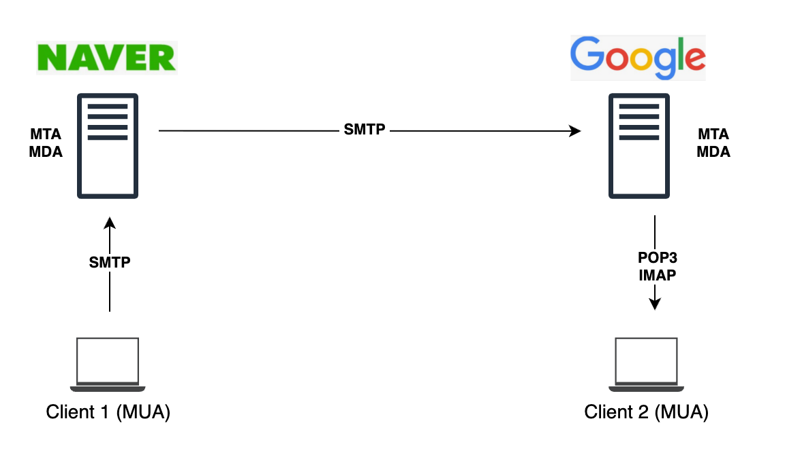

<Header />

[[toc]]

SMTP 에 대해 내가 아는 건 "이메일을 보내는 프로토콜"이라는 것이다. 이번에 AWS SES 로 이메일을 송수신하며 관리까지 할 수 없을까 확인하면서 문득 SMTP 에 대해 궁금해졌고 간단하게 찾아봤다.

# SMTP 란?

SMTP(Simple Mail Transfer Protocol)는 인터넷을 통해 **이메일을 전송하기 위해 표준화된 프로토콜**이다. 우리가 Gmail, 네이버 메일, 회사 메일 등 어떤 서비스를 사용하든, 결국 *메일 서버 간의 메일 송수신에는 SMTP가 핵심 역할을 한다.

즉, SMTP는 "메일을 보낸다"라는 기능에만 집중된 프로토콜이며, 메일을 **저장하거나 클라이언트가 읽는 것(IMAP, POP3)** 은 별도의 프로토콜이 담당한다.

## SMTP 프로토콜 특징

**텍스트 기반 프로토콜**

모든 명령어와 응답은 사람이 읽을 수 있는 텍스트로 주고받는다. (예: `HELO`, `MAIL FROM`, `RCPT TO`, `DATA`)

**TCP 기반 (포트 25, 465, 587)**

 안정적인 전송을 위해 TCP를 사용하며, 기본 포트는 25번이다.

- 25: 주로 서버 간 메일 릴레이용 (스팸 필터링 문제로 ISP가 종종 차단함)
- 465: SMTPS (암호화 전송)
- 587: 일반적인 클라이언트 → 서버 송신용 포트 (인증 필수)

**계층 구조**

OSI 7계층에서 **애플리케이션 계층**에서 동작한다. 따라서 TCP/IP 스택 위에서 동작하며, 전송 중 보안을 위해 TLS(STARTTLS) 확장을 사용할 수 있다.

**왜 이메일에 쓰이는가?**

SMTP는 신뢰성 있는 전송을 위해 설계되었고, 명령·응답 기반이라 오류 처리가 명확하다. 또한 다른 프로토콜(IMAP/POP3)과 조합하면 이메일 시스템 전체를 완성할 수 있기 때문이다.

## SMTP 프로토콜 동작

SMTP 세션은 크게 세 단계로 이뤄진다: **연결 → 메일 전송 → 종료**

| 명령                            | 의미                                                         |
| ------------------------------- | ------------------------------------------------------------ |
| HELO + `<송신자의 호스트 이름>` | 송신자의 호스트 이름을 전송하여 서버에 자신이 누구인지를 통지한다. |
| MAIL + `<송신자의 메일 주소>`   | 송신자의 메일 주소를 통지한다.                               |
| RCPT + `<수신자의 메일 주소>`   | 수신자의 메일 주소를 통지한다.                               |
| DATA + `<메시지의 내용>`        | 메일 메시지를 송신하려고 사용할 때.                          |
| QUIT                            | 더 이상의 전송 메시지가 없음을 통지한다.                     |
| RSET                            | 현재의 연결 상태가 종료되었음을 통지하고, 연결 재설정이 이루어진다. |
| VRFY + `<수신자의 메일 주소>`   | 수신자의 주소를 조회하려고 사용한다.                         |
| NOOP                            | 수신자의 상태를 검사하려고 사용한다.                         |


예시 (구글 메일 서버와의 대화)

```
S: 220 smtp.gmail.com ESMTP
C: HELO example.com
S: 250 Hello example.com
C: MAIL FROM:<user@example.com>
S: 250 OK
C: RCPT TO:<friend@gmail.com>
S: 250 Accepted
C: DATA
S: 354 End data with <CR><LF>.<CR><LF>
C: Subject: Test Mail
C: Hello World
C: .
S: 250 Message queued
C: QUIT
S: 221 Bye
```

- `HELO/EHLO`: 클라이언트 식별
- `MAIL FROM`: 발신자 정보
- `RCPT TO`: 수신자 정보
- `DATA`: 본문 입력 시작
- `.`(단독 줄): 입력 종료 표시

이런 텍스트 기반 대화가 TCP 세션 안에서 교환되며, 결국 수신자 메일 서버의 큐에 메일이 적재된다.

# 이메일을 보내는 플로우

## 이메일 서버의 구성

이메일 송수신에는 다음과 같은 구성 요소가 필요하다

- **MUA (Mail User Agent)**: 클라이언트 앱 (예: Outlook, Gmail 웹)
- **MTA (Mail Transfer Agent)**: 메일 서버 (Postfix, Exim, Sendmail 등)
- **MDA (Mail Delivery Agent)**: 최종적으로 메일박스에 저장하는 역할
- **프로토콜**:
  - 송신: SMTP
  - 수신: IMAP / POP3

즉, 메일을 "보낸다"는 행위만 보면 SMTP가 전부지만, 실제로 **메일을 "읽고 관리"하는 것**은 IMAP/POP3가 있어야 가능하다.

## 네이버에서 구글로 보낼 때의 흐름



1. 사용자가 네이버 웹메일에서 작성 후 "보내기" 클릭
2. 네이버 메일 서버(MTA)가 SMTP 세션을 열고, 구글 메일 서버(Gmail MTA)로 전송
3. Gmail MTA가 메일을 수신 후 큐에 저장
4. Gmail 내부 MDA가 이를 사용자 메일박스에 넣음
5. 사용자가 Gmail 앱을 열면, 클라이언트(MUA)가 IMAP/POP3를 통해 메일을 읽음

즉, 네이버 → 구글로 전송할 때 **중간은 무조건 SMTP**, 수신 후 사용자 단에서 **IMAP/POP3**로 확인한다.

# 마치며

사실 AWS SES 로 메일을 관리하려고 알아보다가 SMTP 까지 공부하게 되었다. 그런데 SES 는 **SMTP 송신(메일 보내기)와 수신(메일 수신 후 S3 저장)** 기능은 제공하지만, **메일을 관리하거나 클라이언트에서 읽는 기능(IMAP/POP3)** 은 제공하지 않는다.

즉, SES는 "이메일 전송 서비스"일 뿐, "메일 호스팅 서비스"는 아니다.

- **SES로 할 수 있는 것**: 대량 메일 발송, 수신 후 S3 저장/람다 트리거
- **SES로 할 수 없는 것**: 사용자 메일박스 관리, 클라이언트에서 메일 읽기(IMAP/POP3 제공 없음)

만약 이메일 시스템을 완성하고 싶다면 **Amazon WorkMail** 을 사용해야 한다.

- 사용자 당 월 $4
- IMAP/SMTP 지원 (Outlook, Gmail 클라이언트 연동 가능)
- 제공 리전: Virginia, Oregon, Ireland

따라서 "보내는 것만" 필요하다면 SES, "전체 메일 서비스"가 필요하다면 WorkMail을 고려해야 한다.
