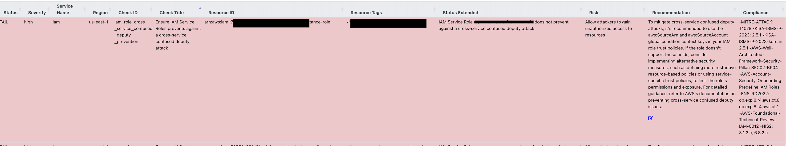

<Header />

Prowler 를 통해 보안취약점을 해결하다보면 "교차 서비스 혼동 대리 공격"이라는 모르는 용어가 나온다. 아래와 같이 (거의 모든) role 에 대해 해당 compliance 로 잡힌다.



Severity 도 high 라서 해결해야 하는데 해결법 자체는 쉽다. 그래서 개념만 알아보려고 한다.

# 교차 서비스 혼동 대리(Cross-service Confused Deputy) 개념

**대리자(Deputy)** 역할을 하는 AWS 서비스(예: API Gateway, EventBridge, CloudFormation 등)가 위임받은 권한으로 작업을 수행할 때,
그 서비스가 요청의 출처(누구를 대신하는지)를 명확히 증명하지 못하면, 의도하지 않은 주체가 내 권한을 빌려 리소스에 접근하는 문제가 발생한다.

핵심은 다음과 같다.

- 의도: `내 API Gateway → 내가 신뢰한 A Role  → 내 SQS`
- 공격: `공격자(또는 다른 리소스) → A Role → 내 SQS`

즉, 대리자 서비스가 누구를 위해 행동하는지 증명하지 못하면 권한 오남용이 발생한다.

## 중요한 이유

- **리소스 유출/변조 위험**이 커진다: S3 객체 유출, SQS 메시지 조작, Step Functions 오작동 등
- **경계가 붕괴**한다: “내 계정 안 서비스”라는 이유로 안심했다가 다른 리소스나 외부 계정을 통한 우회 접근을 허용할 수 있다.
- **감사·추적 비용이 증가**한다: CloudTrail에는 호출 기록만 남고, `aws:SourceArn` 같은 컨텍스트 키는 보이지 않아 설정 오류를 찾는 데 시간이 소요된다.

# 방지 원리

IAM **Trust Policy** 또는 **Resource-based Policy**에서 **요청의 출처를 검증**하는 조건을 사용한다.

### Condition 키

- `aws:SourceArn` : **정확히 어떤 리소스(ARN)** 에서 온 요청인지 제한한다.
- `aws:SourceAccount` : **어떤 계정**에서 온 요청인지 제한한다.
- `sts:ExternalId` : **3rd-party(SaaS)** 가 내 Role을 Assume할 때 **임의의 비밀 식별자**를 요구해 혼동 대리를 차단한다.

> 일반적으로 **`SourceArn` + `SourceAccount`**를 함께 쓰는 구성이 가장 안전하다.
>  다만 서비스별 컨텍스트 제공 여부가 달라, 지원하는 키만 사용하는 것이 현실적이다.**

## 패턴

## Amazon SNS → Lambda

SNS 주제가 특정 Lambda 함수를 호출할 수 있도록 하는 경우 SNS 는 Lambda Invoke 권한을 가진 역할을 Assume해서 Lambda 함수를 호출하게 된다. 이때 아래와 같은 trust policy 를 설정할 수 있다.

```json
{
  "Version": "2012-10-17",
  "Statement": [
    {
      "Effect": "Allow",
      "Principal": {
        "Service": "sns.amazonaws.com"
      },
      "Action": "sts:AssumeRole",
      "Condition": {
        "StringEquals": {
          "aws:SourceAccount": "123456789012"
        },
        "ArnLike": {
          "aws:SourceArn": "arn:aws:sns:us-east-1:123456789012:MyTopic"
        }
      }
    }
  ]
}

```

위와 같이 구성하면 "**내 계정의 이 SNS 주제에서만 Role을 Assume 가능**"하게 막을 수 있다.

## S3(이벤트) → Lambda(호출)

이 경로는 **리소스 정책(=Lambda permission)** 설계가 핵심이다.

- `lambda:AddPermission`으로 함수 정책에 **S3 이벤트 소스**를 등록할 때
  - `Principal: s3.amazonaws.com`
  - `SourceArn: arn:aws:s3:::<BUCKET_NAME>`
  - `SourceAccount: <ACCOUNT_ID>` 를 함께 사용했다.

**Lambda 권한 예시**

```json
{
  "Sid": "AllowS3Invoke",
  "Effect": "Allow",
  "Principal": { "Service": "s3.amazonaws.com" },
  "Action": "lambda:InvokeFunction",
  "Resource": "arn:aws:lambda:ap-northeast-2:<ACCOUNT_ID>:function:<FUNC_NAME>",
  "Condition": {
    "StringEquals": { "aws:SourceAccount": "<ACCOUNT_ID>" },
    "ArnLike": { "aws:SourceArn": "arn:aws:s3:::<BUCKET_NAME>" }
  }
}
```

## 3rd-party SaaS가 내 Role을 Assume(교차 계정)

`sts:ExternalId`를 필수로 강제해 혼동 대리를 차단한다.

**Trust Policy 예시(3rd-party)**

```json
{
  "Version": "2012-10-17",
  "Statement": [
    {
      "Effect": "Allow",
      "Principal": { "AWS": "arn:aws:iam::<VENDOR_ACCOUNT_ID>:role/<VENDOR_ROLE>" },
      "Action": "sts:AssumeRole",
      "Condition": {
        "StringEquals": { "sts:ExternalId": "<YOUR_RANDOM_EXTERNAL_ID>" }
      }
    }
  ]
}
```


# 마치며

교차 서비스 혼동 대리는 **대리자 서비스가 누구를 위해 행동하는가를 증명하는 문제**다. 하지만  최소 권한 원칙만 고려한다면, 현재 시점에서 해당 역할을 사용하는 리소스만 접근 가능하도록 변경하는 것이 맞지만 추후 확장성을 고려하여 Principal 항목을 계정이나 서비스 수준으로 설정해두는 것도 권장된다.

<Footer/>

