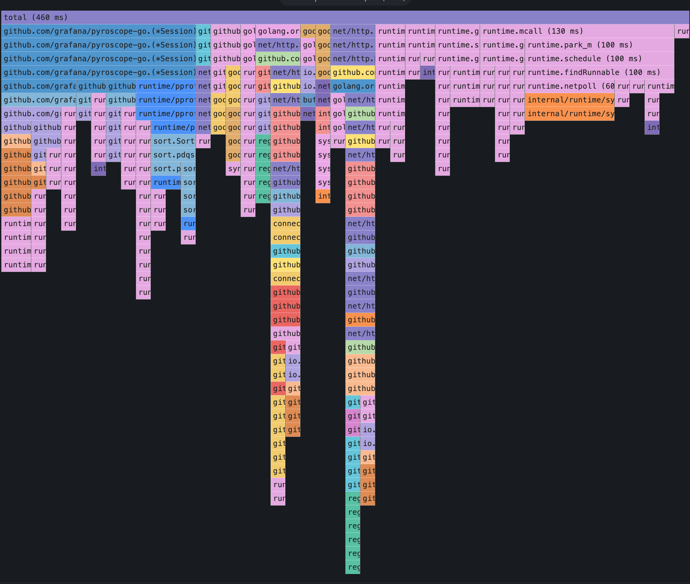
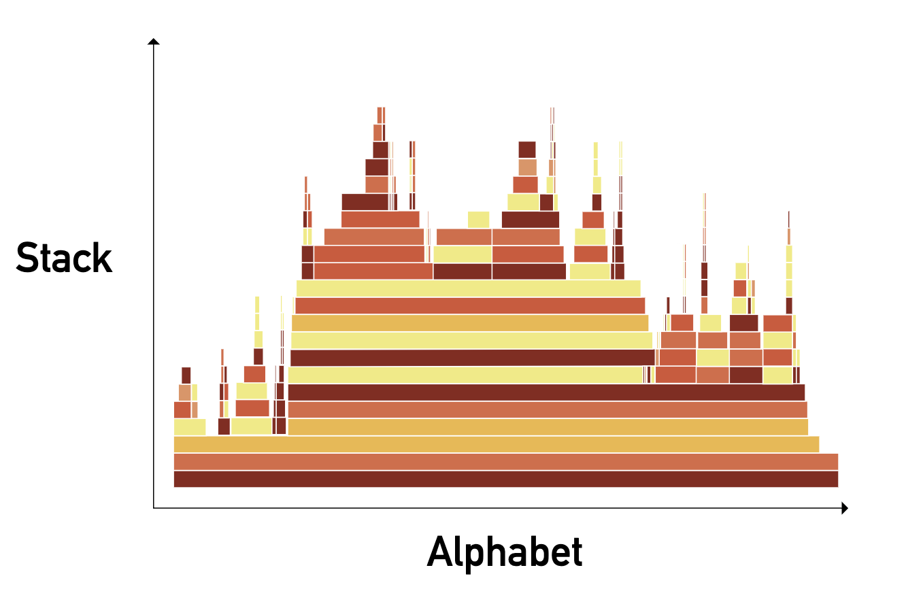

<Header />

Flame Graph 는 소프트웨어 performance 를 분석하는 데 필수적인 도구다. 병목 구간과 코드 최적화를 위한 시각화 도구를 제공한다. Flame Graph 를 뒤집어놓은 게 Icicle 인데 콜스택이라는 의미에 맞게 위에서 아래로 구성되어있다.

아래는 그라파나에서 설정한 pyroscope 의 Flame Graph 이다. (실제로는 icicle 인 듯하다.)

# Flame Graph 읽는 방법

가장 명심해야 할 건 "**색은 아무 의미 없으며**", "**x 축은 시간 순이 아니다**" 다. 이를 염두에 두고 설명한다.

1. 각각의 사각형은 스택의 함수 호출을 의미한다. 그리고 그 사각형의 너비는 함수의 상대적인 리소스 사용량을 의미하는데, 하위 함수의 사용량도 함께 포함한다.
1. y 축은 스택의 깊이다. 가장 위쪽의 사각형은 실행 중인 leaf 함수로 자원이 소비되는 지점이다. 그리고 그 하위의 스택들은 호출 경로를 의미한다.
1. x 축은 시간의 흐름이 아니라 샘플링된 데이터를 좌우로 펼쳐놓은 것이다. 같은 스택들을 합친다음 알파벳 순서로 정렬된다.
1. 사각형의 너비는 리소스의 총 사용량을 나타낸다. 넓은 사각형의 함수는 좁은 사각형보다 리소스를 더 많이 소모했을 것이다.

> 색은 특별한 의미를 가지고 있지 않다. 함수별로 똑같은 색을 가질 수는 있지만 랜덤한 패턴으로 색이 선택된다. (flame 은 주로 붉은 계열)

# 프로필이 쌓이는 과정

Flame graph 는 프로그램의 콜스택을 보여준다. 그게 정확히 어떤 의미일까?

## 구조

그래프는 가로로 정렬된 직사각형들로 구성된 콜스택이다. 각 직사각형은 하나의 함수이고 그 너비는 그 함수가 소비한 시간(하위 함수를 포함하여)을 의미한다. 직사각형들은 다른 직사각형 위에 계속 쌓인다. 따라서 부모 함수가 가장 아래에 위치하고 하위 함수가 위에 계속 쌓이는 형식이다. 이 계층적 구조와 관계는 수직적인 정렬로 이해하기 쉽게 구성된다. 중요한 점은 다음과 같다.

- 각 직사각형의 너비는 함수의 리소스 소모량을 나타낸다.

# Ref.

- [Ice and Fire: How to read icicle and flame graphs](https://www.polarsignals.com/blog/posts/2023/03/28/how-to-read-icicle-and-flame-graphs)

<Footer/>