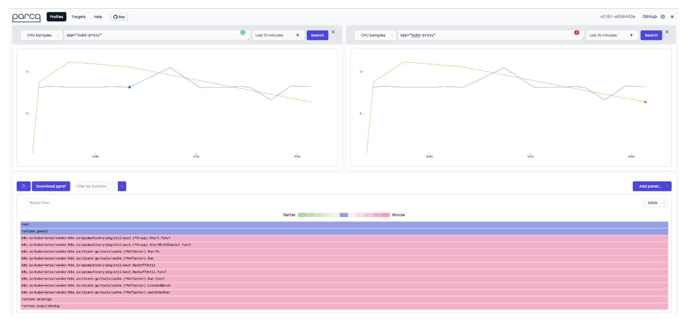

<Header />

Flame Graph 는 소프트웨어 performance 를 분석하는 데 필수적인 도구다. 병목 구간과 코드 최적화를 위한 시각화 도구를 제공한다. Flame Graph 를 뒤집어놓은 게 Icicle 인데 콜스택이라는 의미에 맞게 위에서 아래로 구성되어있다.

아래는 그라파나에서 설정한 pyroscope 의 Flame Graph 이다. (실제로는 icicle 인 듯하다.)


# Flame Graph 읽는 방법

가장 명심해야 할 건 "**색은 아무 의미 없으며**", "**x 축은 시간 순이 아니다**" 다. 이를 염두에 두고 설명한다.


1. 각각의 사각형은 스택의 함수 호출을 의미한다. 그리고 그 사각형의 너비는 함수의 상대적인 리소스 사용량을 의미하는데, 하위 함수의 사용량도 함께 포함한다.
1. y 축은 스택의 깊이다. 가장 위쪽의 사각형은 실행 중인 leaf 함수로 자원이 소비되는 지점이다. 그리고 그 하위의 스택들은 호출 경로를 의미한다.
1. x 축은 시간의 흐름이 아니라 샘플링된 데이터를 좌우로 펼쳐놓은 것이다. 같은 스택들을 합친다음 알파벳 순서로 정렬된다.
1. 사각형의 너비는 리소스의 총 사용량을 나타낸다. 넓은 사각형의 함수는 좁은 사각형보다 리소스를 더 많이 소모했을 것이다.

> 색은 특별한 의미를 가지고 있지 않다. 함수별로 똑같은 색을 가질 수는 있지만 랜덤한 패턴으로 색이 선택된다. (flame 은 주로 붉은 계열)

# 싱글 콜스택 구조

Flame graph 는 프로그램의 콜스택을 보여준다. 그게 정확히 어떤 의미일까?

## 구조

그래프는 가로로 정렬된 직사각형들로 구성된 콜스택이다. 각 직사각형은 하나의 함수이고 그 너비는 그 함수가 소비한 시간(하위 함수를 포함하여)을 의미한다. 직사각형들은 다른 직사각형 위에 계속 쌓인다. 따라서 부모 함수가 가장 아래에 위치하고 하위 함수가 위에 계속 쌓이는 형식이다. 이 계층적 구조와 관계는 수직적인 정렬로 이해하기 쉽게 구성된다. 중요한 점은 다음과 같다.

- 각 직사각형의 너비는 함수의 리소스 소모량을 나타낸다.
- 직사각형의 높이는 아무런 의미가 없다. 수직적인 정렬은 콜스택의 계층적 구조를 나타내기 위함이다.

## 상세

하나의 콜스택으로 어떻게 그래프가 그려지는지 확인해보자. 다음 함수는 `a` 함수가 `b` 함수를 부르고, `b` 함수가 무한 루프를 도는 `c` 함수를 호출한다.

```java
static void a() {
      b();
  }

  static void b() {
      c();
  }

  static void c() {
      for(;;);
  }

  public static void main(String[] args) {
      a();
  }
```

예를 들어 위 함수를 50ms 동안 프로파일링했다면 아래와 같이 나타난다.


이 예제에서 `c` 함수가 시간의 대부분을 사용하지만 모든 직사각형이 같은 너비를 가지고 있다. 그 이유는 직사각형의 너비가 그 함수와 하위 함수까지 포함하기때문이다.

만약 `c` 함수를 더 많이 호출한다면 어떻게 될까?

```java
static void a() {
    b();
}

static void b() {
    c();
    c();
    c();
}

static void c() {
		for(int i = 0; i < 1_000_000; i++);
}

public static void main(String[] args) {
    a();
}
```

큰 변화가 있어보이지는 않는다. 왜냐하면 콜스택은 `merge` 되기 때문이다. 따라서 `c` 함수는  `b` 함수 위에서 3개로 나눠지는 게 아니라 하나로 합쳐져서 보인다. 즉 **함수가 같은 레벨에서 몇 번이나 실행되었느냐는 flame graph 에서 보여지지 않는다.**


여기서 이제 `b` 함수가 `d`, `e` 함수를 추가로 호출해보자. 순서는 `d` -> `e` -> `c` 순서로 호출한다.

```java
static void a() {
    b();
}

static void b() {
    d();
    e();
    c();
}

static void c() {
		for(int i = 0; i < 1_000_000; i++);
}

static void d() {
		for(int i = 0; i < 1_000_000; i++);
}

static void e() {
		for(int i = 0; i < 1_000_000; i++);
}

public static void main(String[] args) {
    a();
}
```

그러면 아래와 같이 나타난다.


해당 콜스택에서 눈여겨볼 점은 `b` 의 하위로  `d` -> `e` -> `c` 순서로 호출되었는데 flame graph 에서는 알파벳 순서로 정렬되어있다. **콜스택은 호출 순서와 전혀 관련이 없다는 뜻이다.** 또한 x 축은 시간의 흐름을 나타내지 않는 것도 기억해야 한다.

비슷하게 이번에는 `a` -> `b`, `c` -> (b,c 각각) `d`,`e`,`f` 순으로 호출한다고 해보자.

```java
static void a() {
    b();
}

static void b() {
    d();
    e();
    f();
}

static void c() {
		d();
    e();
    f();
}

static void d() {
		for(int i = 0; i < 1_000_000; i++);
}

static void e() {
		for(int i = 0; i < 1_000_000; i++);
}

static void f() {
		for(int i = 0; i < 1_000_000; i++);
}

public static void main(String[] args) {
    a();
}
```

위 main 함수를 호출한 콜스택은 아래와 같이 된다. 여기서 확인할 점은 `d`, `e`, `f` 함수가 같은 깊이에서 두번씩 호출되더라도 같은 부모 함수가 아니라면 merge 되지 않는다는 것이다.


# 여러 콜스택의 통합

프로그램이 실행되는 동안 수많은 콜스택이 생성된다. 1초 동안 프로그램은 수천 개의 콜스택을 가질 수 있는데 이는 현실적으로 모두 수집하기가 쉽지 않다. 따라서 일정 간격으로 샘플링을 하고 스택을 통합하면서 이를 해결할 수 있다.

콜스택은 다음 3단계로 수집되고 통합된다.

## Sampling

샘플링은 성능 분석을 위해 통계적으로 중요하고 충분한 데이터를 제공한다. 샘플링은 모든 이벤트에 대한 수집 없이 프로그램 리소스 소모를 보여준다. 콜스택을 지속적으로 캡처하면서 프로그램 실행의 트랜드와 패턴에 대한 **스냅샷**을 얻는 것이다.

> 이러한 접근은 데이터 분석을 위한 성능 오버헤드를 최소화하면서 더 효율적이고 관리가 편하게 만든다. 물론 모든 이벤트를 기록하는 게 더 포괄적인 관점을 제공하겠지만 너무 큰 오버헤드와 감당할 수 없는 데이터량에 압도될 수 있다. 따라서 샘플링은 데이터를 실용적으로 수집하면서도 신뢰할 수 있고 효율적인 성능 분석을 가능케 한다.

예를 들어 50ms 의 간격으로 아래와 같은 샘플링 데이터를 얻었다고 하자. 50ms 간격으로 하나씩(여기선 왼쪽부터) 스냅샷을 떠 하나의 수직적인 콜스택을 얻는다.


## Sorting

이제 샘플링된 콜스택을 주어진 시간 범위 내에서 알파벳 순으로 정렬한다. (이때 샘플의 순서는 보장되지 않는다.)


##  Merging (Grouping)

마지막으로 같은 콜스택을 모두 더한다. 앞서 싱글 스택에서 `c` 함수가 같은 레벨이고 같은 부모일 때 merge 되는 것을 확인했다. 그것과 같은 과정이다.


이 과정을 통해 flame graph 가 그려지고, 이를 통해 병목 현상을 식별하고 코드를 최적화할 수 있게 된다.

# Flame graph 활용

성능 최적화는 모든 소프트웨어에 중요한 문제이며, 유저 경험과 시스템 리소스에 큰 영향을 미친다. 따라서 성능 이슈의 원인을 확인하고 매우 중요하고, 특히 큰 코드베이스와 복잡한 콜스택에서 더 중요해준다. Flame graph 는 다음과 같을 때 유용하다.

1. **복잡한 데이터 시각화** : Flame graph 는 콜스택 데이터를 그래프로 보여줘서 서로 다른 함수 간의 관계나 리소스 소모를 더 잘 표현하고 이해하기 쉽게 만들어준다.
2. **병목구간 식별** : 콜스택 데이터를 시각화해서 개발자들이 CPU 소모량이나 메모리 양이 큰 병목구간을 식별하게 해준다.
3. **profile 비교** : flame graph 는 다른 프로필과 비교해서 코드베이스의 수정이 성능 상으로 어떤 변화를 가져오는지 알기 쉽게 해준다.



## 성능 이슈 찾기

**너비가 긴 콜스택 찾기**

많은 양의 리소스를 소모하는 함수를 찾으려면 우선 직사각형의 길이가 긴 함수를 찾는다. 그 함수가 바로 전체 실행 시간의 큰 부분을 차지한다. 그리고 이런 함수들을 최적화의 후보로 잡아야 한다.


**콜스택 검사**

다른 함수들 간의 관계를 이해하기 위해 호출 스택 계층 구조를 확인해야 한다. 이를 통해 성능 문제가 단일 함수에서 비롯된 것인지, 아니면 여러 함수의 조합에서 발생한 것인지 파악할 수 있다. 또한 호출 스택을 이해하면 리팩터링이나 불필요한 호출 제거와 같은 최적화 기회를 발견할 수도 있다.

**tall 스택 확인**

호출의 깊이가 긴 tall 스택은 복잡하고 비효율적인 코드일 수 있다.


**반복 패턴 확인**

그래프에서 반복되는 패턴은 불필요하거나 반복적인 코드일 수 있고, 개선의 대상이 될 수 이싿.

## 코드 개선

만약 문제가 되는 함수를 찾고 콜스택을 분석했다면 코드 개선을 시작해야 한다.

1. **알고리즘 최적화**
2. **성능이 매우 중요한 코드 경로의 함수 호출을 최소화**
3. **코드 병렬** : 성능 병목 현상이 CPU 연산에 의해 발생한다면, 코드를 병렬화하여 여러 프로세서 코어를 활용하는 것을 고려해야 한다.
4. **메모리 사용 줄이기** : 메모리 할당과 해제를 최적화하고, 메모리 단편화를 최소화해야 한다.

## 개선 측정

개선 이후에는 새로운 프로파일링 데이터로 flame graph 를 확인한다. 이전 그래프와 새로운 그래프를 확인하면서 개선 사항이 성능 상으로 어떤 변화를 보여주는지 측정한다.

만약 개선이 성공적이라면 문제가 되는 함수의 너비가 줄어드는 것을 볼 수 있을 것이다.

## 반복과 정제

성능 개선은 반복적인 프로세스다. 지속적으로 분석하고 그래프를 업데이트하면서 새로운 병목 구간을 찾고 관련된 코드를 업데이트해야 한다. 그러면서 목표로 하는 성능까지 지속적으로 개선해야 한다.

# Ref.

- [Ice and Fire: How to read icicle and flame graphs](https://www.polarsignals.com/blog/posts/2023/03/28/how-to-read-icicle-and-flame-graphs)

<Footer/>